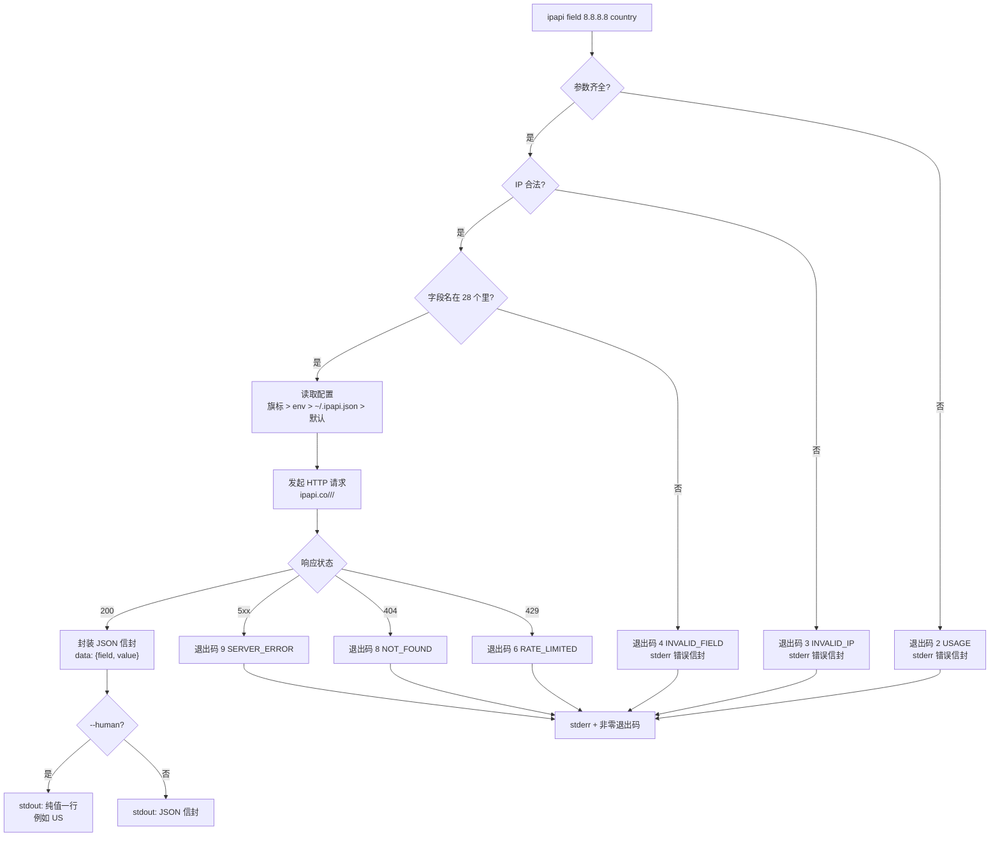
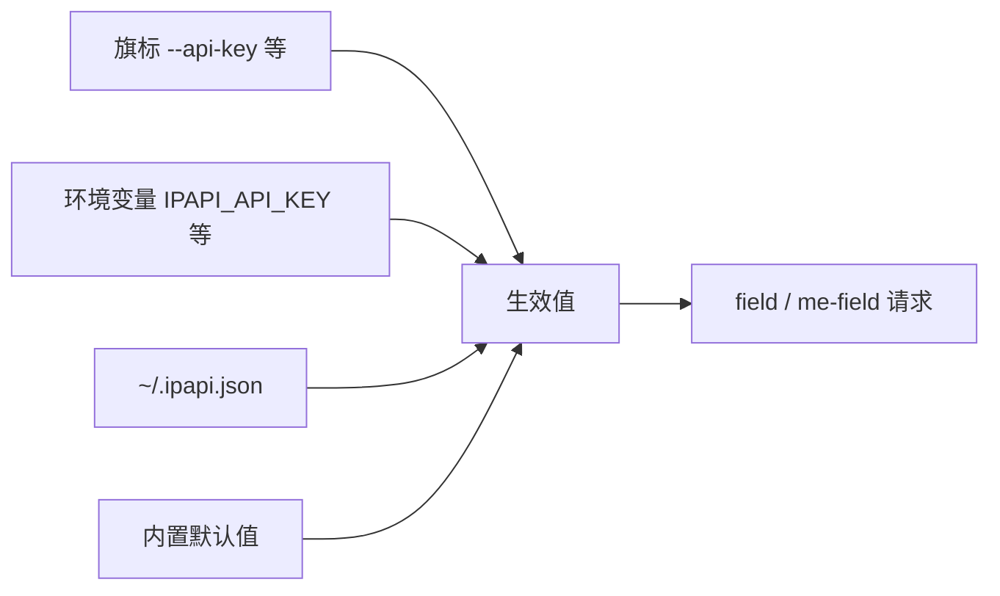

# 🔎 field / me-field 命令

> 查询单个字段的"狙击枪"命令。当你只需要一个值——比如某个 IP 的国家代码、ASN、货币——不必拉回整份 28 字段的 JSON，`field` 系列命令只取一瓢饮，返回 `{field, value}` 的精简信封。配上 `--human` 还能直接吐出一行纯值，完美喂给 shell 管道。

## 概述

`ipapi field` 与 `ipapi me-field` 是一对"单字段查询"命令，分别面向"指定 IP"和"本机 IP"两种场景：

- 🎯 `ipapi field <ip> <field>` —— 查**任意指定 IP** 的**单个字段**，返回 `{"field": "...", "value": ...}` 信封。
- 🪞 `ipapi me-field <field>` —— 查**本机公网 IP** 的单个字段，参数更少，适合"我自己的出口 IP 是什么国家"这类自省需求。

两者共享同一套全局旗标（`--api-key`、`--format`、`--human` 等）和同一套错误处理/退出码体系。它们底层调用的是 SDK 的 `GetField` / `GetClientField` 方法，只是把结果包进了 CLI 统一的 JSON 信封里。

::: tip 💡 什么时候用 field，什么时候用 info？
- 只要**一个字段** → 用 `field`：响应更小、更快、`--human` 后直接是纯值，便于脚本消费。
- 要**多个字段**或完整画像 → 用 `info`：一次拿回 28 个字段，省去多次往返。
- 要**原始格式**（csv/xml/yaml 喂给别的工具） → 用 `raw`。
:::

---

## 📖 命令语法

```bash
# 查指定 IP 的单个字段
ipapi field <ip> <field> [flags]

# 查本机公网 IP 的单个字段
ipapi me-field <field> [flags]
```

两个命令都**必填**字段名参数（`<field>`），`field` 还额外必填 `<ip>`。字段名必须来自 `ipapi fields` 列出的 28 个合法字段之一，否则会以退出码 `4`（`INVALID_FIELD`）报错。

### 参数说明

| 命令 | 参数 | 是否必填 | 说明 |
|------|------|:--------:|------|
| `field` | `<ip>` | ✅ | 要查询的 IPv4/IPv6 地址，如 `8.8.8.8`、`2001:4860:4860::8888` |
| `field` | `<field>` | ✅ | 字段名，须为 28 个合法字段之一（见下文） |
| `me-field` | `<field>` | ✅ | 字段名，同上；IP 由本机出口决定 |

### 常用旗标

`field` / `me-field` 继承全部全局旗标，其中最常用的是这几个：

| 旗标 | 类型 | 默认 | 说明 |
|------|------|------|------|
| `-H` / `--human` | bool | `false` | 人类可读输出：开启后**只输出一行纯值**，不包信封 |
| `--api-key` | string | 空 | API Key，也可用环境变量 `IPAPI_API_KEY` |
| `--api-key-mode` | string | `header` | Key 传递方式：`header` 或 `query` |
| `-f` / `--format` | string | `json` | 信封格式（field 系列实际只产出 JSON 信封） |
| `--timeout` | duration | `10s` | 单次请求超时 |
| `--retries` | int | `2` | 重试次数，总请求 = retries + 1 |

::: warning ⚠️ field 系列只产出 JSON 信封
和 `raw` 命令不同，`field` / `me-field` 的输出**始终是 JSON 信封**（除非加 `--human`）。`-f` 旗标虽然在全局生效，但对 field 系列不会切换成 csv/xml 等原始格式——那是 `raw` 的职责。要原始字节，请用 `ipapi raw <ip> -f csv`。
:::

---

## 🏷️ 字段名从哪来？—— `ipapi fields`

`<field>` 参数不是随便写的字符串，它必须命中以下 28 个字段之一。这些字段被分成 7 组，完整清单可用本地命令一键列出（**不走网络**）：

```bash
ipapi fields
```

输出（节选）：

```
identity:  ip, network, version, hostname
geo:       city, region, region_code, country, country_name, country_code,
           country_code_iso3, country_capital, country_tld, continent_code,
           in_eu, postal, latitude, longitude, latlong
time:      timezone, utc_offset
network:   asn, org
culture:   languages, country_calling_code
economy:   currency, currency_name
stats:     country_area, country_population
```

想只看某一组：

```bash
ipapi fields --group geo
```

想要机器可读的 JSON 清单：

```bash
ipapi fields --json
```

::: tip 🧭 记不住字段名？让 shell 帮你补全
先 `ipapi completion bash > /etc/bash_completion.d/ipapi`（或对应 shell），重开终端后输入 `ipapi field 8.8.8.8 <Tab>` 就会自动列出 28 个合法字段，从根上杜绝 `INVALID_FIELD`。
:::

### 28 个字段完整对照

| 分组 | 字段 | 典型示例值 |
|------|------|-----------|
| identity | `ip` | `8.8.8.8` |
| identity | `network` | `8.8.8.0/24` |
| identity | `version` | `IPv4` |
| identity | `hostname` | `dns.google` |
| geo | `city` | `Mountain View` |
| geo | `region` | `California` |
| geo | `region_code` | `CA` |
| geo | `country` | `US` |
| geo | `country_name` | `United States` |
| geo | `country_code` | `US` |
| geo | `country_code_iso3` | `USA` |
| geo | `country_capital` | `Washington, D.C.` |
| geo | `country_tld` | `.us` |
| geo | `continent_code` | `NA` |
| geo | `in_eu` | `false` |
| geo | `postal` | `94043` |
| geo | `latitude` | `37.42301` |
| geo | `longitude` | `-122.083352` |
| geo | `latlong` | `37.42301,-122.083352` |
| time | `timezone` | `America/Los_Angeles` |
| time | `utc_offset` | `-0700` |
| network | `asn` | `AS15169` |
| network | `org` | `GOOGLE` |
| culture | `languages` | `en` |
| culture | `country_calling_code` | `1` |
| economy | `currency` | `USD` |
| economy | `currency_name` | `US Dollar` |
| stats | `country_area` | `9629091.0` |
| stats | `country_population` | `327167434` |

---

## 🚀 基本用法

### 查指定 IP 的单个字段

```bash
ipapi field 8.8.8.8 country
```

成功时 stdout 输出 JSON 信封，`data` 里只含 `field` 和 `value` 两个键：

```json
{
  "ok": true,
  "command": "field",
  "args": {"ip": "8.8.8.8", "field": "country"},
  "data": {"field": "country", "value": "US"},
  "meta": {"format": "json", "durationMs": 312, "retrievedAt": "2026-07-04T10:01:22Z"}
}
```

### 查本机 IP 的单个字段

```bash
ipapi me-field country
```

输出结构相同，只是 `command` 变成 `me-field`、`args` 里没有 `ip`（因为 IP 由本机出口决定）：

```json
{
  "ok": true,
  "command": "me-field",
  "args": {"field": "country"},
  "data": {"field": "country", "value": "CN"},
  "meta": {"format": "json", "durationMs": 287, "retrievedAt": "2026-07-04T10:02:08Z"}
}
```

---

## 🧑‍💻 `--human`：纯值一行，专为管道而生

这是 `field` 系列最实用的形态。加上 `-H` / `--human` 后，CLI **不再输出 JSON 信封**，而是直接把字段的值打印成一行纯文本到 stdout：

```bash
ipapi field 8.8.8.8 country --human
```

输出：

```
US
```

本机版本：

```bash
ipapi me-field country --human
```

输出：

```
CN
```

### 为什么这很重要？

纯值意味着你可以无缝接进 shell 管道，无需 `jq` 解包：

```bash
# 把国家代码塞进变量
COUNTRY=$(ipapi field 8.8.8.8 country --human)
echo "8.8.8.8 位于 $COUNTRY"

# 批量查一组 IP 的 ASN
for ip in 8.8.8.8 1.1.1.1 9.9.9.9; do
  printf '%s -> %s\n' "$ip" "$(ipapi field "$ip" asn --human)"
done

# 拿经纬度喂给别的工具
ipapi field 8.8.8.8 latlong --human   # 37.42301,-122.083352
```

::: tip 🪄 `--human` 下字段值就是"裸值"
- 字符串字段（如 `country`、`asn`、`timezone`）→ 直接打印字符串，无引号。
- 数值字段（如 `latitude`、`country_population`）→ 直接打印数字。
- 布尔字段（如 `in_eu`）→ 打印 `true` / `false`。
- 若该字段对目标 IP 不可用，值为空字符串或空行——脚本里记得处理这种情况。
:::

---

## 📨 JSON 信封结构详解

不加 `--human` 时，`field` / `me-field` 遵循 CLI 统一的成功信封规范。和 `info` 命令相比，唯一区别在 `data` 字段——这里它永远是固定形状 `{field, value}`：

| 信封字段 | 类型 | 说明 |
|---------|------|------|
| `ok` | bool | 固定 `true`，表示成功 |
| `command` | string | `"field"` 或 `"me-field"` |
| `args` | object | 原样回显调用参数：`field` 含 `ip`+`field`，`me-field` 只含 `field` |
| `data` | object | **固定两键**：`field`（字段名）+ `value`（字段值，类型随字段而变） |
| `meta` | object | `format`、`durationMs`、`retrievedAt` 等元信息 |

::: details 🔍 `data.value` 的类型随字段变化
- `country` / `asn` / `timezone` 等 → 字符串
- `latitude` / `longitude` / `country_area` / `country_population` → 数值
- `in_eu` → 布尔
- `latlong` → 字符串（逗号分隔的 `"lat,lng"`）
- `languages` → 字符串（逗号分隔的多语言列表）

写脚本用 `jq` 取值时注意类型，例如：
```bash
ipapi field 8.8.8.8 latitude | jq '.data.value | tonumber'
```
:::

---

## ❌ 错误处理

错误信封走 **stderr**，stdout 保持纯净（什么都不会输出）。退出码帮你快速分流：

### 字段名非法 → 退出码 4（INVALID_FIELD）

```bash
ipapi field 8.8.8.8 contry   # 拼错了
```

stderr：

```json
{
  "ok": false,
  "command": "field",
  "args": {"ip": "8.8.8.8", "field": "contry"},
  "error": {
    "code": "INVALID_FIELD",
    "message": "unknown field: contry; run `ipapi fields` to list valid fields",
    "sentinel": "ErrInvalidField",
    "retryable": false
  }
}
```

```bash
echo $?   # 4
```

### IP 非法 → 退出码 3（INVALID_IP）

```bash
ipapi field 999.1.1.1 country
```

stderr 信封的 `error.code` 为 `INVALID_IP`，`sentinel` 为 `ErrInvalidIP`，退出码 `3`。

### 字段对该 IP 不可用 / 未找到 → 退出码 8（NOT_FOUND，可重试）

某些字段对特定 IP 可能没有数据（如保留 IP 段、字段缺失）。此时 `error.code` 为 `NOT_FOUND`，`retryable` 为 `true`。

### 限流 → 退出码 6（RATE_LIMITED，可重试）

无 API Key 或超额时触发。建议设置 `--api-key` 或等待后重试。

::: warning ⚠️ 错误永远在 stderr
记住这条铁律：**stdout 只在成功时有内容**。所以下面这种写法是安全的——失败时 `$VAL` 为空，但不会把 JSON 错误信封误当成"国家代码"：
```bash
VAL=$(ipapi field 8.8.8.8 country --human) || {
  echo "查询失败，退出码 $?" >&2
  exit 1
}
``
:::

---

## 🧭 调用流程一图流

下面的流程图展示了从命令行参数到最终 stdout/stderr 输出的完整路径，包括参数校验、字段名校验、网络请求与错误分流：



---

## 🍳 实用配方

### 配方 1：监控本机出口 IP 的国家变化

```bash
# 写进 crontab，每天记录一次
echo "$(date -Iseconds) $(ipapi me-field country --human)" >> ~/ip-country.log
```

### 配方 2：从访问日志批量提取国家

```bash
# 假设 access.log 每行第一个字段是 IP
cut -d' ' -f1 access.log | sort -u | while read ip; do
  printf '%s|%s\n' "$ip" "$(ipapi field "$ip" country --human)"
done
```

::: warning ⚠️ 批量查询注意限流
无 API Key 时 ipapi.co 有请求频率限制。批量脚本建议：
- 申请 API Key 并通过 `--api-key` 或 `IPAPI_API_KEY` 传入；
- 在循环里加 `sleep` 控制节奏；
- 遇到退出码 `6`（`RATE_LIMITED`）时退避重试。
:::

### 配方 3：取经纬度喂给地图工具

```bash
# latlong 字段一次性给两个值
ipapi field 8.8.8.8 latlong --human
# 37.42301,-122.083352

# 拆成两个变量
IFS=',' read -r lat lng < <(ipapi field 8.8.8.8 latlong --human)
echo "纬度=$lat 经度=$lng"
```

### 配方 4：用 `jq` 提取 JSON 信封里的值

```bash
# 不用 --human，走 JSON 信封
ipapi field 8.8.8.8 asn | jq -r '.data.value'
# AS15169

# 顺便看请求耗时
ipapi field 8.8.8.8 country | jq '.meta.durationMs'
```

---

## ⚙️ 与配置系统的关系

`field` / `me-field` 完全遵循全局配置优先级：



也就是说，你可以把 API Key 写进 `~/.ipapi.json` 一劳永逸：

```json
{
  "api_key": "your-key-here",
  "api_key_mode": "header",
  "timeout": "10s",
  "retries": 2
}
```

之后所有 `ipapi field ...` 都会自动带上 Key，命令行里再也不用重复传 `--api-key`。

---

## 🆚 field / me-field / info / raw 速辨

| 命令 | 取几个字段 | 输出形态 | `--human` 行为 | 典型场景 |
|------|:---------:|---------|---------------|---------|
| `field` | 1 | JSON 信封 `{field,value}` | 纯值一行 | 脚本取单值 |
| `me-field` | 1（本机） | JSON 信封 `{field,value}` | 纯值一行 | 自省本机出口 |
| `info` | 28 | JSON 信封 `data` 含全部字段 | 对齐表格 | 完整 IP 画像 |
| `raw` | 全部（原始） | 原始字节（csv/xml/yaml…） | 不适用 | 喂给外部工具 |

::: tip 🧩 一句话记忆
**要一个值用 field，要全部用 info，要原始格式用 raw。**
:::

---

## 🔗 相关命令

- [`info` / `me`](./command-info) —— 取完整 28 字段画像
- [`raw` / `me-raw`](./command-raw) —— 直出原始字节（csv/xml/yaml）
- [`fields`](./command-fields) —— 本地列出 28 个合法字段名（写脚本前先查这张表）
- [命令速查](./commands) —— 全部 9 条子命令一页式总表

---

## 下一步

- 📚 先读 [快速开始](./quickstart) 跑通第一条命令，再回来玩 `field`。
- ⚙️ 想长期免传 `--api-key`？看 [配置文件](./config) 把 Key 写进 `~/.ipapi.json`。
- 🍳 更多 shell 配方见 [实用手册](../cookbook/)。
- 🐛 遇到非零退出码？对照 [退出码参考](./exit-codes) 排查。

---

## 对应 SDK 方法

`field` / `me-field` 命令底层封装了 `pkg/ipapi` SDK 的两个方法：

- `ipapi field <ip> <field>` → [`Client.GetField(ip, field)`](../api/get-field)
- `ipapi me-field <field>` → [`Client.GetClientField(field)`](../api/get-client-field)

CLI 做的事是：解析参数与旗标 → 校验 IP / 字段名 → 调用上述 SDK 方法 → 把返回值包进统一的 JSON 信封（或 `--human` 模式下直接打印纯值）。源码可见 [`cmd/ipapi` 目录](https://github.com/cyberspacesec/ipapi.co-skills/blob/main/cmd/ipapi)。
