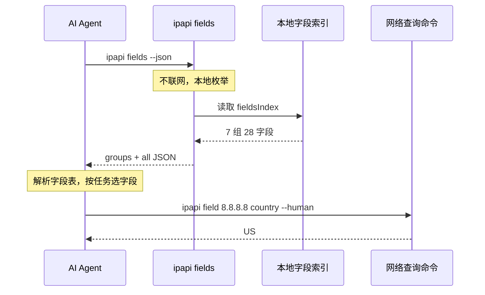
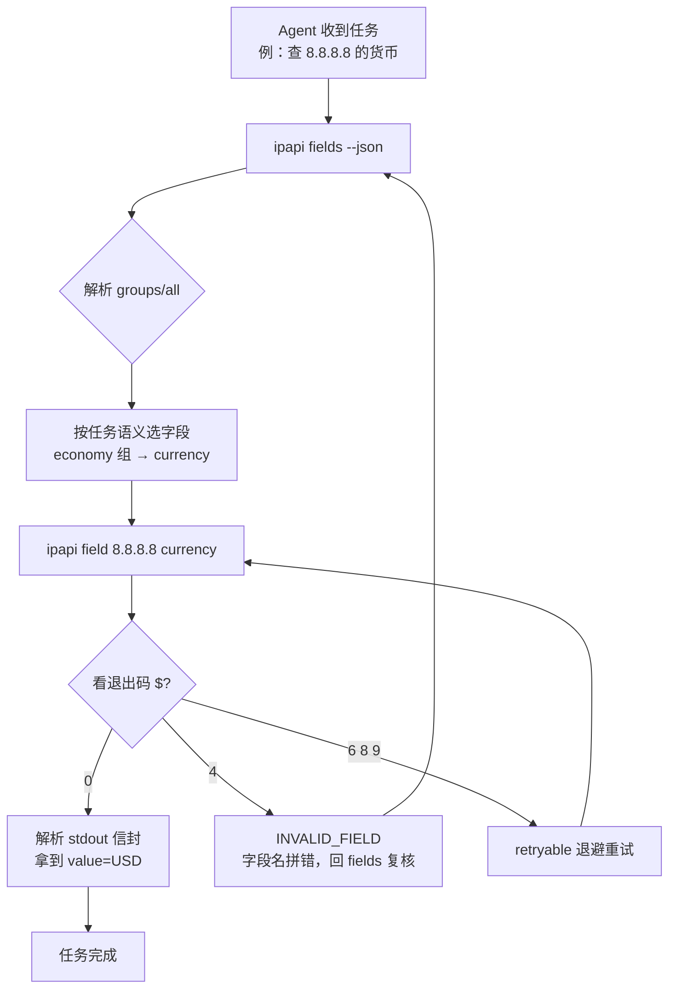
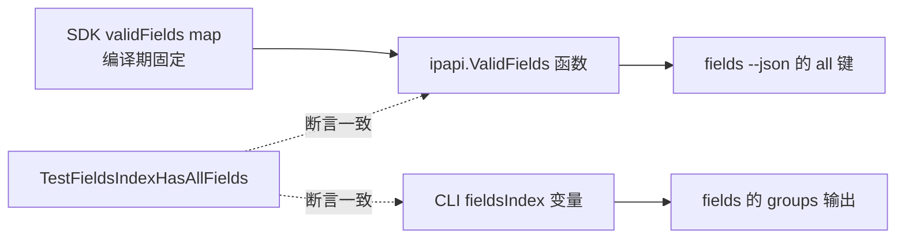

# 📋 fields 命令

> `ipapi fields` —— 列出全部 28 个可查字段，按 7 个语义分组展示。**纯本地枚举，不发起任何网络请求**，是 AI Agent "先探查能力边界、再决定查什么"的自描述入口。

## 它解决什么问题

写脚本调 `ipapi field` 时，你常会卡在一个问题上：**到底有哪些字段可查？字段名怎么拼？** `country_code_iso3` 还是 `country_iso3`？`utc_offset` 还是 `utc_offset`？靠记忆和猜，拼错就是退出码 `4`（`INVALID_FIELD`）。

`fields` 命令把这个"试错"过程变成一次本地调用：

```bash
ipapi fields
```

```text

📡 ipapi 支持的可查字段（共 28 个）
──────────────────────────────────────────

  ▸ identity
      hostname
      ip
      network
      version

  ▸ geo
      city
      continent_code
      country
      country_capital
      country_code
      country_code_iso3
      country_name
      country_tld
      in_eu
      latitude
      latlong
      longitude
      postal
      region
      region_code

  ▸ time
      timezone
      utc_offset

  ▸ network
      asn
      org

  ▸ culture
      country_calling_code
      languages

  ▸ economy
      currency
      currency_name

  ▸ stats
      country_area
      country_population

──────────────────────────────────────────
用法: ipapi field <ip> <field>   |   ipapi me-field <field>
```

不需要联网，不需要 API Key，不需要翻文档——字段清单硬编码在二进制里，断网也能跑。所以它特别适合用来验证安装是否成功、给 Agent 当能力探查入口、以及让 shell 脚本动态选字段。

::: tip 🆚 与 `info` 的关系
`info` 返回某 IP 的全部 28 字段**取值**（要联网）；`fields` 返回全部 28 字段的**名称清单**（不联网）。一个是"查值"，一个是"查能查什么"——后者是前者的前置探查。
:::

---

## 命令语法

```bash
ipapi fields [--group <分组名>] [--json]
```

`fields` 不接受位置参数（`cobra.NoArgs`），只认两个本地旗标：

| 旗标 | 类型 | 默认值 | 说明 |
|------|------|--------|------|
| `--group` | string | `all` | 只显示指定分组：`identity` / `geo` / `time` / `network` / `culture` / `economy` / `stats`，或 `all`（全部） |
| `--json` | bool | `false` | 输出**纯 JSON 对象**（非信封），含 `groups` 与 `all` 两个键，便于脚本/Agent 程序化解析 |

::: warning ⚠️ `fields` 不走信封
注意：`fields` 是个"特例命令"。即便不加 `--json`，它默认输出的也不是 `info` 那种 `{ok, command, data, meta}` 信封，而是上面那样的人类可读分组视图。加 `--json` 后输出的是**纯 JSON 对象** `{"groups": [...], "all": [...]}`，同样没有 `ok`/`meta` 字段——因为这是本地枚举，没有"耗时""检索时间"等网络元信息可言。

如果你用脚本统一解析 ipapi 的输出，记得对 `fields` 单独处理：它没有信封包裹。
:::

### 退出码

`fields` 是本地命令，几乎不会失败。可能的退出码：

| 码 | 含义 | 触发场景 |
|----|------|----------|
| `0` | 成功 | 正常列出字段 |
| `2` | USAGE | 传了多余位置参数，或 `--group` 给了未知分组名 |

`--group` 给未知值时，CLI 会直接报错并提示可选分组，例如：

```bash
$ ipapi fields --group geoo
# stderr:
# Error: --group: 未知分组 "geoo"，可选: identity/geo/time/network/culture/economy/stats
# 退出码 2
```

---

## 用法详解

### 1. 默认：人类可读分组视图

```bash
ipapi fields
```

输出如本文开头所示：7 个分组、每组下字段按字母序排列、底部附使用提示。这是给"人在终端前看"的形态。

::: details 📝 字段在输出里是字母序，不是定义序
源码里 `fieldsIndex` 的定义顺序是 `ip, network, version, hostname`（按语义逻辑），但打印时 `printFieldsHuman` 会 `sort.Strings(g.Fields)` 重新排序成 `hostname, ip, network, version`。这是为了人类扫读时更易定位。`--json` 的 `groups` 数组同样会排序，但 `all` 数组来自 SDK 的 `ValidFields()`（也已排序）——两条路径都保证稳定输出，便于 diff。
:::

### 2. `--json`：纯 JSON 对象（脚本/Agent 用）

```bash
ipapi fields --json
```

```json
{
  "groups": [
    {
      "name": "identity",
      "fields": ["hostname", "ip", "network", "version"]
    },
    {
      "name": "geo",
      "fields": ["city", "continent_code", "country", "country_capital", "country_code", "country_code_iso3", "country_name", "country_tld", "in_eu", "latitude", "latlong", "longitude", "postal", "region", "region_code"]
    },
    {
      "name": "time",
      "fields": ["timezone", "utc_offset"]
    },
    {
      "name": "network",
      "fields": ["asn", "org"]
    },
    {
      "name": "culture",
      "fields": ["country_calling_code", "languages"]
    },
    {
      "name": "economy",
      "fields": ["currency", "currency_name"]
    },
    {
      "name": "stats",
      "fields": ["country_area", "country_population"]
    }
  ],
  "all": ["asn", "city", "continent_code", "country", "country_area", "country_calling_code", "country_capital", "country_code", "country_code_iso3", "country_name", "country_population", "country_tld", "currency", "currency_name", "hostname", "in_eu", "ip", "languages", "latitude", "latlong", "longitude", "network", "org", "postal", "region", "region_code", "timezone", "utc_offset", "version"]
}
```

两个键的含义：

| 键 | 含义 | 用途 |
|----|------|------|
| `groups` | 7 个分组的数组，每项含 `name` 与按字母序的 `fields` | 按"主题"选字段（如做货币展示查 `economy` 组） |
| `all` | 全部 28 个字段名的一维数组（字母序） | 校验某个字段名是否合法、遍历全部字段 |

::: tip 🤖 为什么 `all` 单独拎出来？
`groups` 是给人/Agent 按"语义主题"理解字段用的；`all` 是给脚本做"合法性校验"用的——拿到 `all` 后 `if field in all` 就能预判 `ipapi field` 会不会返回 `INVALID_FIELD`，避免无谓的网络请求。两者各有侧重，所以并列输出。
:::

### 3. `--group`：只看某一组

```bash
ipapi fields --group geo
```

```text

📡 ipapi 支持的可查字段（共 28 个）
──────────────────────────────────────────

  ▸ geo
      city
      continent_code
      country
      country_capital
      country_code
      country_code_iso3
      country_name
      country_tld
      in_eu
      latitude
      latlong
      longitude
      postal
      region
      region_code

──────────────────────────────────────────
用法: ipapi field <ip> <field>   |   ipapi me-field <field>
```

`--group` 与 `--json` 可叠加使用，拿到单组的结构化输出：

```bash
ipapi fields --group network --json
```

```json
{
  "groups": [
    {
      "name": "network",
      "fields": ["asn", "org"]
    }
  ],
  "all": ["asn", "city", "continent_code", "country", "country_area", "country_calling_code", "country_capital", "country_code", "country_code_iso3", "country_name", "country_population", "country_tld", "currency", "currency_name", "hostname", "in_eu", "ip", "languages", "latitude", "latlong", "longitude", "network", "org", "postal", "region", "region_code", "timezone", "utc_offset", "version"]
}
```

::: details 🔍 `--group all` 是显式的"全部"
`--group` 默认值就是 `all`，所以 `ipapi fields` 与 `ipapi fields --group all` 完全等价。`all` 是一个被特殊处理的值——传它会跳过分组过滤，输出全部 7 组。除此之外的任何值都会去 `fieldsIndex` 里找匹配，找不到就报 USAGE 错误（退出码 2）。
:::

---

## 28 字段分组表

`fields` 命令输出的 7 个分组与 28 个字段完整对照如下。这张表与 SDK 的 `IPInfo` 结构体字段一一对应（详见 [API 字段总览](../api/fields)）。

| 分组 | 字段数 | 字段 | 语义 |
|------|:----:|------|------|
| 🆔 `identity` | 4 | `ip` `network` `version` `hostname` | IP 本身的标识：地址、CIDR 网段、IPv4/IPv6、反向解析主机名 |
| 🌍 `geo` | 15 | `city` `region` `region_code` `country` `country_name` `country_code` `country_code_iso3` `country_capital` `country_tld` `continent_code` `in_eu` `postal` `latitude` `longitude` `latlong` | 地理归属：城市、一级行政区、国家、大洲、邮政编码、经纬度 |
| ⏰ `time` | 2 | `timezone` `utc_offset` | 时区：IANA 时区名（如 `America/Los_Angeles`）与 UTC 偏移（如 `-0700`） |
| 📡 `network` | 2 | `asn` `org` | 网络：自治系统号（如 `AS15169`）与组织名（如 `Google LLC`） |
| 🗣️ `culture` | 2 | `languages` `country_calling_code` | 文化：官方语言列表与国际电话区号（如 `1`） |
| 💰 `economy` | 2 | `currency` `currency_name` | 经济：货币代码（如 `USD`）与货币名称（如 `Dollar`） |
| 📊 `stats` | 2 | `country_area` `country_population` | 统计：所属国家的面积（km²）与人口 |

合计 4 + 15 + 2 + 2 + 2 + 2 + 2 = **28 个字段**。

::: tip 🧭 怎么按"任务"选分组
- 做国家分流 / 地理可视化 → `--group geo`
- 做 ASN 黑名单 / 流量归因 → `--group network`
- 做时区问候 / 跨时区调度 → `--group time`
- 做货币展示 / 价格本地化 → `--group economy`
- 做电话号码格式化 → `--group culture`
- 做国家统计 / 人口画像 → `--group stats`
- 验证 IP 本身 / 反查主机名 → `--group identity`
:::

---

## Agent 自发现用法

`fields` 是 ipapi CLI 里**为 AI Agent 专门设计**的命令。它的存在让 Agent 不必把字段表硬编码进 prompt，而是"现场探查、按需取用"。

### 为什么 Agent 需要 `fields`

让 LLM Agent 调用一个外部工具，最大的失败模式是"凭记忆猜参数"。字段名拼错（`country_iso3` vs `country_code_iso3`）会导致 `INVALID_FIELD`（退出码 4），Agent 不得不重试或放弃。`fields` 把"可查什么"变成一次零成本的本地探查：



整个探查过程**不发一个网络包**，对限流、对延迟都零负担——Agent 可以放心地在每次会话开头先 `fields` 一次，摸清能力边界。

### 典型 Agent 调用链

下面这张流程图展示 Agent 如何用 `fields` 串起一条"探查 → 选字段 → 查询 → 分支"的完整链路：



::: tip 🔁 `INVALID_FIELD` 后回探 `fields`
退出码 4（`INVALID_FIELD`）是确定性错误，重试也是同样结果——但 Agent 可以把它当成"字段名记忆有误"的信号，**回到 `fields` 重新拿权威清单**，从 `all` 数组里挑正确名字再查。这是 `fields` 作为"自描述入口"的第二层价值：不仅用于首次探查，也用于错误恢复。
:::

### 用 `all` 数组做预校验

Agent 在发起 `field` 查询前，可以先用 `all` 数组本地校验字段名，避免一次注定失败的网络请求：

```bash
# 取 all 数组，校验字段名是否合法
FIELDS=$(ipapi fields --json | jq -r '.all[]')
if echo "$FIELDS" | grep -qx "country_code_iso3"; then
  ipapi field 8.8.8.8 country_code_iso3 --human
  # USA
else
  echo "字段不存在，请复核" >&2
fi
```

这种"先本地校验、再远程查询"的两段式，把 `INVALID_FIELD` 错误挡在了网络层之前，既省请求又快。

---

## 不调用 SDK 方法（本地枚举）

`fields` 是 ipapi CLI 里少数**不对应任何 SDK 网络方法**的命令。它不调 `Client.GetIPInfo`，也不调 `Client.GetField`——它只读两样本地数据：

1. **CLI 自己的 `fieldsIndex` 变量**（定义在 [`cmd/ipapi/cmd_fields.go`](https://github.com/cyberspacesec/ipapi.co-skills/blob/main/cmd/ipapi/cmd_fields.go)）：7 个分组的展示用元数据。
2. **SDK 的 `ipapi.ValidFields()` 函数**（定义在 [`pkg/ipapi/api.go`](https://github.com/cyberspacesec/ipapi.co-skills/blob/main/pkg/ipapi/api.go)）：返回全部合法字段名的排序数组，用于填充 `--json` 输出里的 `all` 键。

`ValidFields()` 是一个纯内存函数——它遍历 SDK 内部的 `validFields` map（编译期就固定），不触碰 HTTP 客户端、不读配置、不需要 API Key。所以 `fields` 命令：

- ❌ 不创建 `ipapi.Client`
- ❌ 不读 `--api-key` / `--base-url` / `--timeout` 等网络配置（读了也用不上）
- ❌ 不走重试逻辑
- ✅ 只读本地字段索引 + SDK 的字段表

::: details 🧩 为什么 `fields` 仍归在 CLI 里，而不是独立工具？
因为字段清单必须与 SDK 的 `IPInfo` 结构体严格一致——CLI 的 `fieldsIndex` 里列出的 28 个字段，必须等于 `pkg/ipapi` 里 `validFields` map 的键集。把它放在同一仓库、同一二进制里，并用单元测试 `TestFieldsIndexHasAllFields` 强制校验这份一致性（见 [`cmd/ipapi/main_test.go`](https://github.com/cyberspacesec/ipapi.co-skills/blob/main/cmd/ipapi/main_test.go)）。如果某天 SDK 加了第 29 个字段，测试会立刻失败，提示同步更新 `fieldsIndex`——保证 CLI 永远不会列出"SDK 不认"的字段。
:::

### 一致性校验链路



两条数据源（SDK 的字段 map 与 CLI 的分组索引）被同一个测试钉在一起，确保 Agent 无论从 `all` 还是 `groups` 拿到的字段名，都能被 `ipapi field` 接受。

---

## 常见组合用法

### 安装自检（断网可用）

```bash
# 不联网、不要 Key 也能跑——验证二进制是否就位
ipapi version && ipapi fields --group identity
```

### 动态遍历全部字段

```bash
# 取某 IP 的全部 28 个字段值（用 all 数组驱动循环）
for f in $(ipapi fields --json | jq -r '.all[]'); do
  printf "%-22s " "$f"
  ipapi field 8.8.8.8 "$f" --human
done
```

### 按组生成字段清单文件

```bash
# 把 geo 组的字段名落盘，供下游脚本读取
ipapi fields --group geo --json | jq -r '.groups[0].fields[]' > geo-fields.txt
```

### 在 prompt 里嵌入字段表

```bash
# 给 Agent 的 system prompt 注入"可查字段"上下文
FIELDS_CTX=$(ipapi fields --json)
echo "可用 IP 字段（JSON）：$FIELDS_CTX"
```

::: warning ⚠️ `fields` 输出不带信封，别用 `jq .data`
`ipapi fields --json` 的输出是 `{"groups": [...], "all": [...]}`，**没有** `.ok` / `.data` / `.meta`。用 `jq` 时直接取顶层键：`jq '.all'`、`jq '.groups[] | .name'`，不要写 `jq '.data.all'`——那会得到 `null`。这是 `fields` 与其他命令最大的解析差异。
:::

---

## 下一步

- 🎯 [field 命令](./command-field) —— 拿 `fields` 选定字段名后，用 `field` 查指定 IP 的单字段值
- 🔍 [info 命令](./command-info) —— 一次取回全部 28 字段的完整信息
- 🤖 [Agent 接入指南](./agent) —— 如何把 `fields` 串进 Agent 的"探查 → 查询"调用链
- 📋 [命令速查](./commands) —— 全部 9 个子命令的一页式速查表
- 🚀 [快速开始](./quickstart) —— 5 分钟跑通 `fields` 与其他主力命令
- 🔧 [字段概念](../guide/field-concept) —— 28 字段分组背后的设计思路

## 对应 SDK 方法

`fields` 是本地枚举命令，**不调用任何 SDK 网络方法**。它的输出由两份数据拼成：

| 数据来源 | 用途 | 文档 |
|----------|------|------|
| CLI `fieldsIndex` 变量 | 7 个分组的展示元数据（`groups` 输出） | [`cmd/ipapi/cmd_fields.go`](https://github.com/cyberspacesec/ipapi.co-skills/blob/main/cmd/ipapi/cmd_fields.go) |
| `ipapi.ValidFields()` | 全部合法字段名的排序数组（`all` 输出） | [/api/fields](../api/fields) |

::: tip 🔗 一致性保证
CLI 的 `fieldsIndex` 与 SDK 的 `ValidFields()` 由单元测试 `TestFieldsIndexHasAllFields` 强制对齐——两份字段清单永远一致。SDK 端的字段总览见 [IPInfo 字段总览](../api/fields)。
:::
