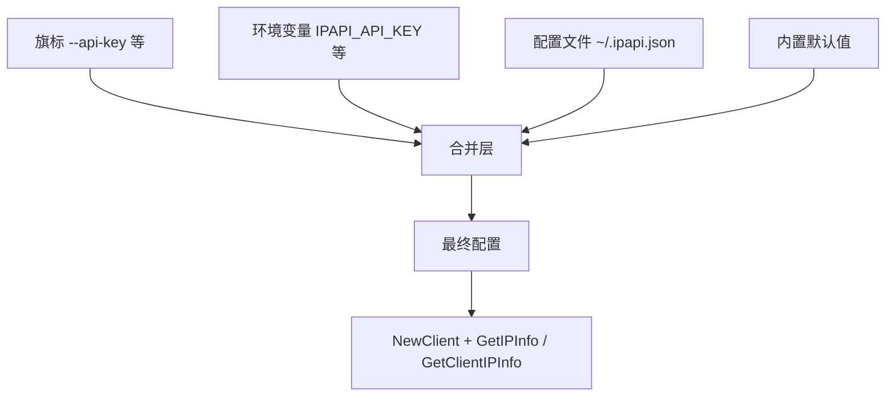
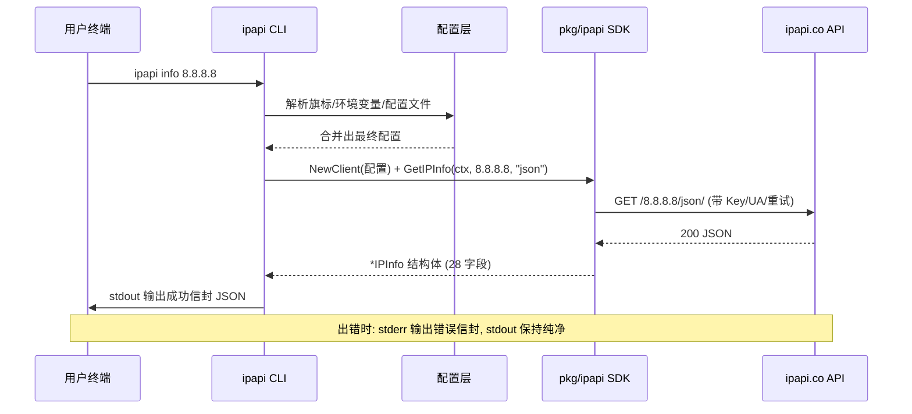

# 🔍 info / me 命令

> `ipapi info <ip>` 查指定 IP 的完整 28 字段信息，`ipapi me` 查本机公网 IP 的完整信息。两者都默认输出 JSON 信封、仅支持 `json` 格式，是 CLI 里"看全貌"的主入口。

`info` 和 `me` 是一对姊妹命令：`info` 需要你给出一个 IP，`me` 不需要任何参数——后者直接查"调用方自己的公网出口 IP"。除此之外，两者的输出结构、旗标行为、错误语义完全一致。本页把它们放在一起讲，避免重复，也方便对照。

- 📨 **默认 JSON 信封**：成功走 stdout，`data` 字段装着完整的 28 个 `IPInfo` 字段。
- 🧍 **`--human` 双形态**：机器读 JSON，人类读对齐表格。
- 🔒 **仅支持 `json`**：`info` / `me` 不接受 `-f xml` 等原始格式——要原始字节请用 [`raw`](./command-raw) / [`me-raw`](./command-raw)。
- 🔁 **统一错误信封**：失败时 stdout 保持纯净，错误信封走 stderr。

::: tip 🚀 一行装好
```bash
go install github.com/cyberspacesec/ipapi.co-skills/cmd/ipapi@latest
```
:::

---

## 📋 命令签名

| 命令 | 用法 | 参数 | 需网络 | 默认输出 |
|------|------|------|:----:|----------|
| `ipapi info <ip>` | `ipapi info <ip> [旗标]` | `<ip>`（必填，IPv4/IPv6） | ✅ | JSON 信封 |
| `ipapi me` | `ipapi me [旗标]` | 无 | ✅ | JSON 信封 |

::: details 🔍 `me` 是怎么"知道"本机 IP 的？
`me` 不会先在本地探测网卡地址再发给 API——它直接向 `https://ipapi.co/{format}/`（注意 URL 里没有 IP 段）发起请求，由 ipapi.co 服务端根据来源连接识别你的公网出口 IP，再返回该 IP 的完整信息。所以 `me` 查的是**公网出口 IP**，不是内网地址；如果你在 NAT/代理后，看到的是 NAT 出口或代理的 IP。
:::

### 位置参数

| 参数 | 必填 | 适用命令 | 说明 |
|------|:----:|----------|------|
| `<ip>` | ✅ | `info` | IPv4（如 `8.8.8.8`）或 IPv6（如 `2001:4860:4860::8888`） |

`me` 命令不接受任何位置参数——传了反而会触发用法错误（退出码 `2`）。

---

## 🎛️ 旗标

`info` / `me` 没有专属旗标，使用的是全局持久旗标（cobra `PersistentFlags`）。下列旗标对这两条命令最有意义：

| 旗标 | 类型 | 默认值 | 环境变量 | 对 `info`/`me` 的作用 |
|------|------|--------|----------|----------------------|
| `--api-key` | string | 空 | `IPAPI_API_KEY` | 注入 API Key，提升限额、解锁付费字段 |
| `--api-key-mode` | string | `header` | `IPAPI_API_KEY_MODE` | Key 传递方式：`header`（请求头）或 `query`（URL 参数） |
| `--base-url` | string | `https://ipapi.co/` | `IPAPI_BASE_URL` | 改指向代理/自建镜像 |
| `--user-agent` | string | `ipapi-cli/0.1.0` | — | 自定义 UA，便于服务端识别 |
| `--retries` | int | `2` | — | 重试次数，总请求数 = `retries + 1` |
| `--timeout` | duration | `10s` | — | 单次请求超时，支持 `30s` / `2m` 等 |
| `-H` / `--human` | bool | `false` | — | 人类可读：`info` 出对齐表格，`me` 同 |
| `--config` | string | `~/.ipapi.json` | — | 配置文件路径 |

::: warning ⚠️ `info` / `me` 不认 `-f` / `--format`
`info` 和 `me` 默认且**仅支持 `json`**——它们把响应解码为强类型 `IPInfo` 结构再装进信封。`-f` / `--format` 旗标是给 `raw` / `me-raw` 用的（那两条命令直出原始字节、不装信封）。如果你在 `info` 上传 `-f csv`，要么被忽略、要么触发用法错误，取决于实现；要拿 CSV/XML/YAML/JSONP 原文，请改用：

```bash
ipapi raw 8.8.8.8 -f csv     # 指定 IP 的 CSV 原文
ipapi me-raw -f yaml         # 本机 IP 的 YAML 原文
```
:::

::: tip 🧠 想查"本机单字段"而不是全量？
`me` 返回 28 个字段，但有时你只想要一个值（比如本机 ASN）。这时不要 `ipapi me | jq '.data.asn'`——直接用 `me-field` 更省流量、更省解析：

```bash
ipapi me-field asn --human   # 直出本机 ASN 纯值，便于管道
```
详见 [field / me-field 命令](./command-field)。
:::

### 配置优先级

旗标、环境变量、配置文件、默认值四者的合并规则对 `info` / `me` 完全生效：



口诀：**旗标 > 环境变量 > 配置文件 > 默认值**。CI 里临时覆盖用旗标，全终端永久生效写进 `~/.ipapi.json`，脚本可移植用环境变量。

---

## 📤 JSON 成功信封

### `ipapi info 8.8.8.8`

```bash
$ ipapi info 8.8.8.8
```

```json
{
  "ok": true,
  "command": "info",
  "args": { "ip": "8.8.8.8", "format": "json" },
  "data": {
    "ip": "8.8.8.8",
    "network": "8.8.8.0/23",
    "version": "IPv4",
    "hostname": "dns.google",
    "city": "Mountain View",
    "region": "California",
    "region_code": "CA",
    "country": "US",
    "country_name": "United States",
    "country_code": "US",
    "country_code_iso3": "USA",
    "country_capital": "Washington, D.C.",
    "country_tld": ".us",
    "continent_code": "NA",
    "in_eu": false,
    "postal": "94043",
    "latitude": 37.4056,
    "longitude": -122.0775,
    "latlong": "37.4056,-122.0775",
    "timezone": "America/Los_Angeles",
    "utc_offset": "-07:00",
    "asn": "AS15169",
    "org": "GOOGLE",
    "languages": "en",
    "country_calling_code": "+1",
    "currency": "USD",
    "currency_name": "Dollar",
    "country_area": 9629091,
    "country_population": 327167434
  },
  "meta": {
    "format": "json",
    "durationMs": 312,
    "retrievedAt": "2026-07-04T10:01:22Z"
  }
}
```

### `ipapi me`

```bash
$ ipapi me
```

输出结构与 `info` 完全一致，只是 `command` 变成 `"me"`，`args` 里没有 `ip`：

```json
{
  "ok": true,
  "command": "me",
  "args": { "format": "json" },
  "data": {
    "ip": "203.0.113.42",
    "network": "203.0.113.0/24",
    "version": "IPv4",
    "city": "Shanghai",
    "region": "Shanghai",
    "country": "CN",
    "country_name": "China",
    "country_code": "CN",
    "latitude": 31.0449,
    "longitude": 121.6129,
    "timezone": "Asia/Shanghai",
    "utc_offset": "+08:00",
    "asn": "AS4809",
    "org": "China Telecom Next Generation Network",
    "currency": "CNY",
    "currency_name": "Yuan Renminbi"
  },
  "meta": {
    "format": "json",
    "durationMs": 287,
    "retrievedAt": "2026-07-04T10:01:25Z"
  }
}
```

::: tip 📌 `data` 永远是完整 28 字段
为可读性，上面 `me` 的示例裁剪了部分字段。实际 `data` 永远是完整的 28 个 `IPInfo` 字段（与 [`ipapi fields`](./command-fields) 列出的清单一一对应）。个别字段在某些 IP 上可能为空字符串或零值——那是上游数据缺失，不是 CLI 漏字段。
:::

### 信封字段说明

| 字段 | 类型 | 说明 |
|------|------|------|
| `ok` | bool | `true` 表示成功 |
| `command` | string | `"info"` 或 `"me"`，标明来自哪条子命令 |
| `args` | object | 调用入参快照，`info` 含 `ip`+`format`，`me` 只含 `format` |
| `data` | object | 完整 28 字段 `IPInfo` 结构 |
| `meta.format` | string | 始终为 `"json"`（`info`/`me` 不出其它格式） |
| `meta.durationMs` | int | 端到端耗时（毫秒），含重试 |
| `meta.retrievedAt` | string | 查询时刻，RFC3339 / ISO 8601 UTC |

---

## 🧍 `--human` 人类可读输出

加 `-H` / `--human` 后，`info` / `me` 不再吐 JSON 信封，而是把 28 字段铺成对齐表格，终端肉眼一眼可读。

### `ipapi info 8.8.8.8 --human`

```bash
$ ipapi info 8.8.8.8 --human
```

```
ip          8.8.8.8
network     8.8.8.0/23
version     IPv4
hostname    dns.google
city        Mountain View
region      California
region_code CA
country     US
country_name United States
country_code US
country_code_iso3 USA
country_capital Washington, D.C.
country_tld .us
continent_code NA
in_eu       false
postal      94043
latitude    37.4056
longitude   -122.0775
latlong     37.4056,-122.0775
timezone    America/Los_Angeles
utc_offset  -07:00
asn         AS15169
org         GOOGLE
languages   en
country_calling_code +1
currency    USD
currency_name Dollar
country_area 9629091
country_population 327167434
```

### `ipapi me --human`

```bash
$ ipapi me --human
```

输出形态同上，字段值换成你本机出口 IP 的信息。`me --human` 是"我现在的公网出口是什么"最快的回答——不需要 Key、不需要参数，终端里敲一下就出表。

::: tip 🎯 `--human` 适合终端，JSON 适合管道
- 终端肉眼 → `ipapi info 8.8.8.8 --human`
- `jq` / 脚本 → `ipapi info 8.8.8.8 | jq '.data.country'`
- 取单值喂管道 → `ipapi field 8.8.8.8 country --human`（比 `info | jq` 更省）

`--human` 输出**不是**稳定接口，对齐宽度、字段顺序可能随版本调整，**不要**用 `grep`/`awk` 解析它做脚本逻辑——要结构化就老老实实用 JSON 信封或 `field --human`。
:::

---

## 🚦 错误情形

`info` / `me` 的错误统一走 stderr 信封，stdout 保持纯净（成功时才有 stdout）。退出码语义与全局一致。

### `info` 的常见错误

| 退出码 | code | 触发场景 | retryable |
|:------:|------|----------|:--------:|
| `2` | USAGE | 没传 `<ip>`、传了多余参数 | ❌ |
| `3` | INVALID_IP | `ipapi info 999.1.1.1`（非法 IP） | ❌ |
| `7` | RESERVED_IP | `ipapi info 10.0.0.1`（私有/保留段） | ❌ |
| `8` | NOT_FOUND | 查不到该 IP 的信息 | ✅ |
| `9` | SERVER_ERROR | 上游 5xx | ✅ |
| `6` | RATE_LIMITED | 触发限流 | ✅ |
| `11` | INVALID_KEY | API Key 无效/过期 | ❌ |
| `12` | UNEXPECTED_DATA | 返回体无法解码为 `IPInfo` | ❌ |
| `70` | INTERNAL | 内部异常 | ❌ |

### `me` 的常见错误

`me` 没有 `<ip>` 参数，所以不会出 INVALID_IP / RESERVED_IP。它最常碰到的是网络/限流类错误：

| 退出码 | code | 触发场景 | retryable |
|:------:|------|----------|:--------:|
| `2` | USAGE | `ipapi me 8.8.8.8`（多传了参数） | ❌ |
| `6` | RATE_LIMITED | 匿名调用过频 | ✅ |
| `9` | SERVER_ERROR | 上游 5xx | ✅ |
| `8` | NOT_FOUND | 上游对你出口 IP 无数据 | ✅ |
| `11` | INVALID_KEY | Key 无效 | ❌ |
| `70` | INTERNAL | 内部异常 | ❌ |

### 错误信封示例（stderr）

```bash
$ ipapi info 999.1.1.1
# stdout: 空
# stderr:
```

```json
{
  "ok": false,
  "command": "info",
  "args": { "ip": "999.1.1.1" },
  "error": {
    "code": "INVALID_IP",
    "message": "invalid IP address: 999.1.1.1",
    "sentinel": "ErrInvalidIP",
    "retryable": false
  }
}
```

`me` 的错误信封结构相同，只是 `command` 为 `"me"`、`args` 不含 `ip`。

::: warning ⚠️ 区分"可重试"与"不可重试"
退出码 `6 / 8 / 9` 标记 `retryable: true`——这类多半是瞬时性的（限流、上游抖动、临时查不到），配合 `--retries` 与退避重试是合理策略。`3 / 7 / 11 / 12` 是确定性错误，重试也是同样结果，应直接修正输入或换 Key。
:::

### 脚本里判断结果

```bash
if ipapi info 8.8.8.8 > /dev/null 2>&1; then
  echo "查询成功"
else
  rc=$?
  echo "失败 退出码=$rc" >&2
fi
```

退出码完整语义见 [命令速查](./commands#退出码速查)。

---

## 🔁 调用流程图

以 `ipapi info 8.8.8.8` 为例，看清一条命令从"回车"到"打印"经历了什么。`ipapi me` 的链路几乎一致，只是 SDK 调用的是 `GetClientIPInfo`、URL 里不带 IP 段。



::: details 🧩 CLI 与 SDK 的对应
CLI 是 SDK 的薄封装：`info` 对应 `Client.GetIPInfo(ctx, ip, "json")`，`me` 对应 `Client.GetClientIPInfo(ctx, "json")`。CLI 负责参数解析、配置合并、信封封装、退出码映射；SDK 负责真正的 HTTP 调用与 `IPInfo` 解码。脚本里用 CLI，Go 程序里用 SDK——同一套底层，两种入口。
:::

---

## 🧪 常见组合

### 首次安装自检（不要 Key）

```bash
# 查本机公网 IP，验证 CLI 装好了、能联网
ipapi me --human
```

### 带 Key 查指定 IP 全量

```bash
export IPAPI_API_KEY=sk-xxxxxxxxxxxx
ipapi info 8.8.8.8 | jq '.data | {ip, city, country, asn, org}'
```

### 取一个字段喂管道

```bash
# 别用 info | jq 取单值——用 field 更省
COUNTRY=$(ipapi field 8.8.8.8 country --human)
echo "8.8.8.8 归属：$COUNTRY"
```

### 批量查一批 IP

```bash
for ip in 8.8.8.8 1.1.1.1 9.9.9.9; do
  ipapi info "$ip" | jq -r --arg ip "$ip" '"\($ip)\t\(.data.country)\t\(.data.org)"'
done
```

### 落盘完整 JSON

```bash
ipapi info 8.8.8.8 > 8.8.8.8.json
ipapi me       > me.json
```

::: tip 📌 要 XML/CSV/YAML 落盘？
`info` / `me` 只出 JSON 信封。要原始格式落盘，用 `raw` / `me-raw` 直出原始字节：

```bash
ipapi raw 8.8.8.8 -f csv > 8.8.8.8.csv
ipapi me-raw -f yaml > me.yaml
```
:::

---

## ❓ 常见问题

::: details `info` 和 `me` 能不能出 CSV / XML？
不能。`info` / `me` 的设计是"解码为强类型 `IPInfo` 再装信封"，所以只支持 `json`。要原始字节（json/jsonp/xml/csv/yaml），用 `raw <ip> -f <fmt>` / `me-raw -f <fmt>`——它们直出上游原文、不装信封、不附带 meta。
:::

::: details `me` 查到的是内网 IP 还是公网 IP？
公网出口 IP。`me` 由 ipapi.co 服务端识别你的来源连接，所以看到的是 NAT/代理后的出口地址，不是内网网卡地址。在云服务器上跑 `me`，看到的是该云厂商出口 IP。
:::

::: details 为什么 `info 10.0.0.1` 报 RESERVED_IP？
`10.0.0.0/8`、`172.16.0.0/12`、`192.168.0.0/16`、`127.0.0.0/8`、`169.254.0.0/16` 等私有/保留段没有公网地理信息，ipapi.co 不收录，CLI 映射为 RESERVED_IP（退出码 `7`，不可重试）。这是确定性结果，重试没用——换一个公网 IP。
:::

::: details `--human` 输出能 grep 吗？
能 grep 看一眼，但**别**用 grep/awk 做脚本逻辑。`--human` 的对齐宽度、字段顺序可能随版本调整，不是稳定接口。要结构化取值，用 JSON 信封 + `jq`，或直接 `ipapi field <ip> <field> --human` 取纯值。
:::

---

## 下一步

- 🗂️ [命令速查](./commands) —— 全部 9 个子命令与全局旗标的一页式速查表
- 🚀 [快速开始](./quickstart) —— 五分钟跑通第一条命令
- 🎯 [field / me-field 命令](./command-field) —— 只取单字段，更省流量
- 📡 [raw / me-raw 命令](./command-raw) —— 直出 XML/CSV/YAML/JSONP 原始字节
- 🧭 [fields 命令](./command-fields) —— 28 个可查字段清单
- ⚙️ [配置方式](./config) —— 旗标/环境变量/配置文件的完整说明
- 📦 [错误概念](../guide/error-concept) —— 退出码与错误信封的完整语义
- 🍳 [实战手册](../cookbook/) —— CLI 与 SDK 的真实场景用法

## 对应 SDK 方法

ipapi CLI 是 `pkg/ipapi` SDK 的命令行封装。本页两条子命令对应的 SDK 方法：

| 子命令 | SDK 方法 | 文档 |
|--------|----------|------|
| `info <ip>` | `Client.GetIPInfo(ctx, ip, "json")` | [/api/get-ip-info](../api/get-ip-info) |
| `me` | `Client.GetClientIPInfo(ctx, "json")` | [/api/get-client-ip-info](../api/get-client-ip-info) |

::: tip 🔗 源码
CLI 命令定义见仓库 [`cmd/ipapi/`](https://github.com/cyberspacesec/ipapi.co-skills/blob/main/cmd/ipapi/) 目录；`info` / `me` 的信封封装与退出码映射逻辑同在此处。SDK 侧的 `GetIPInfo` / `GetClientIPInfo` 实现见 [`pkg/ipapi/api.go`](https://github.com/cyberspacesec/ipapi.co-skills/blob/main/pkg/ipapi/api.go)。
:::
