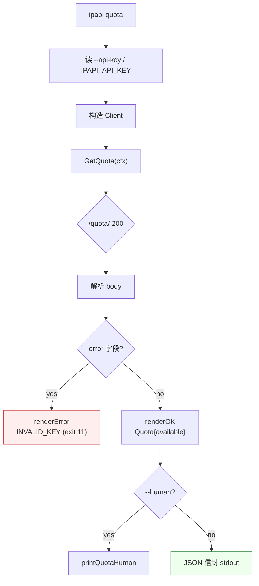

# 📊 quota 命令

> `ipapi quota` —— 查询当前 API key 的剩余 IP 查询配额。对应 ipapi.co 的 `GET /quota/` endpoint。

## 它解决什么问题

生产环境用 ipapi.co，最怕的就是配额耗尽突发 `429 RATE_LIMITED`。`quota` 命令让你随时探查剩余配额，配合 cron 定时监控，可在配额低于阈值时提前告警，避免服务中断。

## 用法

```bash
ipapi quota                       # JSON 信封（默认）
ipapi quota -H                    # 人类可读
IPAPI_API_KEY=xxx ipapi quota     # 用 key 查询真实配额
```

## 输出

### JSON 信封（默认）

```json
{
  "ok": true,
  "command": "quota",
  "args": {},
  "data": {
    "available": "12345"
  },
  "meta": {
    "format": "json",
    "durationMs": 210,
    "retrievedAt": "2026-07-05T20:30:00Z"
  }
}
```

### 人类可读（`-H`）

```text

  📊 IP 查询配额
  ─────────────────────────────────────────
  剩余配额        12345 次
  ─────────────────────────────────────────
```

### 未配置 key

```json
{
  "ok": true,
  "command": "quota",
  "data": { "available": "API key needed" }
}
```

`data.available` 为字符串 `"API key needed"`，提示需要配置 API key。

### 无效 key（退出码 11）

stderr 输出错误信封：

```json
{
  "ok": false,
  "command": "quota",
  "error": {
    "code": "INVALID_KEY",
    "message": "Invalid key. SignUp @ https://ipapi.co/pricing/ ",
    "sentinel": "ErrInvalidKey",
    "retryable": false
  }
}
```

退出码 `11`（`INVALID_KEY`），不重试。

## Agent 调用模板

```bash
# 取剩余配额数字
IPAPI_API_KEY=xxx ipapi quota | jq -r '.data.available'

# 配额低于 1000 时告警
remaining=$(IPAPI_API_KEY=xxx ipapi quota | jq -r '.data.available')
if [ "$remaining" != "API key needed" ] && [ "$remaining" -lt 1000 ]; then
  echo "⚠️ ipapi 配额仅剩 $remaining" >&2
  exit 1
fi
```

## 退出码

| 码 | code | 含义 | retryable |
|---|---|---|---|
| 0 | — | 成功 | — |
| 11 | INVALID_KEY | API key 无效/过期 | 否 |
| 12 | UNEXPECTED_DATA | 响应非 JSON | 否 |
| 9 | SERVER_ERROR | 服务端错误 | 是 |
| 6 | RATE_LIMITED | 限流 | 是 |
| 70 | INTERNAL | 其他内部错误 | 否 |

## 认证

复用全局旗标 / 环境变量：

- `--api-key` / `IPAPI_API_KEY`：API key
- `--api-key-mode`：`header`（Bearer，默认）或 `query`（`?key=`）

详见 [全局旗标](/cli/flags) 与 [认证机制](/guide/auth-concept)。

## 内部流程



## 相关

- [SDK `GetQuota` 方法](/api/get-quota)
- [配额监控 cookbook](/cookbook/quota-monitoring)
- [退出码详解](/cli/exit-codes)
- [全局旗标](/cli/flags)
