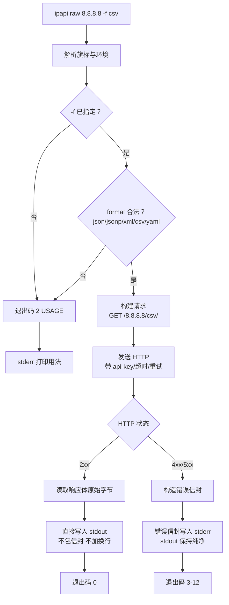
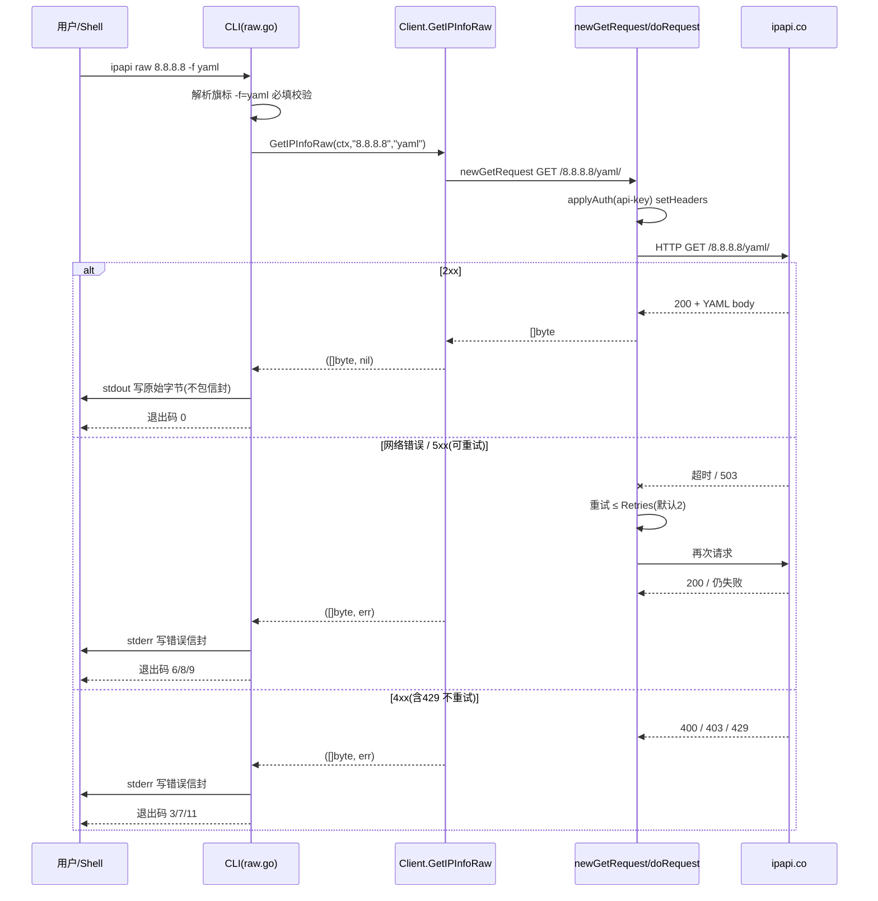
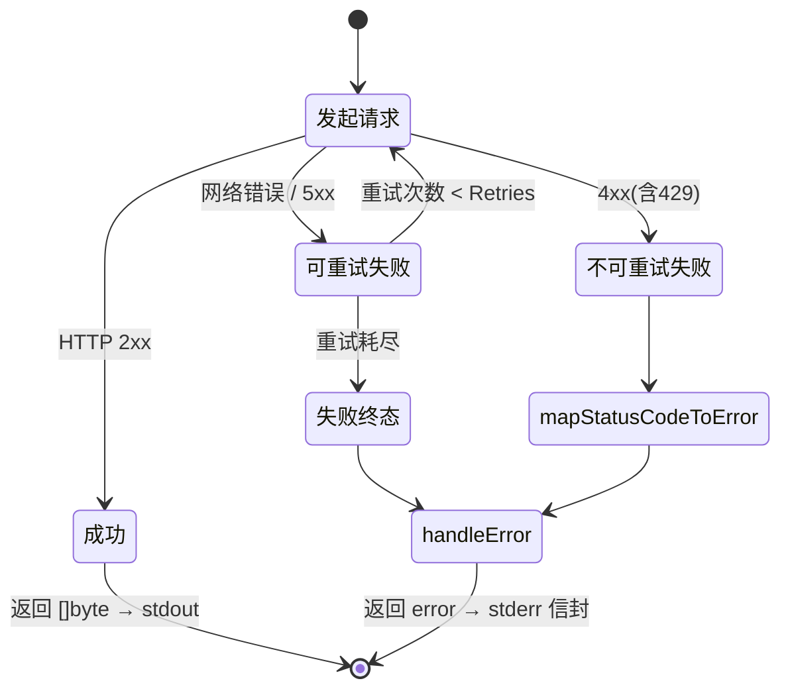

# 🦫 raw / me-raw 命令

> `ipapi raw <ip> -f <fmt>` 与 `ipapi me-raw -f <fmt>`：以 **5 种原始格式**查询 IP，原始字节**直出 stdout、不包 JSON 信封**——专为管道与下游解析器而生的"裸数据"通道。`raw` 查指定 IP，`me-raw` 查本机出口 IP。

## 概述

`info` / `me` 命令把 IP 信息包进一个标准 JSON 信封（`{ok, command, args, data, meta}`），便于程序化判断成败。但很多场景你要的不是"信封"，而是**原始负载本身**：

- 📦 想把 XML/CSV/YAML 直接落盘或喂给另一个解析器；
- 🪝 想用 `<script>` 标签做 JSONP 跨域回调；
- 🔧 想用 `jq` / `csvkit` / `yq` 自己切片，不希望外层信封碍事。

`raw` 与 `me-raw` 就是为此而生：它们直接把 `ipapi.co` 返回的原始响应体**原封不动**写到 stdout，不加信封、不加换行、不加注解。错误则走 stderr 的 JSON 信封——**stdout 永远纯净**，可以放心管道串联。

| 维度 | `raw <ip>` | `me-raw` |
|------|------------|----------|
| 查询对象 | 任意 IPv4/IPv6 | 本机出口 IP |
| 端点 | `GET /{ip}/{format}/` | `GET /{format}/` |
| 必填参数 | `<ip>` + `-f <fmt>` | `-f <fmt>` |
| 输出 | 原始字节，stdout | 原始字节，stdout |
| 信封 | ❌ 无 | ❌ 无 |
| 支持格式 | `json` `jsonp` `xml` `csv` `yaml` | 同左 |

::: tip 🚀 一行装好
```bash
go install github.com/cyberspacesec/ipapi.co-skills/cmd/ipapi@latest
```
:::

---

## 🧭 用法

### raw：查指定 IP 的原始格式

```bash
ipapi raw <ip> -f <fmt> [旗标]
```

| 参数 | 必填 | 说明 |
|------|:----:|------|
| `<ip>` | ✅ | IPv4 或 IPv6 地址，如 `8.8.8.8`、`2001:4860:4860::8888` |
| `-f, --format <fmt>` | ✅ | `json` / `jsonp` / `xml` / `csv` / `yaml` 五选一 |

### me-raw：查本机出口 IP 的原始格式

```bash
ipapi me-raw -f <fmt> [旗标]
```

| 参数 | 必填 | 说明 |
|------|:----:|------|
| `-f, --format <fmt>` | ✅ | `json` / `jsonp` / `xml` / `csv` / `yaml` |

::: warning ⚠️ `-f` 对 raw/me-raw 是**必填**的
不同于 `info`/`me`（默认 `json`），`raw` 与 `me-raw` **必须显式指定** `-f`。因为"原始格式"本身的语义就是"你要哪种原始字节"——不指定格式，命令无从决定该请求哪个端点。省略时退出码为 `2`（USAGE）。
:::

---

## 🎨 五种格式速览

`-f` 接受 5 个值，对应 `ipapi.co` 的 5 种响应格式。下表以 `8.8.8.8` 为例展示各自形态。

### json —— 标准 JSON 对象

```bash
ipapi raw 8.8.8.8 -f json
```

```json
{
    "ip": "8.8.8.8",
    "city": "Mountain View",
    "region": "California",
    "country": "US",
    "country_name": "United States",
    "latitude": 37.4056,
    "longitude": -122.0775,
    "asn": "AS15169",
    "org": "Google LLC",
    "timezone": "America/Los_Angeles"
}
```

::: details ℹ️ 为什么 `raw -f json` 和 `info` 看起来不一样？
`info` 把同一份 JSON 放进 `data` 字段并加一层信封；`raw -f json` **只输出**那份数据本身，没有 `ok`/`command`/`meta`。两者底层数据一致，只是外壳不同。
:::

### jsonp —— 带 `callback` 包裹的 JSON

```bash
ipapi raw 8.8.8.8 -f jsonp --callback myFunc
```

```javascript
myFunc({
    "ip": "8.8.8.8",
    "city": "Mountain View",
    "country": "US",
    ...
});
```

::: tip 🪝 `--callback` 仅在 `jsonp` 格式下生效
`--callback` 旗标指定 JSONP 的回调函数名。如果格式是 `json`/`xml`/`csv`/`yaml`，`--callback` 会被静默忽略。默认回调名由服务端决定，建议总是显式指定。
:::

### xml —— 结构化 XML

```bash
ipapi raw 8.8.8.8 -f xml
```

```xml
<?xml version="1.0" encoding="UTF-8"?>
<response>
    <ip>8.8.8.8</ip>
    <city>Mountain View</city>
    <region>California</region>
    <country>US</country>
    <country_name>United States</country_name>
    <latitude>37.4056</latitude>
    <longitude>-122.0775</longitude>
</response>
```

### csv —— 逗号分隔值

```bash
ipapi raw 8.8.8.8 -f csv
```

```
8.8.8.8,Mountain View,California,US,United States,37.4056,-122.0775,America/Los_Angeles,AS15169,Google LLC
```

::: details 🔍 CSV 没有表头
`ipapi.co` 的 CSV 响应**不含表头行**，只有一行数据。字段顺序与 `fields` 命令列出的 28 字段集合一致，但建议用 `json`/`yaml` 做结构化消费，CSV 更适合直接入库或表格工具。
:::

### yaml —— YAML 文档

```bash
ipapi raw 8.8.8.8 -f yaml
```

```yaml
ip: 8.8.8.8
city: Mountain View
region: California
country: US
country_name: United States
latitude: 37.4056
longitude: -122.0775
asn: AS15169
org: Google LLC
timezone: America/Los_Angeles
```

---

## 🌐 me-raw 示例

`me-raw` 不接受 IP 参数——它查询的是**当前机器的公网出口 IP**，常用于 NAT 探测、出口 IP 自检、代理链验证。

```bash
# 看本机出口 IP 的 YAML 全量信息
ipapi me-raw -f yaml
```

```yaml
ip: 203.0.113.42
city: Shanghai
region: Shanghai
country: CN
country_name: China
timezone: Asia/Shanghai
asn: AS4134
org: China Telecom
```

```bash
# 本机出口 IP 的 JSONP，回调名 handleMyIP
ipapi me-raw -f jsonp --callback handleMyIP
```

```javascript
handleMyIP({
    "ip": "203.0.113.42",
    "country": "CN",
    ...
});
```

---

## 🔧 旗标一览

`raw` / `me-raw` 继承全部全局旗标，其中与原始格式最相关的几个如下：

| 旗标 | 类型 | 默认 | 环境变量 | 说明 |
|------|------|------|----------|------|
| `-f, --format` | string | `json` | `IPAPI_FORMAT` | 原始格式，raw/me-raw 下**必填** |
| `--callback` | string | 空 | — | JSONP 回调名，仅 `jsonp` 生效 |
| `--api-key` | string | 空 | `IPAPI_API_KEY` | API Key，提升速率限制 |
| `--api-key-mode` | string | `header` | `IPAPI_API_KEY_MODE` | `header` 或 `query` |
| `--base-url` | string | `https://ipapi.co/` | `IPAPI_BASE_URL` | 自定义端点 |
| `--timeout` | duration | `10s` | — | 单次请求超时 |
| `--retries` | int | `2` | — | 重试次数，总请求 = retries+1 |

::: tip 📌 配置优先级
旗标 > 环境变量 > `~/.ipapi.json` > 默认值。详见 [配置指南](../guide/auth-concept) 与 [配置文件参考](./config)。
:::

---

## 📊 调用流程图

下图展示 `raw` / `me-raw` 从解析参数到输出原始字节的全流程，重点突出 **stdout / stderr 分流**。



::: details 🧩 为什么 stdout 必须纯净？
因为 `raw` 的核心价值是"裸数据可管道"。如果你写 `ipapi raw 8.8.8.8 -f json | jq '.city'`，任何混入 stdout 的额外字节（信封、日志、提示）都会破坏 `jq` 的解析。所以**成功时 stdout 只有原始负载**，一切元信息（`durationMs`、`retrievedAt`）和错误都去 stderr。这是与 `info` 命令最本质的设计差异。
:::

### 时序视角：CLI → SDK → 上游

下图以 `ipapi raw 8.8.8.8 -f yaml` 为例，展示从 CLI 解析参数到 SDK 的 [`GetIPInfoRaw`](../api/get-ip-info-raw) 返回 `[]byte`、再到原始字节**直出 stdout（不包信封）**的全链路时序。注意 `Client` 内部重试只针对网络错误与 5xx，4xx（含 429）立即返回。



::: tip 🔗 与 [`info`](./command-info) 命令的对照
同一份上游 YAML，`info` 会反序列化进 `*IPInfo` 再包信封 `{ok,data:{...}}`；`raw` 跳过反序列化，把 `[]byte` 原样写 stdout——这就是上图"C→U stdout 写原始字节"这一步的全部设计差异。
:::

### 状态视角：单次请求的状态流转

下图聚焦 `doRequest` 一次请求的状态机：重试只发生在网络错误与 5xx 通道，4xx（含 429）直接转入 `mapStatusCodeToError` 不重试，最终要么 `[]byte` 成功返回，要么带哨兵错误的 `error` 返回给 CLI 包装成 stderr 信封。



::: warning ⚠️ 429 也不重试
SDK 的 [`IsRetryableError`](../api/errors) 仅匹配 `ErrRateLimited` / `ErrServerError` / `ErrNotFound`，但 429（[`ErrRateLimited`](../api/errors)）属于 HTTP 4xx，`doRequest` 不会重试——它把 429 直接交给 `mapStatusCodeToError` 映射为哨兵错误返回。重试只针对真正的网络层失败与 5xx 响应。
:::

---

## 🐚 管道实战：与 jq / column / yq 串联

`raw` 直出原始字节的真正威力，在于它能无缝接入 Unix 管道生态。

### jq 切片 JSON

```bash
# 只取 city 和 country 字段
ipapi raw 8.8.8.8 -f json | jq '{city, country}'
```

```json
{
  "city": "Mountain View",
  "country": "US"
}
```

### jq 配合 me-raw 提取本机出口 IP

```bash
# 一行拿到本机公网 IP
ipapi me-raw -f json | jq -r '.ip'
```

```
203.0.113.42
```

### column 把 CSV 变成对齐表格

```bash
# 假设你已有表头文件 header.csv
ipapi raw 8.8.8.8 -f csv | paste -d',' header.csv - | column -t -s','
```

### yq 处理 YAML

```bash
# 从 YAML 提取 asn 字段
ipapi raw 8.8.8.8 -f yaml | yq '.asn'
```

```
AS15169
```

### xmllint 解析 XML

```bash
# XPath 提取 country 节点
ipapi raw 8.8.8.8 -f xml | xmllint --xpath '//country/text()' -
```

```
US
```

### JSONP + 管道：把回调名剥掉

```bash
# 去掉 jsonp 外层 callback，再交给 jq
ipapi raw 8.8.8.8 -f jsonp --callback cb | sed 's/^cb(//;s/);$//' | jq '.city'
```

::: warning ⚠️ JSONP 不能直接喂给 jq
JSONP 形如 `cb({...});`，不是合法 JSON。必须先用 `sed`/`awk` 剥掉 `cb(` 前缀和 `);` 后缀，才能交给 `jq`。如果下游是浏览器 `<script>` 标签则无需处理。
:::

---

## ❌ 错误处理：stderr 信封

`raw` / `me-raw` 失败时，**stdout 不输出任何内容**，错误以标准 JSON 信封写到 stderr。退出码语义与其它命令一致。

### 错误信封结构

```json
{
  "ok": false,
  "command": "raw",
  "args": {"ip": "999.1.1.1", "format": "json"},
  "error": {
    "code": "INVALID_IP",
    "message": "999.1.1.1 is not a valid IP address",
    "sentinel": "ErrInvalidIP",
    "retryable": false
  }
}
```

### 常见错误对照

| 退出码 | code | 触发场景 | retryable |
|:------:|------|----------|:---------:|
| 2 | USAGE | 未指定 `-f` 或格式非法 | ❌ |
| 3 | INVALID_IP | `<ip>` 不是合法 IPv4/IPv6 | ❌ |
| 5 | INVALID_FORMAT | `-f` 不在 5 种之内 | ❌ |
| 6 | RATE_LIMITED | 触发速率限制 | ✅ |
| 8 | NOT_FOUND | IP 无可用数据 | ✅ |
| 9 | SERVER_ERROR | 上游 5xx | ✅ |
| 11 | INVALID_KEY | API Key 无效 | ❌ |

::: tip 🔁 可重试错误（`retryable: true`）
`RATE_LIMITED` / `NOT_FOUND` / `SERVER_ERROR` 三类标记为可重试。CLI 的 `--retries`（默认 `2`）会对这些错误自动重试，总请求次数 = `retries + 1`。详见 [错误处理参考](../api/errors)。
:::

### 捕获错误信封的 shell 惯用法

```bash
# 把 stdout 落盘，stderr 错误信封单独捕获
ipapi raw 8.8.8.8 -f json > /tmp/ip.json 2> /tmp/err.json
if [ $? -ne 0 ]; then
  jq '.error' /tmp/err.json
  exit 1
fi
jq '.city' /tmp/ip.json
```

---

## ⚖️ raw vs info：何时用哪个？

| 场景 | 推荐命令 | 原因 |
|------|----------|------|
| 脚本里判断成败并读字段 | `info` | 信封带 `ok`/`meta`，便于结构化判断 |
| 把 XML/CSV/YAML 直接落盘 | `raw` | 不要信封污染，原样保存 |
| `jq`/`yq`/`xmllint` 切片 | `raw` | 纯净负载可直连管道 |
| 浏览器 `<script>` JSONP | `raw -f jsonp` | 服务端原始回调格式 |
| 人类查看对齐表格 | `info --human` | raw 无 `--human` 形态 |
| 需要请求耗时/时间戳 | `info` | 信封 `meta` 带 `durationMs`/`retrievedAt` |

::: details 🤔 raw 没有 --human
`--human` 是给 `info`/`field` 用的"人类可读"形态（对齐表格 / 纯值行）。`raw` 的语义就是"原样输出服务端字节"，加 `--human` 反而违背初衷。要看人类可读的完整信息，请用 `ipapi info <ip> --human`。
:::

---

## 📝 退出码

`raw` / `me-raw` 遵循 CLI 统一退出码：

| 码 | 含义 | raw/me-raw 触发条件 |
|:--:|------|---------------------|
| 0 | 成功 | 收到 2xx 并输出原始字节 |
| 2 | USAGE | 缺 `-f`、参数数量错 |
| 3 | INVALID_IP | `<ip>` 非法（仅 `raw`） |
| 5 | INVALID_FORMAT | `-f` 值不在 5 种之内 |
| 6 | RATE_LIMITED | 触发限流（可重试） |
| 8 | NOT_FOUND | IP 无数据（可重试） |
| 9 | SERVER_ERROR | 上游 5xx（可重试） |
| 11 | INVALID_KEY | API Key 无效 |
| 70 | INTERNAL | 未预期内部错误 |

---

## 🔗 对应 SDK 方法

`raw` 与 `me-raw` 命令分别对应 `pkg/ipapi` SDK 的两个原始字节方法。CLI 在内部完成参数解析、配置注入、重试与错误信封包装后，最终调用这两个方法。

| 命令 | SDK 方法 | 端点 |
|------|----------|------|
| `ipapi raw <ip> -f <fmt>` | `Client.GetIPInfoRaw(ctx, ip, format)` | `GET /{ip}/{format}/` |
| `ipapi me-raw -f <fmt>` | `Client.GetClientIPInfoRaw(ctx, format)` | `GET /{format}/` |

两者均返回 `([]byte, error)`——原始响应体字节与错误。CLI 把 `[]byte` 直接写 stdout，把 `error` 包装成 stderr 信封。

- 📘 [GetIPInfoRaw — SDK 方法详解](../api/get-ip-info-raw)
- 📗 [GetClientIPInfoRaw — SDK 方法详解](../api/get-client-ip-info-raw)
- 📕 [GetIPInfo / GetClientIPInfo（结构化版本）](../api/get-ip-info)

```go
// SDK 等价调用示例
client, _ := ipapi.NewClient(ipapi.WithAPIKey("your-key"))
data, err := client.GetIPInfoRaw(ctx, "8.8.8.8", "csv")
// data 即 ipapi raw 8.8.8.8 -f csv 的 stdout 内容
```

源码入口：[`cmd/ipapi/raw.go`](https://github.com/cyberspacesec/ipapi.co-skills/blob/main/cmd/ipapi/raw.go) · [`cmd/ipapi/me-raw.go`](https://github.com/cyberspacesec/ipapi.co-skills/blob/main/cmd/ipapi/me-raw.go)

---

## 🚀 下一步

- 📖 [命令速查](./commands) —— 9 个子命令一页式总表
- 🏗️ [info / me 命令](./command-info) —— 结构化信封版，对比 raw 的设计差异
- 🎯 [field / me-field 命令](./command-field) —— 单字段查询，`--human` 输出纯值
- 📚 [字段总览](../api/fields) —— 28 个可查字段清单
- ⚙️ [配置指南](../guide/auth-concept) —— 旗标/环境变量/配置文件优先级
- ❗ [错误处理参考](../api/errors) —— 退出码与错误信封全集
- 🧪 [JSONP 跨域指南](../guide/jsonp) —— `--callback` 在前端的实战用法
