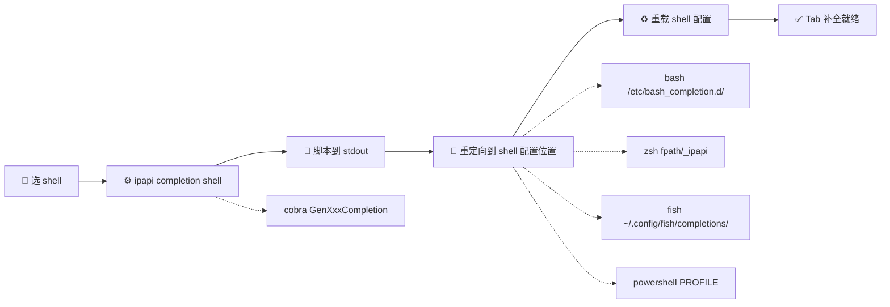
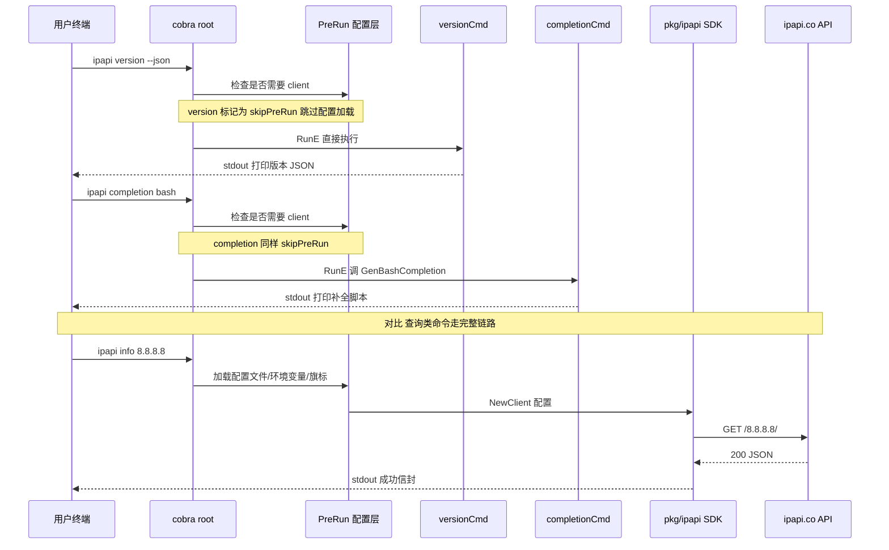

# 🏷️ version / completion 命令

> `ipapi version` 打印二进制的版本/commit/构建时间/Go 运行时版本，`ipapi completion <shell>` 生成 bash/zsh/fish/powershell 的自动补全脚本。两者都是纯本地命令——不走网络、不需要 API Key、不需要配置文件，是最适合用来「自检安装」与「提升手感」的两条命令。

ipapi CLI 把「我是谁」与「帮我补全」做成了两条独立子命令。前者回答「这二进制是哪个版本、用什么 Go 编的」，后者把 cobra 内置的补全能力直接吐成脚本，写到 shell 配置位置即可获得 Tab 补全。它们与查询类命令（`info` / `me` / `field` / `raw`）解耦——即便断网、没配 Key，也照样能跑，因此常被放进安装自检与 CI 冒烟脚本里。

---

## 🧭 命令总览

| 命令 | 用途 | 参数 | 需网络 | 退出码 |
|------|------|------|:----:|:----:|
| `ipapi version` | 打印版本信息（人类可读） | 无 | ❌ | `0` |
| `ipapi version --json` | 打印结构化版本信息（机器可读） | `--json` | ❌ | `0` |
| `ipapi completion <shell>` | 生成补全脚本到 stdout | `bash`/`zsh`/`fish`/`powershell` | ❌ | `0` / `2` |

::: tip 🚀 一行自检
```bash
ipapi version && ipapi fields --group identity
```
两条都是本地命令，跑通就说明二进制本身没问题，再排查网络/Key 也不迟。
:::

---

## 📦 version：打印版本信息

`ipapi version` 输出三件套：CLI 版本号、commit 哈希、构建时间，外加 Go 运行时版本。版本元数据由 goreleaser 在发布时通过 `-ldflags -X` 注入；若二进制是直接 `go build` 出来的（没带 ldflags），则显示 `dev` / `none` / `unknown`——功能照常，只是元数据为空。

### 默认人类可读输出

```bash
ipapi version
```

```
ipapi 0.1.0 (commit: abc1234, built: 2026-07-04T10:00:00Z)
Go go1.23.4
```

第一行是 `version (commit: <hash>, built: <date>)`，第二行是 `Go <goVersion>`。两行都用 `fmt.Printf` 直出 stdout，便于 `grep` / `awk` 提取。

### JSON 输出（`--json`）

加 `--json` 旗标，版本信息以缩进 JSON 输出到 stdout，字段固定为 `version` / `commit` / `date` / `goVersion`：

```bash
ipapi version --json
```

```json
{
  "version": "0.1.0",
  "commit": "abc1234",
  "date": "2026-07-04T10:00:00Z",
  "goVersion": "go1.23.4"
}
```

::: tip 🔧 用 `--json` + `jq` 做版本判断
```bash
# CI 里判断版本是否 ≥ 0.1.0
ver=$(ipapi version --json | jq -r '.version')
[ "$ver" = "0.1.0" ] && echo "版本匹配" || echo "版本不符: $ver"
```
`--json` 输出是结构化的，比 `grep` 人类可读输出更稳——版本号格式不会变，正则不会断。
:::

### 字段语义

| 字段 | 来源 | 未注入时的值 | 含义 |
|------|------|--------------|------|
| `version` | `main.version`（ldflags） | `dev` | 语义化版本号，如 `0.1.0` |
| `commit` | `main.commit`（ldflags） | `none` | git 短哈希，如 `abc1234` |
| `date` | `main.date`（ldflags） | `unknown` | 构建时间，RFC3339 UTC，如 `2026-07-04T10:00:00Z` |
| `goVersion` | `runtime.Version()` | —（运行时总有） | 编译用的 Go 版本，如 `go1.23.4` |

::: details 🔍 为什么我看到 `dev` / `none` / `unknown`？
源码里这三个变量初始化为 `dev` / `none` / `unknown`，靠 goreleaser 的 ldflags 在发布时注入真实值。如果你看到 `dev`，说明这个二进制是 `go build ./cmd/ipapi` 直接编译的（没带 `-X` 旗标），功能完全正常，只是版本元数据为空。Releases 下载的二进制和 `go install @latest` 拉到的版本会有真实版本号。源码构建时手动注入见 [安装指南 · 源码构建](./install#方式四-源码构建)。
:::

### 旗标

| 旗标 | 类型 | 默认 | 说明 |
|------|------|------|------|
| `--json` | bool | `false` | 输出 JSON 而非人类可读文本 |

`version` 不接受任何位置参数（`cobra.NoArgs`），传参会报 USAGE 错误（退出码 `2`）。它也不继承查询相关的全局旗标——`--api-key` / `--format` / `--timeout` 等对它无意义，传了会被忽略。

::: warning ⚠️ `version` 不读配置文件
`version` 与 `completion` / `fields` / `help` 一样，被标记为「不需要 client」，会跳过 PreRun 的配置加载阶段——也就是说不会去读 `~/.ipapi.json`、不会解析 `IPAPI_*` 环境变量、不会尝试构造 SDK 客户端。这是设计上的「轻量化」：自检命令不该因为配置缺失而失败。
:::

### 退出码

| 码 | 含义 | 触发场景 |
|----|------|----------|
| `0` | 成功 | 正常打印版本信息 |
| `2` | USAGE | 传了位置参数（如 `ipapi version 8.8.8.8`） |

`version` 几乎不会失败——它不联网、不读配置、不解析参数，唯一能出错的方式就是用法错误。

---

## 🐚 completion：生成 shell 补全脚本

`ipapi completion <shell>` 把 cobra 内置的补全生成器直接吐到 stdout。四种 shell 各对应一个生成函数，输出的是完整的补全脚本，重定向到 shell 配置位置即可生效。

### 语法

```bash
ipapi completion <shell>
# shell ∈ { bash, zsh, fish, powershell }
```

`completion` 接受且必须接受 1 个位置参数（`cobra.ExactArgs(1)`），并通过 `ValidArgs` 限定只能是 `bash` / `zsh` / `fish` / `powershell` 之一。传别的值会报错。

### 四种 shell 的生成器

| shell | 调用的 cobra 方法 | 输出特点 |
|-------|-------------------|----------|
| `bash` | `GenBashCompletion` | bash 补全脚本，注册 `__start_ipapi` |
| `zsh` | `GenZshCompletion` | zsh 补全脚本，注册 `_ipapi` 函数 |
| `fish` | `GenFishCompletion(_, true)` | fish 补全脚本，带描述 |
| `powershell` | `GenPowerShellCompletionWithDesc` | PowerShell 脚本，带描述 |

### bash 安装

```bash
# 系统级（需 sudo）
sudo ipapi completion bash > /etc/bash_completion.d/ipapi

# 用户级（无需 sudo，推荐）
mkdir -p ~/.local/share/bash-completion/completions
ipapi completion bash > ~/.local/share/bash-completion/completions/ipapi

# 重载
source ~/.bashrc
```

### zsh 安装

```bash
# 把脚本放到 fpath 内的某个目录
mkdir -p ~/.zfunc
ipapi completion zsh > ~/.zfunc/_ipapi

# 确保 ~/.zfunc 在 fpath（加到 ~/.zshrc，在 compinit 之前）
fpath+=~/.zfunc

# 重载
source ~/.zshrc
```

::: details 📝 zsh 的 `fpath` 与 `compinit`
zsh 的补全机制要求补全脚本文件名以 `_` 开头（如 `_ipapi`）且所在目录在 `fpath` 里。`compinit` 会扫描 `fpath` 注册这些函数。如果你的 `~/.zshrc` 还没调用 `compinit`，加一行 `autoload -Uz compinit && compinit` 在 `fpath` 设置之后。oh-my-zsh 用户通常已经配好，直接放脚本即可。
:::

### fish 安装

```sh
# fish 会自动加载 ~/.config/fish/completions 下的脚本
ipapi completion fish > ~/.config/fish/completions/ipapi.fish

# 立即生效，无需重载
```

fish 的补全是「即时编译」式的——`~/.config/fish/completions/*.fish` 会被自动加载，写完就能用，连 `source` 都不用。

### powershell 安装

```powershell
# 生成脚本到 profile
ipapi completion powershell | Out-File -Encoding utf8 $PROFILE

# 重载当前会话
. $PROFILE
```

::: warning ⚠️ PowerShell 执行策略
若 `.` `$PROFILE` 报「无法加载文件，因为在此系统上禁止运行脚本」，是执行策略限制。以管理员开 PowerShell 跑一次：
```powershell
Set-ExecutionPolicy -Scope CurrentUser RemoteSigned
```
之后 `. $PROFILE` 即可生效。
:::

### 验证补全生效

装好后开一个新终端，试这几个 Tab：

```bash
ipapi <Tab>            # 列出所有子命令
ipapi field 8.8.8.8 <Tab>   # 列出 28 个可查字段名
ipapi raw 8.8.8.8 -f <Tab>  # 列出格式选项 json/jsonp/xml/csv/yaml
ipapi completion <Tab>      # 列出 bash/zsh/fish/powershell
ipapi --<Tab>              # 列出所有全局旗标
```

::: tip 🎯 字段补全尤其有用
28 个字段名（`country_code_iso3` / `continent_code` / `country_calling_code` …）记不全很正常。装好补全后，`ipapi field 8.8.8.8 <Tab>` 直接列全，按方向键选——这是 `completion` 命令最日常的收益。
:::

### 补全安装流程图



### 退出码

| 码 | 含义 | 触发场景 |
|----|------|----------|
| `0` | 成功 | 脚本生成并写到 stdout |
| `2` | USAGE | 未传 shell 参数、传了多个参数、或传了非 `bash/zsh/fish/powershell` 的值 |

::: warning ⚠️ 不支持的 shell 会报 USAGE
`completion` 的 `ValidArgs` 限定四种 shell。传 `ipapi completion tcsh` 会因参数不合法报错（退出码 `2`），stderr 输出用法提示。不会静默失败。
:::

---

## 🔗 两条命令的调用链

`version` 与 `completion` 都是「本地命令」，不经过 SDK 客户端，但走的还是 cobra 的同一套命令分发框架。下图把它们的执行路径与查询类命令对比清楚：



::: details 🧩 为什么 version/completion 跳过配置加载？
源码里 `skipPreRun` 判断逻辑对 `help` / `completion` / `version` / `fields` 四类命令返回 true，跳过 PreRun 的配置合并与客户端构造。原因有二：一是这些命令不需要网络，构造 client 纯属浪费；二是「自检命令」不该因为 `~/.ipapi.json` 写错或 `IPAPI_BASE_URL` 设错而失败——它们是排查问题时的「最小可用集」，必须能在任何环境下跑起来。
:::

---

## 🧪 常见用法

### 安装自检三连

```bash
# 1. 二进制可用性
ipapi version

# 2. 字段清单本地可用（验证子命令树）
ipapi fields --group identity

# 3. 联网链路（验证 API 可达 + Key 有效）
ipapi me --human
```

第一步用 `version` 确认二进制没坏，第二步用 `fields` 确认 cobra 子命令树正常，第三步才轮到真实查询。出问题时按这个顺序排查，能快速定位是「装坏了」还是「网不通」还是「Key 不对」。

### CI 冒烟脚本

```bash
# .github/workflows/smoke.yml 片段
- name: Verify ipapi install
  run: |
    ipapi version --json | jq -e '.version == "0.1.0"'
    ipapi fields --json | jq -e 'length == 28'
```

`version --json` 配合 `jq -e` 能在 CI 里做精确版本断言，比 `grep` 文本输出稳得多。`fields --json` 输出 28 元素数组，断言长度即可验证字段清单完整。

### 一键装补全（dotfiles 友好）

把补全安装写进 dotfiles bootstrap 脚本，新机器一条命令搞定：

```bash
#!/usr/bin/env bash
set -e

case "$(basename "$SHELL")" in
  bash)
    mkdir -p ~/.local/share/bash-completion/completions
    ipapi completion bash > ~/.local/share/bash-completion/completions/ipapi
    ;;
  zsh)
    mkdir -p ~/.zfunc
    ipapi completion zsh > ~/.zfunc/_ipapi
    ;;
  fish)
    mkdir -p ~/.config/fish/completions
    ipapi completion fish > ~/.config/fish/completions/ipapi.fish
    ;;
esac

echo "✅ ipapi 补全已安装，重开终端或 source 配置即可生效"
```

::: tip 🔄 升级 ipapi 后要重新生成补全吗？
通常不用——补全脚本是「壳」侧能力，告诉 shell「遇到 ipapi 这个命令时 Tab 该补什么」。脚本本身不调用 ipapi 二进制，cobra 生成的脚本会动态查询当前二进制的子命令树（通过 `__complete` 隐藏命令），所以新增子命令后 Tab 也能跟上。只有子命令树结构大改（比如重命名了子命令）时才需要重新生成。
:::

### 提取版本号进变量

```bash
# 人类可读输出 + awk
ver=$(ipapi version | awk 'NR==1{print $2}')
echo "$ver"   # 0.1.0

# 或 JSON 输出 + jq（更稳）
ver=$(ipapi version --json | jq -r '.version')
echo "$ver"   # 0.1.0
```

两种方式都行，`--json` + `jq` 更稳健——不依赖文本格式，未来即使人类可读输出调整了也不会断。

---

## ❓ 常见问题

::: details Q: `ipapi version` 显示 `dev`，怎么注入真实版本号？
`go build` 时带 ldflags 即可：
```bash
go build -ldflags="-s -w \
  -X main.version=0.1.0 \
  -X main.commit=$(git rev-parse --short HEAD) \
  -X main.date=$(date -u +%Y-%m-%dT%H:%M:%SZ)" \
  -o ipapi ./cmd/ipapi
```
官方 Release 的二进制由 goreleaser 自动注入，`go install @latest` 拉到的也会有真实版本号。详见 [安装指南 · 源码构建](./install#方式四-源码构建)。
:::

::: details Q: `version --json` 的输出是 stdout 还是 stderr？
stdout。`version` 用 `json.NewEncoder(os.Stdout)` 编码，与所有成功输出一样走 stdout。`--json` 不改变流向，只改变格式。脚本里可以放心 `ipapi version --json | jq`。
:::

::: details Q: 装了补全但 Tab 不补字段？
分两步排查：① 确认补全脚本被 shell 实际加载——bash 用 `complete -p ipapi` 看是否注册，zsh 确认 `compinit` 已跑且 `_ipapi` 在 fpath，fish 检查 `~/.config/fish/completions/ipapi.fish` 存在。② 新开一个终端窗口再试——补全脚本在 shell 启动时加载，当前会话不会自动生效。
:::

::: details Q: `completion` 命令本身需要联网吗？
不需要。`completion` 调的是 cobra 的本地生成器（`GenBashCompletion` 等），脚本内容在二进制里就已确定，不发起任何 HTTP 请求。断网环境也能生成。
:::

::: details Q: 能把补全脚本提交进仓库统一管理吗？
可以，但不推荐。补全脚本依赖 cobra 版本与子命令树，跟着二进制版本走最稳。建议在 dotfiles 里用「检测到 ipapi 存在就调用 `ipapi completion <shell>` 现场生成」的方式，而不是把脚本静态提交进仓库——这样升级 ipapi 后补全永远跟得上。
:::

---

## 📌 小结

- 🏷️ `version` 打印版本/commit/构建时间/Go 版本，`--json` 切结构化输出，是安装自检的第一道关。
- 🐚 `completion <shell>` 生成 bash/zsh/fish/powershell 补全脚本，重定向到 shell 配置位置即可获得 Tab 补全——字段名补全尤其有用。
- 🚫 两者都是纯本地命令，跳过配置加载，断网/无 Key 也能跑，最适合放进 CI 冒烟与 dotfiles bootstrap。
- 🔧 CI 里用 `version --json | jq -e` 做版本断言，比 grep 文本更稳。

---

## 下一步

- 📦 [安装指南](./install) —— 四种方式装好 ipapi，含补全安装详解
- 🗂️ [命令速查](./commands) —— 9 个子命令 + 全局旗标一页流
- 🚀 [快速开始](./quickstart) —— 五分钟跑通第一条查询命令
- 🧭 [fields 命令](./command-fields) —— 另一条本地命令，列出 28 个可查字段
- ℹ️ [info 命令](./command-info) —— 查指定 IP 完整信息，理解 JSON 成功信封
- 🏠 回 [CLI 首页](../index) —— 全站导航

## 对应 SDK 方法

`version` 与 `completion` 是 CLI 自身的能力，**没有对应的 SDK 方法**——它们不调用 `pkg/ipapi` 客户端，是 cobra 命令树里的本地辅助命令。

| 子命令 | SDK 方法 | 文档 |
|--------|----------|------|
| `version` | —（CLI 本地命令） | — |
| `completion <shell>` | —（cobra 内置生成器） | — |

::: tip 🔗 源码
- 版本命令实现：[`cmd/ipapi/cmd_version.go`](https://github.com/cyberspacesec/ipapi.co-skills/blob/main/cmd/ipapi/cmd_version.go)
- 补全命令构造：同文件内 `buildCompletionCmd`，由 [`cmd/ipapi/root.go`](https://github.com/cyberspacesec/ipapi.co-skills/blob/main/cmd/ipapi/root.go) 注册到根命令
- 版本变量注入：见仓库根 [.goreleaser.yaml](https://github.com/cyberspacesec/ipapi.co-skills/blob/main/.goreleaser.yaml) 的 `ldflags` 段
:::
