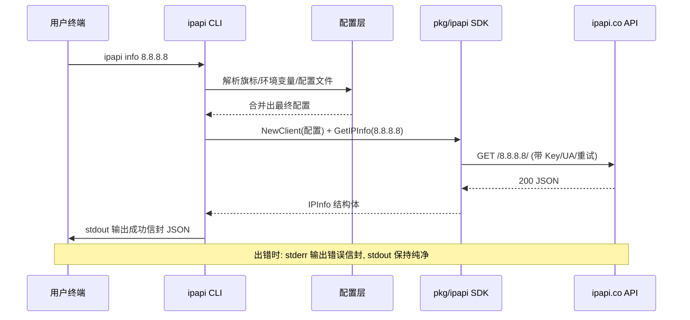
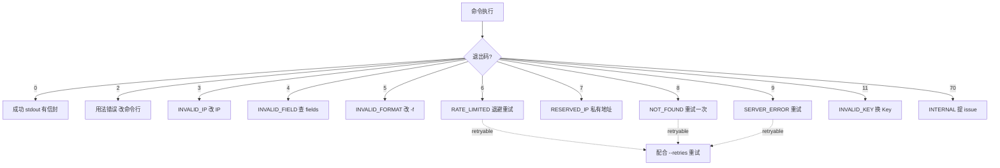
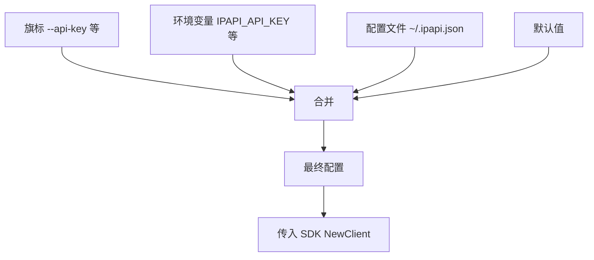

# 🗂️ 命令速查

> ipapi CLI 全部 9 个子命令与全局旗标的一页式速查表。一图抵千言，一表抵千行——本页是你在终端前的"翻字典"页：忘了某条命令的参数？想确认哪些命令走网络？想一眼对照退出码？都在这里。

## 概述

ipapi CLI 是围绕 `pkg/ipapi` SDK 构建的命令行工具，把 SDK 的核心能力（查 IP / 查本机 IP / 查单字段 / 查原始格式 / 列字段 / 版本 / 补全）映射成 9 个子命令。所有命令遵循同一套约定：

- 📨 **默认 JSON 信封**：成功走 stdout，错误走 stderr——stdout 永远纯净，可以放心 `| jq` 或管道串联。
- 🧭 **统一配置来源**：旗标 > 环境变量 > `~/.ipapi.json` > 默认值。
- 🔢 **语义化退出码**：`0` 成功，`2` 用法错误，`3-12` 各类业务错误，`70` 内部错误——便于脚本判断。
- 🧩 **`--human` 双形态**：机器读 JSON，人类读对齐表格 / 纯值行。

::: tip 🚀 一行装好
```bash
go install github.com/cyberspacesec/ipapi.co-skills/cmd/ipapi@latest
```
:::

---

## 📋 子命令总表（9 条）

下表列出全部 9 个子命令。"需网络"列标注该命令是否会发起 HTTP 请求到 `ipapi.co`。

| 命令 | 用途 | 参数 | 示例 | 需网络 |
|------|------|------|------|:----:|
| `ipapi info <ip>` | 查指定 IP 的完整信息，返回 28 字段 JSON 信封 | `<ip>`（必填） | `ipapi info 8.8.8.8` | ✅ |
| `ipapi me` | 查本机公网 IP 的完整信息 | 无 | `ipapi me` | ✅ |
| `ipapi field <ip> <field>` | 查指定 IP 的单个字段，返回 `{field,value}` | `<ip>` `<field>`（均必填） | `ipapi field 8.8.8.8 country` | ✅ |
| `ipapi me-field <field>` | 查本机 IP 的单个字段 | `<field>`（必填） | `ipapi me-field country` | ✅ |
| `ipapi raw <ip> -f <fmt>` | 查指定 IP 的原始格式，**直出原始字节**到 stdout | `<ip>` `-f json\|jsonp\|xml\|csv\|yaml` | `ipapi raw 8.8.8.8 -f csv` | ✅ |
| `ipapi me-raw -f <fmt>` | 查本机 IP 的原始格式，直出原始字节 | `-f <fmt>`（必填） | `ipapi me-raw -f yaml` | ✅ |
| `ipapi fields` | 列出 28 个可查字段（本地、无网络） | `[--group X]` `[--json]` | `ipapi fields --group geo` | ❌ |
| `ipapi quota` | 查询当前 API key 剩余配额 | 无 | `ipapi quota` | ✅ |
| `ipapi version` | 打印版本信息 | `[--json]` | `ipapi version --json` | ❌ |
| `ipapi completion <shell>` | 生成 shell 补全脚本 | `<bash\|zsh\|fish\|powershell>` | `ipapi completion bash` | ❌ |

::: details 🔍 为什么 `fields` / `version` / `completion` 不走网络？
这 3 条命令是纯本地操作：`fields` 的字段清单硬编码在二进制里，`version` 读构建时注入的版本号，`completion` 由 cobra 本地生成补全脚本。它们即便断网、即便没有 API Key 也能跑——所以最适合用来验证安装是否成功。
:::

### 命令分组一图流

```mermaid
flowchart LR
    A["ipapi"] --> B["查询类 走网络"]
    A --> C["本地类 无网络"]
    B --> B1["info &lt;ip&gt;"]
    B --> B2["me"]
    B --> B3["field &lt;ip&gt; &lt;field&gt;"]
    B --> B4["me-field &lt;field&gt;"]
    B --> B5["raw &lt;ip&gt; -f &lt;fmt&gt;"]
    B --> B6["me-raw -f &lt;fmt&gt;"]
    C --> C1["fields"]
    C --> C2["version"]
    C --> C3["completion &lt;shell&gt;"]
    B1 -. JSON 信封 .-> D["stdout"]
    B5 -. 原始字节 .-> D
    B3 --human -. 纯值一行 .-> D
```

---

## 🎛️ 全局旗标速查

下列旗标对所有子命令生效（cobra `PersistentFlags`），可在任意子命令前/后穿插使用。

| 旗标 | 类型 | 默认值 | 环境变量 | 说明 |
|------|------|--------|----------|------|
| `--api-key` | string | 空 | `IPAPI_API_KEY` | API 密钥，留空走匿名（受限）调用 |
| `--api-key-mode` | string | `header` | `IPAPI_API_KEY_MODE` | 密钥传递方式：`header`（请求头）或 `query`（URL 参数） |
| `-f` / `--format` | string | `json` | `IPAPI_FORMAT` | 原始格式输出格式：`json` / `jsonp` / `xml` / `csv` / `yaml` |
| `--base-url` | string | `https://ipapi.co/` | `IPAPI_BASE_URL` | API 基址，可指向代理或自建镜像 |
| `--user-agent` | string | `ipapi-cli/0.1.0` | — | 自定义 User-Agent |
| `--retries` | int | `2` | — | 重试次数，总请求数 = `retries + 1` |
| `--timeout` | duration | `10s` | — | 单次请求超时，支持 `30s` / `2m` 等 Go duration 写法 |
| `-H` / `--human` | bool | `false` | — | 人类可读输出（默认 JSON 信封） |
| `--config` | string | `~/.ipapi.json` | — | 配置文件路径 |
| `--callback` | string | 空 | — | JSONP 回调名，仅 `raw` / `me-raw` + `jsonp` 格式生效 |

::: warning ⚠️ `info` 的 `--format` 只认 `json`
`info` 子命令默认且仅支持 JSON 信封输出。若要拿到 `xml` / `csv` / `yaml` / `jsonp` 的**原始字节**，请改用 `raw <ip> -f <fmt>`——`raw` 才是"原始格式直出"的入口。
:::

::: tip 🧠 配置优先级记忆口诀
**旗标 > 环境变量 > 配置文件 > 默认值**——越靠近命令行，优先级越高。想在 CI 里临时覆盖某个值？用旗标；想在所有终端永久生效？写进 `~/.ipapi.json`；想让脚本可移植？用环境变量。
:::

### 配置文件示例

`~/.ipapi.json` 是普通 JSON，字段名用下划线：

```json
{
  "api_key": "sk-xxxxxxxxxxxx",
  "api_key_mode": "header",
  "format": "json",
  "base_url": "https://ipapi.co/",
  "user_agent": "ipapi-cli/0.1.0",
  "retries": 2,
  "timeout": "10s",
  "callback": "handleResponse"
}
```

::: details 📝 `timeout` 在配置文件里是字符串
JSON 没有原生 duration 类型，所以配置文件里 `timeout` 写成 `"10s"` / `"30s"` / `"2m"` 这样的字符串，CLI 内部用 Go 的 `time.ParseDuration` 解析。旗标 `--timeout 10s` 同理。
:::

---

## 📤 输出形态对照

不同命令、不同 `--human` 设置会产出不同形态的 stdout。下表帮你一眼选对组合。

| 目标 | 推荐命令 | stdout 形态 | 适合谁 |
|------|----------|-------------|--------|
| 机器解析完整信息 | `ipapi info 8.8.8.8` | JSON 信封（含 `data` 28 字段） | `jq`、脚本 |
| 人类看完整信息 | `ipapi info 8.8.8.8 --human` | 对齐表格 | 终端肉眼 |
| 取单字段喂管道 | `ipapi field 8.8.8.8 country --human` | 纯值一行（如 `US`） | `bash` 管道、`xargs` |
| 取单字段结构化 | `ipapi field 8.8.8.8 country` | `{"field":"country","value":"US"}` 信封 | 程序 |
| 拿 XML/CSV/YAML 原文 | `ipapi raw 8.8.8.8 -f csv` | 原始字节，无信封 | 数据落盘、下游系统 |
| 拿 JSONP（前端用） | `ipapi raw 8.8.8.8 -f jsonp --callback cb` | `cb({...})` | `<script>` 注入 |
| 列字段清单 | `ipapi fields` | 分组人类可读 | 查字段名 |
| 列字段给脚本 | `ipapi fields --json` | JSON 数组 | 自动化 |

### `field --human` 纯值示例

```bash
$ ipapi field 8.8.8.8 country --human
US
```

一行纯值，可以直接接管道：

```bash
# 批量取一批 IP 的国家码
for ip in 8.8.8.8 1.1.1.1 9.9.9.9; do
  printf "%s\t" "$ip"
  ipapi field "$ip" country --human
done
```

### `info` 默认 JSON 信封示例

```bash
$ ipapi info 8.8.8.8
```

```json
{
  "ok": true,
  "command": "info",
  "args": { "ip": "8.8.8.8", "format": "json" },
  "data": {
    "ip": "8.8.8.8",
    "network": "8.8.8.0/23",
    "version": "IPv4",
    "city": "Mountain View",
    "region": "California",
    "country": "US",
    "country_name": "United States",
    "country_code": "US",
    "latitude": 37.4056,
    "longitude": -122.0775,
    "timezone": "America/Los_Angeles",
    "org": "GOOGLE",
    "asn": "AS15169"
  },
  "meta": {
    "format": "json",
    "durationMs": 312,
    "retrievedAt": "2026-07-04T10:01:22Z"
  }
}
```

::: tip 📌 `data` 里其实是 28 个字段
上面示例为节省篇幅只展示了部分字段。完整 28 字段清单用 `ipapi fields` 查看，分组见下文。
:::

---

## 🚦 退出码速查

脚本里 `echo $?` 判断结果时对这张表。

| 码 | 含义 | 可重试 | 典型场景 |
|----|------|:----:|---------|
| `0` | 成功 | — | 正常返回 |
| `2` | USAGE 用法错误 | ❌ | 参数缺失、子命令拼错 |
| `3` | INVALID_IP | ❌ | `ipapi info 999.1.1.1` |
| `4` | INVALID_FIELD | ❌ | 字段名拼错 |
| `5` | INVALID_FORMAT | ❌ | `raw -f txt`（不支持） |
| `6` | RATE_LIMITED | ✅ | 触发限流，稍后重试 |
| `7` | RESERVED_IP | ❌ | 私有/保留地址段 |
| `8` | NOT_FOUND | ✅ | 查不到结果 |
| `9` | SERVER_ERROR | ✅ | 上游 5xx |
| `10` | METHOD_NOT_ALLOWED | ❌ | HTTP 方法错误 |
| `11` | INVALID_KEY | ❌ | API Key 无效 |
| `12` | UNEXPECTED_DATA | ❌ | 返回数据解析失败 |
| `70` | INTERNAL | ❌ | 内部异常 |

::: warning 🔁 区分"可重试"与"不可重试"
退出码 `6 / 8 / 9` 标记为 `retryable: true`——这类错误多半是瞬时性的（限流、上游抖动），脚本里配合 `--retries` 与退避重试是合理策略。其余码（`3/4/5/7/11/12` 等）是确定性错误，重试也是同样结果，应直接修正输入。
:::

### 错误信封示例（stderr）

```bash
$ ipapi info 999.1.1.1
# stdout: 空
# stderr:
```

```json
{
  "ok": false,
  "command": "info",
  "args": { "ip": "999.1.1.1" },
  "error": {
    "code": "INVALID_IP",
    "message": "invalid IP address: 999.1.1.1",
    "sentinel": "ErrInvalidIP",
    "retryable": false
  }
}
```

---

## 🔁 命令调用流程图

以 `ipapi info 8.8.8.8` 为例，看清一条命令从"回车"到"打印"经历了什么。



::: details 🧩 CLI 与 SDK 的关系
CLI 是 SDK 的薄封装：`info` 对应 `Client.GetIPInfo`，`me` 对应 `Client.GetClientIPInfo`，`field` 对应 `Client.GetField`，`raw` 对应 `Client.GetIPInfoRaw`，`me-raw` 对应 `Client.GetClientIPInfoRaw`，`me-field` 对应 `Client.GetClientField`。CLI 负责参数解析、配置合并、信封封装、退出码映射；SDK 负责真正的 HTTP 调用与数据结构。脚本里用 CLI，程序里用 SDK——同一套底层，两种入口。
:::

### 错误处理决策树



---

## 🗂️ 28 字段分组速查

`ipapi fields` 列出的 28 个可查字段按主题分 7 组：

| 组 | 字段 |
|----|------|
| 🆔 identity | `ip` `network` `version` `hostname` |
| 🌍 geo | `city` `region` `region_code` `country` `country_name` `country_code` `country_code_iso3` `country_capital` `country_tld` `continent_code` `in_eu` `postal` `latitude` `longitude` `latlong` |
| ⏰ time | `timezone` `utc_offset` |
| 📡 network | `asn` `org` |
| 🗣️ culture | `languages` `country_calling_code` |
| 💰 economy | `currency` `currency_name` |
| 📊 stats | `country_area` `country_population` |

::: tip 🔎 按组列字段
```bash
# 只看 geo 组
ipapi fields --group geo

# 拿到 JSON 给脚本消费
ipapi fields --json
```
`fields` 命令本地无网络，字段清单与 SDK 的 `IPInfo` 结构体一一对应。
:::

---

## 🧪 常见组合速用

### 首次安装自检

```bash
# 不联网、不要 Key 也能跑——验证安装
ipapi version
ipapi fields --group identity
```

### 匿名查本机公网 IP

```bash
# 没配 Key 也能查（匿名有独立限流）
ipapi me --human
```

### 带 Key 查指定 IP 的国家

```bash
export IPAPI_API_KEY=sk-xxxxxxxxxxxx
ipapi field 8.8.8.8 country --human
# => US
```

### 导出 CSV 落盘

```bash
# raw 直出原始字节，重定向到文件
ipapi raw 8.8.8.8 -f csv > 8.8.8.8.csv
```

### 脚本里判断结果

```bash
if ipapi info 8.8.8.8 > /dev/null 2>&1; then
  echo "查询成功"
else
  rc=$?
  echo "失败 退出码=$rc" >&2
fi
```

::: warning ⚠️ `raw` 的错误也走 stderr
`raw` / `me-raw` 成功时 stdout 是**原始字节**（无信封），但失败时错误**仍然走 stderr 信封**——所以脚本里要 `2>` 单独捕获错误，不要把 stderr 混进 stdout 的原始数据。
:::

---

## ⚙️ 配置优先级可视化



---

::: tip 📖 想深入每条命令？
本页是速查表。每条子命令的详细参数、旗标、输出示例、退出码语义、与 SDK 方法的对应关系，见各命令专页：
- `info` · `me` · `field` · `me-field` · `raw` · `me-raw` · `fields` · `version` · `completion`
:::

## 下一步

- 📖 [安装指南](../guide/installation) —— 把 ipapi CLI 装到本机
- 🚀 [快速开始](../guide/getting-started) —— 五分钟跑通第一条命令
- 🧱 [客户端概念](../guide/client-concept) —— CLI 背后的 SDK 客户端模型
- 🔧 [字段概念](../guide/field-concept) —— 28 字段的设计思路
- 📦 [错误概念](../guide/error-concept) —— 退出码与错误信封的完整语义
- 🍳 [实战手册](../cookbook/) —— CLI 与 SDK 的真实场景用法

## 对应 SDK 方法

ipapi CLI 是 `pkg/ipapi` SDK 的命令行封装。子命令与 SDK 方法的对应关系：

| 子命令 | SDK 方法 | 文档 |
|--------|----------|------|
| `info <ip>` | `Client.GetIPInfo` | [/api/get-ip-info](../api/get-ip-info) |
| `me` | `Client.GetClientIPInfo` | [/api/get-client-ip-info](../api/get-client-ip-info) |
| `field <ip> <field>` | `Client.GetField` | [/api/get-field](../api/get-field) |
| `me-field <field>` | `Client.GetClientField` | [/api/get-client-field](../api/get-client-field) |
| `raw <ip> -f <fmt>` | `Client.GetIPInfoRaw` | [/api/get-ip-info-raw](../api/get-ip-info-raw) |
| `me-raw -f <fmt>` | `Client.GetClientIPInfoRaw` | [/api/get-client-ip-info-raw](../api/get-client-ip-info-raw) |
| `fields` | `IPInfo` 结构体字段 | [/api/fields](../api/fields) |
| `version` | — | — |
| `completion <shell>` | — | — |

::: tip 🔗 源码
CLI 入口与命令定义见仓库 [`cmd/ipapi/`](https://github.com/cyberspacesec/ipapi.co-skills/blob/main/cmd/ipapi/) 目录。
:::
