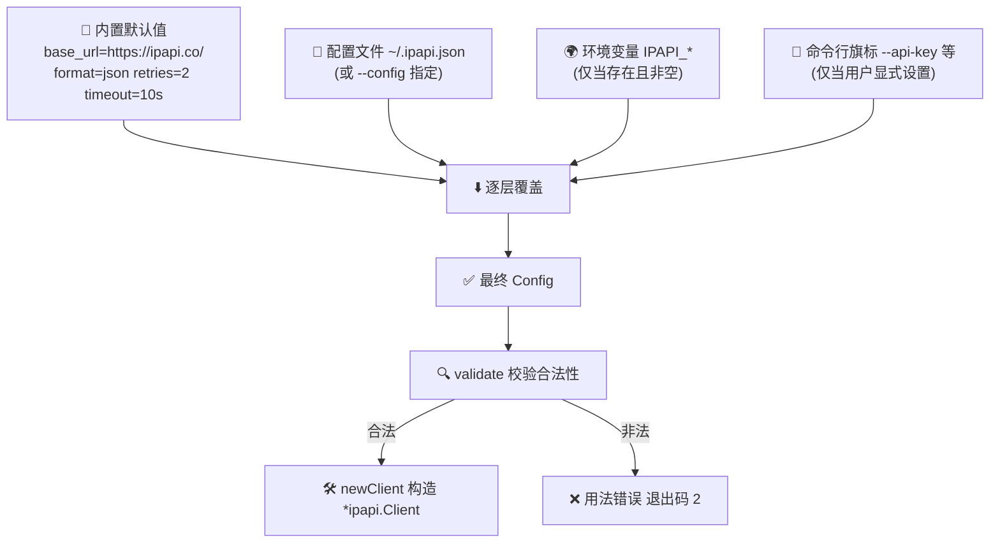
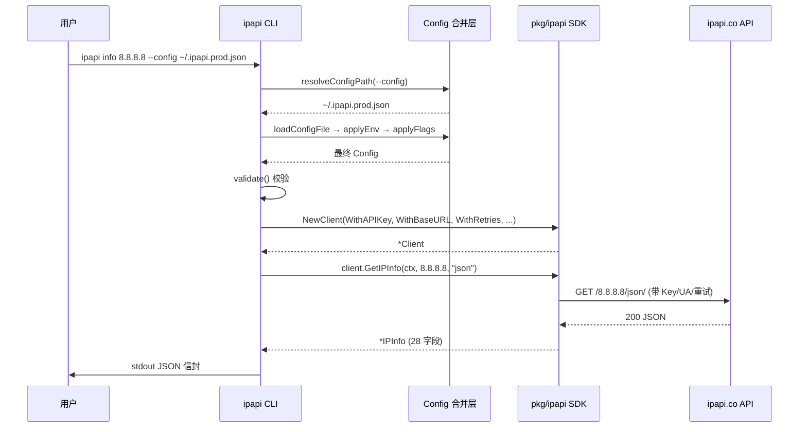

# ⚙️ 配置

> ipapi CLI 用一条「四层覆盖链」管理所有可调参数：**旗标 > 环境变量 > 配置文件 > 默认值**。CI 临时覆盖用旗标，多终端永久生效写进 `~/.ipapi.json`，脚本可移植靠环境变量——同一套配置语义，覆盖从本地开发到容器化部署的全部场景。

ipapi CLI 把「怎么连 API」「用什么格式」「带不带 Key」这些跨命令的共性配置抽出来，做成一套全局持久旗标（cobra `PersistentFlags`）。所有子命令（`info` / `me` / `field` / `raw` / ...）共享同一份配置——你不必每条命令重复传参。本页讲清这份配置的四层来源、合并顺序、字段语义与典型用法。

- 🧱 **四层来源**：默认值打底，配置文件塑形，环境变量覆盖，旗标压顶。
- 📄 **配置文件 `~/.ipapi.json`**：JSON 格式，stdlib 解析，零额外依赖。
- 🌍 **环境变量**：`IPAPI_*` 前缀，天然适配容器与 CI。
- 🛣️ **`--config` 自定义路径**：多套配置切换（生产/测试/自建镜像）。

::: tip 🚀 一行装好
```bash
go install github.com/cyberspacesec/ipapi.co-skills/cmd/ipapi@latest
```
:::

---

## 🧱 四层优先级

ipapi CLI 在每条子命令的 `PersistentPreRunE` 阶段执行一次配置合并，得到一份最终 `Config`，再据此构造 `*ipapi.Client`。合并严格按以下顺序，**后者覆盖前者**：



口诀：**旗标 > 环境变量 > 配置文件 > 默认值**。

四层各自的最佳场景：

| 来源 | 谁优先 | 适合场景 |
|------|:------:|----------|
| 旗标 `--api-key` 等 | 最高 | CI 单次覆盖、临时换 Key、调试某条命令 |
| 环境变量 `IPAPI_*` | 次之 | 容器 `-e`、CI secrets、脚本可移植性 |
| 配置文件 `~/.ipapi.json` | 再次 | 个人/团队长期默认、多终端同步 |
| 内置默认值 | 最低 | 不做任何配置时的兜底，保证开箱可用 |

::: tip 🎯 旗标只覆盖「显式设置」的那一项
旗标不是「无脑覆盖默认值」，而是「**用户显式传了才覆盖**」。CLI 用 cobra 的 `Flags().Changed(name)` 判断：你没传 `--retries`，就算默认值是 `2`，它也不会去覆盖环境变量里设的 `IPAPI_RETRIES=5`。这意味着你可以把环境变量当长期默认，只在需要时用旗标临时改某一项——其余项不动。
:::

::: warning ⚠️ 配置文件是「最低非默认」一层
配置文件的优先级**低于**环境变量与旗标——它的作用是「给默认值塑形」。如果你同时在 `~/.ipapi.json` 写了 `format: "yaml"` 又在 shell `export IPAPI_FORMAT=json`，最终生效的是 `json`。想让文件值胜出，就别设对应的环境变量/旗标。
:::

---

## 📄 配置文件 `~/.ipapi.json`

配置文件是 JSON 格式（stdlib `encoding/json` 即可解析，不引入 viper/yaml 等额外依赖）。默认路径是用户主目录下的 `~/.ipapi.json`。

### 路径解析顺序

`--config` 旗标只是「指定路径」的入口之一。完整的配置文件查找链如下，CLI 取**第一个存在**的文件，都没有就当「无配置文件」（不报错）：

| 顺序 | 来源 | 说明 |
|:----:|------|------|
| 1 | `--config <path>` | 旗标显式指定，最高优先 |
| 2 | `IPAPI_CONFIG` 环境变量 | 适合容器/CI 固定路径 |
| 3 | `./.ipapi.json` | 当前工作目录（项目级覆盖） |
| 4 | `~/.ipapi.json` | 用户主目录（全局默认） |

::: details 🔍 为什么要找 `./.ipapi.json`？
让你在一个项目目录里放一份「项目级配置」，进入该目录跑 `ipapi` 就自动套用——比如某项目用自建镜像、某项目用测试 Key。切到别的目录则不受影响。这份 `.ipapi.json` 可以也推荐加进 `.gitignore`，避免误提交真实 Key。
:::

### 一份完整示例

```json
{
  "api_key": "sk-xxxxxxxxxxxxxxxxxxxxxxxxxxxxxxxx",
  "api_key_mode": "header",
  "format": "json",
  "base_url": "https://ipapi.co/",
  "user_agent": "ipapi-cli/0.1.0",
  "retries": 3,
  "timeout": "15s",
  "callback": "handleResponse"
}
```

::: tip 💡 `timeout` 在文件里是字符串
Go 的 `time.Duration` 在 JSON 里没有原生表示，所以配置文件里 `timeout` 写成字符串（如 `"10s"`、`"2m"`、`"500ms"`），CLI 内部用 `time.ParseDuration` 解析。旗标 `--timeout` 同样接受这几种写法。
:::

### 最小可用配置

只想给所有命令兜底一个 Key、其余都用默认值，一行就够：

```json
{
  "api_key": "sk-xxxxxxxxxxxxxxxxxxxxxxxxxxxxxxxx"
}
```

### 创建配置文件

```bash
# 一行生成最小配置（注意替换为你自己的 Key）
cat > ~/.ipapi.json <<'EOF'
{
  "api_key": "sk-xxxxxxxxxxxxxxxxxxxxxxxxxxxxxxxx",
  "api_key_mode": "header",
  "format": "json",
  "retries": 2,
  "timeout": "10s"
}
EOF

# 权限收紧——配置里有 Key，别让同机其他用户读到
chmod 600 ~/.ipapi.json
```

::: warning ⚠️ 配置文件解析失败会报错
文件**不存在**视为「无配置文件」，静默跳过（开箱即用）。但文件**存在却解析失败**（JSON 语法错、`timeout` 写成 `10秒` 等非法 duration）会直接报错，CLI 不会用「坏配置」继续跑。这是有意为之——用户主动配错了应该被提示，而不是静默回退到默认值导致行为费解。
:::

---

## 📋 配置文件字段表

`~/.ipapi.json` 支持的全部字段。每个字段都对应一个全局旗标、一个环境变量（部分）。

| 字段（JSON key） | 类型 | 默认值 | 对应旗标 | 对应环境变量 | 说明 |
|------------------|------|--------|----------|--------------|------|
| `api_key` | string | `""` | `--api-key` | `IPAPI_API_KEY` | API 密钥，注入后提升限额、解锁付费字段 |
| `api_key_mode` | string | `"header"` | `--api-key-mode` | `IPAPI_API_KEY_MODE` | Key 传递方式：`header`（请求头，默认）或 `query`（URL 参数 `?key=`） |
| `format` | string | `"json"` | `-f` / `--format` | `IPAPI_FORMAT` | 响应格式：`json` \| `jsonp` \| `xml` \| `csv` \| `yaml`（`info`/`me` 仅支持 `json`） |
| `base_url` | string | `https://ipapi.co/` | `--base-url` | `IPAPI_BASE_URL` | API 基础 URL，可改指向代理或自建镜像 |
| `user_agent` | string | `ipapi-cli/0.1.0` | `--user-agent` | `IPAPI_USER_AGENT` | 自定义 User-Agent，便于服务端识别来源 |
| `retries` | int | `2` | `--retries` | `IPAPI_RETRIES` | 网络错误/5xx 重试次数，总请求数 = `retries + 1` |
| `timeout` | string | `"10s"` | `--timeout` | `IPAPI_TIMEOUT` | 单次请求超时（duration 字符串），如 `10s` / `30s` / `2m` |
| `callback` | string | `""` | `--callback` | — | JSONP 回调函数名，仅 `raw`/`me-raw` + `jsonp` 格式生效 |

::: details 🚫 哪些旗标不进配置文件？
`--human`（`-H`）和 `--config` 这两个旗标**不会**持久化到配置文件——它们是「本次调用」的运行时开关，对应 `Config` 结构里 `json:"-"` 标注的字段。原因：
- `--human` 是输出形态选择，每次调用都可能不同，不该固化；
- `--config` 本身就是「指定配置文件路径」，循环引用没有意义。

所以配置文件里写 `"human": true` 会被忽略，写 `"config": "/x/y.json"` 也会被忽略。
:::

::: tip 🔁 `retries` 在文件里的「0 被忽略」语义
配置文件加载时，`retries` 用 `> 0` 判断而非「非零」——即文件里写 `"retries": 0` **会被忽略**，回退到默认值 `2`。如果你真想关掉重试，用旗标 `--retries 0`（旗标走 `Changed` 判断，会真正生效）或环境变量 `IPAPI_RETRIES=0`。这是「文件层只塑形、不显式清零」的设计取舍。
:::

---

## 🌍 环境变量

环境变量是容器化与 CI/CD 场景的首选——`docker run -e`、GitHub Actions `env:` 都是天然入口。CLI 用 `os.LookupEnv` 读取，**仅当变量存在且非空时覆盖**。

### 完整环境变量表

| 环境变量 | 对应配置项 | 默认值 | 示例值 | 何时用 |
|----------|------------|--------|--------|--------|
| `IPAPI_API_KEY` | `api_key` | 空 | `sk-xxxx...` | 注入 API Key，CI/容器最常用 |
| `IPAPI_API_KEY_MODE` | `api_key_mode` | `header` | `query` | 切换 Key 传递方式 |
| `IPAPI_FORMAT` | `format` | `json` | `csv` | 默认出 CSV，给 `raw`/`me-raw` 用 |
| `IPAPI_BASE_URL` | `base_url` | `https://ipapi.co/` | `https://my-mirror.test/` | 指向自建镜像/代理 |
| `IPAPI_USER_AGENT` | `user_agent` | `ipapi-cli/0.1.0` | `mybot/1.2` | 自定义 UA，服务端识别 |
| `IPAPI_RETRIES` | `retries` | `2` | `5` | 加大重试，应对抖动网络 |
| `IPAPI_TIMEOUT` | `timeout` | `10s` | `30s` | 慢网加大超时 |
| `IPAPI_CONFIG` | 配置文件路径 | `~/.ipapi.json` | `/etc/ipapi/prod.json` | 固定配置文件位置（容器常用） |

::: details 🔍 `IPAPI_CONFIG` 与 `--config` 的关系
`IPAPI_CONFIG` 是「指定配置文件路径」的环境变量版本，优先级低于 `--config` 旗标、高于默认的 `./.ipapi.json` 与 `~/.ipapi.json`。容器里把配置文件固定挂到 `/etc/ipapi/config.json`，再 `ENV IPAPI_CONFIG=/etc/ipapi/config.json`，跑任何 `ipapi` 子命令都会自动套用——无需每条命令带 `--config`。
:::

### 在不同场景里设环境变量

**bash / zsh**（临时，当前 shell）：

```bash
export IPAPI_API_KEY=sk-xxxxxxxxxxxxxxxxxxxxxxxxxxxxxxxx
export IPAPI_FORMAT=json
ipapi info 8.8.8.8
```

**bash / zsh**（永久，写进 `~/.bashrc` / `~/.zshrc`）：

```bash
echo 'export IPAPI_API_KEY=sk-xxxx' >> ~/.bashrc
source ~/.bashrc
```

**Docker**（单次运行）：

```bash
docker run --rm \
  -e IPAPI_API_KEY=sk-xxxx \
  -e IPAPI_FORMAT=json \
  ipapi-cli:0.1.0 info 8.8.8.8
```

**Dockerfile**（镜像内固化）：

```dockerfile
ENV IPAPI_BASE_URL=https://ipapi.co/
ENV IPAPI_RETRIES=3
ENV IPAPI_TIMEOUT=15s
```

**GitHub Actions**：

::: v-pre
~~~yaml
- name: 查询 IP
  env:
    IPAPI_API_KEY: ${{ secrets.IPAPI_API_KEY }}
  run: ipapi info 8.8.8.8
~~~
:::

::: tip 🔐 Key 进 CI secrets，别进 git
`IPAPI_API_KEY` 这类敏感值**永远**从 CI/CD 的 secrets 注入，不要硬编码进 `.yml`、Dockerfile、shell 脚本再提交到仓库。GitHub Actions 在 env 里引用 `secrets.IPAPI_API_KEY`（见上块），GitLab CI 用 `$CI_JOB_ID` 触发的 masked 变量。本地 `.ipapi.json` 同理，加进 `.gitignore`。
:::

::: warning ⚠️ `IPAPI_FORMAT` 对 `info`/`me` 无效
环境变量 `IPAPI_FORMAT=csv` 会让 `raw`/`me-raw` 默认出 CSV，但 `info`/`me` **仍然只出 JSON 信封**——它们的设计是「解码为强类型 `IPInfo` 再装信封」，不认其它格式。这是命令语义决定，不是配置没生效。要 CSV/XML 原文，改用 `raw`/`me-raw`。
:::

---

## 🛣️ `--config` 自定义路径

`--config <path>` 旗标让你在单次调用里指定一份配置文件，优先级最高（覆盖 `IPAPI_CONFIG`、`./.ipapi.json`、`~/.ipapi.json`）。适合多套配置切换：生产/测试/自建镜像各一份文件，按需 `--config` 指过去。

### 基本用法

```bash
# 用一份测试环境配置（指向自建镜像、测试 Key）
ipapi info 8.8.8.8 --config ~/.ipapi.test.json

# 配合环境变量固定路径（容器常用）
export IPAPI_CONFIG=/etc/ipapi/prod.json
ipapi me          # 自动读 /etc/ipapi/prod.json，无需 --config
```

### 多套配置切换实践

维护三份配置文件，按场景挑一份：

```bash
# 生产：真实 Key + 官方地址 + 较短超时
cat > ~/.ipapi.prod.json <<'EOF'
{
  "api_key": "sk-prod-xxxxxxxxxxxxxxxx",
  "base_url": "https://ipapi.co/",
  "retries": 2,
  "timeout": "10s"
}
EOF

# 测试：测试 Key + 自建镜像 + 宽松超时
cat > ~/.ipapi.test.json <<'EOF'
{
  "api_key": "sk-test-yyyyyyyyyyyy",
  "base_url": "https://ipapi-mirror.test/",
  "retries": 5,
  "timeout": "30s"
}
EOF

# 匿名：不带 Key，走免费额度
cat > ~/.ipapi.anon.json <<'EOF'
{
  "base_url": "https://ipapi.co/",
  "retries": 1,
  "timeout": "10s"
}
EOF
```

```bash
# 生产查询
ipapi info 8.8.8.8 --config ~/.ipapi.prod.json

# 测试环境（打镜像、验证链路）
ipapi me --config ~/.ipapi.test.json

# 匿名快速查
ipapi field 8.8.8.8 country --human --config ~/.ipapi.anon.json
```

::: tip 🧩 `--config` 与其它旗标可叠加
`--config` 指定的文件是「底」，旗标仍可在其上覆盖单值。比如测试配置的 `retries=5` 偏多，本次只想试一次：

```bash
ipapi me --config ~/.ipapi.test.json --retries 0
```

合并链：默认值 → `~/.ipapi.test.json`（`retries=5`）→ 旗标 `--retries 0` → 最终 `retries=0`。
:::

::: warning ⚠️ `--config` 指向的文件必须存在且可读
`--config <path>` 是「显式指定」，CLI 会真的去读这个路径。若文件不存在，CLI 不会回退到 `~/.ipapi.json`——它把「显式指定却找不到」视为「用户的明确意图没满足」，当次调用退化为「无配置文件」（用默认值 + env + 旗标）。所以 `--config` 的路径要写对；想「可选」就用 `IPAPI_CONFIG` 或默认的 `~/.ipapi.json`。
:::

---

## 🔍 配置校验

合并出最终 `Config` 后，CLI 在构造 `*ipapi.Client` 之前会跑一次 `validate()`，校验合法性。校验失败直接终止，退出码 `2`（USAGE），不发起任何网络请求。

| 校验项 | 合法值 | 失败原因 |
|--------|--------|----------|
| `format` | `json` / `jsonp` / `xml` / `csv` / `yaml` | 不在枚举内（如 `yaml2`） |
| `api_key_mode` | `header` / `query`（大小写不敏感） | 其它值（如 `body`） |
| `retries` | `>= 0` | 负数 |
| `timeout` | `> 0` | `0s` 或负值 |

::: details 🧪 故意触发校验失败
```bash
$ ipapi info 8.8.8.8 --api-key-mode body
# stderr:
{
  "ok": false,
  "command": "info",
  "args": {"ip": "8.8.8.8"},
  "error": {
    "code": "USAGE",
    "message": "--api-key-mode: must be 'header' or 'query', got \"body\"",
    "sentinel": "ErrUsage",
    "retryable": false
  }
}
# echo $?
2
```
校验在 `PersistentPreRunE` 阶段，早于任何子命令逻辑——所以连网络都不会发，更不会消耗 API 额度。
:::

---

## 🧪 配置诊断技巧

### 看当前生效的配置

CLI 没有专门的 `ipapi config show` 命令，但你可以用「最小查询 + `--human`」反推生效值。最稳的诊断方式是 `ipapi me --human`——它会用合并后的配置发起一次真实请求，成功就说明 Key/URL/超时/重试都对：

```bash
# 最小自检：能联网 + 配置链路通
ipapi me --human
```

### 临时覆盖某一项

```bash
# 默认走 ~/.ipapi.json，本次只想加大重试
ipapi info 8.8.8.8 --retries 5

# 本次换 Key（不写进文件、不设 env）
ipapi info 8.8.8.8 --api-key sk-oneoff-zzzz

# 本次指向自建镜像
ipapi me --base-url https://ipapi-mirror.test/
```

### 让脚本自带配置（不污染用户环境）

```bash
# 脚本开头临时设 env，脚本结束自动失效
IPAPI_API_KEY=sk-script-only IPAPI_FORMAT=json ipapi info 8.8.8.8 | jq '.data.country'
```

::: tip 🧰 配置有问题时的排查清单
1. **Key 没生效？** 检查 `--api-key` / `IPAPI_API_KEY` / `~/.ipapi.json` 的 `api_key` 是否真有值；`ipapi info <ip>` 返回 `INVALID_KEY`（退出码 `11`）通常说明 Key 被注入了但上游拒收。
2. **`info` 没出 CSV？** `info`/`me` 只支持 `json`，`-f`/`IPAPI_FORMAT` 对它们无效——改用 `raw`/`me-raw`。
3. **配置文件没被读？** 确认路径在查找链内（`--config` > `IPAPI_CONFIG` > `./.ipapi.json` > `~/.ipapi.json`）；`chmod 600` 别写过头变成 `chmod 000`。
4. **`timeout` 解析报错？** 文件里必须写成 duration 字符串（`"10s"`），不能写数字 `10` 或带中文的 `"10秒"`。
:::

---

## 🧬 CLI ↔ SDK 配置映射

CLI 的 `Config` 结构是为命令行场景定制的（多了 `Human`、`ConfigPath` 等运行时字段）。真正发起 HTTP 请求时，CLI 把 `Config` 转成 SDK 的函数式选项（`ClientOption`），交给 `pkg/ipapi.NewClient` 构造客户端。对应关系：

| CLI 配置 | SDK 选项 | SDK 文档 |
|----------|----------|----------|
| `api_key` + `api_key_mode=header` | `WithAPIKey(key)` | [/api/with-api-key](../api/with-api-key) |
| `api_key` + `api_key_mode=query` | `WithAPIKeyQuery(key)` | [/api/with-api-key-query](../api/with-api-key-query) |
| `base_url` | `WithBaseURL(url)` | [/api/options](../api/options) |
| `user_agent` | `WithUserAgent(ua)` | [/api/options](../api/options) |
| `retries` | `WithRetries(n)` | [/api/options](../api/options) |
| `timeout` | `WithTimeout(d)` | [/api/options](../api/options) |
| `callback` | `WithCallback(name)` | [/api/with-callback](../api/with-callback) |



::: tip 🔗 同源不同入口
CLI 与 SDK 共享同一份底层 HTTP 调用、重试、解码逻辑——CLI 只是多了一层「参数解析 + 配置合并 + 信封封装 + 退出码映射」。所以你在 CLI 里调好的 `retries`/`timeout`/`base_url`，迁到 Go 程序里用 SDK 时，对应选项的行为完全一致。配置语义可移植。
:::

---

## ❓ 常见问题

::: details 配置文件写 `"human": true` 为什么没生效？
`--human` 是运行时旗标，对应 `Config` 的 `Human` 字段，标注了 `json:"-"`，不持久化。配置文件里写 `human` 会被忽略。想默认人类可读，请用 shell alias：`alias ipapi='ipapi -H'`，或脚本里显式带 `-H`。
:::

::: details 同时设了 `~/.ipapi.json` 和 `IPAPI_API_KEY`，哪个生效？
`IPAPI_API_KEY` 生效。优先级是旗标 > env > 文件 > 默认。环境变量覆盖文件值。想让文件值胜出，就 `unset IPAPI_API_KEY` 或本次用 `--api-key` 显式指定文件里的同一个 Key（等效但意图更明确）。
:::

::: details `IPAPI_CONFIG` 和 `--config` 同时设了不同路径，用哪个？
`--config` 生效。路径查找链是 `--config` > `IPAPI_CONFIG` > `./.ipapi.json` > `~/.ipapi.json`，取第一个存在的文件。旗标显式指定的路径优先级最高。
:::

::: details 配置文件里的 `retries: 0` 为什么没关掉重试？
文件层加载 `retries` 用 `> 0` 判断，`0` 会被忽略并回退到默认值 `2`。想真正关掉重试，用旗标 `--retries 0`（走 `Changed` 判断，会生效）或环境变量 `IPAPI_RETRIES=0`。
:::

::: details 容器里挂了配置文件但 CLI 没读到？
检查挂载路径与容器内用户 home 是否一致。distroless `nonroot` 用户 home 是 `/home/nonroot`，把文件挂到 `/home/nonroot/.ipapi.json` 才会被默认查找链命中。或更省事：`ENV IPAPI_CONFIG=/path/to/config.json` 显式指定，绕过 home 依赖。
:::

::: details `--api-key-mode query` 与 `header` 有什么区别？
- `header`（默认）：Key 放在 HTTP 请求头，URL 不暴露 Key，更安全、更符合惯例；
- `query`：Key 作为 URL 查询参数 `?key=...` 传递，便于某些代理/日志链路，但 Key 可能出现在访问日志里。

两者上游都接受。除非你的网络中间件只认 URL 里的 Key，否则保持默认 `header`。
:::

---

## 📌 小结

到这里你应该已经掌握：

- ✅ 四层优先级：**旗标 > 环境变量 > `~/.ipapi.json` > 默认值**；
- ✅ 配置文件路径查找链：`--config` > `IPAPI_CONFIG` > `./.ipapi.json` > `~/.ipapi.json`；
- ✅ `~/.ipapi.json` 的 8 个字段语义、`timeout` 写成 duration 字符串；
- ✅ `--config` 多套配置切换、`IPAPI_*` 环境变量在容器/CI 里的用法；
- ✅ 配置校验会在发请求前拦截非法值（退出码 `2`）。

一句话总结配置策略：**本地默认写文件，容器/CI 用环境变量，单次调试用旗标**——三者各司其职，互不冲突。

---

## 下一步

- 🗂️ [命令速查](./commands) —— 9 个子命令与全局旗标的一页式速查表
- 🚀 [快速开始](./quickstart) —— 五分钟跑通第一条命令
- 🔍 [info / me 命令](./command-info) —— 查指定/本机 IP 完整信息，理解 JSON 成功信封
- 📡 [raw / me-raw 命令](./command-raw) —— 直出 XML/CSV/YAML/JSONP 原始字节
- 🧭 [fields 命令](./command-fields) —— 28 个可查字段清单（本地、无网络）
- 📦 [安装](./install) —— 四种方式装好 `ipapi` 二进制
- 🍳 [实战手册](../cookbook/) —— CLI 与 SDK 的真实场景用法
- 🏠 回 [首页](../) —— 全站导航

## 对应 SDK 方法

ipapi CLI 的配置链路对应 `pkg/ipapi` SDK 的客户端构造与函数式选项。本页配置项对应的 SDK 方法：

| CLI 配置 | SDK 选项 | 文档 |
|----------|----------|------|
| `api_key`（header 模式） | `WithAPIKey(key)` | [/api/with-api-key](../api/with-api-key) |
| `api_key`（query 模式） | `WithAPIKeyQuery(key)` | [/api/with-api-key-query](../api/with-api-key-query) |
| `base_url` | `WithBaseURL(url)` | [/api/options](../api/options) |
| `user_agent` | `WithUserAgent(ua)` | [/api/options](../api/options) |
| `retries` | `WithRetries(n)` | [/api/options](../api/options) |
| `timeout` | `WithTimeout(d)` | [/api/options](../api/options) |
| `callback` | `WithCallback(name)` | [/api/with-callback](../api/with-callback) |
| 全部合并 | `NewClient(opts ...ClientOption)` | [/api/new-client](../api/new-client) |

::: tip 🔗 源码
CLI 配置合并逻辑见仓库 [`cmd/ipapi/config.go`](https://github.com/cyberspacesec/ipapi.co-skills/blob/main/cmd/ipapi/config.go)（四层来源、字段映射、校验）；全局旗标注册与 `PersistentPreRunE` 编排见 [`cmd/ipapi/root.go`](https://github.com/cyberspacesec/ipapi.co-skills/blob/main/cmd/ipapi/root.go)。SDK 侧的函数式选项实现见 [`pkg/ipapi/client.go`](https://github.com/cyberspacesec/ipapi.co-skills/blob/main/pkg/ipapi/client.go)。
:::
