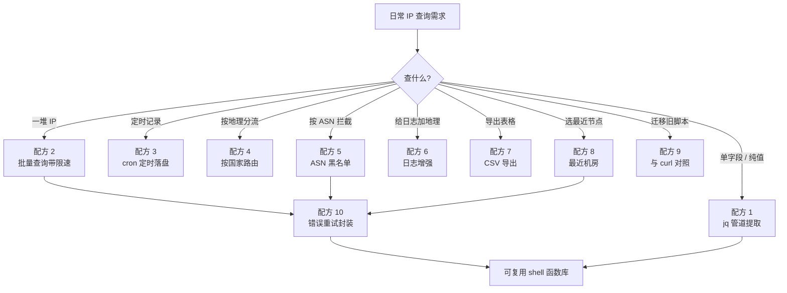
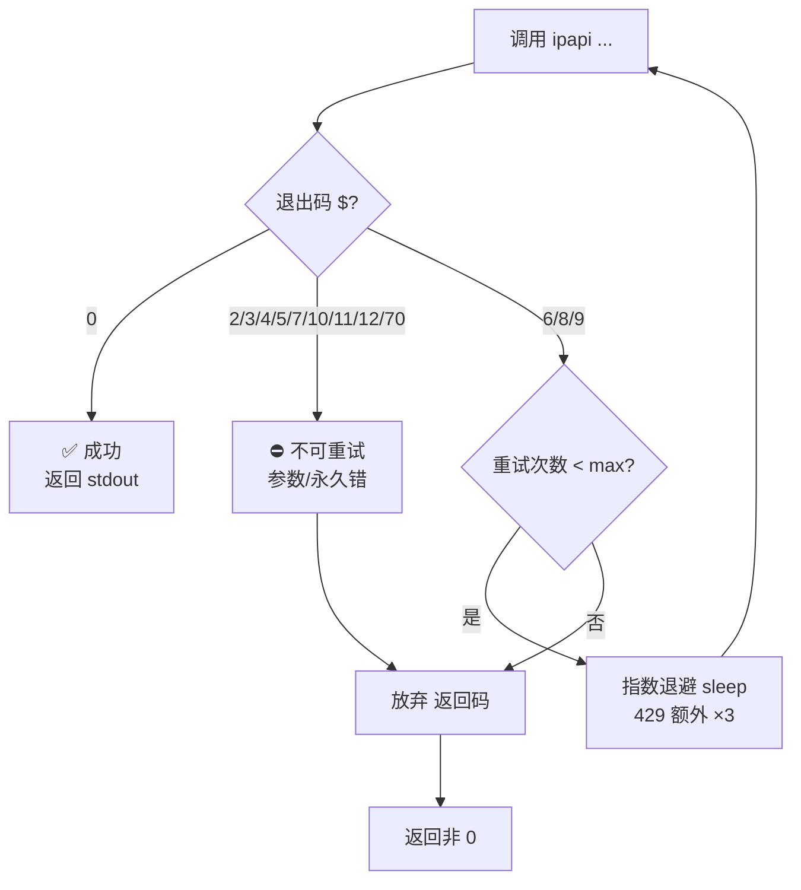

# 🍳 CLI 实战食谱

> 10+ 个开箱即用的 shell 实战配方：jq 管道提取、批量限速查询、cron 定时记录、按国家路由、ASN 黑名单、日志增强、CSV 导出、最近机房选址、与 curl 对照、错误重试封装。每个配方都是完整可运行脚本，复制即用。

`ipapi` CLI 的设计目标之一是"好拼"——默认 JSON 信封、`--human` 直出纯值、稳定退出码、stderr 与 stdout 严格分离。这些特性让它在 shell 脚本里像积木一样接得起来：`ipapi field 8.8.8.8 country --human` 一行就是一个值，喂给 `grep`、`awk`、`xargs`、`jq` 都顺手。

本页不是 SDK 食谱（那部分在 [.](./cookbook/](../cookbook/)），而是**命令行配方**：用 `ipapi` + 标准 Unix 工具组合出真实运维、安全、数据分析场景下的可运行脚本。每个配方都遵循"先讲场景、再给脚本、最后解释关键点"的三段式。

::: tip 🚀 前置：一行装好
```bash
go install github.com/cyberspacesec/ipapi.co-skills/cmd/ipapi@latest
```
本页所有脚本假设 `ipapi` 已在 `PATH` 中。配 API Key 可提升额度，但多数配方在免费额度下即可跑通。
:::

---

## 🗺️ 配方总览

下面这张流程图把本页 11 个配方按"使用频率/场景"组织成一张地图，方便你按需取用：



---

## 配方 1：jq 管道提取单字段 🔧

**场景**：你已经用 `ipapi info 8.8.8.8` 拿到完整 JSON 信封，但只想要其中一两个字段——比如国家代码和 ASN。不想再发一次请求，只想在本地从信封里抽。

`info` / `me` 的 stdout 是稳定的 `{ok, command, args, data, meta}` 结构，`data` 里装着全部 28 个 `IPInfo` 字段。用 `jq` 直接挖：

```bash
#!/usr/bin/env bash
# jq-pipe.sh —— 从 info 信封里抽字段
set -euo pipefail

IP="${1:-8.8.8.8}"

# 一次请求，多字段提取
ipapi info "$IP" | jq '{ip: .data.ip, country: .data.country_code, asn: .data.asn, org: .data.org, city: .data.city}'
```

输出示例：

```json
{
  "ip": "8.8.8.8",
  "country": "US",
  "asn": "AS15169",
  "org": "Google LLC",
  "city": "Mountain View"
}
```

::: tip 💡 一次请求抽多字段，优于多次 field 查询
`info` 一次拉回 28 个字段，本地 `jq` 任意抽取，**只消耗一次 API 配额**。若你要的字段 ≥ 2 个，且其中任一字段不在 `field` 命令支持的 28 字段表之外的特殊场景，`info + jq` 几乎总比多次 `ipapi field` 划算。但若只要一个字段，`ipapi field <ip> <field> --human` 更省流量、更省解析——见 [field 命令](./command-field)。
:::

::: details 🔬 想同时看 meta（耗时、时间戳）？
```bash
ipapi info 8.8.8.8 | jq '{data: .data, meta: .meta}'
```
`meta` 含 `format`、`durationMs`、`retrievedAt`，做性能监控或缓存键时有用。详见 [输出格式](./output)。
:::

---

## 配方 2：批量查询带限速 🚦

**场景**：手头一份 IP 列表（访问日志、防火墙抓包、客户名单），要批量查地理归属。ipapi.co 免费额度约 1000 次/天，无脑 `xargs` 会瞬间打爆配额触发 `RATE_LIMITED`（退出码 `6`）。必须限速。

核心思路：用 `xargs -n1 -P1` 串行 + `sleep` 间隔，逐条调用 `field` 命令取国家代码，失败时按退出码决定是否重试。

```bash
#!/usr/bin/env bash
# batch-lookup.sh —— 批量查 IP 国家，带限速与重试
# 用法: ./batch-lookup.sh ips.txt
set -euo pipefail

INPUT="${1:?用法: $0 <ip-list-file>}"
RATE="${RATE:-1.2}"   # 每次请求间隔秒，默认 1.2s ≈ 50 req/min
MAX_RETRY=2           # retryable 错误最多重试次数

# retryable 退出码：6=RATE_LIMITED, 8=NOT_FOUND(可能瞬时), 9=SERVER_ERROR
retryable_codes=(6 8 9)

is_retryable() {
  local code="$1"
  for c in "${retryable_codes[@]}"; do [[ "$c" == "$code" ]] && return 0; done
  return 1
}

while IFS= read -r ip; do
  [[ -z "$ip" || "$ip" == \#* ]] && continue
  attempt=0
  while :; do
    # field --human 直出纯值，便于拼行
    if value=$(ipapi field "$ip" country --human 2>/dev/null); then
      printf '%s\t%s\n' "$ip" "$value"
      break
    else
      code=$?
      attempt=$((attempt + 1))
      if is_retryable "$code" && (( attempt <= MAX_RETRY )); then
        # 限速退避：遇 429 多睡一会儿
        (( code == 6 )) && sleep 5 || sleep "$RATE"
        continue
      fi
      # 非可重试或重试耗尽：记到 stderr，不污染 stdout
      printf '# WARN: %s 查询失败 退出码=%s 已重试=%s\n' "$ip" "$code" "$attempt" >&2
      break
    fi
  done
  sleep "$RATE"
done < "$INPUT"
```

运行：

```bash
$ cat > ips.txt <<EOF
8.8.8.8
1.1.1.1
208.67.222.222
9.9.9.9
EOF

$ ./batch-lookup.sh ips.txt > result.tsv 2> err.log
$ column -t -s$'\t' result.tsv
8.8.8.8         US
1.1.1.1         AU
208.67.222.222  US
9.9.9.9         US
```

::: warning ⚠️ stdout 与 stderr 的分工是脚本可靠性的基石
`ipapi` 把成功结果放 stdout、错误信封放 stderr——本脚本据此用 `2>/dev/null` 屏蔽错误信封、用退出码判断成败，保证 `result.tsv` 永远只有"成功的 IP\t国家"行，不会被错误 JSON 污染。这是 [输出格式](./output) 里"stdout 保持纯净"约定的直接收益。
:::

::: details 🔬 想并发又限速？
串行 + sleep 最简单但慢。要并发可用 GNU `parallel` 配 `--semaphore` 限流：
```bash
cat ips.txt | parallel -j 4 --colsep '\t' \
  'ipapi field {1} country --human 2>/dev/null | sed "s/^/{1}\t/"'
```
`-j 4` 控制并发数。但并发越高越容易触发 429，建议 `--retries 2` 配合（CLI 内置重试，详见 [旗标参考](./flags) 的 `--retries`）。
:::

---

## 配方 3：cron 定时记录本机出口 IP 🕒

**场景**：你家/办公室是动态 IP，或云主机出口 IP 会变。想每小时记一次本机公网 IP 的归属变化，落盘成时序日志，便于事后排查"那个时间点我对外访问的 IP 是哪个"。

`ipapi me` 查本机公网出口 IP 完整信息。把它塞进 cron，每小时跑一次，输出追加到带时间戳的日志。

```bash
#!/usr/bin/env bash
# cron-me.sh —— 定时记录本机出口 IP 归属
# crontab: 0 * * * * /path/to/cron-me.sh >> /var/log/ipapi-me.log 2>&1
set -euo pipefail

LOG="${LOG:-/var/log/ipapi-me.log}"
TS="$(date -u +%Y-%m-%dT%H:%M:%SZ)"

# me 命令查本机公网 IP；用 jq 抽关键字段 + 注入时间戳
ipapi me 2>/dev/null | jq -c --arg ts "$TS" '
  {ts: $ts,
   ip: .data.ip,
   asn: .data.asn,
   org: .data.org,
   country: .data.country_code,
   city: .data.city,
   timezone: .data.timezone}' >> "$LOG"
```

输出（每行一个 JSON，便于 `jq` 流式处理）：

```json
{"ts":"2026-07-04T10:00:00Z","ip":"203.0.113.42","asn":"AS64500","org":"Example ISP","country":"CN","city":"Shanghai","timezone":"Asia/Shanghai"}
{"ts":"2026-07-04T11:00:00Z","ip":"203.0.113.42","asn":"AS64500","org":"Example ISP","country":"CN","city":"Shanghai","timezone":"Asia/Shanghai"}
{"ts":"2026-07-04T12:00:00Z","ip":"198.51.100.7","asn":"AS64501","org":"Other ISP","country":"CN","city":"Beijing","timezone":"Asia/Shanghai"}
```

::: tip 📊 流式分析：找出 IP 变更时刻
```bash
# 用 jq -s 流式读全部，再 uniq 找出 IP 变化点
jq -s 'group_by(.ip) | map({ip: .[0].ip, first_seen: .[0].ts, last_seen: .[-1].ts, count: length})' /var/log/ipapi-me.log
```
`-s` 把整个文件 slurp 成数组，按 IP 分组后看每段 IP 的起止时间，一眼看出"哪天换的 IP"。
:::

::: details 🔬 配合配置文件免传 API Key
写 `~/.ipapi.json` 把 Key 固化，cron 脚本就无需在环境变量里硬编码：
```json
{
  "api_key": "your-key-here",
  "api_key_mode": "header",
  "timeout": "10s",
  "retries": 2
}
```
配置优先级为 旗标 > 环境变量 > `~/.ipapi.json` > 默认值，详见 [配置方式](./config)。
:::

---

## 配方 4：按国家路由请求 🌍

**场景**：你做内容分发或合规分流——访问者来自 EU 就路由到 GDPR 合规节点，来自 CN 就走国内 CDN。`ipapi me` 只能查"自己"的 IP，要查"访问者"的 IP 得用 `ipapi info <visitor-ip>`。

把这条命令嵌进反向代理的 `access` 阶段（nginx `auth_request`、Caddy `forward_auth` 等），用 `--human` 取纯值做决策：

```bash
#!/usr/bin/env bash
# route-by-country.sh —— 根据访客 IP 国家返回路由目标
# 用法: ./route-by-country.sh <visitor-ip>
# 返回: 上游主机名（用于 nginx auth_request / caddy forward_auth）
set -euo pipefail

VISITOR_IP="${1:?用法: $0 <visitor-ip>}"
CACHE_TTL=300  # 本地缓存秒数，避免每次请求都打 ipapi.co

# 极简文件缓存：/tmp/ipapi-cache/<ip>
CACHE_DIR="/tmp/ipapi-cache"
mkdir -p "$CACHE_DIR"
CACHE_FILE="$CACHE_DIR/$(echo -n "$VISITOR_IP" | md5sum | cut -d' ' -f1)"

country=""
if [[ -f "$CACHE_FILE" ]]; then
  age=$(( $(date +%s) - $(stat -c %Y "$CACHE_FILE") ))
  if (( age < CACHE_TTL )); then
    country=$(<"$CACHE_FILE")
  fi
fi

if [[ -z "$country" ]]; then
  # field --human 直出国家代码（如 "US"），便于缓存与比较
  if ! country=$(ipapi field "$VISITOR_IP" country_code --human 2>/dev/null); then
    # 查询失败：默认路由到 fallback，不阻断业务
    echo "fallback.example.com"
    exit 0
  fi
  echo -n "$country" > "$CACHE_FILE"
fi

case "$country" in
  CN)  echo "cdn-cn.example.com" ;;
  EU|DE|FR|NL|IE|SE|AT|BE|BG|HR|CY|CZ|DK|EE|FI|GR|HU|IT|LV|LT|LU|MT|PL|PT|RO|SK|SI|ES)
       echo "gdpr-eu.example.com" ;;
  US)  echo "cdn-us.example.com" ;;
  *)   echo "cdn-global.example.com" ;;
esac
```

nginx 集成示例（`auth_request` 把决策权交给本脚本）：

```nginx
location /_route {
    internal;
    proxy_pass http://127.0.0.1:8080/decision;  # 后端跑本脚本
}
location / {
    auth_request /_route;
    # 后端通过 X-Upstream 头告诉 nginx 走哪
    proxy_set_header X-Upstream $upstream_http_x_upstream;
    proxy_pass http://$upstream_http_x_upstream;
}
```

::: warning ⚠️ 别在请求关键路径上"无缓存"地查 IP
每次外部请求都同步查 ipapi.co 会把 P99 拉到几百毫秒、还可能触发限流。本配方用 `/tmp` 下的 md5 文件做 TTL 缓存——真实生产环境请换成 Redis/memcached，但思路一致：**查过一次的 IP，TTL 内别再查**。SDK 侧的缓存方案见 [.](./cookbook/cached-lookup](../cookbook/cached-lookup)。
:::

::: details 🔬 为什么用 country_code 而不是 country？
`country` 返回全名（如 "United States"），`country_code` 返回 ISO-2（如 "US"）。代码/路由判断用短码更稳：大小写固定、无空格、无本地化变体。28 个可查字段里 `country`、`country_name`、`country_code`、`country_code_iso3`、`country_tld` 都与国家相关，按需取用。完整字段表见 [fields 命令](./command-fields)。
:::

---

## 配方 5：ASN 黑名单拦截 🛡️

**场景**：你的日志里频繁出现某个 ASN 的扫描行为（比如某 VPS 厂商被滥用做扫描跳板）。你想在防火墙前先识别来源 ASN，命中黑名单就直接 drop。

`ipapi field <ip> asn --human` 直出 ASN 纯值（如 `AS15169`），拿来跟黑名单比对：

```bash
#!/usr/bin/env bash
# asn-blocklist.sh —— 命中 ASN 黑名单则输出 DROP，否则 PASS
# 用法: ./asn-blocklist.sh <ip>
set -euo pipefail

IP="${1:?用法: $0 <ip>}"

# 黑名单：一行一个 ASN，# 开头注释
BLOCKLIST="${BLOCKLIST:-/etc/ipapi/asn-blocklist.txt}"
# 示例内容:
#   AS14061   # DigitalOcean，常被扫描滥用
#   AS16276   # OVH
#   AS46562   # Performa/某 IDC

asn=$(ipapi field "$IP" asn --human 2>/dev/null || true)

# 查询失败（限流/无效 IP）时默认放行，避免误伤
if [[ -z "$asn" ]]; then
  echo "PASS  # asn-unknown"
  exit 0
fi

if grep -qE "(^|[[:space:]])${asn}([[:space:]]|$)" "$BLOCKLIST" 2>/dev/null; then
  echo "DROP  # ${asn} 命中黑名单"
  exit 0
fi

echo "PASS  # ${asn}"
```

配合 `iptables` / `nftables` 的 batch 模式，从日志批量提取并封禁：

```bash
# 从 nginx access.log 提取近 1 小时高频 404 的 IP，逐个判定 ASN
awk '$9==404 {print $1}' /var/log/nginx/access.log \
  | sort | uniq -c | sort -rn | awk '$1 > 20 {print $2}' \
  | while read -r ip; do
      decision=$(./asn-blocklist.sh "$ip")
      if [[ "$decision" == DROP* ]]; then
        asn=$(awk '{print $3}' <<<"$decision")
        # 实际封禁（取消 -- 的注释启用）
        # nft add element inet filter blackhole "{ $ip }"
        printf '%s\t%s\t%s\n' "$(date -u +%FT%TZ)" "$ip" "$asn"
      fi
    done | tee -a /var/log/asn-blocks.log
```

::: tip 🧠 保留 IP 直接跳过，别浪费配额
`10.0.0.0/8`、`172.16.0.0/12`、`192.168.0.0/16`、`127.0.0.0/8` 等私有/保留段没有公网地理信息，`ipapi info` 会返回 `RESERVED_IP`（退出码 `7`，不可重试）。脚本里可以先做本地 CIDR 预判，跳过这些段不发请求，省配额、降延迟。
:::

::: details 🔬 org 字段比 asn 更"人类可读"
`asn` 是 `AS15169` 这样的编号，`org` 是 `Google LLC` 这样的名称。做白名单/黑名单时，按 ASN 比更稳（名称可能因并购变更），但给运维看的报表用 `org` 更直观。两者都在 `info` 的 `data` 里，用 `jq` 同时取：
```bash
ipapi info "$IP" | jq -r '[.data.asn, .data.org] | @tsv'
```
:::

---

## 配方 6：日志增强（给访问日志补地理字段）📖

**场景**：nginx/apache 访问日志只有 IP，没有地理。想生成"每国 PV Top 10"这类报表，得先给每条日志补上 `country`、`asn` 等字段。逐条查太慢，要批量补全且去重。

```bash
#!/usr/bin/env bash
# log-enrich.sh —— 给访问日志补地理字段（去重查询 + 回填）
# 用法: ./log-enrich.sh access.log > enriched.jsonl
set -euo pipefail

LOG="${1:?用法: $0 <access-log>}"
CACHE="/tmp/ipapi-enrich-cache.tsv"

# 1. 抽取日志里所有唯一 IP（第 1 列）
awk '{print $1}' "$LOG" | sort -u > /tmp/unique-ips.txt

# 2. 为每个唯一 IP 查一次国家+ASN，落到缓存 TSV
#    （复用配方 2 的限速逻辑，这里简化为串行 sleep）
: > "$CACHE"
while IFS= read -r ip; do
  [[ -z "$ip" ]] && continue
  # info 一次拿全字段，jq 抽 country_code + asn + org，TSV 落盘
  ipapi info "$ip" 2>/dev/null \
    | jq -rf - <<'JQ' >> "$CACHE" 2>/dev/null || printf '%s\t\t\t\n' "$ip"
[.data.ip, .data.country_code, .data.asn, .data.org] | @tsv
JQ
  sleep 1
done < /tmp/unique-ips.txt

# 3. 回填：把日志每行 IP 替换成 "IP\tcountry\tasn\torg"
awk -F'\t' '
  NR==FNR { geo[$1]=$2"\t"$3"\t"$4; next }      # 先读缓存建映射
  {
    ip=$1
    if (ip in geo) print $0"\t"geo[ip]
    else           print $0"\t\t\t"
  }
' "$CACHE" <(awk '{print $1"\t"$0}' "$LOG") \
  | cut -f2-
```

输出示例（每行原日志 + 三个地理字段）：

```
203.0.113.5 - - [04/Jul/2026:10:00:01 +0000] "GET / HTTP/1.1" 200 ...	CN	AS64500	Example ISP
198.51.100.9 - - [04/Jul/2026:10:00:02 +0000] "GET /api HTTP/1.1" 200 ...	US	AS64501	Other ISP
```

::: tip 📊 配合 jq 一行出"每国 PV Top 10"
```bash
./log-enrich.sh access.log \
  | awk -F'\t' '{print $NF}' \  # 最后一个字段是 country... 实际请按你的列调整
  | sort | uniq -c | sort -rn | head -10
```
注意列顺序：本配方把地理字段拼在行尾，`awk -F'\t' '{print $NF}'` 取最后一列即国家代码。
:::

::: warning ⚠️ 唯一 IP 数量大时，先看配额再跑
1000 个唯一 IP = 1000 次请求 ≈ 免费额度一天上限。跑前先 `wc -l /tmp/unique-ips.txt` 估算，超量就配 API Key 或分多天跑。SDK 侧的批量并发方案见 [.](./cookbook/async-lookup](../cookbook/async-lookup)。
:::

---

## 配方 7：CSV 导出（用 raw 直出，零解析）📊

**场景**：要把一批 IP 的完整信息导成 CSV 给业务方用 Excel 看。`ipapi raw <ip> -f csv` 直出上游 CSV 原文字节，不装信封、不带 meta——正好喂给 `csvkit`、`awk` 或直接拼大表。

```bash
#!/usr/bin/env bash
# csv-export.sh —— 批量导出 IP 信息为单个 CSV
# 用法: ./csv-export.sh ips.txt > out.csv
set -euo pipefail

INPUT="${1:?用法: $0 <ip-list-file>}"
HEADER_PRINTED=0

while IFS= read -r ip; do
  [[ -z "$ip" || "$ip" == \#* ]] && continue
  # raw -f csv 直出原始 CSV，第一行是表头
  out=$(ipapi raw "$ip" -f csv 2>/dev/null) || {
    printf '# WARN: %s 失败\n' "$ip" >&2; continue
  }
  if (( HEADER_PRINTED == 0 )); then
    printf '%s\n' "$out"   # 含表头
    HEADER_PRINTED=1
  else
    # 跳过表头行，只拼数据行
    printf '%s\n' "$out" | tail -n +2
  fi
  sleep 1
done < "$INPUT"
```

运行结果（首行是 ipapi.co 的 CSV 表头，后续每行一个 IP）：

```csv
ip,version,city,region,country_name,country_code,asn,org,...
8.8.8.8,4,Mountain View,California,United States,US,AS15169,Google LLC,...
1.1.1.1,4,South Brisbane,Queensland,Australia,AU,AS13335,Cloudflare,...
```

::: tip 🧪 raw 直出 vs info + jq 转 CSV
两条路都能产 CSV，但语义不同：
- `ipapi raw <ip> -f csv`：**直出上游原文**，字段顺序由 ipapi.co 决定，含全部上游字段，零本地解析，最快。
- `ipapi info <ip> | jq -r '[.data.ip,.data.country_code,...] | @csv'`：**本地组装**，字段自选自排，可裁剪。

要"原汁原味全量"用 raw；要"精选列、自定义顺序"用 info + jq。raw 命令详见 [raw / me-raw 命令](./command-raw)。
:::

::: details 🔬 raw 支持的全部格式
`raw` / `me-raw` 的 `-f` 接受 `json` / `jsonp` / `xml` / `csv` / `yaml` 五种。其中 `jsonp` 还需配 `--callback <name>` 指定回调函数名（仅 raw/me-raw + jsonp 组合生效）。其他命令（info/me/field 等）不支持 `-f`——它们走强类型解码。
:::

---

## 配方 8：选最近机房（基于经纬度距离）📍

**场景**：你有若干个机房/CDN 节点的坐标，要根据访客 IP 的经纬度选距离最近的那一个。`ipapi info <ip>` 的 `data` 里有 `latitude` / `longitude`，拿来算 Haversine 距离。

```bash
#!/usr/bin/env bash
# nearest-server.sh —— 为访客选最近机房
# 用法: ./nearest-server.sh <visitor-ip>
set -euo pipefail

VISITOR_IP="${1:?用法: $0 <visitor-ip>}"

# 机房清单：名字\t纬度\t经度
DATACENTERS="${DATACENTERS:-/etc/ipapi/datacenters.tsv}"
# 示例内容:
#   dc-frankfurt   50.1109   8.6821
#   dc-singapore   1.3521    103.8198
#   dc-virginia    38.8048   -77.0469
#   dc-tokyo       35.6762   139.6503

# 从 info 信封抽 lat/lon（注意 data.latlong 是 "lat,lon" 串，这里分别取）
read -r lat lon < <(ipapi info "$VISITOR_IP" 2>/dev/null \
  | jq -r '[.data.latitude, .data.longitude] | @tsv')

if [[ -z "$lat" || -z "$lon" ]]; then
  echo "dc-fallback"
  exit 0
fi

# 用 awk 算 Haversine 距离（km），取最小者
awk -F'\t' -v lat1="$lat" -v lon1="$lon" '
  function rad(x) { return x * 3.14159265358979 / 180 }
  function haversine(lat1, lon1, lat2, lon2) {
    dlat = lat2 - lat1; dlon = lon2 - lon1
    a = sin(rad(dlat)/2)^2 + cos(rad(lat1))*cos(rad(lat2))*sin(rad(dlon)/2)^2
    return 6371 * 2 * atan2(sqrt(a), sqrt(1-a))
  }
  NF==3 {
    dist = haversine(lat1, lon1, $2, $3)
    if (min == "" || dist < min) { min = dist; best = $1 }
  }
  END { print best }
' "$DATACENTERS"
```

::: details 🔬 为什么不直接用 country 路由？
按国家路由（配方 4）简单但粗：大国（US/RU/CN）内部跨度几千公里，"美国访客"可能离弗吉尼亚近、也可能离洛杉矶近。经纬度 + Haversine 精细但贵（要 `info` 全量字段，不能像 `field` 那样省流量）。生产环境常见分层：先用 `country_code` 粗筛到区域，再在区域内用经纬度精筛到具体节点。
:::

::: tip 🌐 latlong 字段是"串"不是"数"
`data.latlong` 是 `"37.4056,-122.0775"` 这样的逗号串，而 `latitude` / `longitude` 是分开的数值字段。算距离优先用分开的两个字段，避免字符串切割。28 个字段里地理相关的有 `city`、`region`、`region_code`、`country`、`latitude`、`longitude`、`latlong`、`postal`、`continent_code`、`in_eu` 等，详见 [fields 命令](./command-fields)。
:::

---

## 配方 9：与 curl 对照（迁移旧脚本）🔄

**场景**：你有一堆旧脚本用 `curl https://ipapi.co/<ip>/json/ | jq` 查 IP，想迁到 `ipapi` CLI 拿到稳定退出码、重试、配置链。先对照两者输出，确认迁移无回退。

```bash
#!/usr/bin/env bash
# curl-vs-ipapi.sh —— 同一 IP，两种方式，对照输出
set -euo pipefail
IP="${1:-8.8.8.8}"

echo "===== 旧: curl + jq ====="
curl -sS --max-time 10 "https://ipapi.co/${IP}/json/" | jq '{ip, country_code, asn, org}'

echo "===== 新: ipapi info + jq ====="
ipapi info "$IP" | jq '{ip: .data.ip, country_code: .data.country_code, asn: .data.asn, org: .data.org}'
```

输出对照：

```json
===== 旧: curl + jq =====
{
  "ip": "8.8.8.8",
  "country_code": "US",
  "asn": "AS15169",
  "org": "Google LLC"
}
===== 新: ipapi info + jq =====
{
  "ip": "8.8.8.8",
  "country_code": "US",
  "asn": "AS15169",
  "org": "Google LLC"
}
```

字段值一致，但 `ipapi` 多了三样新东西。下面这张表是迁移决策的核心：

| 维度 | `curl + jq` | `ipapi` CLI | 迁移收益 |
|------|-------------|-------------|----------|
| 退出码 | 0=HTTP 200，非 0=网络错 | 0=成功，2~12 细分语义 | 能区分"限流"vs"无效IP"vs"服务器错" |
| 错误位置 | 错误 JSON 混在 stdout | 错误信封走 stderr，stdout 纯净 | 管道不被错误污染 |
| 重试 | 自己写 | 内置 `--retries 2` | 429/5xx 自动重试 |
| API Key | 手工拼 URL | `--api-key`/env/配置文件 | 不泄漏到 shell history |
| 格式切换 | 改 URL | `-f json/xml/csv/yaml/jsonp` | 一致接口 |
| 元信息 | 无 | `meta.durationMs`/`retrievedAt` | 可观测 |

::: tip 🔄 迁移口诀
- `curl .../<ip>/json/ | jq '.x'` → `ipapi field <ip> x --human`（单字段）
- `curl .../<ip>/json/ | jq` → `ipapi info <ip> | jq`（全字段）
- `curl .../<ip>/csv/` → `ipapi raw <ip> -f csv`（原始字节）
- `curl .../`（无 IP，查本机）→ `ipapi me` / `ipapi me-raw -f <fmt>`
:::

::: warning ⚠️ curl 的"假成功"是迁移最大动机
`curl` 对 HTTP 429（限流）仍返回退出码 0（只要 TCP 层拿到响应），旧脚本会把限流响应的 JSON 当成"查询结果"喂给下游，污染数据。`ipapi` 把 429 映射为退出码 `6`（RATE_LIMITED，retryable=true），脚本可据 `$?` 重试或丢弃——这是 AI Agent 与自动化脚本最看重的语义。退出码全表见 [退出码参考](./exit-codes)。
:::

---

## 配方 10：错误重试封装（可复用 shell 函数）🔁

**场景**：前面多个配方都用到"按退出码决定是否重试"的逻辑。把它抽成一个可复用函数，统一处理 `ipapi` 的 10 类退出码。

```bash
#!/usr/bin/env bash
# ipapi-retry.sh —— 可复用的 ipapi 调用封装，按退出码决定重试/放弃
# 用法: source ipapi-retry.sh; ipapi_retry info 8.8.8.8
set -euo pipefail

# 退出码语义（摘自 exit-codes.md）
#   0 成功 | 2 USAGE | 3 INVALID_IP | 4 INVALID_FIELD | 5 INVALID_FORMAT
#   6 RATE_LIMITED(retryable) | 7 RESERVED_IP | 8 NOT_FOUND(retryable)
#   9 SERVER_ERROR(retryable) | 10 METHOD_NOT_ALLOWED | 11 INVALID_KEY
#   12 UNEXPECTED_DATA | 70 INTERNAL
IPAPI_RETRYABLE_RE='^(6|8|9)$'   # 可重试
IPAPI_FATAL_RE='^(2|3|4|5|7|10|11|12|70)$'   # 参数/永久错，重试无用

# ipapi_retry <args...> —— 透传给 ipapi，失败按码处理
# 返回 0 成功，非 0 放弃；stdout 透传 ipapi stdout
ipapi_retry() {
  local max="${IPAPI_MAX_RETRY:-3}"
  local base="${IPAPI_BACKOFF:-1}"
  local attempt=0
  local code

  while :; do
    attempt=$((attempt + 1))
    if ipapi "$@"; then
      return 0
    fi
    code=$?

    # 参数/永久错：直接放弃，重试没意义
    if [[ "$code" =~ $IPAPI_FATAL_RE ]]; then
      printf '# ipapi_retry: 不可重试 退出码=%s 参数=%s\n' "$code" "$*" >&2
      return "$code"
    fi

    # 可重试：指数退避
    if [[ "$code" =~ $IPAPI_RETRYABLE_RE ]] && (( attempt < max )); then
      local wait=$(( base * (2 ** (attempt - 1)) ))
      # 限流特殊处理：多睡
      (( code == 6 )) && wait=$(( wait * 3 ))
      printf '# ipapi_retry: 退出码=%s 第%s次重试 等待%ss\n' "$code" "$attempt" "$wait" >&2
      sleep "$wait"
      continue
    fi

    # 重试耗尽或未知码
    printf '# ipapi_retry: 放弃 退出码=%s 已重试=%s\n' "$code" "$attempt" >&2
    return "$code"
  done
}
```

使用：

```bash
source ipapi-retry.sh

# 简单调用，自动重试限流/服务器错
ipapi_retry info 8.8.8.8 | jq '.data.country_code'

# 配置退避参数
IPAPI_MAX_RETRY=5 IPAPI_BACKOFF=2 ipapi_retry field 8.8.8.8 asn --human
```

下面这张决策图就是 `ipapi_retry` 的逻辑，也是 [退出码参考](./exit-codes) 的"行动版"：



::: tip 🧠 CLI 内置重试与脚本重试的分工
`ipapi` 自身有 `--retries`（默认 2，总请求 = retries+1），处理的是**单次命令内的瞬时网络错/5xx**。本函数处理的是**命令级的可重试码**（429 限流、NOT_FOUND 抖动、SERVER_ERROR）——两者叠加：CLI 先内部重试 2 次仍失败返回码 6/8/9，外层函数再退避重试。这样既不浪费配额（CLI 重试快、不退避），又能在持续限流时优雅让步（函数退避）。`--retries` 详见 [旗标参考](./flags)。
:::

::: details 🔬 为什么 INVALID_KEY（11）不重试？
API Key 错了，重试一万次还是错——属于永久错，归入 `IPAPI_FATAL_RE`。同理 `INVALID_IP`（3）、`INVALID_FIELD`（4）、`INVALID_FORMAT`（5）都是参数错，改参数才是正解。`RESERVED_IP`（7）是确定性结果（私有/保留段无公网地理），重试无意义。可重试的只有 `RATE_LIMITED`、`NOT_FOUND`、`SERVER_ERROR` 三类，语义见 [退出码参考](./exit-codes)。
:::

---

## 配方 11：JSONP 前端取数（raw + callback）🌐

**场景**：纯前端页面（无后端）想直接查访客 IP 归属。浏览器跨域限制下，直接 `fetch('https://ipapi.co/json/')` 可能被 CORS 拦。JSONP 是经典解法——但通常要后端动态生成 `<script>`。`ipapi raw -f jsonp --callback <name>` 能在服务端（你的 BFF/边缘函数）直出 JSONP 原文，前端塞进 `<script>` 即可。

```bash
#!/usr/bin/env bash
# jsonp-endpoint.sh —— 直出 JSONP，供前端 <script> 消费
# 用法: ./jsonp-endpoint.sh <callback> [ip]
set -euo pipefail
CB="${1:?用法: $0 <callback> [ip]}"
IP="${2:-}"

if [[ -z "$IP" ]]; then
  # 无 IP：查本机（访客出口 IP）
  ipapi me-raw -f jsonp --callback "$CB"
else
  ipapi raw "$IP" -f jsonp --callback "$CB"
fi
```

前端集成：

```html
<script>
function handleGeo(data) {
  console.log(data.ip, data.country_code, data.city);
  document.getElementById('geo').textContent =
    `你来自 ${data.country_name} ${data.city}`;
}
</script>
<script src="https://your-bff.example.com/jsonp?cb=handleGeo"></script>
```

::: warning ⚠️ --callback 仅对 raw/me-raw + jsonp 生效
`--callback` 旗标只在与 `raw`/`me-raw` + `-f jsonp` 组合时有效；其他命令或格式下传了会被忽略或报错。JSONP 的回调名必须是合法 JS 标识符（字母数字下划线）。SDK 侧的 JSONP 用法见 [.](./guide/jsonp](../guide/jsonp)。
:::

---

## 🧰 配方共用约定小结

把本页 11 个配方串起来，有几个贯穿始终的"ipapi CLI 用法心法"：

1. **stdout 纯净、stderr 信封** —— 脚本用 `2>/dev/null` 屏蔽错误、用退出码分流，stdout 永远只有成功结果。这是所有配方能拼起来的根基。
2. **`--human` 取纯值** —— 单字段场景一律 `ipapi field <ip> <field> --human`，省流量、省解析，直出 `US` 这样的纯值喂管道。
3. **退出码驱动重试** —— 6/8/9 可重试，其余永久错。配方 10 把这套逻辑抽成函数，其他配方按需内联。
4. **限速 + 缓存** —— ipapi.co 有免费额度上限，批量场景必限速、必缓存（配方 2/4/6 都体现）。
5. **配置文件固化密钥** —— `~/.ipapi.json` 让 cron/脚本无需在命令行或环境变量里硬编码 Key。

::: details 📚 想深入某条命令的实现细节？
每个子命令都有专档：[info/me](./command-info)、[field/me-field](./command-field)、[raw/me-raw](./command-raw)、[fields](./command-fields)、[version](./command-version)。旗标全表见 [旗标参考](./flags)，退出码全表见 [退出码参考](./exit-codes)。
:::

---

## 下一步

- 🚀 [快速开始](./quickstart) —— 还没跑通第一条命令？5 分钟教程。
- 🗂️ [命令速查](./commands) —— 全部 9 个子命令与全局旗标的一页式速查表。
- 🎛️ [旗标参考](./flags) —— `--retries` / `--timeout` / `--api-key-mode` 等全量旗标说明。
- 📦 [退出码参考](./exit-codes) —— 10 类退出码的完整语义与可重试性。
- 📤 [输出格式](./output) —— JSON 信封结构、`--human` 表格、`raw` 原始字节的对照。
- ⚙️ [配置方式](./config) —— 旗标/环境变量/`~/.ipapi.json`/默认值的四级合并。
- 🍳 [SDK 实战手册](../cookbook/) —— 同类场景的 Go SDK 实现（缓存中间件、geoip 中间件、异步批量等）。
- 🐛 [常见问题](../faq/) —— 遇到非零退出码或限流时的排查思路。

## 对应 SDK 方法

本页配方大量使用 CLI 子命令，它们底层都封装自 `pkg/ipapi` SDK。下表给出每个配方主用命令对应的 SDK 方法，便于在 shell 与 Go 代码间互译：

| 配方主用命令 | SDK 方法 | 文档 |
|--------------|----------|------|
| `info <ip>` | `Client.GetIPInfo(ctx, ip, "json")` | [/api/get-ip-info](../api/get-ip-info) |
| `me` | `Client.GetClientIPInfo(ctx, "json")` | [/api/get-client-ip-info](../api/get-client-ip-info) |
| `field <ip> <field>` | `Client.GetField(ip, field)` | [/api/get-field](../api/get-field) |
| `me-field <field>` | `Client.GetClientField(field)` | [/api/get-client-field](../api/get-client-field) |
| `raw <ip> -f <fmt>` | `Client.GetIPInfoRaw(ctx, ip, fmt)` | [/api/get-ip-info-raw](../api/get-ip-info-raw) |
| `me-raw -f <fmt>` | `Client.GetClientIPInfoRaw(ctx, fmt)` | [/api/get-client-ip-info-raw](../api/get-client-ip-info-raw) |

::: tip 🔗 源码
CLI 命令定义见仓库 [`cmd/ipapi/`](https://github.com/cyberspacesec/ipapi.co-skills/blob/main/cmd/ipapi/) 目录；信封封装、退出码映射、配置合并逻辑均在此处。SDK 侧方法实现见 [`pkg/ipapi/api.go`](https://github.com/cyberspacesec/ipapi.co-skills/blob/main/pkg/ipapi/api.go)。本页配方的 shell 脚本仅为示例，非仓库内文件。
:::
