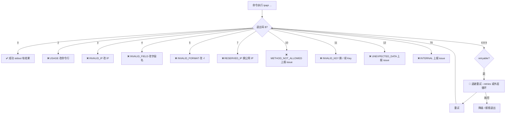
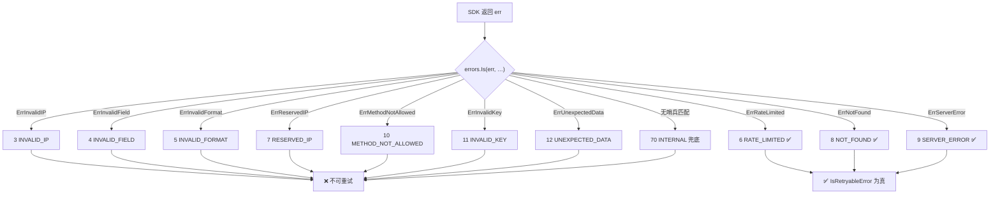
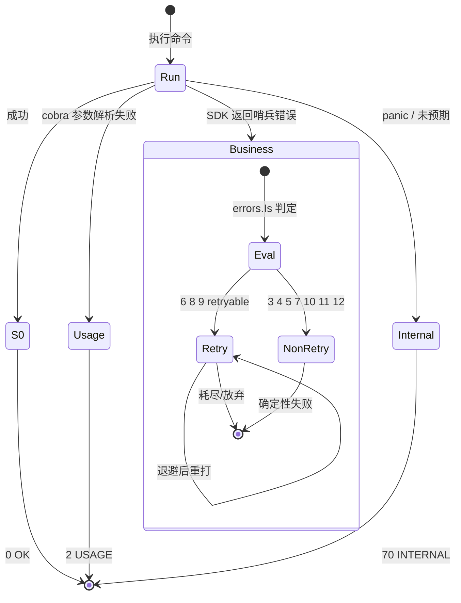

# 🚦 退出码

> ipapi CLI 用一组语义化的进程退出码（exit code）告诉你"这次调用到底成了没、不成是什么性质的失败"。`0` 是成功，`2` 是用法错，`3-12` 是各类业务错误，`70` 是内部异常——脚本里 `echo $?` 一行就能分流处理，不用去解析输出。

退出码是 CLI 与 shell 脚本、CI/CD 流水线之间的"契约"：它把"成功 / 参数错 / 输入非法 / 限流 / 上游故障 / 鉴权失败 / 内部异常"这些本质不同的情形，映射到 13 个可枚举的整数上。配合 [stderr 错误信封](#-stderr-错误信封)，你既能用退出码做粗粒度分流，又能用信封里的 `code` / `sentinel` / `retryable` 做细粒度决策。

- 🔢 **13 个码各司其职**：`0` 成功，`2` 用法，`3-5` 输入校验（IP/字段/格式），`6-9` 运行时（限流/保留段/未找到/上游错误），`10-12` 协议层（方法/Key/数据），`70` 兜底内部。
- 🟢 **可重试仅 3 个**：`6 RATE_LIMITED`、`8 NOT_FOUND`、`9 SERVER_ERROR` 标记 `retryable: true`，其余皆确定性错误。
- 🧭 **与 SDK 同源**：CLI 的退出码直接来自 `pkg/ipapi` 的哨兵错误（`ErrInvalidIP` 等），语义与 [/api/errors](../api/errors) 一一对应。
- 📤 **stdout 永不污染**：失败时 stdout 不输出任何内容，错误信封只走 stderr——管道安全。

::: tip 🚀 一行装好
```bash
go install github.com/cyberspacesec/ipapi.co-skills/cmd/ipapi@latest
```
:::

---

## 📋 完整退出码表

下表列出全部 13 个退出码。脚本里 `echo $?` 判断结果时对这张表。

| 码 | code | 含义 | retryable | 触发条件 |
|:--:|------|------|:--------:|----------|
| `0` | — | 成功 | — | 命令正常返回，stdout 输出成功信封或原始字节 |
| `2` | USAGE | 用法错误 | ❌ | 参数缺失 / 多余参数 / 子命令拼错 / `raw` 未指定 `-f` |
| `3` | INVALID_IP | IP 非法 | ❌ | `ipapi info 999.1.1.1`（不是合法 IPv4/IPv6） |
| `4` | INVALID_FIELD | 字段名非法 | ❌ | `ipapi field 8.8.8.8 foo`（不在 28 字段白名单内） |
| `5` | INVALID_FORMAT | 格式非法 | ❌ | `ipapi raw 8.8.8.8 -f txt`（仅支持 json/jsonp/xml/csv/yaml） |
| `6` | RATE_LIMITED | 触发限流 | ✅ | 上游 429 或限流响应，匿名调用过频最常见 |
| `7` | RESERVED_IP | 保留 IP 段 | ❌ | `ipapi info 10.0.0.1`（私有/回环/链路本地等保留段） |
| `8` | NOT_FOUND | 未找到 | ✅ | 上游 404，该 IP 在 ipapi.co 暂无数据 |
| `9` | SERVER_ERROR | 上游错误 | ✅ | 上游 5xx 或 400，服务端临时故障 |
| `10` | METHOD_NOT_ALLOWED | 方法不允许 | ❌ | 上游 405，正常调用不会触发 |
| `11` | INVALID_KEY | API Key 无效 | ❌ | 上游 403 / `Invalid Key`，Key 过期、拼错或额度耗尽 |
| `12` | UNEXPECTED_DATA | 数据解析失败 | ❌ | 返回体无法解码为期望的 `IPInfo` 结构 |
| `70` | INTERNAL | 内部异常 | ❌ | 未预期的 panic / 兜底错误，应上报 issue |

::: warning ⚠️ `2` 与 `70` 的区别
`2`（USAGE）是"你用错了"——参数层面的问题，修你的命令行就行。`70`（INTERNAL）是"CLI 自己出了问题"——属于 bug，正常使用下不应见到；若反复出现，请到 [GitHub Issues](https://github.com/cyberspacesec/ipapi.co-skills/issues) 上报，附上命令、版本（`ipapi version`）与 stderr 信封。
:::

---

## 🟢 可重试 vs ❌ 不可重试

退出码 `6 / 8 / 9` 标记 `retryable: true`，是**仅有的**三个可重试码。它们的共同点是"瞬时性"——这次失败不代表下次还失败：

| 码 | 为什么可重试 | 典型恢复时间 |
|:--:|--------------|--------------|
| `6` RATE_LIMITED | 限流按窗口计数，过窗口即恢复 | 秒级 ~ 分钟级 |
| `8` NOT_FOUND | 上游偶发 404，重试可能命中 | 秒级 |
| `9` SERVER_ERROR | 上游 5xx 通常是瞬时抖动 | 秒级 ~ 分钟级 |

其余 10 个码（`2/3/4/5/7/10/11/12/70`，外加成功的 `0`）都是**确定性**的——同样的输入重试一千次还是同样结果。对它们，重试是浪费，应该直接修正输入或换 Key。

::: details 🔍 为什么 NOT_FOUND 也算可重试？
严格说，"这个 IP 查不到"对单个 IP 而言是确定的。但 ipapi.co 把 404 也用在"上游临时无此数据"的情形上——配合短暂退避重试，有时能拿到结果。CLI 沿用 SDK 的 `IsRetryableError` 语义，把 `ErrNotFound` 列为可重试，给瞬时性 404 一个恢复机会。如果你的业务确定某 IP 不可能短期变化（比如保留段已被 `7` 拦截），把 `8` 当不可重试处理也合理。
:::

### retryable 的退避建议

对 `6 / 8 / 9` 三个可重试码，建议采用**指数退避 + 抖动**策略，而不是立刻无脑重打：

```bash
# 朴素的指数退避：1s → 2s → 4s，最多 3 次
backoff=1
for i in 1 2 3; do
  ipapi info 8.8.8.8 > /tmp/out.json 2>/tmp/err.json
  rc=$?
  if [ $rc -eq 0 ]; then
    cat /tmp/out.json; exit 0
  fi
  if [ $rc -eq 6 ] || [ $rc -eq 8 ] || [ $rc -eq 9 ]; then
    # 加一点抖动，避免雷同的重试风暴
    sleep $(( backoff + (RANDOM % 100) / 100 ))
    backoff=$(( backoff * 2 ))
    continue
  fi
  # 不可重试码：直接退出，别浪费
  cat /tmp/err.json >&2
  exit $rc
done
echo "重试耗尽" >&2
exit 1
```

::: tip 🧰 优先用内置 `--retries`
CLI 自带 `--retries`（默认 `2`，总请求数 = `retries + 1`），SDK 层已实现重试逻辑，且只对 `IsRetryableError` 为真的错误重试。**多数情况下你不需要手写上面的循环**——直接：

```bash
ipapi info 8.8.8.8 --retries 4 --timeout 30s
```

只有当你想在 shell 层做更精细的退避（比如跨进程协调、按码分流）时，才需要自己写循环。内置重试不退避抖动，若你担心密集重试触发更严限流，再叠加外层退避。
:::

| 退避参数 | 推荐值 | 说明 |
|----------|--------|------|
| 初始间隔 | `1s` | 第一次重试前等 1 秒 |
| 退避倍率 | `×2` | 每次翻倍：1s → 2s → 4s |
| 抖动 | `±100ms` | 避免多客户端同步重试 |
| 最大重试次数 | `3-5` | 超过即放弃，转降级 |
| 单次超时 | `--timeout 30s` | 配合 `--retries 3` |

---

## 🧭 错误处理决策树

一条命令失败后，该"重试"还是"修输入"？顺着这张图走：



::: tip 🎯 一句话决策
- 码 ∈ {`6`, `8`, `9`} → 退避重试
- 码 ∈ {`2`, `3`, `4`, `5`, `7`, `11`} → 修输入 / 换 Key，别重试
- 码 ∈ {`10`, `12`, `70`} → 正常不该出现，留 issue
- 码 = `0` → 收工
:::

### 从错误类型到退出码

上图是"退出码 → 动作"的视角。反过来问：SDK 抛了一个错误，CLI 最终会落到哪个退出码？关键是 [`errors.Is`](../api/errors) 逐哨兵判定——第一个匹配的哨兵即决定出口码，匹配不上则兜底 `70`。



::: info 🧬 `errors.Is` 而非类型断言
SDK 的哨兵错误用 `fmt.Errorf("%w", …)` 包裹了 `op`（操作名）等上下文，CLI 用 `errors.Is(err, ErrInvalidIP)` 这种**按哨兵比对**的方式匹配，而非直接类型断言——这样上层包装过的错误也能正确归因。详见 [/api/errors](../api/errors) 的 `WrapError` 与哨兵定义。
:::

---

## 🚦 退出码状态机

把 13 个码按"语义家族"归为四个状态：`0` 成功终态、`2` 用法分支、`3-12` 业务错误簇、`70` 兜底异常。`6 / 8 / 9` 是簇内仅有的"可重试"自循环态。



::: tip 🎯 四态速记
- `0`：成功，stdout 有数据，唯一非错误终态
- `2`：用法错，参数层拦截，改命令行即可
- `3-12`：业务错，又分"确定性（9 个）"与"可重试（3 个：`6/8/9`）"
- `70`：内部异常，正常不该见，留 issue
:::

---

## 📤 stderr 错误信封

失败时，CLI 把结构化错误以 JSON 信封写到 **stderr**，stdout 保持纯净（什么都不输出）。信封字段与 [/api/errors](../api/errors) 的 SDK 错误一一对应：

| 字段 | 类型 | 说明 |
|------|------|------|
| `ok` | bool | 始终 `false` |
| `command` | string | 来自哪条子命令（`info` / `me` / `field` / …） |
| `args` | object | 调用入参快照，便于复现 |
| `error.code` | string | 机器友好的错误码（如 `INVALID_IP`） |
| `error.message` | string | 人类可读的描述 |
| `error.sentinel` | string | 对应的 SDK 哨兵错误（如 `ErrInvalidIP`） |
| `error.retryable` | bool | 是否值得重试 |

```bash
$ ipapi info 999.1.1.1
# stdout: 空
# stderr:
```

```json
{
  "ok": false,
  "command": "info",
  "args": { "ip": "999.1.1.1" },
  "error": {
    "code": "INVALID_IP",
    "message": "invalid IP address: 999.1.1.1",
    "sentinel": "ErrInvalidIP",
    "retryable": false
  }
}
```

::: warning ⚠️ stdout / stderr 必须分流
ipapi CLI 的设计前提是"stdout 给管道，stderr 给人/日志"。脚本里若用 `2>&1` 合并，会把错误信封混进 stdout 数据流，破坏 `jq` 解析。**判错用退出码，取数用 stdout**，需要看错误细节时单独读 stderr：

```bash
# 错误的做法：合并流后 jq 会因 stderr 信封而解析失败
ipapi info 999.1.1.1 2>&1 | jq .    # ❌

# 正确的做法：分流
ipapi info 8.8.8.8 2>err.json       # stdout 进终端，stderr 落 err.json
ipapi info 8.8.8.8 > out.json 2>err.json   # 各走各的
```
:::

---

## 🐚 bash 判断示例

### 按退出码分流

```bash
#!/usr/bin/env bash
set -uo pipefail

ip="${1:-8.8.8.8}"

if ipapi info "$ip" > "/tmp/${ip}.json" 2>"/tmp/${ip}.err"; then
  echo "✅ 查询成功，结果在 /tmp/${ip}.json"
  jq -r '.data | "\(.ip)\t\(.country)\t\(.org)"' "/tmp/${ip}.json"
else
  rc=$?
  case "$rc" in
    2)  echo "❌ 用法错误：检查参数" >&2 ;;
    3)  echo "❌ IP 非法：$ip" >&2 ;;
    4)  echo "❌ 字段名非法" >&2 ;;
    5)  echo "❌ 格式非法：-f 只能是 json/jsonp/xml/csv/yaml" >&2 ;;
    6)  echo "⚠️  限流，稍后重试" >&2 ;;
    7)  echo "❌ 保留 IP 段：$ip（私有/回环）" >&2 ;;
    8)  echo "⚠️  未找到，可重试" >&2 ;;
    9)  echo "⚠️  上游错误，可重试" >&2 ;;
    10) echo "❌ 方法不允许（应上报）" >&2 ;;
    11) echo "❌ API Key 无效" >&2 ;;
    12) echo "❌ 返回数据解析失败（应上报）" >&2 ;;
    70) echo "❌ 内部异常（应上报）" >&2 ;;
    *)  echo "❌ 未知退出码 $rc" >&2 ;;
  esac
  echo "── stderr 信封 ──" >&2
  cat "/tmp/${ip}.err" >&2
  exit "$rc"
fi
```

### 仅判"成功 / 可重试 / 不可重试"三态

很多场景下你不需要 13 个码全分，只要三态：

```bash
ipapi info "$ip" > out.json 2>err.json
rc=$?

if [ $rc -eq 0 ]; then
  echo "成功"
elif [ $rc -eq 6 ] || [ $rc -eq 8 ] || [ $rc -eq 9 ]; then
  echo "可重试失败（码 $rc）"
else
  echo "不可重试失败（码 $rc）"
fi
```

### 取字段时按码降级

```bash
# 拿不到 country 就降级为 UNKNOWN
country=$(ipapi field "$ip" country --human 2>/dev/null)
rc=$?
if [ $rc -ne 0 ]; then
  case "$rc" in
    6|8|9) country="RETRY_LATER" ;;
    *)     country="UNKNOWN" ;;
  esac
fi
echo "$ip -> $country"
```

::: tip 📌 `--human` + 退出码是绝配
`ipapi field <ip> <field> --human` 成功时直出纯值一行，失败时退出码非 0 且 stderr 出信封。`2>/dev/null` 屏蔽信封、`$?` 判错——shell 取值的最佳姿态，比 `info | jq` 省流量又省解析。
:::

---

## 🔁 退出码与 SDK 哨兵的对应

CLI 的退出码不是凭空发明的，它直接映射自 `pkg/ipapi` 的哨兵错误。换句话说，CLI 退出码 = SDK 错误的"shell 视角"。

| 退出码 | code | SDK 哨兵 | SDK 函数 |
|:------:|------|----------|----------|
| `3` | INVALID_IP | `ErrInvalidIP` | `ValidateIP` |
| `4` | INVALID_FIELD | `ErrInvalidField` | 字段白名单校验 |
| `5` | INVALID_FORMAT | `ErrInvalidFormat` | `ValidateFormat` |
| `6` | RATE_LIMITED | `ErrRateLimited` | `IsRetryableError` ✅ |
| `7` | RESERVED_IP | `ErrReservedIP` | `handleError` |
| `8` | NOT_FOUND | `ErrNotFound` | `IsRetryableError` ✅ |
| `9` | SERVER_ERROR | `ErrServerError` | `IsRetryableError` ✅ |
| `10` | METHOD_NOT_ALLOWED | `ErrMethodNotAllowed` | `mapStatusCodeToError` |
| `11` | INVALID_KEY | `ErrInvalidKey` | `handleError` |
| `12` | UNEXPECTED_DATA | `ErrUnexpectedData` | JSON 解码层 |

::: details 🔗 `2` 与 `70` 没有 SDK 哨兵？
是的。`2`（USAGE）是 cobra 在参数解析阶段就拦截的，根本走不到 SDK；`70`（INTERNAL）是 CLI 兜底 `recover` 出来的未预期异常，也不对应某个具体哨兵。这两个码是 CLI 层专属，SDK 侧没有等价物。`0` 自然也没有——它就是"没错误"。
:::

完整的哨兵错误定义、`handleError` 出口、`IsRetryableError` 判定逻辑，见 [/api/errors](../api/errors)。

---

## 🧪 各命令会触发哪些码

不同子命令"容易踩到"的码不一样。下表帮你快速定位"这条命令失败最可能是什么码"：

| 命令 | 常见码 | 不可能出现的码 |
|------|--------|----------------|
| `info <ip>` | `2 3 6 7 8 9 11 12 70` | `4 5 10`（不带字段/格式参数） |
| `me` | `2 6 8 9 11 70` | `3 4 5 7 10 12`（无 IP/字段/格式参数） |
| `field <ip> <field>` | `2 3 4 6 7 8 9 11 70` | `5 10 12` |
| `me-field <field>` | `2 4 6 8 9 11 70` | `3 5 7 10 12` |
| `raw <ip> -f <fmt>` | `2 3 5 6 7 8 9 11 70` | `4 10 12`（直出原始字节，不解码） |
| `me-raw -f <fmt>` | `2 5 6 8 9 11 70` | `3 4 7 10 12` |
| `fields` | `2` | 其余（本地无网络） |
| `version` | `2` | 其余（本地无网络） |
| `completion <shell>` | `2` | 其余（本地生成） |

::: tip 📌 `fields` / `version` / `completion` 几乎不会失败
这三条是**本地命令**，不发起网络请求——除了参数错（`2`），不会出业务码。`fields` 列 28 字段、`version` 报版本、`completion` 生成补全脚本，全部离线完成。如果你在这三条上见到非 `0`/`2` 的码，大概率是 `70`（INTERNAL），请上报。
:::

---

## ❓ 常见问题

::: details 为什么 `70` 而不是用更大的数字？
`70` 沿用了 [BSD `sysexits.h`](https://man.freebsd.org/cgi/man.cgi?query=sysexits) 里 `EX_SOFTWARE`（70）的约定——"软件内部错误"。ipapi CLI 把 3-12 留给业务错误，`70` 作为"未预期"的兜底，符合 Unix 习惯。`2` 也来自 POSIX 约定（`Shell Builtin` / 用法错）。
:::

::: details 退出码会随版本变化吗？
退出码是 CLI 与脚本之间的契约，**不会轻易增删**。新增业务错误会启用未占用的码（目前 `1` 与 `13-69` 未用），不会复用已分配的码。`code` / `sentinel` 字符串同样稳定。脚本可以放心硬编码这些码。
:::

::: details 为什么 stdout 在失败时是空的？我看不到任何输出。
这是设计如此。失败时 stdout **不输出任何内容**，错误信封只走 stderr——保证 `ipapi ... | jq` 这种管道在失败时不会把 JSON 信封混进数据流。需要看错误时，读 stderr 或加 `2>err.json`。
:::

::: details `--retries` 会重试不可重试的码吗？
不会。SDK 的重试逻辑只在 `IsRetryableError(err)` 为真时触发，即仅 `ErrRateLimited` / `ErrServerError` / `ErrNotFound` 三类。USAGE / INVALID_IP 等不可重试错误，`--retries` 多大都不会重打。
:::

---

## 下一步

- 🗂️ [命令速查](./commands) —— 全部 9 个子命令与全局旗标的一页式速查表，含退出码速查
- 🚀 [快速开始](./quickstart) —— 五分钟跑通第一条命令
- 🔍 [info / me 命令](./command-info) —— 完整 28 字段查询的错误情形
- 🎯 [field / me-field 命令](./command-field) —— 单字段查询的错误码分流
- 📡 [raw / me-raw 命令](./command-raw) —— 原始格式直出的错误语义
- ⚙️ [配置方式](./config) —— `--retries` / `--timeout` 等影响重试的旗标
- 📦 [错误概念](../guide/error-concept) —— 退出码与错误信封的概念性讲解
- 🛡 [SDK 错误类型](../api/errors) —— 哨兵错误、`IsRetryableError`、状态码映射的完整定义
- ❗ [错误处理参考](../api/errors) —— 退出码与错误信封全集

## 对应 SDK 方法

ipapi CLI 是 `pkg/ipapi` SDK 的命令行封装。本页涉及的退出码与 SDK 错误处理方法对应关系：

| CLI 概念 | SDK 方法 / 类型 | 文档 |
|----------|----------------|------|
| 退出码 → 哨兵映射 | 哨兵错误集（`ErrInvalidIP` 等） | [/api/errors](../api/errors) |
| `retryable` 判定 | `IsRetryableError(err) bool` | [/api/is-retryable](../api/is-retryable) |
| 错误包装 | `WrapError(op string, err error) error` | [/api/wrap-error](../api/wrap-error) |
| 自定义错误处理 | `WithErrorHandler(fn)` | [/api/with-error-handler](../api/with-error-handler) |
| 状态码 → 错误 | `mapStatusCodeToError`（内部） | [/api/errors](../api/errors) |

::: tip 🔗 源码
CLI 的退出码映射逻辑见仓库 [`cmd/ipapi/`](https://github.com/cyberspacesec/ipapi.co-skills/blob/main/cmd/ipapi/) 目录（`exitcode.go`）；SDK 侧的哨兵错误与 `IsRetryableError` 实现见 [`pkg/ipapi/errors.go`](https://github.com/cyberspacesec/ipapi.co-skills/blob/main/pkg/ipapi/errors.go) 与 [`pkg/ipapi/client.go`](https://github.com/cyberspacesec/ipapi.co-skills/blob/main/pkg/ipapi/client.go)。
:::
