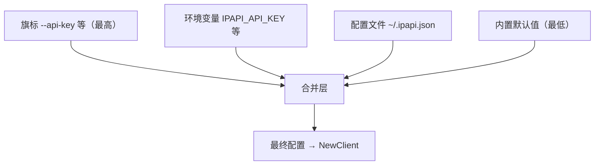
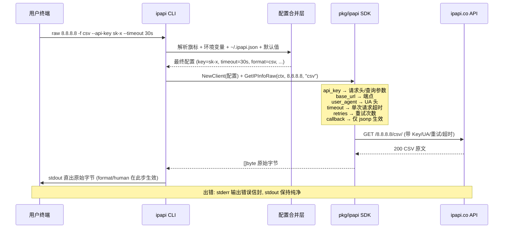

# ⚙️ 全局旗标参考

> `ipapi` 的 10 个持久旗标（`PersistentFlags`）对**所有子命令**生效。本页是它们的完整参考：按认证 / 请求 / 输出 / 配置四组列出每个旗标的类型、默认值、环境变量、示例，并讲清四级配置优先级怎么决定最终取值。

## 一张表看全部旗标

下面 10 个旗标由 cobra 的 `PersistentFlags` 注册，挂在根命令上，因此 `ipapi info`、`ipapi me`、`ipapi field`、`ipapi raw` …… 任何子命令都能用。旗标写在子命令前后都可以：`ipapi --api-key sk-x info 8.8.8.8` 与 `ipapi info 8.8.8.8 --api-key sk-x` 等价。

| 旗标 | 短 | 类型 | 默认值 | 环境变量 | 说明 |
|------|:--:|------|--------|----------|------|
| `--api-key` | — | string | 空 | `IPAPI_API_KEY` | API Key，付费/高限额场景必填 |
| `--api-key-mode` | — | string | `header` | `IPAPI_API_KEY_MODE` | Key 传递方式：`header` 或 `query` |
| `--base-url` | — | string | `https://ipapi.co/` | `IPAPI_BASE_URL` | API 端点，切代理/自建镜像用 |
| `--user-agent` | — | string | `ipapi-cli/0.1.0` | — | 自定义 User-Agent |
| `--retries` | — | int | `2` | — | 重试次数，总请求数 = retries + 1 |
| `--timeout` | — | duration | `10s` | — | 单次请求超时，支持 `30s` / `2m` |
| `-f` / `--format` | `-f` | string | `json` | `IPAPI_FORMAT` | `json`/`jsonp`/`xml`/`csv`/`yaml` |
| `-H` / `--human` | `-H` | bool | `false` | — | 人类可读输出（默认 JSON） |
| `--config` | — | string | `~/.ipapi.json` | — | 配置文件路径 |
| `--callback` | — | string | 空 | — | JSONP 回调名（仅 `raw`/`me-raw` + jsonp） |

::: tip 🚀 一行装好
```bash
go install github.com/cyberspacesec/ipapi.co-skills/cmd/ipapi@latest
```
:::

---

## 🔐 认证组

负责"你是谁"——把 API Key 安全地送进每一个请求。

### `--api-key`

| 项 | 值 |
|----|----|
| 短旗标 | 无 |
| 类型 | string |
| 默认 | 空（匿名调用） |
| 环境变量 | `IPAPI_API_KEY` |
| 适用命令 | 全部子命令（`fields` / `version` / `completion` 不发请求，传了也用不上） |

注入 API Key。匿名调用有较严的限流，带上 Key 可提升限额、解锁付费字段。Key 不会出现在 stdout，也不会被写进信封；它只进 HTTP 请求。

```bash
# 旗标直接给
ipapi info 8.8.8.8 --api-key sk-xxxxxxxxxxxx

# 环境变量（推荐，避免 Key 进入 shell history）
export IPAPI_API_KEY=sk-xxxxxxxxxxxx
ipapi info 8.8.8.8

# 配置文件 ~/.ipapi.json
# { "api_key": "sk-xxxxxxxxxxxx" }
ipapi info 8.8.8.8
```

::: warning ⚠️ 别把 Key 写进脚本明文
`--api-key sk-x` 会出现在 `ps`、shell history、CI 日志里。生产环境优先用环境变量 `IPAPI_API_KEY`，其次写进 `~/.ipapi.json`（权限 `chmod 600`）。CI 里用 secret 注入环境变量是最稳妥的。
:::

### `--api-key-mode`

| 项 | 值 |
|----|----|
| 短旗标 | 无 |
| 类型 | string |
| 默认 | `header` |
| 环境变量 | `IPAPI_API_KEY_MODE` |
| 合法值 | `header` / `query` |

控制 Key 怎么送给上游：

- `header`（默认）：放进请求头，URL 干净、不易进日志。
- `query`：拼进 URL 查询参数，兼容某些只读 query 的代理/网关——但 Key 会出现在 URL 里，日志要小心。

```bash
# 默认 header 模式
ipapi info 8.8.8.8 --api-key sk-x
# 等价于：Authorization 请求头带 Key

# 切到 query 模式
ipapi info 8.8.8.8 --api-key sk-x --api-key-mode query
# Key 拼进 URL：https://ipapi.co/8.8.8.8/json/?key=sk-x（示意）

# 环境变量
export IPAPI_API_KEY_MODE=query
```

::: details 什么时候用 `query` 模式？
绝大多数场景保持默认 `header` 即可。只有当你的请求要经过一个只透传 query 参数、会剥掉自定义头的中间层（某些老式 API 网关、简单反代），才需要切 `query`。注意：query 模式下 Key 会进访问日志、CDN 日志、`Referer`——务必确认链路安全。
:::

---

## 📡 请求组

负责"请求怎么发"——端点、UA、重试、超时。这组旗标改变的是 HTTP 层行为，与输出格式无关。

### `--base-url`

| 项 | 值 |
|----|----|
| 短旗标 | 无 |
| 类型 | string |
| 默认 | `https://ipapi.co/` |
| 环境变量 | `IPAPI_BASE_URL` |

把请求指向另一个端点。典型用途：自建反代镜像、内网网关、测试桩。注意**保留尾斜杠**——CLI 在此基础上拼接 `8.8.8.8/json/` 这样的路径。

```bash
# 指向自建镜像
ipapi info 8.8.8.8 --base-url https://my-mirror.example.com/

# 环境变量
export IPAPI_BASE_URL=https://my-mirror.example.com/
ipapi me

# 测试桩（本地 mock）
ipapi info 8.8.8.8 --base-url http://localhost:8080/
```

::: warning ⚠️ 尾斜杠很重要
默认值是 `https://ipapi.co/`（带尾斜杠）。自定义时也带上尾斜杠，否则拼接出的路径可能变成 `https://host8.8.8.8/json/`。CI 里切端点时尤其要检查这一行。
:::

### `--user-agent`

| 项 | 值 |
|----|----|
| 短旗标 | 无 |
| 类型 | string |
| 默认 | `ipapi-cli/0.1.0` |
| 环境变量 | 无（只能旗标或配置文件） |

自定义 `User-Agent` 请求头。便于服务端按客户端识别、统计、放行。配置文件字段名为 `user_agent`（下划线）。

```bash
ipapi info 8.8.8.8 --user-agent "my-bot/1.0 (contact=ops@example.com)"

# 配置文件
# { "user_agent": "my-bot/1.0 (contact=ops@example.com)" }
```

::: tip 📌 没有 `IPAPI_USER_AGENT` 环境变量
UA 没有对应的环境变量入口——要持久改 UA，写进 `~/.ipapi.json` 的 `user_agent` 字段，或每次 `--user-agent` 显式传。
:::

### `--retries`

| 项 | 值 |
|----|----|
| 短旗标 | 无 |
| 类型 | int |
| 默认 | `2` |
| 环境变量 | 无 |
| 语义 | 重试次数，总请求数 = `retries + 1` |

可重试错误（退出码 `6`/`8`/`9`，对应限流、查不到、上游 5xx）会按指数退避重试。`--retries 2` 意味着首次失败后再试 2 次，总共最多 3 次请求。

```bash
# 更激进：最多 5 次请求
ipapi info 8.8.8.8 --retries 4

# 关掉重试：只发 1 次
ipapi info 8.8.8.8 --retries 0

# 配置文件
# { "retries": 3 }
```

::: details 重试只针对"可重试"错误
确定性错误（INVALID_IP、RESERVED_IP、INVALID_KEY 等）不会触发重试——重试结果不变。只有 `retryable: true` 的错误才会进重试循环。所以把 `--retries` 调大不会拖慢"参数写错"这种场景。详见 [错误概念](../guide/error-concept)。
:::

### `--timeout`

| 项 | 值 |
|----|----|
| 短旗标 | 无 |
| 类型 | duration |
| 默认 | `10s` |
| 环境变量 | 无 |
| 格式 | Go duration：`30s` / `2m` / `500ms` |

单次 HTTP 请求的超时。注意这是**单次**——重试时每次请求独立计这个超时，不是总超时。

```bash
# 网络差：放宽到 30 秒
ipapi info 8.8.8.8 --timeout 30s

# 快速失败：2 秒
ipapi info 8.8.8.8 --timeout 2s

# 配置文件（字符串）
# { "timeout": "30s" }
```

::: warning ⚠️ 配置文件里 timeout 是字符串
`~/.ipapi.json` 中 `timeout` 必须写成字符串（如 `"10s"`、`"2m"`），不能写裸数字 `10`——解析用的是 Go 的 `time.ParseDuration`，缺单位会报错。
:::

---

## 🖨️ 输出组

负责"结果长什么样"——格式与可读性。这组旗标只影响 stdout 呈现，不影响请求本身。

### `-f` / `--format`

| 项 | 值 |
|----|----|
| 短旗标 | `-f` |
| 类型 | string |
| 默认 | `json` |
| 环境变量 | `IPAPI_FORMAT` |
| 合法值 | `json` / `jsonp` / `xml` / `csv` / `yaml` |

::: warning ⚠️ 各子命令对 `-f` 的接受度不同
- `raw` / `me-raw`：**完整支持** 5 种格式，直出原始字节。
- `info` / `me`：**仅支持 `json`**——它们把响应解码为强类型 `IPInfo` 再装信封，`-f csv` 等会被忽略或报错。要原始格式用 `raw`。
- `field` / `me-field`：返回 `{field, value}` 信封，不受 `-f` 影响。
- `fields` / `version` / `completion`：本地命令，不发请求，`-f` 无意义。
:::

```bash
# raw 直出 CSV
ipapi raw 8.8.8.8 -f csv

# 环境变量（影响 raw/me-raw）
export IPAPI_FORMAT=yaml
ipapi me-raw

# 短旗标
ipapi raw 8.8.8.8 -f xml | xmllint --format -
```

### `-H` / `--human`

| 项 | 值 |
|----|----|
| 短旗标 | `-H` |
| 类型 | bool |
| 默认 | `false`（输出 JSON 信封） |
| 环境变量 | 无 |

切换到人类可读输出，具体形态按子命令而定：

- `info` / `me`：对齐表格，28 字段铺开。
- `field` / `me-field`：**纯值一行**，最适合管道。
- `raw` / `me-raw`：原始字节本就是"人可读"原文，`--human` 无额外效果。

```bash
# field 纯值——管道友好
ipapi field 8.8.8.8 country --human
# 输出：US

# 接管道
COUNTRY=$(ipapi field 8.8.8.8 country -H)
echo "$COUNTRY"   # US

# info 对齐表格
ipapi info 8.8.8.8 --human
```

::: warning ⚠️ `--human` 不是稳定接口
`--human` 的对齐宽度、字段顺序、分隔符可能随版本调整。**终端肉眼看可以，`grep`/`awk` 做脚本逻辑不行**——要结构化取值，用 JSON 信封 + `jq`，或 `field --human` 取纯值。
:::

### `--callback`

| 项 | 值 |
|----|----|
| 短旗标 | 无 |
| 类型 | string |
| 默认 | 空 |
| 环境变量 | 无 |
| 适用条件 | 仅 `raw` / `me-raw` 且 `-f jsonp` 时生效 |

JSONP 回调函数名。仅当 `raw`/`me-raw` 配 `-f jsonp` 时才有意义——输出会变成 `callbackName({...})` 形式，便于在浏览器 `<script>` 标签里跨域消费。

```bash
ipapi raw 8.8.8.8 -f jsonp --callback handleIp
# 输出：handleIp({"ip":"8.8.8.8", ...})

ipapi me-raw -f jsonp --callback gotMe
# 输出：gotMe({"ip":"203.0.113.42", ...})
```

::: details 什么时候用 JSONP？
JSONP 是浏览器跨域的老办法。现在多数前端用 CORS + `fetch` 即可，JSONP 主要用于：必须支持极老浏览器、或后端只放行 JSONP 端点的场景。CLI 侧提供 `--callback` 主要是为了"原样透传上游能力"——`raw` 命令的定位就是直出原始字节、不装信封。
:::

---

## 🗂️ 配置组

负责"配置从哪来"——配置文件路径本身。

### `--config`

| 项 | 值 |
|----|----|
| 短旗标 | 无 |
| 类型 | string |
| 默认 | `~/.ipapi.json` |
| 环境变量 | 无 |

指定配置文件路径。配置文件是 JSON 格式，字段如下：

| JSON 字段 | 对应旗标 | 类型/示例 |
|-----------|----------|-----------|
| `api_key` | `--api-key` | `"sk-xxxx"` |
| `api_key_mode` | `--api-key-mode` | `"header"` / `"query"` |
| `format` | `--format` | `"json"` / `"csv"` ... |
| `base_url` | `--base-url` | `"https://ipapi.co/"` |
| `user_agent` | `--user-agent` | `"my-bot/1.0"` |
| `retries` | `--retries` | `2` |
| `timeout` | `--timeout` | `"10s"`（字符串！） |
| `callback` | `--callback` | `"handleIp"` |

```bash
# 用默认配置文件
ipapi info 8.8.8.8   # 读 ~/.ipapi.json

# 指定别的配置文件
ipapi info 8.8.8.8 --config ~/work-ipapi.json

# CI 里用专用配置
ipapi me --config /etc/ipapi/ci.json
```

一个完整的 `~/.ipapi.json` 示例：

```json
{
  "api_key": "sk-xxxxxxxxxxxx",
  "api_key_mode": "header",
  "format": "json",
  "base_url": "https://ipapi.co/",
  "user_agent": "my-bot/1.0 (contact=ops@example.com)",
  "retries": 3,
  "timeout": "20s",
  "callback": "handleIp"
}
```

::: tip 📌 配置文件可只写你关心的字段
没写的字段回落到默认值。只写 `{"api_key": "sk-x"}` 也是合法配置——其余参数走默认。这让 `~/.ipapi.json` 可以从一行 `api_key` 起步，按需扩充。
:::

---

## 🧭 配置优先级

旗标、环境变量、配置文件、默认值，四级从高到低覆盖。**同一参数有多处定义时，高优先级赢。**



口诀：**旗标 > 环境变量 > 配置文件 > 默认值**。

| 场景 | 推荐渠道 |
|------|----------|
| CI 里单次临时覆盖 | 旗标（`--timeout 30s`） |
| 多终端永久生效、脚本可移植 | 环境变量（`IPAPI_API_KEY`） |
| 个人本机长期配置、含敏感信息 | 配置文件（`~/.ipapi.json`，`chmod 600`） |
| 什么都不设 | 默认值 |

::: warning ⚠️ 同名时谁赢？举例
同时设了 `IPAPI_API_KEY=env_key`（环境变量）和 `--api-key flag_key`（旗标），最终生效的是 **`flag_key`**——旗标赢环境变量。再假设配置文件里 `api_key` 是 `file_key`，三者并存时仍是 `flag_key` 赢。只有当旗标和环境变量都没设，才轮到配置文件的 `file_key`。
:::

### 一张表：每个参数的四个入口

| 参数 | 旗标 | 环境变量 | 配置文件字段 | 默认 |
|------|------|----------|--------------|------|
| API Key | `--api-key` | `IPAPI_API_KEY` | `api_key` | 空 |
| Key 模式 | `--api-key-mode` | `IPAPI_API_KEY_MODE` | `api_key_mode` | `header` |
| 格式 | `-f`/`--format` | `IPAPI_FORMAT` | `format` | `json` |
| 端点 | `--base-url` | `IPAPI_BASE_URL` | `base_url` | `https://ipapi.co/` |
| UA | `--user-agent` | — | `user_agent` | `ipapi-cli/0.1.0` |
| 重试 | `--retries` | — | `retries` | `2` |
| 超时 | `--timeout` | — | `timeout` | `10s` |
| 人可读 | `-H`/`--human` | — | — | `false` |
| 配置路径 | `--config` | — | — | `~/.ipapi.json` |
| JSONP 回调 | `--callback` | — | `callback` | 空 |

注意：`--user-agent`、`--retries`、`--timeout`、`--human`、`--config` **没有环境变量入口**——要持久化只能写配置文件或每次旗标显式传。

---

## 🔄 旗标怎么流到一次请求

以 `ipapi raw 8.8.8.8 -f csv --api-key sk-x --timeout 30s` 为例，看清 10 个旗标里哪些进了请求、哪些只影响输出：



要点：

- **认证组 + 请求组** → 进 HTTP 请求（Key、端点、UA、超时、重试）。
- **输出组** → 只在 CLI 拿到响应后决定 stdout 怎么呈现（格式、人可读、回调名）。
- **配置组** → 在最前面决定配置从哪个文件读。

---

## 🧪 常见组合

### 匿名快速查（默认配置）

```bash
ipapi me --human     # 本机公网 IP，对齐表格
```

### 带 Key + 自定义端点 + 长超时

```bash
ipapi info 8.8.8.8 \
  --api-key sk-x \
  --base-url https://mirror.example.com/ \
  --timeout 30s \
  --retries 4
```

### 全用环境变量（脚本可移植）

```bash
export IPAPI_API_KEY=sk-x
export IPAPI_BASE_URL=https://mirror.example.com/
export IPAPI_FORMAT=yaml
ipapi me-raw          # 自动读环境变量
```

### 配置文件 + 单次旗标覆盖

```bash
# ~/.ipapi.json: { "api_key": "sk-x", "timeout": "10s", "retries": 2 }
ipapi info 8.8.8.8 --timeout 30s
# api_key/retries 走配置文件，timeout 被旗标覆盖成 30s
```

### 取单字段喂管道（最省）

```bash
COUNTRY=$(ipapi field 8.8.8.8 country -H)
echo "$COUNTRY"   # US
```

### JSONP 输出（浏览器跨域）

```bash
ipapi raw 8.8.8.8 -f jsonp --callback handleIp
# handleIp({"ip":"8.8.8.8", ...})
```

---

## ❓ 常见问题

::: details 旗标和子命令谁在前？
都行。cobra 的持久旗标允许写在子命令前后：`ipapi --api-key sk-x info 8.8.8.8` 与 `ipapi info 8.8.8.8 --api-key sk-x` 等价。习惯上把"全局调参"放前面、"目标参数"放后面，可读性更好。
:::

::: details 为什么 `info` 不认 `-f csv`？
`info` / `me` 的设计是"解码为强类型 `IPInfo` 再装信封"，所以只支持 `json`。要原始 CSV/XML/YAML/JSONP 字节，用 `raw <ip> -f <fmt>` / `me-raw -f <fmt>`——它们直出上游原文、不装信封、不附带 meta。详见 [raw 命令](./command-raw)。
:::

::: details `--timeout` 是总超时还是单次超时？
单次。重试时每次请求独立计这个超时。所以 `--retries 2 --timeout 10s` 最坏情况总耗时约 `3 * 10s`（不含退避间隔）。
:::

::: details 配置文件里 `timeout` 写成数字会怎样？
会报解析错误。`~/.ipapi.json` 的 `timeout` 必须是字符串（如 `"10s"`、`"2m"`），用的是 Go `time.ParseDuration`，缺单位不认。`retries` 则可以是裸数字。
:::

::: details `--human` 能不能 grep？
能 grep 看一眼，但**别**用 grep/awk 做脚本逻辑。`--human` 不是稳定接口。要结构化取值，用 JSON 信封 + `jq`，或 `field --human` 取纯值。
:::

::: details 没有 `IPAPI_USER_AGENT` 这种环境变量？
对。`--user-agent`、`--retries`、`--timeout`、`--human`、`--config`、`--callback` 都没有环境变量入口——要持久化只能写进 `~/.ipapi.json`，或每次旗标显式传。有环境变量入口的只有 `IPAPI_API_KEY`、`IPAPI_API_KEY_MODE`、`IPAPI_FORMAT`、`IPAPI_BASE_URL` 四个。
:::

---

## 下一步

- 🗂️ [命令速查](./commands) —— 全部子命令与全局旗标的一页式速查表
- 🚀 [快速开始](./quickstart) —— 五分钟跑通第一条命令
- 🔍 [info / me 命令](./command-info) —— 完整 28 字段查询详解
- 🎯 [field / me-field 命令](./command-field) —— 单字段取值，`--human` 纯值模式
- 📡 [raw / me-raw 命令](./command-raw) —— 直出 XML/CSV/YAML/JSONP 原始字节
- 🧭 [fields 命令](./command-fields) —— 28 个可查字段清单与分组
- ⚙️ [配置方式](./config) —— 旗标/环境变量/配置文件/默认值四级链路完整说明
- 📦 [错误概念](../guide/error-concept) —— 退出码与错误信封的完整语义
- 🍳 [实战手册](../cookbook/) —— CLI 与 SDK 的真实场景用法
