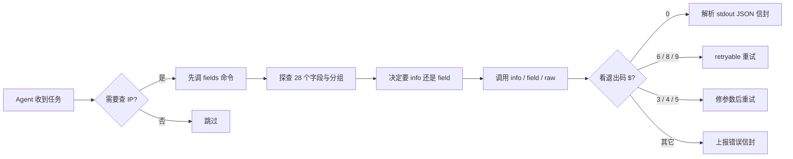
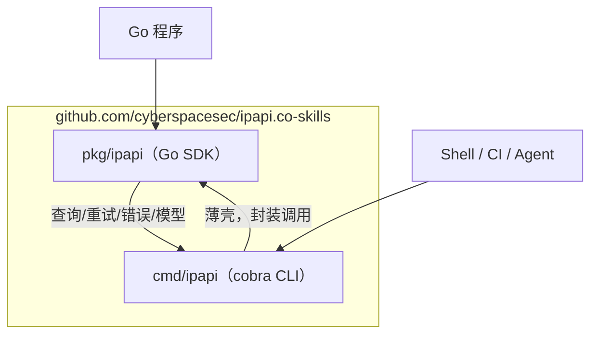
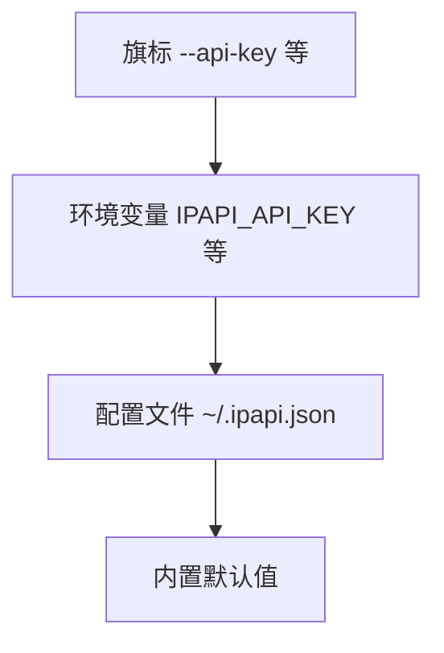

# ⚙️ CLI 总览

> `ipapi` —— 命令行里的 IP 地理位置查询工具，默认 JSON 输出、稳定退出码、AI Agent 友好，背后是零运行时依赖的 Go SDK。

## 它是什么

`ipapi` 是一个用 Go 写成的命令行工具，用于查询任意 IP 地址的地理、网络、文化、经济等结构化信息。它封装了 [ipapi.co](https://ipapi.co) 的公开 API，把"查一个 IP 是哪个国家、哪个城市、属于哪个 ASN"这件事压成一行命令：

```bash
ipapi info 8.8.8.8          # 查指定 IP 的完整信息
ipapi me                    # 查本机公网 IP 的完整信息
ipapi field 8.8.8.8 country # 只取"国家"字段
ipapi me-field asn          # 只取本机 ASN
```

它不是脚本胶水，而是一个**编译后的单二进制**：无 Python 依赖、无 Node 运行时、无 shell 解释器要求，丢进 `~/bin` 或 `/usr/local/bin` 就能跑。同一份代码也可以作为 Go 库直接嵌入你的程序，CLI 与 SDK 共享同一套请求/重试/错误逻辑。

## 解决什么问题

在 `ipapi` 出现之前，想从命令行查 IP 归属，通常要这样写：

```bash
curl -s "https://ipapi.co/8.8.8.8/json/" | jq '.country'
```

这条命令能跑，但只在"理想情况下"能跑。真实世界里你会撞上：

- **格式不一**：ipapi.co 支持 json / jsonp / xml / csv / yaml 五种格式，`curl` 不会帮你切换，`jq` 也只认 JSON。
- **错误难判**：限流返回 429、保留 IP 返回特殊结构、无效 IP 直接报错——`curl` 的退出码永远是 0 或非 0，你分不清是"网络挂了"还是"IP 写错了"。
- **管道难用**：想把国家代码喂给下一个命令？得先 `jq` 解一遍 JSON 再 `cut`，链路越长越脆。
- **配置散乱**：API Key 放哪？base_url 切换？超时怎么调？每写一个脚本都要重新处理一遍。
- **Agent 难调**：让 AI Agent 调 `curl` 加 `jq`，等于让它手写一段易碎的 shell——格式漂移、字段拼错、退出码语义不明，全靠模型自己猜。

`ipapi` 把这些问题一次性解决：**结构化的 JSON 信封**承载结果与元信息、**10 类稳定退出码**承载错误语义、**`--human` 纯值模式**让管道一行接通、**四级配置链**统一管理密钥与超时、**`raw` 命令**直出原始字节兼容既有工具链。

## 为什么对 AI Agent 友好

这是 `ipapi` 设计时的核心目标之一。一个能被 LLM Agent 可靠调用的命令行工具，需要满足四个约束，而 `ipapi` 全部命中：

| 约束 | `ipapi` 的做法 |
|------|----------------|
| **输出可解析** | 默认输出 JSON 信封 `{ok, command, args, data, meta}`，字段固定、类型稳定，Agent 用 `json.Unmarshal` 即可消费，无需读自然语言。 |
| **错误可枚举** | 错误走 stderr 同样是 JSON 信封，含 `code`（如 `RATE_LIMITED`）、`sentinel`（如 `ErrRateLimited`）、`retryable` 布尔，Agent 据此决定是否重试。 |
| **退出码可分支** | 0=成功，2=USAGE，3=INVALID_IP … 12=UNEXPECTED_DATA，Agent 看 `$?` 就知道下一步该不该重试、该不该改参数。 |
| **自描述** | `ipapi fields` 本地无网络列出全部 28 个可查字段并按 7 个语义分组，Agent 先探查可查什么、再决定查什么——无需把字段表写进 prompt。 |



换句话说，Agent 调 `ipapi` 不需要读文档——它先 `ipapi fields` 摸清能力边界，再按退出码和 `retryable` 字段决定动作，全程结构化、零自然语言猜测。详见 [Agent 接入指南](./agent)。

## 与 SDK 的关系

`ipapi` CLI 不是一个独立项目，而是 [`github.com/cyberspacesec/ipapi.co-skills`](https://github.com/cyberspacesec/ipapi.co-skills) 仓库的"另一张脸"：

- **共享内核**：CLI 子命令调用的查询、重试、状态码映射、错误构造，全部来自 `pkg/ipapi` 这个 Go 包。CLI 只是一层 cobra 薄壳。
- **同一套错误**：CLI 的退出码与 SDK 的 10 个哨兵错误（`ErrInvalidIP`、`ErrRateLimited` 等）一一对应，你在脚本里 `errors.Is(err, ipapi.ErrRateLimited)` 的判断，等价于 CLI 里 `$? -eq 6`。
- **同一套配置**：SDK 的 `WithAPIKey`、`WithAPIKeyQuery`、`WithCallback` 等选项函数，对应到 CLI 就是 `--api-key`、`--api-key-mode`、`--callback` 旗标。
- **互为出口**：在 shell / CI / Agent 场景用 CLI，在 Go 程序里用 SDK，两者行为一致、错误一致、字段一致。



想要在 Go 代码里直接调用？跳到 [CLI 与 SDK 桥接](./sdk-bridge) 或 [API 方法详解](/api/methods)。

## 安装

一行 `go install` 即可（需 Go 1.21+）：

```bash
go install github.com/cyberspacesec/ipapi.co-skills/cmd/ipapi@latest
```

安装后确认：

```bash
ipapi version
```

```json
{
  "ok": true,
  "command": "version",
  "data": {
    "version": "0.1.0",
    "commit": "3bceb6b",
    "goVersion": "go1.21"
  },
  "meta": {
    "format": "json",
    "retrievedAt": "2026-07-04T10:01:22Z"
  }
}
```

::: tip 没有 Go 工具链？
到 [GitHub Releases](https://github.com/cyberspacesec/ipapi.co-skills/releases) 下载对应平台的预编译二进制，放进 `PATH` 即可。详细步骤见 [安装指南](./install)。
:::

## 30 秒上手

### 1. 查一个 IP 的完整信息

```bash
ipapi info 8.8.8.8
```

```json
{
  "ok": true,
  "command": "info",
  "args": { "ip": "8.8.8.8", "format": "json" },
  "data": {
    "ip": "8.8.8.8",
    "city": "Mountain View",
    "region": "California",
    "country": "US",
    "country_name": "United States",
    "asn": "AS15169",
    "org": "Google LLC",
    "timezone": "America/Los_Angeles",
    "currency": "USD"
  },
  "meta": {
    "format": "json",
    "durationMs": 312,
    "retrievedAt": "2026-07-04T10:01:22Z"
  }
}
```

::: details data 里到底有多少字段？
`data` 永远是完整的 28 字段 `IPInfo` 结构（详见 [字段总览](./command-fields)）。上面为可读性做了裁剪，实际输出更长。想只取一两个字段，用下面的 `field` 命令。
:::

### 2. 只取一个字段，并喂给下一条命令

```bash
# 默认输出 {field, value} 信封
ipapi field 8.8.8.8 country
```

```json
{
  "ok": true,
  "command": "field",
  "args": { "ip": "8.8.8.8", "field": "country" },
  "data": { "field": "country", "value": "US" },
  "meta": { "format": "json", "durationMs": 188 }
}
```

加 `--human`（或 `-H`）直出纯值，方便接管道：

```bash
COUNTRY=$(ipapi field 8.8.8.8 country --human)
echo "8.8.8.8 归属：$COUNTRY"
# 8.8.8.8 归属：US
```

### 3. 查本机公网 IP

```bash
ipapi me              # 完整信息
ipapi me-field asn    # 只取本机 ASN
```

### 4. 直出原始字节（兼容 jq / column / xsltproc）

```bash
ipapi raw 8.8.8.8 -f json   | jq '.country'
ipapi raw 8.8.8.8 -f csv    | column -t -s,
ipapi raw 8.8.8.8 -f yaml   | grep country
```

`raw` 不包信封、不附带 meta，错误仍走 stderr 信封，stdout 永远纯净——可以放心接管道。详见 [raw 命令](./command-raw)。

## 命令地图

`ipapi` 共 8 个子命令，按用途分四组：

| 分组 | 命令 | 用途 | 文档 |
|------|------|------|------|
| 🔍 完整信息 | `info <ip>` | 指定 IP 完整 28 字段 | [command-info](./command-info) |
| 🔍 完整信息 | `me` | 本机公网 IP 完整信息 | [command-info](./command-info) |
| 🎯 单字段 | `field <ip> <field>` | 指定 IP 单字段，返回 `{field,value}` | [command-field](./command-field) |
| 🎯 单字段 | `me-field <field>` | 本机 IP 单字段 | [command-field](./command-field) |
| 📡 原始格式 | `raw <ip> -f <fmt>` | 指定 IP 原始字节，5 种格式 | [command-raw](./command-raw) |
| 📡 原始格式 | `me-raw -f <fmt>` | 本机 IP 原始字节 | [command-raw](./command-raw) |
| 🧭 自描述 | `fields [--group X] [--json]` | 列出 28 个可查字段，本地无网络 | [command-fields](./command-fields) |
| ℹ️ 元信息 | `version [--json]` | 版本信息 | [command-version](./command-version) |
| 🧩 补全 | `completion <shell>` | bash/zsh/fish/powershell | [command-version](./command-version) |

## 全局旗标速查

所有子命令共享这些持久旗标（完整说明见 [配置方式](./config)）：

| 旗标 | 类型 | 默认 | 环境变量 | 说明 |
|------|------|------|----------|------|
| `--api-key` | string | 空 | `IPAPI_API_KEY` | API Key，付费场景必填 |
| `--api-key-mode` | string | `header` | `IPAPI_API_KEY_MODE` | `header` 或 `query` |
| `-f` / `--format` | string | `json` | `IPAPI_FORMAT` | `json`/`jsonp`/`xml`/`csv`/`yaml` |
| `--base-url` | string | `https://ipapi.co/` | `IPAPI_BASE_URL` | 切换 API 端点 |
| `--user-agent` | string | `ipapi-cli/0.1.0` | — | 自定义 UA |
| `--retries` | int | `2` | — | 重试次数，总请求 = retries + 1 |
| `--timeout` | duration | `10s` | — | 单次请求超时 |
| `-H` / `--human` | bool | `false` | — | 人类可读输出（默认 JSON） |
| `--config` | string | `~/.ipapi.json` | — | 配置文件路径 |
| `--callback` | string | 空 | — | JSONP 回调名（仅 `raw`/`me-raw` + jsonp） |

### 配置优先级

四级覆盖，从高到低：



::: warning 同名时谁赢？
旗标 > 环境变量 > 配置文件 > 默认值。例如同时设了 `IPAPI_API_KEY=env_key` 和 `--api-key flag_key`，最终生效的是 `flag_key`。配置文件是 JSON 格式，字段为 `api_key`、`api_key_mode`、`format`、`base_url`、`user_agent`、`retries`、`timeout`（字符串如 `"10s"`）、`callback`。
:::

## 输出结构：成功与错误信封

### 成功信封（stdout）

所有非 `raw` 命令的成功输出都遵循同一结构：

```json
{
  "ok": true,
  "command": "info",
  "args": { "ip": "8.8.8.8", "format": "json" },
  "data": { "...28 个 IPInfo 字段..." },
  "meta": {
    "format": "json",
    "durationMs": 312,
    "retrievedAt": "2026-07-04T10:01:22Z"
  }
}
```

### 错误信封（stderr，stdout 保持纯净）

```json
{
  "ok": false,
  "command": "info",
  "args": { "ip": "999.1.1.1" },
  "error": {
    "code": "INVALID_IP",
    "message": "invalid IP address: 999.1.1.1",
    "sentinel": "ErrInvalidIP",
    "retryable": false
  }
}
```

::: tip stdout / stderr 严格分离
成功结果永远在 stdout，错误信封永远在 stderr。这意味着你可以放心地 `ipapi info 1.1.1.1 | jq .data.country`——即使出错，stdout 也不会被错误信息污染，`jq` 不会收到半截垃圾。
:::

## 退出码速查

脚本里用 `$?` 分支，比解析 JSON 更轻量：

| 码 | 含义 | 可重试 | 触发场景 |
|----|------|--------|----------|
| 0 | 成功 | — | 正常返回 |
| 2 | USAGE | 否 | 参数缺失/多余 |
| 3 | INVALID_IP | 否 | IP 格式非法 |
| 4 | INVALID_FIELD | 否 | 字段名不存在 |
| 5 | INVALID_FORMAT | 否 | 格式名不支持 |
| 6 | RATE_LIMITED | ✅ | 触发限流 |
| 7 | RESERVED_IP | 否 | 保留/私有 IP |
| 8 | NOT_FOUND | ✅ | 查不到结果 |
| 9 | SERVER_ERROR | ✅ | 服务端 5xx |
| 10 | METHOD_NOT_ALLOWED | 否 | HTTP 方法错 |
| 11 | INVALID_KEY | 否 | API Key 无效 |
| 12 | UNEXPECTED_DATA | 否 | 响应无法解析 |
| 70 | INTERNAL | 否 | 内部异常 |

完整表与每个码的应对策略见 [退出码表](./exit-codes)。

## 下一步

- 🚀 **第一次用？** 从 [快速开始](./quickstart) 走一遍 30 秒上手。
- 📥 **装到机器上**：[安装指南](./install)，含 `go install` 与预编译二进制两种方式。
- 🤖 **给 Agent 用**：[Agent 接入指南](./agent) 讲清信封、退出码、自描述字段怎么串成一条可靠调用链。
- 🔍 **看命令细节**：[info](./command-info) / [field](./command-field) / [raw](./command-raw) / [fields](./command-fields) 等命令逐条详解。
- ⚙️ **调参数**：[配置方式](./config) 覆盖旗标、环境变量、`~/.ipapi.json`、默认值四级链路。
- 🔢 **写脚本**：[退出码表](./exit-codes) 给出每个码的 shell 分支写法。
- 🧩 **进 Go 程序**：[CLI 与 SDK 桥接](./sdk-bridge) 说明如何从 CLI 平滑切到 `pkg/ipapi` 库。
