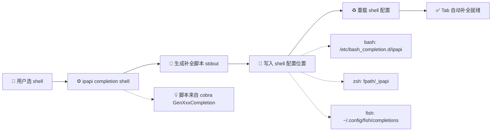
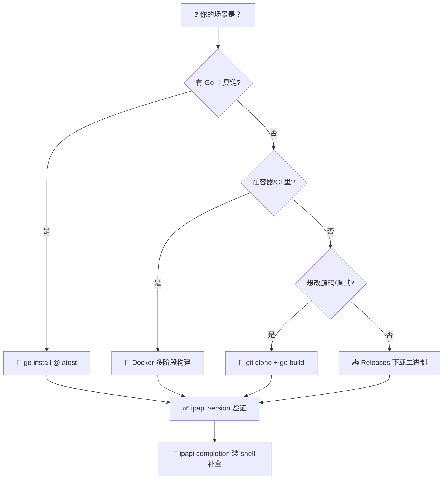

# 📦 安装

> 四种方式安装 ipapi CLI：`go install` 一键拉取、Releases 二进制下载、Docker 容器化、源码克隆构建。装完用 `ipapi version` 验证，再装上 shell 补全让命令行更好用。

ipapi CLI 是一个独立的命令行二进制，与 SDK 同源——它复用了 `pkg/ipapi` 的全部能力，把客户端调用、配置链路、输出信封、退出码都封装成开箱即用的子命令。CLI 适合在脚本、CI/CD、运维排障中「单条命令拿结果」；SDK 适合嵌入到 Go 程序里做工程化集成。

---

## 📋 系统要求

| 项目 | 要求 |
|------|------|
| 🐹 Go 版本 | `1.23.4` 或更高（仅 `go install` 与源码构建需要） |
| 💻 操作系统 | Linux / macOS / Windows（amd64、arm64 均有预编译二进制） |
| 🌐 网络 | 能访问 `proxy.golang.org`（拉依赖）与 `ipapi.co`（实际查询） |
| 🧰 运行时 | 无——编译后是单文件静态二进制，不依赖任何动态库 |

::: tip 💡 二进制下载用户无需安装 Go
Releases 页面提供预编译二进制，下载即用，目标机器上不需要任何 Go 工具链。这是在服务器、容器、CI runner 上最省事的方式。
:::

---

## 🚀 方式一：go install（推荐）

最轻量的方式。只要机器上有 Go 工具链，一条命令即可拉取最新版本并编译到 `$GOPATH/bin`（或 `$GOBIN`）：

```bash
go install github.com/cyberspacesec/ipapi.co-skills/cmd/ipapi@latest
```

`go install` 会：

1. 解析模块路径 `github.com/cyberspacesec/ipapi.co-skills`；
2. 进入子包 `cmd/ipapi`（这是 `package main` 所在）；
3. 编译为名为 `ipapi` 的二进制，落到 `$GOBIN`（默认 `$GOPATH/bin`）。

::: warning ⚠️ 确保 GOBIN 在 PATH 中
若执行后 shell 提示 `ipapi: command not found`，多半是 `$GOBIN` 没在 `PATH` 里。补一行：

```bash
# 加到 ~/.bashrc 或 ~/.zshrc
export PATH="$PATH:$(go env GOPATH)/bin"
```

重新开终端或 `source` 一下即可。
:::

指定版本安装：

```bash
go install github.com/cyberspacesec/ipapi.co-skills/cmd/ipapi@v0.1.0
```

::: details 🌏 中国大陆加速拉取
若 `go install` 卡在拉依赖，配置国内模块代理：

```bash
go env -w GOPROXY=https://goproxy.cn,direct
go env -w GOSUMDB=sum.golang.google.cn
```

然后再执行 `go install`。这是拉取慢的最常见解法。
:::

---

## 📥 方式二：二进制下载（Releases）

不想装 Go？直接下预编译二进制。每个版本发布时，CI 会为常见平台构建好归档文件。

### 1. 打开 Releases 页面

访问 [GitHub Releases](https://github.com/cyberspacesec/ipapi.co-skills/releases)，选最新版本，按平台下载对应归档：

| 文件名片段 | 平台 |
|------------|------|
| `ipapi_*_linux_amd64.tar.gz` | Linux x86_64 |
| `ipapi_*_linux_arm64.tar.gz` | Linux ARM64 |
| `ipapi_*_darwin_amd64.tar.gz` | macOS Intel |
| `ipapi_*_darwin_arm64.tar.gz` | macOS Apple Silicon |
| `ipapi_*_windows_amd64.zip` | Windows x86_64 |

### 2. 解压并安装

Linux / macOS：

```bash
# 示例：Linux amd64
curl -L -o ipapi.tar.gz \
  https://github.com/cyberspacesec/ipapi.co-skills/releases/latest/download/ipapi_0.1.0_linux_amd64.tar.gz
tar -xzf ipapi.tar.gz
sudo mv ipapi /usr/local/bin/
sudo chmod +x /usr/local/bin/ipapi
```

Windows（PowerShell）：

```powershell
# 下载 zip → 解压 → 把 ipapi.exe 放到 PATH 内目录（如 C:\Users\你\bin）
Expand-Archive ipapi_0.1.0_windows_amd64.zip -DestinationPath .
```

::: tip 🔄 一键脚本（Linux/macOS）
把下载、解压、装到 `/usr/local/bin` 合成一行：

```bash
curl -sL https://github.com/cyberspacesec/ipapi.co-skills/releases/latest/download/ipapi_0.1.0_linux_amd64.tar.gz \
  | tar -xz -C /tmp && sudo mv /tmp/ipapi /usr/local/bin/
```
:::

### 3. 校验完整性（可选）

正式环境建议校验归档的 SHA256，与 Release 页面公布的 checksums.txt 比对：

```bash
sha256sum ipapi.tar.gz
# 对照 releases 页 checksums.txt 中同文件名一行
```

---

## 🐳 方式三：Docker

适合在 CI 流水线、Kubernetes Job、或不想污染宿主环境的场景里跑。以下是基于官方 `golang` 镜像的多阶段构建——第一阶段编译，第二阶段只保留二进制，最终镜像极小。

### Dockerfile

```dockerfile
# 构建阶段
FROM golang:1.23.4-alpine AS builder
WORKDIR /src
RUN apk add --no-cache git
COPY go.mod go.sum ./
RUN go mod download
COPY . .
RUN CGO_ENABLED=0 go build \
    -ldflags="-s -w -X main.version=0.1.0" \
    -o /out/ipapi ./cmd/ipapi

# 运行阶段
FROM gcr.io/distroless/static:nonroot
COPY --from=builder /out/ipapi /ipapi
USER nonroot:nonroot
ENTRYPOINT ["/ipapi"]
```

### 构建与运行

```bash
# 构建镜像
docker build -t ipapi-cli:0.1.0 .

# 查询指定 IP（参数通过 CMD 传入，追加在 ENTRYPOINT 之后）
docker run --rm ipapi-cli:0.1.0 info 8.8.8.8

# 查本机公网 IP
docker run --rm ipapi-cli:0.1.0 me

# 透传 API Key（环境变量会被 CLI 自动读取）
docker run --rm -e IPAPI_API_KEY=your-key ipapi-cli:0.1.0 info 8.8.8.8
```

::: tip 🌍 配置优先级在容器里同样适用
容器内通过 `-e` 传环境变量（如 `IPAPI_API_KEY`、`IPAPI_FORMAT`、`IPAPI_BASE_URL`）即可生效——CLI 的配置链路是「旗标 > 环境变量 > `~/.ipapi.json` > 默认值」，环境变量天然适配容器化部署。详见 [配置参考](./config)。
:::

::: details 📦 挂载配置文件而非传环境变量
若你更习惯配置文件，把宿主的 `~/.ipapi.json` 挂进容器即可：

```bash
docker run --rm \
  -v "$HOME/.ipapi.json:/home/nonroot/.ipapi.json:ro" \
  ipapi-cli:0.1.0 info 8.8.8.8
```

注意挂载路径要落在容器内用户的 `$HOME` 下（distroless `nonroot` 用户 home 是 `/home/nonroot`），否则 CLI 找不到默认配置路径。
:::

---

## 🔧 方式四：源码构建

适合需要改源码、调试、或想用未发布特性的场景。

### 1. 克隆仓库

```bash
git clone https://github.com/cyberspacesec/ipapi.co-skills.git
cd ipapi.co-skills
```

### 2. 编译

```bash
# 编译到当前目录的 ./ipapi
go build -o ipapi ./cmd/ipapi

# 带版本信息注入（与 goreleaser 一致）
go build -ldflags="-s -w \
  -X main.version=0.1.0 \
  -X main.commit=$(git rev-parse --short HEAD) \
  -X main.date=$(date -u +%Y-%m-%dT%H:%M:%SZ)" \
  -o ipapi ./cmd/ipapi
```

### 3. 安装到 PATH

```bash
# 方式 A：go install 本地模块（会装到 $GOBIN）
go install ./cmd/ipapi

# 方式 B：手动移动
sudo mv ipapi /usr/local/bin/
```

::: warning ⚠️ 源码版本可能领先于 Releases
`main` 分支可能包含未发布的功能。生产环境请用 `git checkout v0.1.0` 切到 tag 再构建，避免用到不稳定代码。
:::

---

## ✅ 验证安装

无论用哪种方式，装完都跑一次 `ipapi version` 确认二进制可用：

```bash
ipapi version
```

预期输出（默认人类可读）：

```
ipapi 0.1.0 (commit: abc1234, built: 2026-07-04T10:00:00Z)
Go go1.23.4
```

`--json` 输出结构化版本信息，便于脚本解析：

```bash
ipapi version --json
```

```json
{
  "version": "0.1.0",
  "commit": "abc1234",
  "date": "2026-07-04T10:00:00Z",
  "goVersion": "go1.23.4"
}
```

::: tip 🧪 再跑一次真实查询
版本能打印说明二进制本身没问题，但还差一步——确认能联网查询。试一下：

```bash
ipapi me          # 查本机公网 IP 完整信息
ipapi field 8.8.8.8 country --human   # 应输出一行：US
```

若 `me` 返回完整 JSON 信封、`field --human` 输出 `US`，则安装与网络链路都正常。
:::

::: details 🔍 version 输出 dev 是怎么回事？
若你看到 `ipapi dev (commit: none, built: unknown)`，说明这个二进制没有通过 goreleaser 的 ldflags 注入版本信息——通常是 `go build` 直接编译、未带 `-X` 旗标的结果。功能完全正常，只是版本元数据为空。Releases 下载的二进制和 `go install @latest` 拉到的版本会有真实版本号。
:::

---

## 🧩 Shell 自动补全

ipapi CLI 基于 cobra，内置生成 bash / zsh / fish / powershell 补全脚本的能力。装上补全后，Tab 键能补全子命令、旗标名，甚至字段名。

### 一图看懂补全安装流程



### bash

```bash
# 生成并安装到系统级目录（需 sudo）
sudo ipapi completion bash > /etc/bash_completion.d/ipapi

# 或装到用户级（无需 sudo）
mkdir -p ~/.local/share/bash-completion/completions
ipapi completion bash > ~/.local/share/bash-completion/completions/ipapi

# 重载
source ~/.bashrc
```

### zsh

```bash
# 把脚本放到 fpath 内的某个目录
mkdir -p ~/.zfunc
ipapi completion zsh > ~/.zfunc/_ipapi

# 确保 ~/.zfunc 在 fpath（加到 ~/.zshrc，通常在调用 compinit 之前）
fpath+=~/.zfunc

# 重载
source ~/.zshrc
```

### fish

```sh
# fish 会自动加载 ~/.config/fish/completions 下的脚本
ipapi completion fish > ~/.config/fish/completions/ipapi.fish

# 立即生效，无需重载
```

### powershell

```powershell
# 生成脚本到 profile
ipapi completion powershell | Out-File -Encoding utf8 $PROFILE

# 重载
. $PROFILE
```

::: warning ⚠️ 补全脚本依赖 shell 自身机制
补全脚本是「壳」侧的能力——它告诉 bash/zsh/fish「遇到 ipapi 这个命令时，Tab 该补什么」。脚本本身不调用 ipapi 二进制，所以即便 ipapi 升级，补全脚本也无需重新生成（子命令树变化时除外）。卸载 ipapi 时记得把对应脚本也删掉。
:::

::: tip 🎯 补全能补什么
装好补全后试试：

- `ipapi <Tab>` → 列出所有子命令（info / me / field / raw / fields / version / completion）
- `ipapi field 8.8.8.8 <Tab>` → 列出 28 个可查字段名（country / city / asn ...）
- `ipapi raw 8.8.8.8 -f <Tab>` → 列出格式选项（json / jsonp / xml / csv / yaml）
- `ipapi --<Tab>` → 列出所有全局旗标

字段补全尤其有用——28 个字段名记不全也无所谓了。
:::

---

## 🗺️ 安装方式怎么选



一句话总结：

- **本地开发机、装了 Go** → `go install` 最快；
- **服务器、CI runner、不装 Go** → Releases 下载二进制；
- **容器化、K8s Job、CI 流水线** → Docker 多阶段构建；
- **要改源码、跑未发布特性** → 源码 `git clone` + `go build`。

---

## 🧹 卸载

各安装方式对应的卸载方法：

| 安装方式 | 卸载命令 |
|----------|----------|
| `go install` | `rm "$(go env GOPATH)/bin/ipapi"` |
| Releases 二进制 | `sudo rm /usr/local/bin/ipapi` |
| 源码 `go install ./cmd/ipapi` | 同 `go install` |
| Docker | `docker rmi ipapi-cli:0.1.0` |
| Shell 补全 | 删除对应脚本（见上文路径），重载 shell |

CLI 不写任何注册表、不污染系统目录之外的路径。配置文件 `~/.ipapi.json` 是用户自建的，卸载不会自动删除——若想彻底清干净：

```bash
rm -f ~/.ipapi.json
```

---

## ❓ 常见问题

::: details Q: `ipapi: command not found` 装完找不到？
八成是二进制没在 `PATH` 里。`go install` 装到 `$GOPATH/bin`，确认这个目录在 `PATH`；二进制下载方式确认 `mv` 到了 `/usr/local/bin` 或其他 `PATH` 目录。
:::

::: details Q: `go install` 报 `module ... not found`？
检查网络能否访问 `proxy.golang.org`；中国大陆用户配 `GOPROXY=https://goproxy.cn,direct`；私有 fork 场景设 `GOPRIVATE`。
:::

::: details Q: macOS 提示「无法验证开发者」/Gatekeeper 拦截？
首次运行右键点二进制 → 打开 → 仍要打开；或 `xattr -d com.apple.quarantine /usr/local/bin/ipapi` 去除隔离属性。
:::

::: details Q: Docker 里 `ipapi me` 查到的是宿主 IP 还是容器 IP？
查到的是**容器出口 IP**，即容器 NAT 后的公网地址——通常和宿主公网 IP 一致，但若容器走了不同的网络出口（如自定义 NAT、VPN sidecar），结果会不同。这是容器网络行为，不是 ipapi 的问题。
:::

::: details Q: 装了补全但 Tab 不补字段？
确认补全脚本被 shell 实际加载了——`bash` 用 `complete -p ipapi` 看是否注册；`zsh` 确认 `compinit` 已跑且 `_ipapi` 在 fpath。新开一个终端窗口再试。
:::

---

## 📌 小结

到这里你应该已经：

- ✅ 用四种方式之一装好了 `ipapi` 二进制；
- ✅ 用 `ipapi version` 验证安装成功；
- ✅ （可选）装好了 shell 补全，Tab 用得飞起。

接下来就可以正式开始查询了。建议先从 `me`（查本机）和 `info`（查指定 IP）入手，熟悉 JSON 信封结构后再看 `field`、`raw` 这些更专注的子命令。

---

## 下一步

- 📖 看 [CLI 命令总览](../index) — 15 个 md 逐个讲清每个子命令
- 🚀 [info 命令](./command-info) — 查指定 IP 完整信息，先理解 JSON 成功信封
- 🧭 [fields 命令](./command-fields) — 离线列出 28 个可查字段，本地无网络
- ⚙️ [配置参考](./config) — 旗标 / 环境变量 / `~/.ipapi.json` 的优先级与字段
- 🏠 回 [首页](../) — 全站导航
