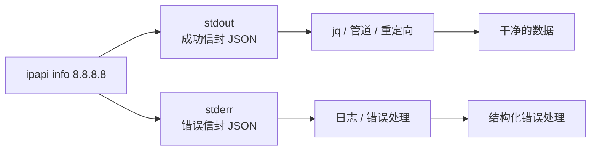
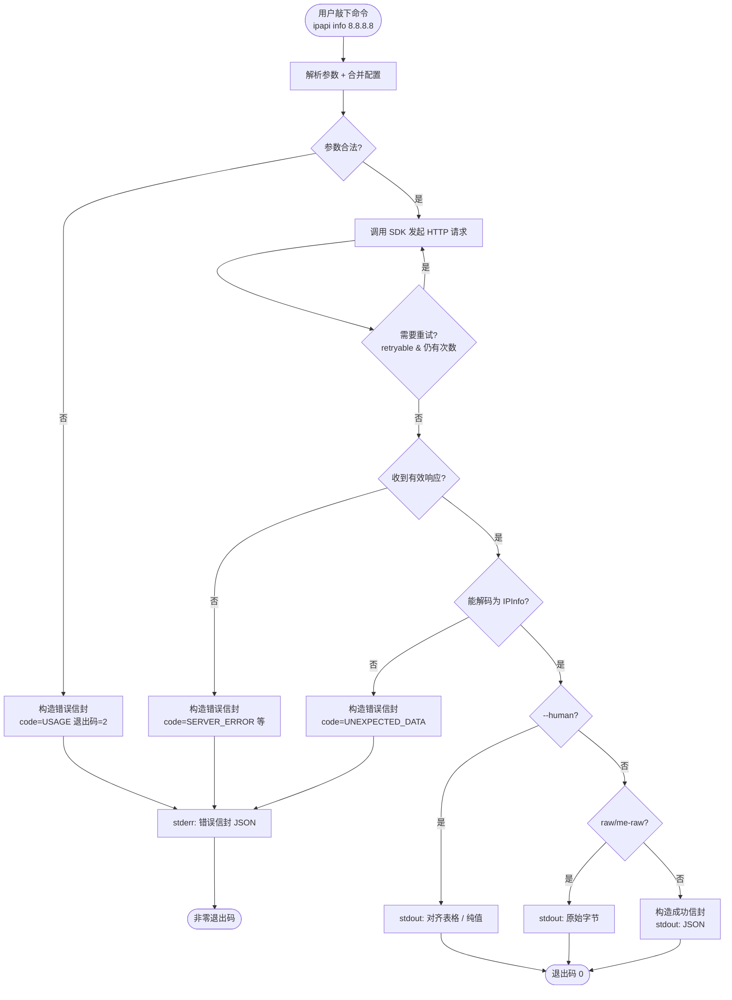

# 📤 输出格式

> ipapi CLI 的所有结构化输出都围绕一个核心设计：**JSON 信封（envelope）**。信封把"成功/失败""调用上下文""数据/错误""元信息"统一封装成可预测的形状，让脚本能用同一套解析逻辑处理任意子命令的结果。本页详解信封 schema、stdout/stderr 分离、`--human` 各命令的输出样式，以及 `raw` 为何刻意不包信封。

CLI 的输出可以被看作两层：**传输层**（信封本身，机器读）和**表示层**（信封里的 `data` 或 `error`，可以是 JSON、对齐表格、原始字节）。理解这两层的分离，是写出健壮的 `ipapi` 调用脚本的前提。

- 📨 **JSON 信封**：`ok` / `command` / `args` / `data` / `error` / `meta` 六大字段，成功与失败共用同一套外壳。
- 🧹 **stdout 与 stderr 分离**：成功走 stdout，错误走 stderr，stdout 永远保持纯净——管道、重定向、`jq` 都不会把错误信息误当数据。
- 🧍 **`--human` 双形态**：同一条命令，机器读 JSON 信封，人类读对齐表格或纯值。
- 📡 **`raw` 是例外**：直出上游原始字节，不装信封、不带 `meta`，为的是"原文落盘 / 原文喂下游解析器"。

::: tip 🚀 一行装好
```bash
go install github.com/cyberspacesec/ipapi.co-skills/cmd/ipapi@latest
```
:::

---

## 🗺 输出全景

不同子命令的输出形态可以归为三类。先看全貌，再逐个展开：

| 形态 | 适用命令 | 走 stdout | 走 stderr | 适合谁 |
|------|----------|:---------:|:---------:|--------|
| JSON 信封（成功） | `info` / `me` / `field` / `me-field` | ✅ | — | `jq`、脚本、CI |
| JSON 信封（错误） | 全部命令（出错时） | — | ✅ | 错误处理逻辑 |
| `--human` 对齐表格 | `info` / `me` + `--human` | ✅ | — | 终端肉眼 |
| `--human` 纯值一行 | `field` / `me-field` + `--human` | ✅ | — | shell 管道 |
| 原始字节 | `raw` / `me-raw` | ✅ | —（错误仍走 stderr 信封） | 落盘、下游解析器 |
| 本地文本 | `fields` / `version`（可选 `--json`） | ✅ | — | 终端、脚本 |

::: warning ⚠️ `raw` 出错时也走 stderr 信封
即使 `raw` / `me-raw` 成功时直出原始字节、不包信封，**失败时仍会向 stderr 输出标准错误信封**——这是为了让你能用同一套 stderr 解析逻辑捕获所有命令的错误。stdout 拿原文，stderr 拿结构化错误，互不干扰。
:::

---

## 📦 JSON 信封 Schema

无论成功还是失败，信封的外壳都是同一个结构。下面把六个顶层字段逐一拆开讲。

### 顶层字段

| 字段 | 类型 | 成功时 | 错误时 | 说明 |
|------|------|:------:|:------:|------|
| `ok` | bool | `true` | `false` | 唯一的成败开关，脚本里**先判这个**最省事 |
| `command` | string | ✅ | ✅ | 触发信封的子命令名，如 `"info"` / `"me"` / `"field"` |
| `args` | object | ✅ | ✅ | 调用入参快照，便于回溯"这次查的是什么" |
| `data` | object / array | ✅ | ❌（缺省） | 成功时的负载数据，错误时不出现 |
| `error` | object | ❌（缺省） | ✅ | 错误时的结构化错误信息，成功时不出现 |
| `meta` | object | ✅ | ❌（缺省） | 成功时的元信息（格式、耗时、时间戳） |

::: tip 📌 `data` 与 `error` 互斥
`ok: true` 时必有 `data`、无 `error`；`ok: false` 时必有 `error`、无 `data`、无 `meta`。这种互斥让解析逻辑非常简单——只看 `ok` 决定走哪条分支，不用同时处理两种情况。
:::

### `ok`

布尔值，整个信封的"门牌号"。脚本里最稳的第一步判断：

```bash
# 把 stdout 喂给 jq，只看 ok
ipapi info 8.8.8.8 | jq -e '.ok == true' > /dev/null && echo "成功" || echo "失败"
```

::: warning ⚠️ 别只看退出码就完事
退出码 `0` 和 `ok: true` 在当前实现里是绑定的，但脚本的健壮写法是**两者都看**：先看退出码区分"成功 / 用法错 / 业务错 / 内部错"大类，再用 `ok` / `error.code` 精确定位。把退出码当成"成功与否"的唯一判据，会在 `INTERNAL`（退出码 `70`）等边界情况下漏掉结构化错误信息。
:::

### `command`

字符串，标明这条信封来自哪条子命令。取值与子命令名一一对应：`info` / `me` / `field` / `me-field` / `raw` / `me-raw`。`fields` / `version` 在 `--json` 模式下也会带上对应 `command`。

它的用处是**调试与日志归因**：当你把多条 `ipapi` 调用的输出汇总到日志，`command` 能让你一眼分辨某行是哪条命令产生的。

### `args`

对象，调用入参的快照。不同子命令的 `args` 字段不同：

| 子命令 | `args` 字段 |
|--------|-------------|
| `info <ip>` | `{ "ip": "8.8.8.8", "format": "json" }` |
| `me` | `{ "format": "json" }` |
| `field <ip> <field>` | `{ "ip": "8.8.8.8", "field": "country" }` |
| `me-field <field>` | `{ "field": "asn" }` |
| `raw <ip> -f <fmt>` | `{ "ip": "8.8.8.8", "format": "csv" }` |

::: details 🔍 `args` 为什么记的是"解析后的入参"而不是"原始 argv"？
`args` 记录的是 CLI **解析后**的有效入参（已合并旗标、环境变量、配置文件），而非原始命令行字符串。这样即使你通过环境变量传了 `IPAPI_API_KEY`、通过配置文件设了 `base_url`，`args` 里也只保留与该子命令语义直接相关的核心入参（IP、字段名、格式），不被配置噪音污染。`api_key` 等敏感配置**不会**出现在 `args` 里。
:::

### `data`

成功时的负载数据，结构随子命令变化：

| 子命令 | `data` 内容 |
|--------|-------------|
| `info` / `me` | 完整 28 字段 `IPInfo` 结构 |
| `field` / `me-field` | `{ "field": "country", "value": "US" }` |

`info` / `me` 的 `data` 永远是完整的 28 个 `IPInfo` 字段（与 [`ipapi fields`](./command-fields) 列出的清单一一对应）。个别字段在某些 IP 上可能为空字符串或零值——那是上游数据缺失，不是 CLI 漏字段。

::: tip 🔗 字段清单与类型
28 个字段的完整定义、分组、JSON tag 见 SDK 数据模型页：[📦 数据模型 IPInfo](../api/models)。
:::

### `error`

错误时的结构化错误信息，对象类型，固定四个字段：

| 字段 | 类型 | 说明 |
|------|------|------|
| `code` | string | 机器友好的错误码，如 `INVALID_IP` / `RATE_LIMITED` |
| `message` | string | 人类可读的错误描述 |
| `sentinel` | string | SDK 侧对应的哨兵错误变量名，如 `ErrInvalidIP` |
| `retryable` | bool | 是否值得重试（限流、上游抖动为 `true`，确定性错误为 `false`） |

`code` 与退出码一一对应（见下方对照表），`sentinel` 则对应 `pkg/ipapi` SDK 里的哨兵错误变量——当你在 Go 程序里用 SDK 时，可以用 `errors.Is(err, ipapi.ErrInvalidIP)` 做同样的判断。

### `meta`

成功时的元信息，对象类型，三个字段：

| 字段 | 类型 | 说明 |
|------|------|------|
| `format` | string | 本次返回的格式，`info`/`me`/`field` 恒为 `"json"`；`raw` 不带 `meta` |
| `durationMs` | int | 端到端耗时（毫秒），含重试，不含本地序列化 |
| `retrievedAt` | string | 查询时刻，RFC3339 / ISO 8601 UTC，如 `2026-07-04T10:01:22Z` |

`meta.durationMs` 是性能观测的好抓手——批量查询时如果某些 IP 的 `durationMs` 异常偏高，多半是触发了重试（上游 5xx 后退避重发）。`meta.retrievedAt` 是查询时刻而非数据时效时刻，IP 地理信息本身可能有时效滞后。

::: details 🔍 错误信封为什么没有 `meta`？
错误信封刻意不带 `meta`：失败时没有"返回的格式"可言（没拿到有效响应体），耗时也往往没有参考价值（可能在中途就中断了）。把 `meta` 留给成功信封，能让"有 `meta` ⇔ 成功"成为一条隐含规则，脚本里 `if envelope.meta` 也能当作成功的旁证。
:::

---

## ✅ 成功信封

把上面六个字段拼起来，就是一条完整的成功信封。以 `ipapi info 8.8.8.8` 为例：

```bash
$ ipapi info 8.8.8.8
```

```json
{
  "ok": true,
  "command": "info",
  "args": { "ip": "8.8.8.8", "format": "json" },
  "data": {
    "ip": "8.8.8.8",
    "network": "8.8.8.0/23",
    "version": "IPv4",
    "hostname": "dns.google",
    "city": "Mountain View",
    "region": "California",
    "region_code": "CA",
    "country": "US",
    "country_name": "United States",
    "country_code": "US",
    "country_code_iso3": "USA",
    "country_capital": "Washington, D.C.",
    "country_tld": ".us",
    "continent_code": "NA",
    "in_eu": false,
    "postal": "94043",
    "latitude": 37.4056,
    "longitude": -122.0775,
    "latlong": "37.4056,-122.0775",
    "timezone": "America/Los_Angeles",
    "utc_offset": "-07:00",
    "asn": "AS15169",
    "org": "GOOGLE",
    "languages": "en",
    "country_calling_code": "+1",
    "currency": "USD",
    "currency_name": "Dollar",
    "country_area": 9629091,
    "country_population": 327167434
  },
  "meta": {
    "format": "json",
    "durationMs": 312,
    "retrievedAt": "2026-07-04T10:01:22Z"
  }
}
```

`field` 命令的成功信封更轻量——`data` 只装一个字段名和它的值：

```bash
$ ipapi field 8.8.8.8 country
```

```json
{
  "ok": true,
  "command": "field",
  "args": { "ip": "8.8.8.8", "field": "country" },
  "data": { "field": "country", "value": "US" },
  "meta": {
    "format": "json",
    "durationMs": 184,
    "retrievedAt": "2026-07-04T10:02:09Z"
  }
}
```

::: tip 📌 `field` 的 `data` 形状
注意 `field` / `me-field` 的 `data` 不是裸字符串，而是 `{ "field": ..., "value": ... }` 对象。这样设计是为了让信封结构在所有子命令里保持一致（`data` 永远是对象），同时 `field` 字段名也回显在输出里，省去脚本侧维护"我查的是哪个字段"的状态。
:::

---

## ❌ 错误信封

失败时，信封外壳不变，但 `data` / `meta` 缺省，换成 `error` 对象。错误信封**走 stderr**，stdout 保持纯净。

```bash
$ ipapi info 999.1.1.1
# stdout: 空
# stderr:
```

```json
{
  "ok": false,
  "command": "info",
  "args": { "ip": "999.1.1.1" },
  "error": {
    "code": "INVALID_IP",
    "message": "invalid IP address: 999.1.1.1",
    "sentinel": "ErrInvalidIP",
    "retryable": false
  }
}
```

### `code` 与退出码对照

`error.code` 与进程退出码一一对应，两者是同一信息的两种编码——退出码给 shell `$?`，`code` 给 JSON 解析器：

| 退出码 | `code` | `sentinel` | `retryable` | 含义 |
|:------:|--------|------------|:-----------:|------|
| `0` | — | — | — | 成功（无 `error` 字段） |
| `2` | USAGE | — | ❌ | 参数用法错误 |
| `3` | INVALID_IP | `ErrInvalidIP` | ❌ | 非法 IP 地址 |
| `4` | INVALID_FIELD | `ErrInvalidField` | ❌ | 不存在的字段名 |
| `5` | INVALID_FORMAT | `ErrInvalidFormat` | ❌ | 不支持的格式 |
| `6` | RATE_LIMITED | `ErrRateLimited` | ✅ | 触发限流 |
| `7` | RESERVED_IP | `ErrReservedIP` | ❌ | 私有/保留段 IP |
| `8` | NOT_FOUND | `ErrNotFound` | ✅ | 查不到该 IP |
| `9` | SERVER_ERROR | `ErrServerError` | ✅ | 上游 5xx |
| `10` | METHOD_NOT_ALLOWED | `ErrMethodNotAllowed` | ❌ | 请求方法不被允许 |
| `11` | INVALID_KEY | `ErrInvalidKey` | ❌ | API Key 无效 |
| `12` | UNEXPECTED_DATA | `ErrUnexpectedData` | ❌ | 响应体无法解码 |
| `70` | INTERNAL | — | ❌ | 内部异常 |

::: tip 🧠 退出码完整语义
退出码的完整说明、shell 判断范式见 [命令速查 · 退出码速查](./commands#退出码速查)，错误概念的系统性讲解见 [错误概念](../guide/error-concept)。
:::

---

## 🧹 stdout 与 stderr 分离

这是 ipapi CLI 输出设计里**最值得在脚本里利用**的一条规则：



- **成功**：成功信封写 stdout，stderr 为空。
- **失败**：错误信封写 stderr，stdout 为空。

这种分离带来的直接好处是：**stdout 永远可以放心喂给 `jq` / 管道 / 重定向**，不用担心错误信息混进去破坏 JSON 解析。

### 正确的重定向姿势

```bash
# 只拿数据，错误丢弃
ipapi info 8.8.8.8 2>/dev/null | jq '.data.country'

# 只看错误，数据丢弃
ipapi info 999.1.1.1 1>/dev/null

# 数据与错误分文件落盘
ipapi info 8.8.8.8 > result.json 2> error.json

# 同时保留 stdout 与 stderr（合并到同一流，注意顺序不保证）
ipapi info 8.8.8.8 2>&1 | tee full.log
```

::: warning ⚠️ `2>&1` 会破坏 stdout 的纯净
把 stderr 合并进 stdout（`2>&1`）后，失败时 stdout 流里会混入错误信封 JSON，`jq` 解析会报错。**只在确信会成功、或要完整审计日志时**才用 `2>&1`；正常数据提取请保持 stdout / stderr 分离。
:::

### 在脚本里同时拿到数据与错误

```bash
# 用文件描述符 3 捕获 stderr，stdout 仍走管道
{ err=$(ipapi info 8.8.8.8 2>&1 >&3 3>&-); } 3>&1
# 此处 $stdout 已流走，$err 里是 stderr 文本
```

更简单的写法是用退出码分流：

```bash
if ipapi info 8.8.8.8 > result.json 2> error.json; then
  echo "成功，数据见 result.json"
  jq '.data.country' result.json
else
  rc=$?
  echo "失败 退出码=$rc" >&2
  jq -r '.error | "\(.code): \(.message)"' error.json >&2
fi
```

---

## 🧍 `--human` 各命令输出样式

加 `-H` / `--human` 后，CLI 不再吐 JSON 信封，而是输出人类更易读的形态。**`--human` 输出不是稳定接口**——对齐宽度、字段顺序可能随版本调整，**不要**用 `grep`/`awk` 解析它做脚本逻辑。要结构化取值，用 JSON 信封 + `jq`，或 `field --human` 取纯值。

### `info` / `me --human`：对齐表格

把 28 字段铺成"字段名 + 值"的对齐表，终端肉眼一眼可读：

```bash
$ ipapi info 8.8.8.8 --human
```

```
ip          8.8.8.8
network     8.8.8.0/23
version     IPv4
hostname    dns.google
city        Mountain View
region      California
region_code CA
country     US
country_name United States
country_code US
country_code_iso3 USA
country_capital Washington, D.C.
country_tld .us
continent_code NA
in_eu       false
postal      94043
latitude    37.4056
longitude   -122.0775
latlong     37.4056,-122.0775
timezone    America/Los_Angeles
utc_offset  -07:00
asn         AS15169
org         GOOGLE
languages   en
country_calling_code +1
currency    USD
currency_name Dollar
country_area 9629091
country_population 327167434
```

### `field` / `me-field --human`：纯值一行

这是 `--human` 家族里**唯一适合脚本**的形态——只输出字段的值，不带字段名、不带引号、不带信封，天然适合 shell 管道：

```bash
$ ipapi field 8.8.8.8 country --human
US

$ ipapi field 8.8.8.8 asn --human
AS15169

$ ipapi field 8.8.8.8 latitude --human
37.4056

$ ipapi me-field asn --human
AS4809
```

::: tip 🎯 `field --human` 是 shell 取值的最优解
对比三种取 `country` 的方式：

```bash
# 方式 A：info + jq（能跑，但拉了 28 字段、多一次 jq 解析）
ipapi info 8.8.8.8 | jq -r '.data.country'

# 方式 B：field JSON 信封 + jq（拉得少，但仍要 jq）
ipapi field 8.8.8.8 country | jq -r '.data.value'

# 方式 C：field --human（最省，无 jq 依赖）
ipapi field 8.8.8.8 country --human
```

方式 C 流量最省、依赖最少、可读性最好，是 shell 脚本取单值的首选。详见 [field / me-field 命令](./command-field)。
:::

### `--human` 形态对照

| 命令 | 默认（JSON） | `--human` |
|------|--------------|-----------|
| `info <ip>` | JSON 信封（28 字段） | 对齐表格 |
| `me` | JSON 信封（28 字段） | 对齐表格 |
| `field <ip> <field>` | `{field,value}` 信封 | 纯值一行 |
| `me-field <field>` | `{field,value}` 信封 | 纯值一行 |
| `raw <ip> -f <fmt>` | 原始字节 | 不适用（`raw` 无 `--human`） |
| `fields` | 文本表格 | 不适用（本身即人类可读，可加 `--json`） |
| `version` | 文本 | 不适用（可加 `--json`） |

---

## 📡 `raw` 为何不包信封

`raw` / `me-raw` 是唯一"成功时不走信封"的子命令。它直出上游返回的原始字节（json/jsonp/xml/csv/yaml），**不附加 `ok`/`command`/`args`/`meta`**。这个例外是刻意设计，原因有三：

### 1. 保持原始格式的完整性

CSV、XML、YAML、JSONP 各有自己的解析器。如果给 CSV 套一层 JSON 信封，你拿到的是"装在 JSON 里的 CSV 字符串"，得先解 JSON 再解 CSV，徒增两层解析。`raw` 直出原文，让你能直接把 stdout 喂给对应格式的解析器：

```bash
# CSV 原文直接喂 awk
ipapi raw 8.8.8.8 -f csv | awk -F, '{print $1, $2}'

# YAML 原文直接喂 yq
ipapi raw 8.8.8.8 -f yaml | yq '.ip'

# JSONP 原文落盘，由前端 <script> 加载
ipapi raw 8.8.8.8 -f jsonp --callback handleIp > ip.js
```

### 2. 原文落盘即用

落盘后的文件应当能被对应工具直接打开。`raw` 出来的 `.csv` 能被 Excel 直接读、`.xml` 能被浏览器直接渲染、`.yaml` 能被 `kubectl` 直接吃——没有任何"剥信封"的中间步骤。

```bash
ipapi raw 8.8.8.8 -f csv  > 8.8.8.8.csv   # Excel 直开
ipapi raw 8.8.8.8 -f xml  > 8.8.8.8.xml   # 浏览器直开
ipapi raw 8.8.8.8 -f yaml > 8.8.8.8.yaml  # yq 直读
ipapi raw 8.8.8.8 -f jsonp --callback cb > 8.8.8.8.js  # <script> 直加载
```

### 3. 错误仍走信封，保持可观测

`raw` 成功时不包信封，但**失败时仍向 stderr 输出标准错误信封**。这意味着你失去的不是可观测性，只是成功时的"信封噪音"：

```bash
$ ipapi raw 999.1.1.1 -f csv
# stdout: 空
# stderr:
```

```json
{
  "ok": false,
  "command": "raw",
  "args": { "ip": "999.1.1.1", "format": "csv" },
  "error": {
    "code": "INVALID_IP",
    "message": "invalid IP address: 999.1.1.1",
    "sentinel": "ErrInvalidIP",
    "retryable": false
  }
}
```

::: tip 📌 `raw` 的 `args.format` 是真实格式
与 `info` / `me` 的 `args.format` 恒为 `"json"` 不同，`raw` / `me-raw` 的 `args.format` 反映你实际请求的格式（`csv` / `xml` / `yaml` / `jsonp` / `json`），因为 `raw` 真的会按这个格式向上游请求。这也意味着错误信封里的 `args.format` 能帮你确认"我以为我请求的是 CSV，是不是哪里传错了"。
:::

### 信封 vs 原始字节：怎么选

| 你的需求 | 选 |
|----------|----|
| 终端看全貌 | `info --human` / `me --human` |
| `jq` 取字段 | `info` / `me`（JSON 信封） |
| shell 取单值 | `field --human` / `me-field --human` |
| 落盘给 Excel / 浏览器 / yq | `raw -f csv/xml/yaml` |
| 前端 `<script>` JSONP | `raw -f jsonp --callback <name>` |
| 想要原文 + 强类型结构都要 | `info`（结构）+ `raw -f json`（原文）各跑一次 |

::: warning ⚠️ `raw -f json` 与 `info` 的区别
两者都"看起来是 JSON"，但完全不同：
- `info` 输出**信封 + 28 字段强类型 `IPInfo`**，带 `meta`，stdout 可直接 `jq`。
- `raw -f json` 输出**上游原始 JSON 字节**，无信封、无 `meta`、字段顺序与命名以上游为准（可能含 CLI 不暴露的额外字段或缺失某些字段）。

要稳定的结构化数据用 `info`；要原汁原味的上游响应用 `raw -f json`。
:::

---

## 🔄 信封生命周期

一条命令从"回车"到"输出"，信封是怎么诞生并决定走 stdout 还是 stderr 的？下面这张图把决策路径画清楚：



::: details 🔍 错误信封的构造时机
错误信封在四个时机被构造：参数校验失败（USAGE）、HTTP 请求最终失败（SERVER_ERROR / RATE_LIMITED / NOT_FOUND 等）、响应解码失败（UNEXPECTED_DATA）、内部 panic 兜底（INTERNAL）。前两类可能经历重试，后两类是确定性的——这解释了为什么 `meta` 只在成功信封里出现：失败路径上"耗时"的意义不稳定。
:::

---

## 🧪 脚本里的实战范式

### 范式一：只关心数据，错误直接抛

```bash
# 用 set -e 风格：失败即退出，错误信息走 stderr 自然显示
ipapi info 8.8.8.8 | jq '.data.country'
```

### 范式二：成功取数据，失败做兜底

```bash
if result=$(ipapi field 8.8.8.8 country --human 2>/dev/null); then
  echo "国家码: $result"
else
  echo "查询失败，用默认值 US" >&2
  result=US
fi
```

### 范式三：结构化错误处理

```bash
ipapi info 8.8.8.8 > out.json 2> err.json
rc=$?
if [ $rc -eq 0 ]; then
  jq '.data' out.json
else
  # 从错误信封里取 code 与 retryable
  code=$(jq -r '.error.code' err.json)
  retry=$(jq -r '.error.retryable' err.json)
  echo "错误码=$code 可重试=$retry" >&2
  if [ "$retry" = "true" ]; then
    echo "稍后重试..." >&2
  fi
fi
```

### 范式四：批量查询只收集成功项

```bash
for ip in 8.8.8.8 999.1.1.1 1.1.1.1 10.0.0.1; do
  ipapi info "$ip" 2>/dev/null | jq -r --arg ip "$ip" \
    '"\($ip)\t\(.data.country)\t\(.data.org)"'
done
# 失败的 IP 自动被 2>/dev/null 吞掉，stdout 只剩成功行
```

---

## ❓ 常见问题

::: details 为什么不直接输出裸数据，要套一层信封？
裸数据（比如 `info` 直接吐 `IPInfo` 的 JSON）有两个问题：一是无法区分"成功但 `data` 为空"和"失败"，二是丢失了调用上下文（查的是哪个 IP、哪个命令、耗时多少）。信封用 `ok` 显式表达成败、用 `args`/`command`/`meta` 携带上下文，让每次调用的输出都是自描述的——日志里捞一行就能复原"谁、什么时候、查了什么、结果如何"。
:::

::: details `--human` 输出能 grep 吗？
能 grep 看一眼，但**别**用 grep/awk 做脚本逻辑。`--human` 的对齐宽度、字段顺序可能随版本调整，不是稳定接口。要结构化取值，用 JSON 信封 + `jq`，或直接 `ipapi field <ip> <field> --human` 取纯值——后者既稳定又省流量。
:::

::: details 错误信封为什么走 stderr 而不是 stdout？
为了让 stdout 保持纯净。如果错误信封也走 stdout，失败时 `ipapi info 8.8.8.8 | jq` 会让 `jq` 去解析错误信封，要么误把 `ok: false` 当数据，要么因为 `data` 缺失而报错。stderr 分离后，stdout 永远只含成功数据，`jq` / 管道 / 重定向都能放心使用；错误则在脚本侧用退出码或 `2>` 显式捕获。
:::

::: details `meta.durationMs` 包含重试耗时吗？
包含。`durationMs` 是端到端耗时，从发起第一次请求到最终拿到有效响应（含中间所有重试与退避）。如果你看到某次查询的 `durationMs` 远高于均值，多半是触发了重试——可以结合 `--retries` 与上游限流策略排查。
:::

::: details `raw` 失败时 stdout 真的完全为空吗？
是的。`raw` / `me-raw` 在失败时不向 stdout 写任何字节——既不写半截原文，也不写信封。错误信息完整地走 stderr 信封。所以 `ipapi raw 8.8.8.8 -f csv > out.csv` 失败时，`out.csv` 会是空文件，不会残留半截 CSV 污染下游解析。
:::

---

## 下一步

- 🗂️ [命令速查](./commands) —— 全部 9 个子命令与全局旗标的一页式速查表
- 🚀 [快速开始](./quickstart) —— 五分钟跑通第一条命令
- 🔍 [info / me 命令](./command-info) —— JSON 信封的典型用法
- 🎯 [field / me-field 命令](./command-field) —— `--human` 纯值输出的最佳实践
- 📡 [raw / me-raw 命令](./command-raw) —— 原始字节输出的设计细节
- 🧭 [fields 命令](./command-fields) —— 28 个可查字段清单
- ⚙️ [配置方式](./config) —— 旗标/环境变量/配置文件的完整说明
- 📦 [数据模型 IPInfo](../api/models) —— `data` 字段里 28 个字段的结构定义
- 🍳 [实战手册](../cookbook/) —— CLI 与 SDK 的真实场景用法

## 对应 SDK 方法

ipapi CLI 是 `pkg/ipapi` SDK 的命令行封装。本页讲解的信封结构是 CLI 层的封装产物——SDK 本身返回的是强类型 `*IPInfo` 与 `error` 哨兵，并不直接产出 JSON 信封。信封的构造、stdout/stderr 分离、退出码映射都在 CLI 层完成。下列 SDK 方法对应会产出本页所述信封的子命令：

| 子命令 | SDK 方法 | 文档 |
|--------|----------|------|
| `info <ip>` | `Client.GetIPInfo(ctx, ip, "json")` | [/api/get-ip-info](../api/get-ip-info) |
| `me` | `Client.GetClientIPInfo(ctx, "json")` | [/api/get-client-ip-info](../api/get-client-ip-info) |
| `field <ip> <field>` | `Client.GetField(ctx, ip, field)` | [/api/get-field](../api/get-field) |
| `me-field <field>` | `Client.GetClientField(ctx, field)` | [/api/get-client-field](../api/get-client-field) |
| `raw <ip> -f <fmt>` | `Client.GetIPInfoRaw(ctx, ip, fmt)` | [/api/get-ip-info-raw](../api/get-ip-info-raw) |
| `me-raw -f <fmt>` | `Client.GetClientIPInfoRaw(ctx, fmt)` | [/api/get-client-ip-info-raw](../api/get-client-ip-info-raw) |

::: tip 🔗 源码
信封结构、stdout/stderr 分离与退出码映射逻辑见仓库 [`cmd/ipapi/`](https://github.com/cyberspacesec/ipapi.co-skills/blob/main/cmd/ipapi/) 目录；`IPInfo` 与 `APIError` 结构体定义见 [`pkg/ipapi/models.go`](https://github.com/cyberspacesec/ipapi.co-skills/blob/main/pkg/ipapi/models.go)。
:::
