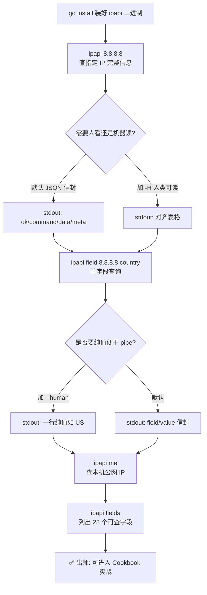
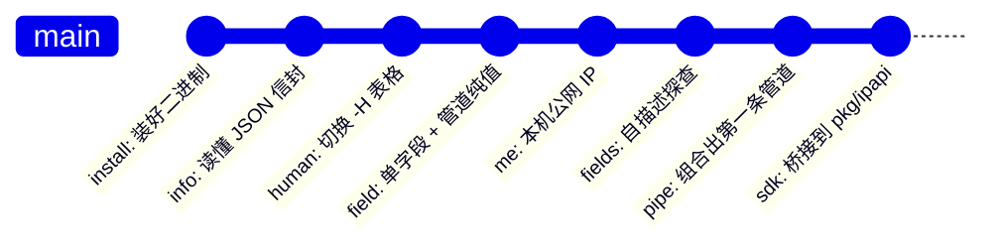
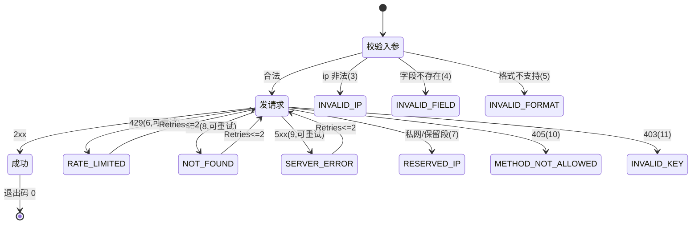
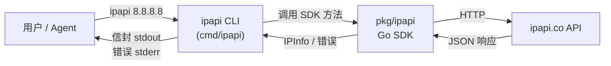

# 🚀 快速开始

> 5 分钟教程：从安装到第一次 IP 查询，再到字段级提取与自描述探查。CLI 默认输出 JSON 信封，退出码稳定可枚举，既适合人看，也适合 AI Agent 调用。

ipapi 是一个基于 [ipapi.co](https://ipapi.co) 的命令行 IP 地理位置查询工具。它背后是零运行时依赖的 Go SDK `pkg/ipapi`，CLI 只是一层薄壳。本指南假设你已对命令行有基本了解，无需 Go 环境——`go install` 一次即装即用。

::: tip 💡 免费额度即可跑通本指南
ipapi.co 提供免费额度（约 1000 次/天，无需注册）。本指南所有示例均可在无 API Key 的情况下运行。生产环境或更高频次请参考 [配置方式](./config) 配置 API Key。
:::

---

## 🧭 这 5 分钟你会学到什么

按顺序完成下面 5 步，你就能覆盖 ipapi 90% 的日常用法：

1. **安装** —— 用 `go install` 一行装好二进制
2. **`ipapi 8.8.8.8`** —— 查指定 IP 完整信息，理解 JSON 信封结构
3. **`ipapi 8.8.8.8 -H`** —— 切换人类可读表格输出
4. **`ipapi field 8.8.8.8 country`** —— 字段级查询，`--human` 直出纯值便于管道
5. **`ipapi me` 与 `ipapi fields`** —— 查本机 IP 与自描述字段探查

下面这张流程图展示了从"装好"到"查到"的完整链路，每一步都对应后文的一个小节。



学完本指南后，你的"能力树"会沿这条 gitGraph 演进——每个 commit 对应一个可复用的技能点：



::: tip 🧭 三张图各看一眼
- **flowchart**：第一次跑通的"动作链"，按顺序照做即可
- **gitGraph**：能力沉淀的"技能树"，每一步都是可复用资产
- 下文 [CLI 与 SDK 的关系](#-cli-与-sdk-的关系) 还有一张 **LR 流程图**，展示请求如何穿过 CLI→SDK→API
:::

---

## 1️⃣ 安装

ipapi 是标准的 Go 二进制，用 `go install` 即可安装到 `$GOPATH/bin`（通常是 `~/go/bin`）。

```bash
go install github.com/cyberspacesec/ipapi.co-skills/cmd/ipapi@latest
```

确保 `$GOPATH/bin` 在你的 `PATH` 中：

```bash
# Linux / macOS（写入 ~/.bashrc 或 ~/.zshrc）
export PATH=$PATH:$(go env GOPATH)/bin

# 验证
ipapi version
```

输出示例：

```json
{
  "ok": true,
  "command": "version",
  "data": {
    "version": "0.1.0",
    "commit": "abc1234",
    "builtAt": "2026-07-04T01:23:45Z"
  }
}
```

::: details 🐟 没装 Go？还有别的途径
`go install` 需要 Go 1.23.4+。如果你不想装 Go，可以：

- 从 [GitHub Releases](https://github.com/cyberspacesec/ipapi.co-skills/releases) 下载对应平台的预编译二进制，放进 `PATH` 即可。
- 用 Docker：`docker run --rm cyberspacesec/ipapi:latest 8.8.8.8`（如有发布镜像）。

二进制本身零运行时依赖，下载即用。
:::

::: warning ⚠️ 关于 API Key
免费额度无需 Key。但如果你设置了 `IPAPI_API_KEY` 环境变量或写入 `~/.ipapi.json`，CLI 会自动带上。本指南的示例不配 Key 也能跑。
:::

---

## 2️⃣ 第一次查询：`ipapi 8.8.8.8`

`info` 是最常用的子命令，查指定 IP 的完整信息。`info` 是默认子命令，可以省略——直接写 `ipapi 8.8.8.8` 等价于 `ipapi info 8.8.8.8`。

```bash
ipapi 8.8.8.8
```

输出示例（已截断，完整响应含 28 个字段）：

```json
{
  "ok": true,
  "command": "info",
  "args": {
    "ip": "8.8.8.8",
    "format": "json"
  },
  "data": {
    "ip": "8.8.8.8",
    "network": "8.8.8.0/24",
    "version": "IPv4",
    "city": "Mountain View",
    "region": "California",
    "region_code": "CA",
    "country": "US",
    "country_name": "United States",
    "country_code": "US",
    "country_code_iso3": "USA",
    "continent_code": "NA",
    "postal": "94043",
    "latitude": 37.42301,
    "longitude": -122.083352,
    "latlong": "37.42301,-122.083352",
    "timezone": "America/Los_Angeles",
    "utc_offset": "-0700",
    "asn": "AS15169",
    "org": "Google LLC",
    "hostname": "dns.google",
    "country_calling_code": "1",
    "currency": "USD",
    "currency_name": "Dollar",
    "languages": "en",
    "country_area": 9629091,
    "country_population": 327167434,
    "in_eu": false
  },
  "meta": {
    "format": "json",
    "durationMs": 312,
    "retrievedAt": "2026-07-04T10:01:22Z"
  }
}
```

### 读懂这个信封

ipapi 的所有结构化输出都遵循同一个"信封"模式，这是它对 AI Agent 友好的核心：

| 字段 | 含义 |
|------|------|
| `ok` | 布尔，成功为 `true`，失败为 `false` |
| `command` | 触发的子命令名，这里 `"info"` |
| `args` | 本次调用的入参，便于回放与审计 |
| `data` | 业务数据，`info` 命令下是完整 IPInfo（28 字段） |
| `meta` | 元信息：格式、耗时、 retrieval 时间戳 |

::: tip 🤖 为什么是信封而不是裸数据？
信封让 Agent 无需读文档即可判断成败（`ok`）、定位来源（`command`）、审计入参（`args`）、评估性能（`meta.durationMs`）。配合稳定退出码，Agent 用一次调用就能拿到结构化的"调用回执"。
:::

::: details 📦 想喂给 jq？这样取值
信封设计天然兼容 `jq`：

```bash
# 只取国家代码
ipapi 8.8.8.8 | jq -r '.data.country'
# US

# 只取 ASN 与组织
ipapi 8.8.8.8 | jq -r '.data | "\(.asn) \(.org)"'
# AS15169 Google LLC

# 取耗时
ipapi 8.8.8.8 | jq -r '.meta.durationMs'
# 312
```
:::

---

## 3️⃣ 人类可读模式：`ipapi 8.8.8.8 -H`

JSON 信封适合机器读，但人眼扫起来费劲。加 `-H` / `--human` 旗标，ipapi 会输出对齐的表格：

```bash
ipapi 8.8.8.8 -H
```

输出示例：

```text
IP            8.8.8.8
Network       8.8.8.0/24
Version       IPv4
Hostname      dns.google
City          Mountain View
Region        California (CA)
Country       United States (US)
Continent     NA
Postal        94043
Latitude      37.42301
Longitude     -122.083352
Timezone      America/Los_Angeles
UTC Offset    -0700
ASN           AS15169
Org           Google LLC
Currency      USD (Dollar)
Calling Code  +1
Languages     en
In EU         false
```

`-H` 是全局持久旗标，对 `info` / `field` / `me-field` 等命令都生效。它的作用是把"结构化信封"折叠成"键值对齐表"，方便一眼扫完。

::: tip 🎛️ JSON 与人类可读如何切换
- **默认**：JSON 信封（适合脚本、Agent、管道）
- **`-H` / `--human`**：人类可读（适合终端查看、调试）

两种模式互斥，`-H` 优先级高于默认 JSON。`raw` 命令是另一条路径——它直出原始字节，不走信封，详见 [raw 命令](./command-raw)。
:::

---

## 4️⃣ 字段级查询：`ipapi field`

很多场景你只想要一个字段——比如做国家分流只要 `country`，做 ASN 黑名单只要 `asn`。`field` 子命令只查一个字段，比 `info` 更快、输出更小。

```bash
ipapi field 8.8.8.8 country
```

默认输出（JSON 信封包裹的 `{field, value}`）：

```json
{
  "ok": true,
  "command": "field",
  "args": {
    "ip": "8.8.8.8",
    "field": "country"
  },
  "data": {
    "field": "country",
    "value": "US"
  },
  "meta": {
    "format": "json",
    "durationMs": 187,
    "retrievedAt": "2026-07-04T10:02:11Z"
  }
}
```

### `--human` 直出纯值

加 `-H`，`field` 命令会丢掉所有信封，**只输出字段值一行**——这是专为 shell 管道设计的：

```bash
ipapi field 8.8.8.8 country --human
```

输出示例：

```text
US
```

这样就能直接喂进变量或下游命令：

```bash
# 取国家代码存进变量
COUNTRY=$(ipapi field 8.8.8.8 country --human)
echo "查询到国家: $COUNTRY"
# 查询到国家: US

# 取 ASN
ipapi field 8.8.8.8 asn --human
# AS15169

# 取经纬度
ipapi field 8.8.8.8 latlong --human
# 37.42301,-122.083352

# 取组织
ipapi field 8.8.8.8 org --human
# Google LLC
```

::: warning ⚠️ 字段名必须是 28 个可查字段之一
`field` 命令会先校验字段名。传了不存在的字段会返回退出码 `4`（`INVALID_FIELD`），不会发请求。完整字段表见 [`ipapi fields`](#5️⃣-自描述探查-ipapi-fields) 或 [字段详解](../reference/fields/ip)。
:::

下面这张状态图从"失败视角"补全前文的 happy path——展示了命令在出错时如何落到稳定退出码，以及哪些错误可重试：



::: info 🔁 重试边界
SDK 的 `Retries` 默认 2、上限 3 次，**只对网络错误与 5xx（含 404 NOT_FOUND）重试**；4xx 中的 429 RATE_LIMITED 虽标记为可重试但不会自动重试，需调用方处理。详见 [退出码表](./exit-codes) 与 [错误处理](../api/errors)。
:::

---

## 5️⃣ 本机查询与字段探查

### 查本机公网 IP：`ipapi me`

`me` 子命令查询当前出口 IP 的完整信息，等价于 `info` 但不需要传 IP：

```bash
ipapi me
```

输出与 `ipapi 8.8.8.8` 结构一致，`data` 里是本机 IP 的 28 个字段。`args` 里不会有 `ip`，`command` 为 `"me"`。

::: tip 🪞 `me` 的典型场景
- 在 NAT/代理后想知道自己的公网 IP
- 验证本机出口 IP 是否走了预期的 VPN/代理
- 配合 `--human` 一行取本机公网 IP：
  ```bash
  ipapi me-field ip --human
  # 203.0.113.42
  ```
  `me-field` 是 `field` 的本机版，同样支持 `--human` 直出纯值。
:::

### 自描述探查：`ipapi fields`

不知道有哪些字段可查？`fields` 命令列出全部 28 个可查字段，并按语义分组。**这个命令纯本地、不发起网络请求**，是 Agent "先探查再查询"的关键。

```bash
ipapi fields
```

输出示例（人类可读分组视图）：

```text
identity
  ip, network, version, hostname

geo
  city, region, region_code, country, country_name, country_code,
  country_code_iso3, country_capital, country_tld, continent_code,
  in_eu, postal, latitude, longitude, latlong

time
  timezone, utc_offset

network
  asn, org

culture
  languages, country_calling_code

economy
  currency, currency_name

stats
  country_area, country_population
```

加 `--json` 可拿到结构化输出，便于 Agent 解析后程序化选字段：

```bash
ipapi fields --json
```

```json
{
  "ok": true,
  "command": "fields",
  "data": {
    "identity": ["ip", "network", "version", "hostname"],
    "geo": ["city", "region", "region_code", "country", "country_name", "country_code", "country_code_iso3", "country_capital", "country_tld", "continent_code", "in_eu", "postal", "latitude", "longitude", "latlong"],
    "time": ["timezone", "utc_offset"],
    "network": ["asn", "org"],
    "culture": ["languages", "country_calling_code"],
    "economy": ["currency", "currency_name"],
    "stats": ["country_area", "country_population"]
  },
  "meta": {
    "format": "json",
    "durationMs": 0,
    "retrievedAt": "2026-07-04T10:03:00Z"
  }
}
```

按组过滤：

```bash
# 只看 geo 组
ipapi fields --group geo
# city, region, region_code, country, country_name, country_code,
# country_code_iso3, country_capital, country_tld, continent_code,
# in_eu, postal, latitude, longitude, latlong

# 只看 network 组
ipapi fields --group network
# asn, org
```

::: tip 🤖 Agent 的"先探查再查询"范式
`fields` 是为 Agent 设计的自描述入口。Agent 拿到字段表后，可以根据任务语义选字段——比如要做货币展示就查 `economy` 组的 `currency`，要做时区问候就查 `time` 组的 `timezone`。配合 [Agent 接入指南](./agent) 可构建稳定的工具调用链。
:::

---

## 🎯 出师：组合你的第一条管道

5 分钟到此，你已经掌握了 `info` / `field` / `me` / `fields` 四大主力命令。把它们组合起来，就能干真活：

```bash
# 取本机公网 IP 所在国家与城市，人类可读
ipapi me -H | grep -E "Country|City"

# 查一批 IP 的国家，输出 CSV
for ip in 8.8.8.8 1.1.1.1 208.67.222.222; do
  echo "$ip,$(ipapi field $ip country --human)"
done

# 用 jq 从 info 信封里抽 ASN 和组织
ipapi 8.8.8.8 | jq -r '.data | "\(.asn)\t\(.org)"'
```

::: details 🧪 想试更多组合？
进入 [Cookbook 食谱](../cookbook/) —— 里面有 20+ 个真实场景：按国家分流、ASN 黑名单、时区问候、货币展示、日志富化、CDN 边缘检测……每个都带可运行命令与输出。
:::

---

## 🧩 CLI 与 SDK 的关系

ipapi CLI 不是独立实现——它是 `pkg/ipapi` Go SDK 的一层薄壳。每个子命令都对应 SDK 的一个方法，信封结构、字段表、错误码在 CLI 与 SDK 之间完全一致。



这意味着：

- 在终端用 `ipapi` 验证逻辑，再在 Go 程序里用 SDK 复刻，行为完全一致
- 信封、字段、退出码与 SDK 错误类型一一对应，便于跨语言/跨形式迁移
- 想嵌入自己的 Go 程序？直接 `go get` 引入 SDK，详见 [CLI 与 SDK 桥接](./sdk-bridge)

---

## 📚 下一步

- **[安装详解](./install)** —— 多平台安装、预编译二进制、Docker 用法
- **[配置方式](./config)** —— 旗标 / 环境变量 / `~/.ipapi.json` / 默认值的四级优先级
- **[info 命令](./command-info)** —— `info` 子命令的完整旗标与输出细节
- **[field 命令](./command-field)** —— 字段级查询的所有用法
- **[raw 命令](./command-raw)** —— 五种格式（json/jsonp/xml/csv/yaml）直出原始字节
- **[退出码表](./exit-codes)** —— 0-12 与 70 的完整语义，脚本分支依据
- **[Agent 接入指南](./agent)** —— 把 ipapi 作为 AI Agent 工具的最佳实践
- **[Cookbook 食谱](../cookbook/)** —— 20+ 真实场景的命令组合实战

---

## 对应 SDK 方法

本指南涉及的 CLI 命令与 `pkg/ipapi` SDK 方法的对应关系：

| CLI 命令 | SDK 方法 | 文档 |
|----------|----------|------|
| `ipapi info <ip>` / `ipapi <ip>` | `Client.GetIPInfo(ctx, ip, format)` | [/api/get-ip-info](../api/get-ip-info) |
| `ipapi me` | `Client.GetClientIPInfo(ctx, format)` | [/api/get-client-ip-info](../api/get-client-ip-info) |
| `ipapi field <ip> <field>` | `Client.GetField(ctx, ip, field)` | [/api/get-field](../api/get-field) |
| `ipapi me-field <field>` | `Client.GetClientField(ctx, field)` | [/api/get-client-field](../api/get-client-field) |
| `ipapi raw <ip> -f <fmt>` | `Client.GetIPInfoRaw(ctx, ip, format)` | [/api/get-ip-info-raw](../api/get-ip-info-raw) |
| `ipapi me-raw -f <fmt>` | `Client.GetClientIPInfoRaw(ctx, format)` | [/api/get-client-ip-info-raw](../api/get-client-ip-info-raw) |
| `ipapi fields` | `ValidFields()` | [/api/fields](../api/fields) |

源码入口：[cmd/ipapi](https://github.com/cyberspacesec/ipapi.co-skills/blob/main/cmd/ipapi) · SDK 实现：[pkg/ipapi/api.go](https://github.com/cyberspacesec/ipapi.co-skills/blob/main/pkg/ipapi/api.go)
