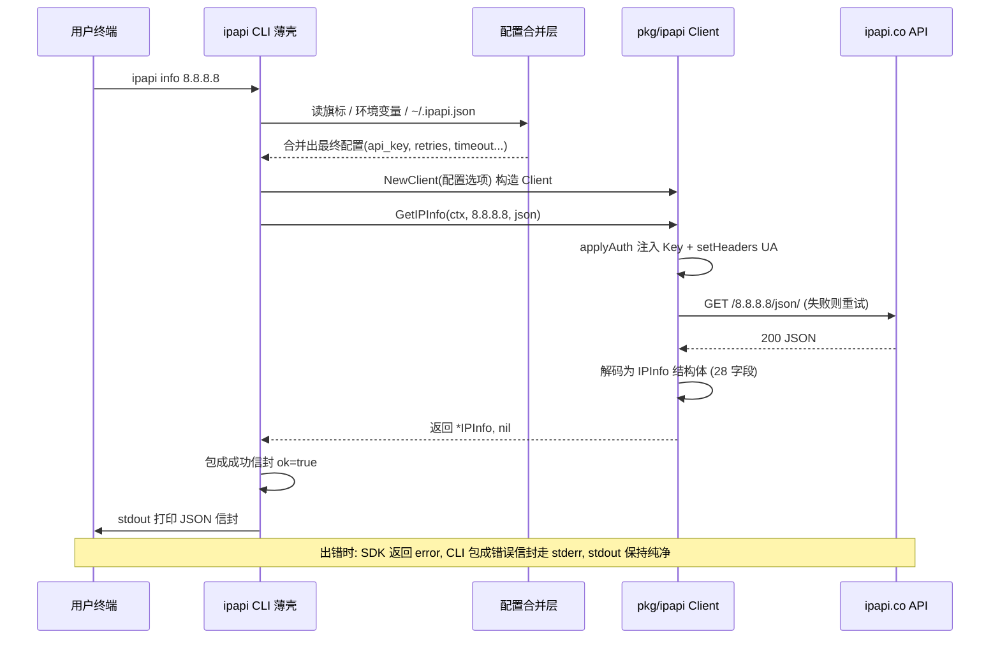
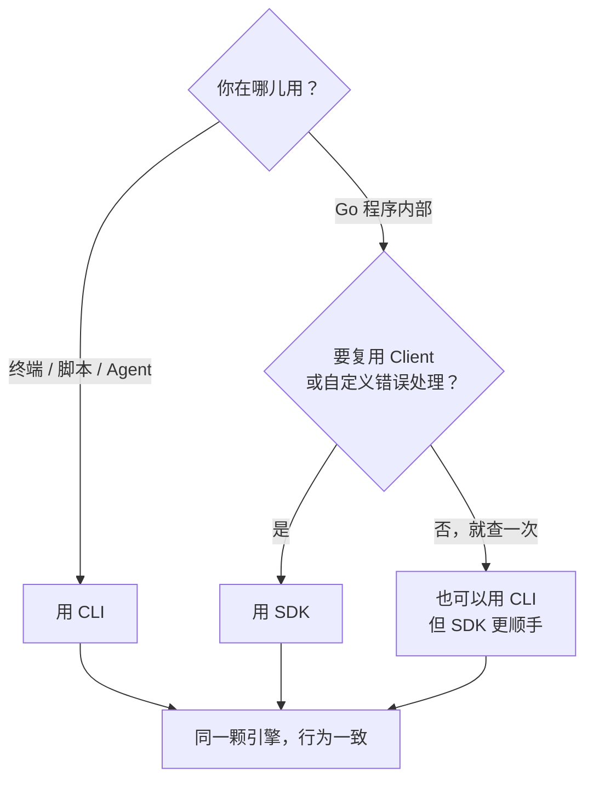
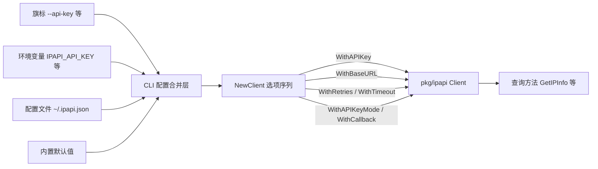
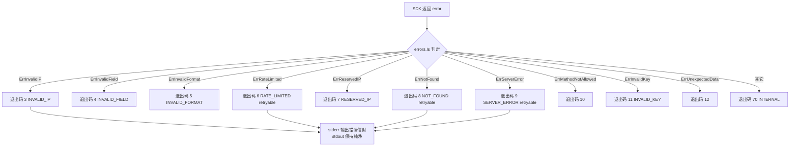

# 🌉 CLI 与 SDK 关系

> `ipapi` CLI 不是"另一套实现"，而是 `pkg/ipapi` SDK 的一层薄壳——100% 复用同一个 `Client`、同一套重试与错误体系，绝不重写任何查询逻辑。本页讲清两者如何分工、何时该用哪个，以及每条 CLI 子命令背后对应哪个 SDK 方法。

## 🧠 一句话定位

`ipapi` CLI 把 `pkg/ipapi` SDK 包成了命令行工具：你在终端敲的那一下，内部跑的就是 SDK 里那个 `Client`。两条入口、同一颗引擎——选哪条只取决于你"在哪个环境里用它"，而不是"它俩谁更强"。

- 🖥 **CLI**：给终端、shell 脚本、AI Agent 用。装一个二进制就能查 IP，默认吐 JSON 信封，退出码精确到错误类型，适合"一行命令拿结果"。
- 📦 **SDK**：给 Go 程序用。`import "github.com/cyberspacesec/ipapi.co-skills/pkg/ipapi"`，复用同一个 `Client` 实例、自定义错误处理、和你的业务代码共享 context 与 HTTP 客户端。

::: tip 🚀 两条入口，一份安装
```bash
# CLI 用户
go install github.com/cyberspacesec/ipapi.co-skills/cmd/ipapi@latest

# SDK 用户（go get 即可，不需要装 CLI）
go get github.com/cyberspacesec/ipapi.co-skills/pkg/ipapi
```
:::

---

## 🏗️ 薄壳到底"薄"在哪

CLI 层（`cmd/ipapi/`）只做四件事，**不碰任何 HTTP / 解码 / 重试逻辑**：

| 职责 | 由谁负责 | 说明 |
|------|----------|------|
| 参数解析 | CLI（cobra） | 子命令、位置参数、旗标、补全脚本 |
| 配置合并 | CLI（config 层） | 旗标 > 环境变量 > `~/.ipapi.json` > 默认值，合并后喂给 `NewClient` |
| 信封封装 | CLI（output 层） | 把 SDK 返回的 `*IPInfo` / `string` / `[]byte` 包进 `{ok, command, args, data, meta}` |
| 退出码映射 | CLI（exitcode 层） | 把 SDK 的哨兵错误映射成 `3/4/5/6/7/8/9/11/12/70` 等退出码 |

真正的"干活"——拼 URL、注入 API Key、发起 HTTP、限流、重试、解码 `IPInfo`、识别 `ErrRateLimited` / `ErrNotFound`——**全部在 SDK 里**。CLI 一行没重写，也无意重写。这意味着：

- 🐛 **行为一致性有保证**：CLI 的"重试 2 次、间隔 500ms、仅重试网络错误/5xx"和 SDK 完全一样，因为它们跑的是同一段代码。
- 📈 **能力同步**：SDK 新加一个字段校验或一种错误哨兵，CLI 立刻获得，无需"等 CLI 那边跟进"。
- 🧩 **可复现性**：在 CLI 里复现的怪行为，把对应 SDK 方法拎出来在 Go 里跑一遍，必然复现；反之亦然。

::: details 🔍 为什么不"在 CLI 里直接发 HTTP"？
让 CLI 100% 走 SDK，是为了"单一事实来源"。如果 CLI 自搞一套 HTTP 拼接，就会出现"CLI 能查、SDK 查不到"或"SDK 重试 2 次、CLI 重试 0 次"这种割裂。薄壳设计把这种风险压到零——任何修复只改一处。源码上，CLI 命令文件（[`cmd/ipapi/`](https://github.com/cyberspacesec/ipapi.co-skills/blob/main/cmd/ipapi/)）里你看不到任何 `http.Get`，全是 `client.GetIPInfo(...)` 这种调用。
:::

---

## 🔗 调用链：从回车到 stdout

下面这张时序图展示了 `ipapi info 8.8.8.8` 这一条命令从你按下回车，到 stdout 打印出 JSON 信封的完整链路。注意中间那一段"`pkg/ipapi` SDK"——它就是 SDK 的 `Client.GetIPInfo`，CLI 把活儿原样转交给了它。



::: tip 🎯 关键观察
图里"SDK"那一栏做的全部事情——`applyAuth`、`setHeaders`、`doRequest`、重试、解码——和你直接写 Go 代码 `client.GetIPInfo(ctx, ip, "json")` 跑的是**同一个函数**。CLI 只是把它的返回值换个"壳"打印出来。
:::

---

## 🤔 何时用 CLI，何时用 SDK

这是本页最实用的一节。下面这张对照表按"你的场景"给出推荐入口。

| 场景 | 推荐 | 理由 |
|------|:----:|------|
| 终端随手查一个 IP | 🖥 CLI | `ipapi info 8.8.8.8 --human` 一行出表，零样板 |
| Shell 脚本里取单值喂管道 | 🖥 CLI | `ipapi field 8.8.8.8 country --human` 直出 `US`，`$(...)` 即取 |
| AI Agent / LLM 工具调用 | 🖥 CLI | 默认 JSON 信封、退出码语义清晰、stdout 纯净易解析 |
| CI 流水线批量查 IP 落盘 | 🖥 CLI | 配合 `--api-key` 环境变量，`for ip in ...; do ipapi info "$ip"; done` |
| 一次性给 XML/CSV 喂给别的工具 | 🖥 CLI | `ipapi raw 8.8.8.8 -f csv` 直出原始字节 |
| Go 后端服务里查访客归属 | 📦 SDK | 复用 `Client`、共享 `*http.Client` 连接池、自定义错误处理 |
| Web 中间件按 IP 限流/重定向 | 📦 SDK | 进程内调用、低延迟、可与中间件共享 context |
| 需要并发查成百上千个 IP | 📦 SDK | 一个 `Client` 实例 goroutine 安全，配 `errgroup` 并发 |
| 要把错误转成业务异常/告警 | 📦 SDK | 拿到 `*APIError` / 哨兵 `errors.Is(err, ErrRateLimited)` 精细化处理 |
| 想自定义 HTTP transport（代理/mtls） | 📦 SDK | `WithCustomHTTPClient` 注入你自己的 `*http.Client` |
| 嵌入已有 Go 代码库，避免多一个二进制 | 📦 SDK | `go get` 即用，无外部进程依赖 |

::: warning ⚠️ 别用"CLI + `exec`"在 Go 程序里查 IP
在 Go 程序里用 `exec.Command("ipapi", "info", ip)` 凑结果，等于绕开了 SDK：多一次进程创建、多一次 JSON 序列化/反序列化、错误处理退化成"看退出码 + 解 stderr"。既然你已经在写 Go，直接 `import` SDK 更快、更稳、更好调试。CLI 是给"不在 Go 进程里"的场景准备的。
:::

### 一句话决策



口诀：**终端用 CLI，Go 里用 SDK，别用 exec 桥接两者。**

---

## 🗺️ CLI 子命令 ↔ SDK 方法映射表

这张表是 CLI 与 SDK 的"对照字典"。左列是你在终端敲的命令，右列是它在 SDK 里实际调用的方法、命中的端点、返回类型。想从 CLI 切到 SDK（或反过来），照着这张表一对一换就行。

| CLI 子命令 | SDK 方法 | HTTP 端点 | SDK 返回 | CLI 信封里的 `data` |
|------------|----------|-----------|----------|---------------------|
| `ipapi info <ip>` | `Client.GetIPInfo(ctx, ip, "json")` | `GET /{ip}/json/` | `*IPInfo` | 完整 28 字段对象 |
| `ipapi me` | `Client.GetClientIPInfo(ctx, "json")` | `GET /json/` | `*IPInfo` | 完整 28 字段对象 |
| `ipapi field <ip> <field>` | `Client.GetField(ctx, ip, field)` | `GET /{ip}/{field}/` | `string` | `{field, value}` |
| `ipapi me-field <field>` | `Client.GetClientField(ctx, field)` | `GET /{field}/` | `string` | `{field, value}` |
| `ipapi raw <ip> -f <fmt>` | `Client.GetIPInfoRaw(ctx, ip, format)` | `GET /{ip}/{format}/` | `[]byte` | 无信封，直出原始字节 |
| `ipapi me-raw -f <fmt>` | `Client.GetClientIPInfoRaw(ctx, format)` | `GET /{format}/` | `[]byte` | 无信封，直出原始字节 |
| `ipapi fields [--group X]` | （本地常量 `validFields`） | 无网络 | — | 字段清单（本地） |
| `ipapi version [--json]` | （编译期版本信息） | 无网络 | — | 版本对象 |
| `ipapi completion <shell>` | （cobra 生成器） | 无网络 | — | 补全脚本 |

::: tip 📌 三条不碰网络的命令
`fields`、`version`、`completion` 这三条**不调用 SDK 的任何查询方法**——它们要么读本地常量（28 个合法字段名）、要么读编译期注入的版本号、要么调 cobra 的补全生成器。所以这三条在离线环境也能跑，也不消耗 API 配额。剩下 6 条（`info`/`me`/`field`/`me-field`/`raw`/`me-raw`）才真正走 SDK 发 HTTP。
:::

### 字段维度的对应

CLI 的"取几个字段"和 SDK 的"调哪个方法"是一一对应的，下面这张表按"要几个字段"帮你选方法：

| 你想要 | CLI 命令 | SDK 方法 | 返回粒度 |
|--------|----------|----------|----------|
| 1 个字段的纯值 | `field <ip> <f> --human` | `GetField(ctx, ip, f)` | `string` |
| 1 个字段的信封 | `field <ip> <f>` | `GetField(ctx, ip, f)` | `{field, value}` |
| 全部 28 字段（结构化） | `info <ip>` | `GetIPInfo(ctx, ip, "json")` | `*IPInfo` |
| 全部字段（原始字节） | `raw <ip> -f <fmt>` | `GetIPInfoRaw(ctx, ip, fmt)` | `[]byte` |
| 本机 1 字段 | `me-field <f>` | `GetClientField(ctx, f)` | `string` |
| 本机全量（结构化） | `me` | `GetClientIPInfo(ctx, "json")` | `*IPInfo` |
| 本机全量（原始字节） | `me-raw -f <fmt>` | `GetClientIPInfoRaw(ctx, fmt)` | `[]byte` |

---

## 🔄 同一个任务，两种写法

下面用三个真实例子把对照关系走一遍：同一个需求，左 CLI、右 SDK，输出等价。

### 例 1：查 8.8.8.8 的国家

```bash
# CLI：取纯值，喂管道
ipapi field 8.8.8.8 country --human
# 输出: US
```

```go
// SDK：等价调用
package main

import (
    "context"
    "fmt"
    "github.com/cyberspacesec/ipapi.co-skills/pkg/ipapi"
)

func main() {
    client, _ := ipapi.NewClient()
    v, err := client.GetField(context.Background(), "8.8.8.8", "country")
    if err != nil {
        // SDK 拿到的是 error，可 errors.Is 精细化处理
        // CLI 则是把同一 error 包成 stderr 信封 + 退出码
        panic(err)
    }
    fmt.Println(v) // US
}
```

::: details 🧩 两边出错时分别长啥样？
CLI 把 SDK 返回的 `error`（如 `ErrInvalidIP`）映射成：stderr 的错误信封 `{ok:false, error:{code:"INVALID_IP", sentinel:"ErrInvalidIP", retryable:false}}` + 退出码 `3`。

SDK 则把同一个 `error` 原样返回给你，你可以用 `errors.Is(err, ipapi.ErrInvalidIP)` 判定，或断言 `*ipapi.APIError` 拿到 `Code` / `Retryable` 等结构化字段。**底层是同一个哨兵错误**，只是出口形态不同。
:::

### 例 2：查本机公网 IP 全量信息

```bash
# CLI：JSON 信封
ipapi me | jq '.data | {ip, country, asn}'
```

```go
// SDK：等价调用
client, _ := ipapi.NewClient(ipapi.WithAPIKey("sk-xxx"))
info, err := client.GetClientIPInfo(ctx, "json")
// info 即信封里 .data 那个对象，类型是 *ipapi.IPInfo
fmt.Println(info.IP, info.Country, info.ASN)
```

### 例 3：把 8.8.8.8 的 CSV 落盘

```bash
# CLI：直出原始字节
ipapi raw 8.8.8.8 -f csv > 8.8.8.8.csv
```

```go
// SDK：等价调用
client, _ := ipapi.NewClient()
data, err := client.GetIPInfoRaw(ctx, "8.8.8.8", "csv")
// data 即 ipapi raw 8.8.8.8 -f csv 的 stdout 内容（[]byte）
_ = os.WriteFile("8.8.8.8.csv", data, 0644)
```

---

## ⚙️ 配置如何从 CLI 流进 SDK

CLI 的全局旗标（`--api-key`、`--retries`、`--timeout`、`--base-url` 等）不是 CLI 自己消费的——它们在配置合并层被翻译成 `NewClient` 的函数式选项，喂给 SDK 的 `Client`。下面这张图展示了这条"配置流"。



也就是说，你在 CLI 里设的 `--retries 5`，最终变成 `ipapi.WithRetries(5)` 传给 `NewClient`；SDK 的 `Client.Retries` 字段就是 `5`，重试逻辑跑的就是这个值。**CLI 的旗标语义和 SDK 的选项语义是一一映射的**，没有"CLI 版的解释"和"SDK 版的解释"之分。

| CLI 旗标 | SDK 选项 | 环境变量 |
|----------|----------|----------|
| `--api-key` | `WithAPIKey` | `IPAPI_API_KEY` |
| `--api-key-mode` | `WithAPIKeyMode` | `IPAPI_API_KEY_MODE` |
| `--base-url` | `WithBaseURL` | `IPAPI_BASE_URL` |
| `--user-agent` | `WithUserAgent` | — |
| `--retries` | `WithRetries` | — |
| `--timeout` | `WithTimeout` | — |
| `--callback` | `WithCallback` | — |
| `--config` | （CLI 配置层读取，非 SDK 选项） | — |

::: details 📝 配置文件 ~/.ipapi.json 长啥样？
```json
{
  "api_key": "sk-xxxxxxxxxxxx",
  "api_key_mode": "header",
  "format": "json",
  "base_url": "https://ipapi.co/",
  "user_agent": "ipapi-cli/0.1.0",
  "retries": 2,
  "timeout": "10s",
  "callback": "myCallback"
}
```
这个文件由 CLI 的配置层读取，字段值进入"旗标 > 环境变量 > 配置文件 > 默认值"的合并链，最终也变成 `NewClient` 的选项。SDK 本身不读这个文件——它只接收选项。详见 [配置方式](./config)。
:::

---

## 🚦 错误处理：同源不同形

CLI 与 SDK 共享同一套哨兵错误（`ErrInvalidIP`、`ErrRateLimited`、`ErrNotFound` 等）和 `*APIError` 结构。差异只在"出口形态"：

| 维度 | CLI | SDK |
|------|-----|-----|
| 成功 | stdout JSON 信封 `ok:true` | 返回 `(*IPInfo, nil)` / `(string, nil)` / `([]byte, nil)` |
| 失败 | stderr JSON 信封 `ok:false` + 非零退出码 | 返回 `(zero, error)` |
| 错误类型识别 | 看退出码 / `error.code` / `error.sentinel` | `errors.Is(err, ErrXxx)` 或断言 `*APIError` |
| 可重试判定 | `error.retryable` 字段 | `errors.As` + `APIError.Retryable` 字段 |
| 限流/5xx 自动重试 | ✅（SDK 内置，CLI 透传） | ✅（`doRequest` 里循环 `0..Retries`） |

下面这张决策树展示了 CLI 收到 SDK 返回的 `error` 后，如何把它映射成退出码与 stderr 信封：



::: tip 🎯 在 Go 里复刻 CLI 的错误处理
CLI 的退出码映射逻辑，你在 SDK 侧用 `errors.Is` 就能完整复刻：

```go
info, err := client.GetIPInfo(ctx, ip, "json")
switch {
case err == nil:
    // 成功，对应 CLI 退出码 0
case errors.Is(err, ipapi.ErrInvalidIP):
    // 对应 CLI 退出码 3
case errors.Is(err, ipapi.ErrRateLimited):
    // 对应 CLI 退出码 6，retryable
case errors.Is(err, ipapi.ErrNotFound):
    // 对应 CLI 退出码 8，retryable
// ...
}
```
完整哨兵清单见 [错误概念](../guide/error-concept) 与 [退出码](./exit-codes)。
:::

---

## 🆚 CLI 与 SDK 能力对照速查

把两者的"能做什么 / 不能做什么"放一张表，帮你快速判断"这个需求该找谁"。

| 能力 | CLI | SDK |
|------|:---:|:---:|
| 查指定 IP 全量信息 | ✅ `info` | ✅ `GetIPInfo` |
| 查本机出口 IP | ✅ `me` | ✅ `GetClientIPInfo` |
| 查单字段 | ✅ `field` / `me-field` | ✅ `GetField` / `GetClientField` |
| 原始格式（csv/xml/yaml/jsonp） | ✅ `raw` / `me-raw` | ✅ `GetIPInfoRaw` / `GetClientIPInfoRaw` |
| 默认 JSON 信封 | ✅ | ❌（SDK 返回结构体，要信封自己包） |
| `--human` 对齐表格 / 纯值 | ✅ | ❌（SDK 返回强类型，自己格式化） |
| 退出码 | ✅ 0/2/3/.../70 | ❌（SDK 返回 error） |
| shell 补全脚本 | ✅ `completion` | ❌ |
| 复用 `Client` 连接池 | ❌（每次进程新建） | ✅ |
| 共享业务 context / HTTP transport | ❌ | ✅ |
| `errors.Is` 精细错误判定 | ❌（只能看退出码） | ✅ |
| 函数式选项自定义 | 仅旗标/配置文件 | ✅ `WithCustomHTTPClient` 等 |
| 零安装（无二进制） | ❌（需 `go install`） | ✅（`go get`） |
| 适合 AI Agent 工具调用 | ✅ | ❌ |

::: warning ⚠️ SDK 没有"信封"和"退出码"
SDK 的方法返回的是**裸的结构体 / 字符串 / 字节**，不会自动给你包成 `{ok, command, args, data, meta}` 信封，也不会把错误映射成退出码——因为在 Go 程序里，"退出码"是你的 `main` 函数决定的，不是库该做的事。如果你想要 CLI 那种信封格式，要么自己写个 helper 包一层，要么干脆在 Go 里调 `exec` 跑 CLI（不推荐，见上文）。
:::

---

## 🧪 混合用法：CLI 调试，SDK 生产

一个常见的工程实践是"两条入口并用"：

- 🧪 **开发/调试期用 CLI**：在终端 `ipapi info 8.8.8.8 --human` 快速看结果、`ipapi fields --group geo` 查字段名、`ipapi me` 自省出口 IP，比写 Go 程序快得多。
- 🏭 **生产代码用 SDK**：你的 Go 服务里 `import` SDK，复用 `Client`，享受进程内调用的低延迟与精细化错误处理。

因为两者跑的是同一颗引擎，你在 CLI 里观察到的任何行为（重试次数、限流表现、字段缺失规律），都可以直接外推到 SDK——反之亦然。这是薄壳设计带来的最大红利：**调试用 CLI，生产用 SDK，结论互通**。

::: tip 🔁 一个调试小技巧
当 SDK 调用出现怪现象（比如某个 IP 总是查不到），先用 CLI 复现：

```bash
ipapi info <那个 IP>       # 看信封与 meta
ipapi raw <那个 IP> -f json # 看原始字节，排除解码问题
ipapi field <那个 IP> country --human # 验证单字段
```

如果 CLI 也复现了，说明是底层/上游问题，不是你 SDK 调用代码的 bug；如果 CLI 不复现，再对比两边的 `--api-key`、`--base-url`、`--retries` 等配置是否一致。配置一致 + 同一颗引擎 = 行为必然一致。
:::

---

## ❓ 常见问题

::: details CLI 和 SDK 的版本号是绑定的吗？
同一仓库、同一 `go.mod`，CLI 与 SDK 版本号一致。`ipapi version` 显示的版本，就是 `pkg/ipapi` 这个包的版本。`go install github.com/cyberspacesec/ipapi.co-skills/cmd/ipapi@latest` 装的 CLI，和 `go get github.com/cyberspacesec/ipapi.co-skills/pkg/ipapi@latest` 拉的 SDK，来自同一个 tag。
:::

::: details 能不能只装 SDK 不装 CLI？
可以。SDK 是 `pkg/ipapi` 一个 Go 包，`go get` 它即可，不需要 `go install` CLI。反过来也行：只装 CLI 不碰 SDK，适合纯终端/脚本用户。
:::

::: details CLI 的信封格式能从 SDK 拿到吗？
SDK 本身不输出信封。信封是 CLI 的 output 层在 SDK 返回值之外包的。如果你在 Go 程序里也想要这种信封格式，可以参考 CLI 的 output 层自己包一层——结构就是 `{ok, command, args, data, meta}`。但更地道的方式是直接用 SDK 的强类型返回值 + Go 原生错误处理，不必模仿 CLI 的信封。
:::

::: details 为什么 `info` 命令只支持 json，而 `raw` 支持 5 种格式？
`info` 的语义是"解码成强类型 `IPInfo` 再装信封"，只有 json 能被解码成结构化对象；其它格式（csv/xml/yaml）是"原始字节"，没有统一的解码路径，所以归 `raw` 命令直出。这是 CLI 的设计分工，对应到 SDK 就是：`GetIPInfo`（结构化，要 json）vs `GetIPInfoRaw`（原始字节，5 种格式）。
:::

::: details CLI 会不会"偷偷"加一些 SDK 没有的请求头或参数？
不会。CLI 的请求全部由 SDK 的 `Client` 发出，`setHeaders` 只设 `User-Agent`，`applyAuth` 只注入 API Key 与 JSONP 回调。CLI 层不碰 `*http.Request`。你在 SDK 里能 `WithCustomHTTPClient` 注入中间件观察到的请求，就是 CLI 实际发出的请求。
:::

---

## 下一步

- 📍 [什么是 ipapi.co-skills](../guide/intro) —— SDK 的整体定位与能力全景
- 📖 [API 方法总览](../api/methods) —— 6 个 SDK 查询方法的签名与端点
- 🚀 [CLI 快速开始](./quickstart) —— 五分钟跑通第一条 CLI 命令
- 🗂️ [命令速查](./commands) —— 9 个子命令与全局旗标一页式总表
- 🔍 [info / me 命令](./command-info) —— 看全量 28 字段的信封版命令
- 🎯 [field / me-field 命令](./command-field) —— 单字段查询，`--human` 输出纯值
- 📡 [raw / me-raw 命令](./command-raw) —— 直出 XML/CSV/YAML/JSONP 原始字节
- ⚙️ [配置方式](./config) —— 旗标/环境变量/配置文件优先级全解
- 🚦 [退出码](./exit-codes) —— CLI 退出码与 SDK 哨兵错误的完整映射
- 🤖 [Agent 接入](./agent) —— 把 CLI 当作 LLM 工具调用的实践指南
- 🍳 [实战食谱](./cookbook) —— CLI 与 SDK 的真实场景配方

## 对应 SDK 方法

本页讲的是 CLI 与 SDK 的整体关系，不对应单一 SDK 方法。下表汇总每条 CLI 子命令对应的 SDK 方法文档页，供你按需跳转：

| CLI 子命令 | SDK 方法 | 文档 |
|------------|----------|------|
| `info <ip>` | `Client.GetIPInfo(ctx, ip, "json")` | [/api/get-ip-info](../api/get-ip-info) |
| `me` | `Client.GetClientIPInfo(ctx, "json")` | [/api/get-client-ip-info](../api/get-client-ip-info) |
| `field <ip> <field>` | `Client.GetField(ctx, ip, field)` | [/api/get-field](../api/get-field) |
| `me-field <field>` | `Client.GetClientField(ctx, field)` | [/api/get-client-field](../api/get-client-field) |
| `raw <ip> -f <fmt>` | `Client.GetIPInfoRaw(ctx, ip, format)` | [/api/get-ip-info-raw](../api/get-ip-info-raw) |
| `me-raw -f <fmt>` | `Client.GetClientIPInfoRaw(ctx, format)` | [/api/get-client-ip-info-raw](../api/get-client-ip-info-raw) |
| `fields` / `version` / `completion` | （本地常量 / 编译期信息 / cobra 生成器，无 SDK 方法） | — |

::: tip 🔗 源码入口
- CLI 薄壳层：[`cmd/ipapi/`](https://github.com/cyberspacesec/ipapi.co-skills/blob/main/cmd/ipapi/) —— 参数解析、配置合并、信封封装、退出码映射
- SDK 核心层：[`pkg/ipapi/api.go`](https://github.com/cyberspacesec/ipapi.co-skills/blob/main/pkg/ipapi/api.go) —— 6 个查询方法、`doRequest`、`applyAuth`、重试与错误映射
- SDK 客户端与选项：[`pkg/ipapi/client.go`](https://github.com/cyberspacesec/ipapi.co-skills/blob/main/pkg/ipapi/client.go) —— `Client` 结构、`NewClient`、函数式选项
:::
