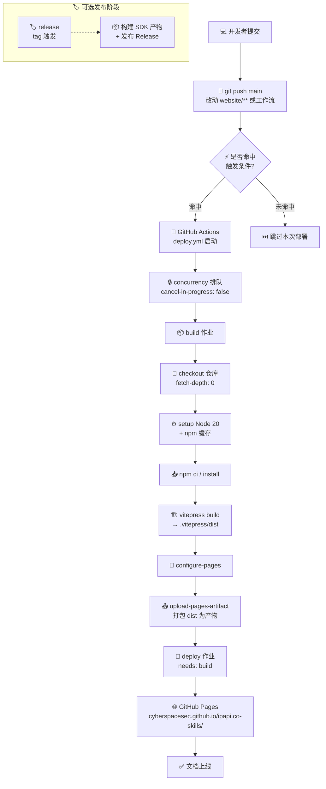
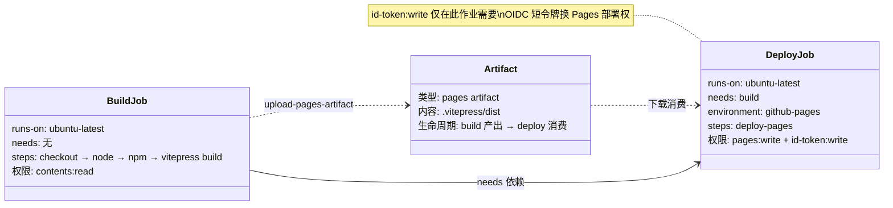

# ⚙️ CI/CD 概述

> 本文档站基于 GitHub Actions 自动构建，部署到 GitHub Pages。

## 流程总览

```
git push main (website/** 改动)
        │
        ▼
┌───────────────────────────┐
│  GitHub Actions 触发       │
│  .github/workflows/        │
│  deploy.yml                │
└─────────────┬─────────────┘
              │
   ┌──────────┴──────────┐
   ▼                     ▼
build job            (并行无)
   │
   ├─ checkout 仓库
   ├─ setup Node 20
   ├─ npm install
   ├─ vitepress build  → .vitepress/dist
   ├─ configure-pages
   └─ upload-artifact
              │
              ▼
deploy job
   │
   └─ deploy-pages  →  https://<user>.github.io/ipapi.co-skills/
```

::: tip 🎨 一图抵千言
下面这张流程图把从「git push」到「文档上线」的完整链路一次看清，含触发、构建、产物、部署、发布各阶段。
:::



::: info 💡 一图多读
- **主线**（实线）：push → 触发判断 → 排队 → build → deploy → 上线
- **虚线**：release 是独立可选路径，由 tag 触发，与文档部署并行不冲突
- **触发判断**：未命中 `paths` 直接跳过，省 CI 额度
:::

## 阶段对照表

| 阶段 | 所在作业 | 关键动作 | 产物 / 结果 |
|------|----------|----------|-------------|
| 🎯 触发 | — | push 到 main + paths 匹配 | 工作流运行 |
| 🔒 并发 | — | group: pages 排队 | 避免半截部署 |
| 📦 构建 | build | checkout → setup-node → npm ci → vitepress build | `.vitepress/dist` |
| 📤 产物 | build | configure-pages → upload-pages-artifact | Pages artifact |
| 🚢 部署 | deploy | deploy-pages | 站点 URL |
| ✅ 上线 | — | GitHub Pages 生效 | 公网可访问 |

## 触发条件

```yaml
on:
  push:
    branches: [main]
    paths:
      - 'website/**'
      - '.github/workflows/deploy.yml'
  workflow_dispatch:  # 手动触发
```

- 推送到 `main` 且改动了 `website/` 或工作流文件 → 自动部署
- 也可在 Actions 页面手动 `workflow_dispatch`

## 并发控制

```yaml
concurrency:
  group: pages
  cancel-in-progress: false
```

同一时刻只跑一个部署，新提交**排队**而非取消旧的（避免半截部署）。

::: warning ⚠️ 为什么 cancel-in-progress: false
文档部署若中途被取消，会产生**半截部署**——旧版被清空、新版没上完，访问者看到空白页。因此这里宁可排队等，也不打断进行中的部署。代价是连续多次 push 时后面会累积排队，但文档场景频率低，可接受。
:::

## 权限

```yaml
permissions:
  contents: read    # 读仓库代码
  pages: write      # 写 GitHub Pages
  id-token: write   # OIDC 鉴权
```

::: danger 🔒 最小权限原则
`id-token: write` 是为 `deploy-pages` 提供 OIDC 短令牌鉴权，**仅文档部署工作流需要**。不要在普通 CI 里随意开此权限。`contents: read` 够用即可，切勿给 `contents: write`，避免工作流被滥用往仓库推东西。
:::

::: details 📖 三项权限各自管什么
| 权限 | 作用 | 缺了会怎样 |
|------|------|------------|
| `contents: read` | checkout 拉代码 | checkout 步骤失败 |
| `pages: write` | 向 Pages 服务写部署 | deploy-pages 报 403 |
| `id-token: write` | 生成 OIDC 令牌鉴权 | deploy-pages 报权限错 |
:::

::: tip 🎨 一图抵千言
下图用作业依赖视角展示 build → deploy 的串联关系，以及每个作业需要哪项权限。
:::



## 下一步

- 📖 看 [GitHub Actions 详解](./github-actions)
- 🌐 看 [GitHub Pages 部署](./github-pages)
- 🖥 看 [本地预览](./local-preview)
