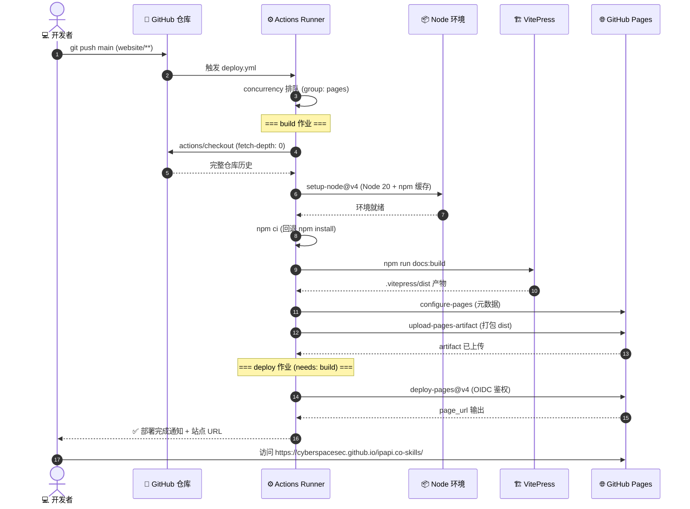

# 🤖 GitHub Actions

> `.github/workflows/deploy.yml` 详解。

::: tip 🎨 一图抵千言
下面用时序图还原一次完整的 Actions 运行：从 push 触发，到 build 作业逐步执行，再到 deploy 作业接力把站点发布到 Pages。
:::



::: info 💡 时序要点
- 第 4 步 `concurrency` 排队保证不重入部署
- 第 6 步 `fetch-depth: 0` 是 `lastUpdated` 时间戳的来源
- build 和 deploy 是**两个独立作业**，通过 artifact 传递产物
- deploy 依赖 OIDC 令牌（`id-token: write`）才能写 Pages
:::

## 作业依赖关系


::: warning ⚠️ 串行非并行
`deploy` 用 `needs: build` 强制等待 build 成功后才执行。若 build 失败，deploy 不会跑——避免把残缺产物推上线。
:::

## 完整工作流

::: v-pre
```yaml
name: Deploy VitePress site to GitHub Pages

on:
  push:
    branches: [main]
    paths:
      - 'website/**'
      - '.github/workflows/deploy.yml'
  workflow_dispatch:

permissions:
  contents: read
  pages: write
  id-token: write

concurrency:
  group: pages
  cancel-in-progress: false

jobs:
  build:
    runs-on: ubuntu-latest
    steps:
      - uses: actions/checkout@v4
        with:
          fetch-depth: 0
      - uses: actions/setup-node@v4
        with:
          node-version: 20
          cache: npm
          cache-dependency-path: website/package-lock.json
      - name: Install dependencies
        working-directory: website
        run: npm ci || npm install
      - name: Build with VitePress
        working-directory: website
        run: npm run docs:build
      - uses: actions/configure-pages@v4
      - uses: actions/upload-pages-artifact@v3
        with:
          path: website/.vitepress/dist

  deploy:
    needs: build
    runs-on: ubuntu-latest
    environment:
      name: github-pages
      url: ${{ steps.deployment.outputs.page_url }}
    steps:
      - name: Deploy to GitHub Pages
        id: deployment
        uses: actions/deploy-pages@v4
```
:::

## build 作业

### checkout

```yaml
- uses: actions/checkout@v4
  with:
    fetch-depth: 0  # 完整历史，VitePress lastUpdated 需要
```

`fetch-depth: 0` 拉全部提交，让 `lastUpdated: true` 能取到文件最后修改时间。

::: tip 💡 为什么需要完整历史
VitePress 的 `lastUpdated` 依赖 `git log` 取文件最后提交时间。默认 `fetch-depth: 1` 只拉最新一次提交，所有文件的"最后更新"都会显示成同一次 push 时间，失去意义。`fetch-depth: 0` 拉全历史，时间戳才准确。
:::

### setup-node

```yaml
- uses: actions/setup-node@v4
  with:
    node-version: 20
    cache: npm
    cache-dependency-path: website/package-lock.json
```

Node 20 + npm 缓存，加速后续构建。

### 安装与构建

```yaml
- run: npm ci || npm install
  working-directory: website
- run: npm run docs:build
  working-directory: website
```

`npm ci` 严格按 lockfile 安装；无 lockfile 时回退 `npm install`。`docs:build` 执行 `vitepress build`，输出到 `.vitepress/dist`。

::: details 📖 npm ci vs npm install 对照
| 维度 | `npm ci` | `npm install` |
|------|----------|---------------|
| 依赖来源 | 严格读 `package-lock.json` | 重新解析、可能改 lock |
| 速度 | 快（命中缓存） | 慢 |
| 一致性 | 高，跨机器结果一致 | 低，可能漂移 |
| 缺 lockfile | ❌ 直接失败 | ✅ 自动生成 |
| 用途 | CI 生产构建 | 本地开发首装 |

工作流用 `npm ci \|\| npm install` 兼顾两者：有 lockfile 走严格模式，没有则兜底。
:::

### 上传产物

```yaml
- uses: actions/configure-pages@v4
- uses: actions/upload-pages-artifact@v3
  with:
    path: website/.vitepress/dist
```

`configure-pages` 准备 Pages 元数据，`upload-pages-artifact` 把 dist 打包成部署产物。

::: info 🔗 产物即契约
build 作业的最终输出就是这个 artifact。它既是 build→deploy 之间的传递媒介，也是部署内容的唯一真相来源。dist 里有什么，Pages 上就有什么——想改上线内容，就得改构建过程。
:::

## build 步骤速查表

| 顺序 | step | 作用 | 失败影响 |
|------|------|------|----------|
| 1 | checkout | 拉代码+全历史 | 后续全停 |
| 2 | setup-node | 装 Node 20+缓存 | 无法 npm |
| 3 | npm ci/install | 装依赖 | 无法 build |
| 4 | docs:build | VitePress 构建 | 无产物，deploy 不跑 |
| 5 | configure-pages | Pages 元数据 | artifact 上传异常 |
| 6 | upload-pages-artifact | 打包上传 | deploy 无内容可部署 |

## deploy 作业

::: v-pre
```yaml
deploy:
  needs: build
  environment:
    name: github-pages
    url: ${{ steps.deployment.outputs.page_url }}
  steps:
    - uses: actions/deploy-pages@v4
      id: deployment
```
:::

- `needs: build` 等 build 完成
- `environment: github-pages` 绑定 Pages 环境
- `deploy-pages` 把产物发布到 GitHub Pages

## 查看运行状态

GitHub 仓库 → **Actions** 标签页 → 选 `Deploy VitePress site to GitHub Pages`。

## 下一步

- 🌐 看 [GitHub Pages 部署](./github-pages)
- 🖥 看 [本地预览](./local-preview)
- ⚙️ 回 [CI/CD 概述](./cicd)
