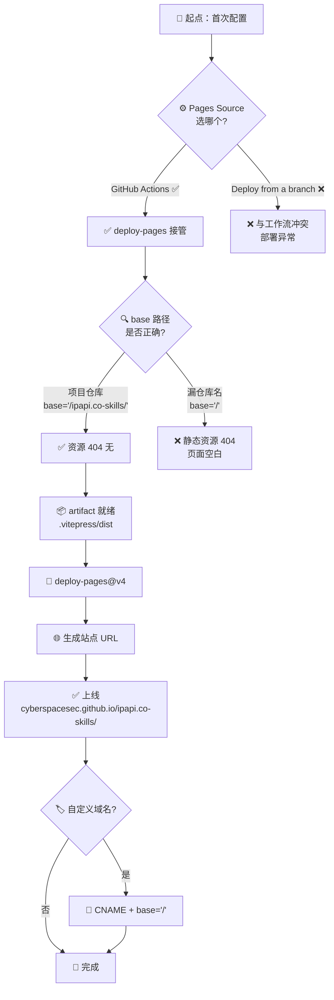

# 🌐 GitHub Pages 部署

> 把构建产物发布到 GitHub Pages。

::: tip 🎨 一图抵千言
下面这张流程图还原 Pages 部署的完整链路：从配置 Source、构建产物、base 路径校验，到最终上线可访问。
:::



::: warning ⚠️ 两个高频坑
1. **Source 选错**：选 "Deploy from a branch" 会让 Pages 走老分支部署，与 `deploy-pages` 工作流打架，出现"推了但没上线"。
2. **base 漏仓库名**：项目仓库（非 `user.github.io`）必须 `base: '/仓库名/'`，否则 JS/CSS 全 404，页面加载空白。
:::

## 访问地址

部署成功后访问：

```
https://<github-user>.github.io/ipapi.co-skills/
```

例如仓库是 `cyberspacesec/ipapi.co-skills`，地址即：

```
https://cyberspacesec.github.io/ipapi.co-skills/
```

## 首次配置

### 1. 开启 Pages

GitHub 仓库 → **Settings** → **Pages** → **Source** 选 **GitHub Actions**。

::: warning ⚠️ 必须选 GitHub Actions
不要选 "Deploy from a branch"，否则与工作流冲突。选 **GitHub Actions** 让 `deploy-pages` 接管。
:::

### 2. base 路径

`website/.vitepress/config.ts` 已设：

```ts
base: '/ipapi.co-skills/',
```

项目站点（非 `username.github.io` 仓库）必须带仓库名前缀，否则静态资源 404。

::: details 📖 base 路径决策表
| 仓库类型 | 访问 URL | base 配置 |
|----------|----------|-----------|
| 项目仓库 `org/repo` | `org.github.io/repo/` | `'/repo/'` |
| 用户站点 `user.github.io` 仓库 | `user.github.io/` | `'/'` |
| 自定义域名 `docs.example.com` | `docs.example.com/` | `'/'` |

本项目是 `cyberspacesec/ipapi.co-skills`，属项目仓库，故 `base: '/ipapi.co-skills/'`。
:::

### 3. 推送触发

```bash
git add website/ .github/
git commit -m "docs: 初始化 VitePress 文档站"
git push origin main
```

推送后 Actions 自动构建部署。

## 自定义域名

若绑定自定义域名（如 `docs.example.com`）：

1. 仓库 Settings → Pages → Custom domain 填域名
2. 改 `base` 为 `'/'`：
   ```ts
   base: '/',
   ```
3. DNS 加 CNAME 指向 `<user>.github.io`

::: info 💡 切换域名后记得清缓存
GitHub Pages 的 CDN 缓存可能滞后数分钟到数小时。改完 base 和 DNS 后若仍看到旧页面或 404，等几分钟再试；持续异常就去 Actions 看最新一次 deploy 是否成功。
:::

::: warning ⚠️ base 与域名必须同步
切自定义域名时，`base` 从 `'/ipapi.co-skills/'` 改回 `'/'`。两者不同步会出现"首页能开但 CSS/JS 全 404"的典型症状——因为资源 URL 多带了一截仓库名前缀。
:::

## 部署失败排查

| 现象 | 原因 |
|------|------|
| Pages 空白 | `base` 路径错（缺仓库名） |
| Actions 报权限错 | `permissions` 未设 `pages: write` |
| 资源 404 | `base` 与实际路径不符 |
| `npm ci` 失败 | 无 `package-lock.json`，回退 `npm install` |

## 查看部署日志

Settings → Pages 显示最近部署；Actions 详查每步日志。

## 下一步

- 🤖 看 [GitHub Actions](./github-actions)
- 🖥 看 [本地预览](./local-preview)
- ⚙️ 回 [CI/CD 概述](./cicd)
