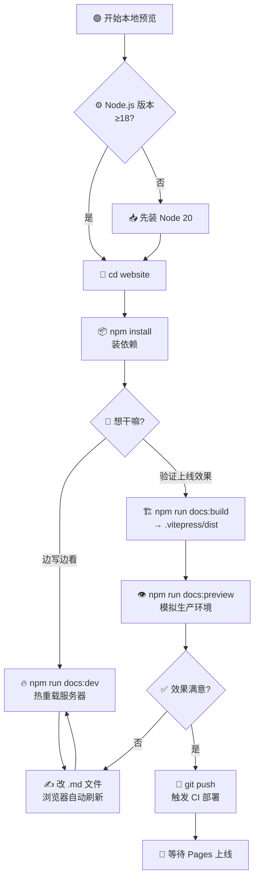

# 🖥 本地预览

> 推送前在本地预览文档站。

::: tip 🎨 一图抵千言
本地预览的完整闭环：装依赖 → 开发热重载 → 构建产物 → 预览模拟生产 → 推送触发 CI。dev 和 preview 服务不同，别混淆。
:::



::: info 💡 dev vs build vs preview
- `docs:dev`：开发服务器，**热重载**，改文件即刷新，但产物不等于线上
- `docs:build`：生产构建，输出真实 dist，但不起服务
- `docs:preview`：对 build 产物起服务，**最接近线上**，上线前必走这步
:::

::: warning ⚠️ 别只测 dev 就推
dev 模式跳过了部分构建优化（路由、SSR、base 路径处理），有些问题只在 build/preview 才暴露。推送前至少跑一次 `docs:build` + `docs:preview`，避免推上去才发现 404。
:::

## 前置

- 🟢 Node.js 18+（推荐 20）
- 📦 npm

## 安装依赖

```bash
cd website
npm install
```

## 启动开发服务器

```bash
npm run docs:dev
```

访问 `http://localhost:5173/`，修改 Markdown **热重载**即时刷新。

## 构建产物

```bash
npm run docs:build
```

输出到 `website/.vitepress/dist/`，这就是部署到 Pages 的内容。

## 预览构建产物

```bash
npm run docs:preview
```

本地起服务模拟生产环境，验证构建结果。

## 常用脚本

| 命令 | 作用 |
|------|------|
| `npm run docs:dev` | 开发热重载 |
| `npm run docs:build` | 生产构建 |
| `npm run docs:preview` | 预览构建 |

## 目录结构

```
website/
├── .vitepress/
│   └── config.ts       # 站点配置
├── public/
│   └── favicon.svg     # 站点图标
├── guide/              # 指南文档
├── api/                # API 参考
├── examples/           # 示例
├── config/             # 配置文档
├── index.md            # 首页
└── package.json
```

::: details 📖 目录职责对照
| 目录 | 放什么 | 何时改 |
|------|--------|--------|
| `.vitepress/` | 站点配置、主题、构建产物 | 改站点行为 |
| `public/` | 静态资源（favicon 等） | 换图标 |
| `guide/` | 入门指南、概念讲解 | 新手向内容 |
| `api/` | SDK API 参考 | 方法签名变动 |
| `examples/` | 示例代码 | 新增用例 |
| `config/` | 部署/CI 配置文档 | 改部署流程 |
| `index.md` | 首页 | 改门面 |
:::

## 新增文档

1. 在对应目录建 `.md` 文件
2. 在 `.vitepress/config.ts` 的 `sidebar` 加链接
3. `docs:dev` 看效果

::: tip 💡 新增文档三步走清单
- ✅ 建 `.md`：放对目录，文件名即路由（`guide/quickstart.md` → `/guide/quickstart`）
- ✅ 加 sidebar：在 `config.ts` 的 `nav`/`sidebar` 配置里登记，否则读者找不到入口
- ✅ 跑 `docs:dev`：确认页面能开、侧边栏链接正确、无构建报错
:::

## 下一步

- 🤖 看 [GitHub Actions](./github-actions)
- 🌐 看 [GitHub Pages 部署](./github-pages)
- ⚙️ 回 [CI/CD 概述](./cicd)
