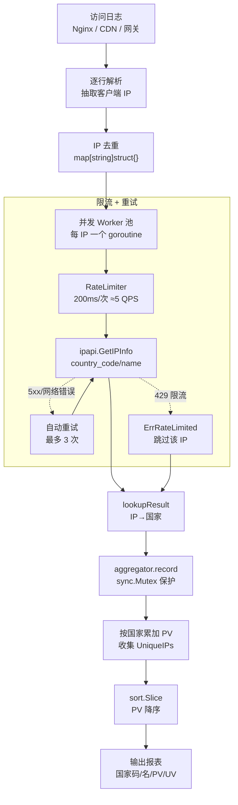

# 🌍 地区统计：按国家聚合 PV/UV

> 用 `ipapi.co-skills` 把访问日志里的 IP 解析成国家，再聚合成 PV / UV 报表。

## 🧩 场景

你有一份访问日志（Nginx / CDN / 自建网关），每条记录只有客户端 IP：

```txt
8.8.8.8  /products
1.1.1.1  /about
8.8.8.8  /products   ← 同一 IP 多次访问
203.0.113.5 /pricing
```

老板要一张「按国家看 PV / UV」的报表：

| 国家 | PV（总访问） | UV（独立访客） |
|------|------------|--------------|
| 🇺🇸 美国 | 3 | 2 |
| 🇦🇺 澳大利亚 | 1 | 1 |

问题是——**日志里只有 IP，没有国家**。需要把 IP → 国家做一次回填，再做聚合。本文给出完整可运行方案。

## 💡 方案

1. **解析日志**：逐行抽出客户端 IP（这里用模拟日志演示，真实场景换成读日志文件即可）。
2. **并发回填国家**：用 `ipapi.Client` 并发查询每个 IP 的 `country_code` / `country_name`，配 `RateLimiter` 防止触发限流。
3. **聚合统计**：
   - **PV**（Page View）= 每个 IP 的访问次数累加到它所属国家；
   - **UV**（Unique Visitor）= 把每个国家的不同 IP 放进 `map[string]struct{}` 去重，统计集合大小。
4. **输出报表**：按 PV 降序排序后打印。

并发写入聚合结果时用 `sync.Mutex` 保护，或用按国家分片的 map 减少锁竞争——这里采用单锁 + 预聚合的简洁写法。

::: tip 🎨 一图抵千言
端到端流程：日志解析 → 去重 → 并发查询（限流）→ 聚合 → 报表。


:::

## 📜 完整代码

```go
package main

import (
	"context"
	"fmt"
	"log"
	"sort"
	"strings"
	"sync"
	"time"

	"github.com/cyberspacesec/ipapi.co-skills/pkg/ipapi"
)

// accessLogEntry 模拟一条访问日志（真实场景从日志文件解析）。
type accessLogEntry struct {
	IP   string
	Path string
}

// countryStats 单个国家的聚合结果。
type countryStats struct {
	CountryCode string
	CountryName string
	PV          int            // 该国总访问次数
	UniqueIPs   map[string]struct{} // 去重后的 IP 集合
}

// aggregator 线程安全的地区聚合器。
type aggregator struct {
	mu    sync.Mutex
	stats map[string]*countryStats // key: country_code
}

func newAggregator() *aggregator {
	return &aggregator{stats: make(map[string]*countryStats)}
}

// record 把一次访问记入对应国家。countryCode 为空时归到 "UNKNOWN"。
func (a *aggregator) record(ip, countryCode, countryName string) {
	if countryCode == "" {
		countryCode = "UNKNOWN"
		countryName = "未知"
	}

	a.mu.Lock()
	defer a.mu.Unlock()

	s, ok := a.stats[countryCode]
	if !ok {
		s = &countryStats{
			CountryCode: countryCode,
			CountryName: countryName,
			UniqueIPs:   make(map[string]struct{}),
		}
		a.stats[countryCode] = s
	}
	s.PV++
	s.UniqueIPs[ip] = struct{}{}
}

// report 返回按 PV 降序排列的快照。
func (a *aggregator) report() []countryStats {
	a.mu.Lock()
	defer a.mu.Unlock()

	out := make([]countryStats, 0, len(a.stats))
	for _, s := range a.stats {
		out = append(out, *s)
	}
	sort.Slice(out, func(i, j int) bool {
		return out[i].PV > out[j].PV
	})
	return out
}

// lookupCountry 并发查询每个 IP 的国家信息，查询结果通过 lookupResult 回传。
type lookupResult struct {
	IP          string
	CountryCode string
	CountryName string
}

// resolveCountries 并发把 IP 列表解析成国家。同一 IP 只查一次。
func resolveCountries(ctx context.Context, client *ipapi.Client, ips []string) []lookupResult {
	// 去重：同一 IP 只查一次，省额度
	unique := make(map[string]struct{}, len(ips))
	for _, ip := range ips {
		unique[ip] = struct{}{}
	}

	// 限流：ipapi 免费档约每秒 5 次，留余量设 200ms 一次
	client.RateLimiter = time.Tick(200 * time.Millisecond)

	var wg sync.WaitGroup
	results := make([]lookupResult, 0, len(unique))
	var resMu sync.Mutex

	for ip := range unique {
		wg.Add(1)
		go func(addr string) {
			defer wg.Done()

			info, err := client.GetIPInfo(ctx, addr, "json")
			if err != nil {
				log.Printf("查询 %s 失败: %v", addr, err)
				return // 查询失败的 IP 不参与聚合
			}

			resMu.Lock()
			results = append(results, lookupResult{
				IP:          addr,
				CountryCode: info.CountryCode,
				CountryName: info.CountryName,
			})
			resMu.Unlock()
		}(ip)
	}
	wg.Wait()
	return results
}

func main() {
	// 1. 准备客户端（生产环境请用 WithAPIKey 申请付费额度）
	client := ipapi.NewClient()

	// 2. 模拟访问日志
	entries := []accessLogEntry{
		{IP: "8.8.8.8", Path: "/products"},
		{IP: "1.1.1.1", Path: "/about"},
		{IP: "8.8.8.8", Path: "/products"}, // 同 IP 二访 → PV+1，UV 不变
		{IP: "203.0.113.5", Path: "/pricing"},
		{IP: "9.9.9.9", Path: "/contact"},
		{IP: "1.1.1.1", Path: "/blog"}, // 同 IP 二访
	}

	// 3. 抽取全部 IP，并发解析国家
	allIPs := make([]string, 0, len(entries))
	for _, e := range entries {
		allIPs = append(allIPs, e.IP)
	}

	ctx, cancel := context.WithTimeout(context.Background(), 30*time.Second)
	defer cancel()

	resolved := resolveCountries(ctx, client, allIPs)
	countryOf := make(map[string]lookupResult, len(resolved))
	for _, r := range resolved {
		countryOf[r.IP] = r
	}

	// 4. 聚合：遍历日志，按国家累加 PV / 收集 UV
	agg := newAggregator()
	for _, e := range entries {
		r, ok := countryOf[e.IP]
		if !ok {
			// 解析失败也计一次 PV，归到未知
			agg.record(e.IP, "", "")
			continue
		}
		agg.record(e.IP, r.CountryCode, r.CountryName)
	}

	// 5. 打印报表
	report := agg.report()
	fmt.Printf("%-6s %-20s %-6s %-6s\n", "国家码", "国家名", "PV", "UV")
	fmt.Println(strings.Repeat("-", 44))
	for _, s := range report {
		fmt.Printf("%-6s %-20s %-6d %-6d\n",
			s.CountryCode, s.CountryName, s.PV, len(s.UniqueIPs))
	}
}
```

预期输出（取决于 ipapi 实时返回）形如：

```text
国家码 国家名              PV     UV
--------------------------------------------
US     United States       4      2
AU     Australia           1      1
```

## 🔑 要点解析

- **去重查询**：`resolveCountries` 先把日志里的 IP 放进 `map` 去重，**同一 IP 只查一次 API**，既省额度又避免把同一访客的重复请求算成多次网络往返。这是 PV/UV 场景的关键优化——UV 本身就要求按 IP 去重，所以查询阶段顺带完成。
- **并发 + 限流**：每个 IP 一个 goroutine，用 `sync.WaitGroup` 等待；`client.RateLimiter = time.Tick(200 * time.Millisecond)` 把请求节流到每秒约 5 次，避免触发 `ErrRateLimited`。`GetIPInfo` 内部对 5xx 与网络错误已有重试。
- **PV 与 UV 的区分**：
  - PV = 访问次数 → `s.PV++` 每条日志都加；
  - UV = 独立访客数 → `s.UniqueIPs[ip] = struct{}{}` 把 IP 塞进集合，最终 `len(s.UniqueIPs)` 即 UV。
- **线程安全**：`aggregator` 用一把 `sync.Mutex` 保护 `stats` map。本例聚合发生在查询之后是单线程的，但保留锁是为了支持「边查边聚合」的流式写法（见扩展）。
- **容错**：查询失败的 IP 会被跳过并记日志，但日志条目仍归入 `UNKNOWN` 计一次 PV，保证 PV 总数与原始日志一致，不丢统计量。
- **结果排序**：`sort.Slice` 按 PV 降序，方便直接贴进报表。需要按 UV 排序把 `out[i].PV` 换成 `len(out[i].UniqueIPs)` 即可。

::: warning ⚠️ 配额与限流
- **API 额度**：免费档请求频率有限，日志量大时务必先去重再查询——本例 `resolveCountries` 的 `map` 去重是省额度的关键。生产环境建议用 [`WithAPIKey`](../api/new-client) 申请付费档以提升速率上限。
- **限流节流**：`client.RateLimiter = time.Tick(200 * time.Millisecond)` 把并发压到约 5 QPS，避免触发 [`ErrRateLimited`](../api/errors)。注意 SDK 默认 `Retries=2` **不重试 429**，被限流的 IP 会直接失败并跳过。
- **失败可重试**：[`IsRetryableError`](../api/errors) 判定 [`ErrRateLimited`](../api/errors) / [`ErrServerError`](../api/errors) / [`ErrNotFound`](../api/errors) 为可重试，但 SDK 内部仅对网络错误与 5xx 重试——4xx（含 429）不重试，需在调用方自行兜底。
- **超时控制**：用 `context.WithTimeout` 兜住整体耗时，避免单个 IP 查询卡死拖垮整批聚合。
- **数据合规**：IP 属于个人数据，落库或跨地域传输前请评估 GDPR 等合规要求，建议只持久化聚合后的国家级统计数据，不留存原始 IP。
:::

## 🚀 扩展

- **流式聚合**：把「查询」和「聚合」合并——goroutine 拿到 `IPInfo` 后直接调 `agg.record()`，省掉中间 `countryOf` map，适合日志量极大的场景（内存更省）。注意此时 `aggregator` 的锁是真在并发下工作的。
- **按城市/大区下钻**：`IPInfo` 还带 `City`、`Region`、`ContinentCode`。把聚合 key 从 `country_code` 换成 `country_code + "/" + city`，即可生成城市级报表。
- **持久化**：把 `countryStats` 序列化成 JSON 落盘或写库，对比每日快照可做增长趋势分析。
- **缓存层**：套一层 `sync.Map` 或 Redis 缓存「IP → 国家」，对反复出现的同一 IP（如爬虫、健康检查）可避免重复消耗 API 额度。
- **批量加速**：IP 量上千时改用 worker pool（参考 [批量查询示例](../examples/batch-lookup)）控制并发上限，比「每 IP 一个 goroutine」更稳。
- **PV 路径维度**：在 `countryStats` 里再加 `map[string]int`（key 为 `Path`），即可输出「某国访问了哪些路径」的细粒度报表。

## 🔗 相关

- 📖 [客户端概念](../guide/client-concept) —— 理解 `ipapi.Client` 的复用与配置
- 📖 [批量查询指南](../guide/batch) —— 大规模 IP 查询的并发与限流策略
- 📖 [重试与限流](../guide/retry-concept) —— `RateLimiter` 与重试机制详解
- 📖 [上下文与超时](../guide/context) —— 用 `context.WithTimeout` 控制整体耗时
- 📘 [`GetIPInfo`](../api/get-ip-info) —— 单 IP 完整信息查询入口
- 📘 [`IPInfo` 模型](../api/models) —— `CountryCode` / `CountryName` / `City` 等字段定义
- 📘 [`NewClient` 与选项](../api/new-client) —— `WithAPIKey` 等配置项
- 🧪 [批量查询示例](../examples/batch-lookup) —— worker pool 写法可直接复用
- 🧪 [查指定 IP](../examples/lookup-specific-ip) —— `GetIPInfo` 的最小用法
