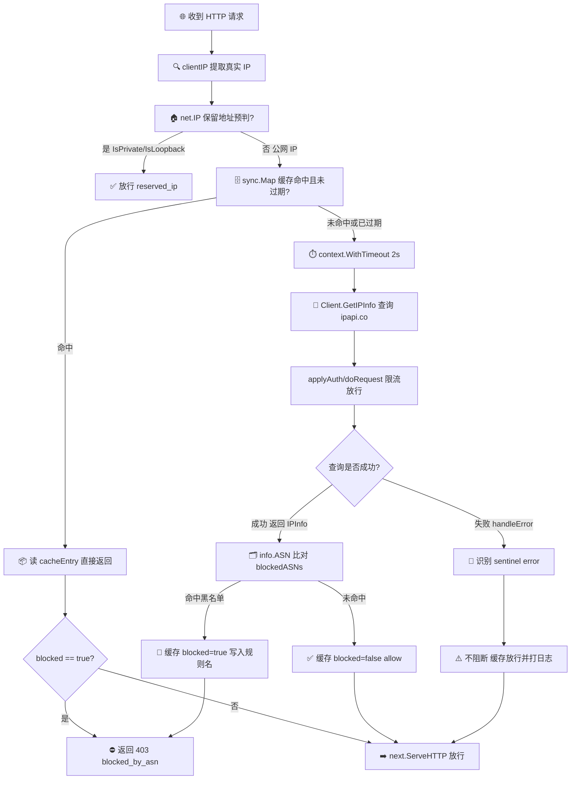

# 🚫 ASN 黑名单 — 按 ASN 拦截特定云厂商流量

> 🍳 食谱编号：asn-blocklist · 适用场景：屏蔽来自指定云厂商 / 数据中心 ASN 的爬虫、扫描器与滥用流量，保护业务接口不被自动化脚本刷量。

## 🧩 场景

你的公开 API 或 Web 服务最近频繁出现异常流量：单 IP 高频请求、批量探测不存在的路径、注册接口被脚本灌脏数据。查了一下来源 IP 的 ASN，发现绝大多数集中在几家云厂商和廉价 VPS 提供商——`AS14618`（Amazon AES）、`AS14061`（DigitalOcean）、`AS24940`（Hetzner）、`AS9009`（M247，常见 VPN 出口）。

按单 IP 封禁有两个痛点：

1. **打地鼠**：攻击者在云上开一台机器打你，被 ban 后几分钟内换一台新 IP 再来。云厂商的 IP 池太大，逐 IP 拉黑名单永远跟不上。
2. **误伤难排查**：纯 IP 黑名单是一坨无语义的数字，运维很难回答"这条为什么被封""什么时候解封"。

按 ASN 拦截则一次覆盖整个厂商的 IP 段：既然你的业务正常用户基本不会从数据中心发起请求，那就**直接把可疑云厂商的 ASN 整体挡在门外**，并把判定依据（ASN、Org、命中规则名）写进日志，可审计、可回溯。

本食谱的目标：用 ipapi.co-skills 在请求入口实时查询客户端 IP 的 ASN，命中黑名单则返回 `403`，同时支持本地缓存、并发安全、限流保护配额。

## 💡 方案

1. **维护 ASN 黑名单**：用一个 `map[string]string` 把 ASN 编号映射到"规则名"（如 `AS24940 -> hetzner`），便于日志可读和按规则统计命中次数。
2. **复用单个 Client**：`ipapi.NewClient` 创建带超时、重试、令牌桶限流的客户端，跨请求复用连接池，避免每请求新建 HTTP client。
3. **本地缓存优先**：用 `sync.Map` 缓存"IP -> 是否命中"的判定结果，TTL 设为 1 小时。同一 IP 反复请求只查一次 ipapi.co，省配额、降延迟。
4. **超时兜底**：用 `context.WithTimeout` 给单次查询设 2 秒上限。查询失败时**不阻断**主请求（按未知放行），仅打日志——可用性优先于严格拦截。
5. **保留地址预判**：发请求前用 `net.IP.IsPrivate()` / `IsLoopback()` 过滤内网地址，避免触发 `ErrReservedIP` 浪费配额。
6. **并发安全**：`sync.Map` + `sync.WaitGroup` 支撑批量预加载与高并发 HTTP 请求下的并发查询。

::: tip 🎨 一图抵千言
下图展示一次请求从「取客户端 IP」到「命中 ASN 黑名单返回 403」的完整判定链路，对应下方代码中 `isBlocked` 与 `middleware` 的实际调用顺序。
:::



## 🧪 完整代码

```go
package main

import (
	"context"
	"encoding/json"
	"errors"
	"fmt"
	"log"
	"net"
	"net/http"
	"sync"
	"time"

	"github.com/cyberspacesec/ipapi.co-skills/pkg/ipapi"
)

// blockedASNs 是 ASN 黑名单：ASN 编号 -> 规则名（用于日志可读）。
// 生产环境应从威胁情报源或运维配置定期更新。
var blockedASNs = map[string]string{
	"AS14618": "amazon-aes",
	"AS16509": "amazon-aws",
	"AS14061": "digitalocean",
	"AS24940": "hetzner",
	"AS9009":  "m247-vpn",
	"AS62311": "linode",
	"" :       "unknown-asn",
}

// asnBlocklist 复用同一个 ipapi 客户端，跨请求并发查询并缓存判定结果。
type asnBlocklist struct {
	lookup *ipapi.Client
	cache  sync.Map // map[string]cacheEntry
}

type cacheEntry struct {
	blocked    bool
	reason     string // 命中规则名，或 "allow" / 查询失败原因
	checkedAt  time.Time
}

const cacheTTL = time.Hour

func newASNBlocklist(apiKey string) *asnBlocklist {
	c := ipapi.NewClient(ipapi.WithAPIKey(apiKey))
	c.HTTPClient.Timeout = 5 * time.Second
	c.Retries = 1
	// 令牌桶限流：每 200ms 放行一次（约 5 QPS），保护 ipapi.co 配额
	c.RateLimiter = time.Tick(200 * time.Millisecond)
	return &asnBlocklist{lookup: c}
}

// isBlocked 判断某 IP 是否落在 ASN 黑名单中。
// 命中缓存且未过期则直接返回，否则查询 ipapi.co。
func (b *asnBlocklist) isBlocked(parent context.Context, ipStr string) (bool, string) {
	// 1. 本地预判保留地址，避免 ErrReservedIP 浪费配额
	if ip := net.ParseIP(ipStr); ip != nil {
		if ip.IsPrivate() || ip.IsLoopback() || ip.IsUnspecified() {
			return false, "reserved_ip"
		}
	}

	// 2. 命中缓存且未过期，直接返回
	if v, ok := b.cache.Load(ipStr); ok {
		e := v.(cacheEntry)
		if time.Since(e.checkedAt) < cacheTTL {
			return e.blocked, e.reason
		}
	}

	// 3. 查询 ipapi.co，2 秒超时兜底
	ctx, cancel := context.WithTimeout(parent, 2*time.Second)
	defer cancel()

	info, err := b.lookup.GetIPInfo(ctx, ipStr, string(ipapi.FormatJSON))
	if err != nil {
		reason := "lookup_failed"
		switch {
		case errors.Is(err, ipapi.ErrRateLimited):
			reason = "rate_limited"
		case errors.Is(err, ipapi.ErrReservedIP):
			reason = "reserved_ip"
		case errors.Is(err, ipapi.ErrServerError):
			reason = "server_error"
		case errors.Is(err, ipapi.ErrInvalidIP):
			reason = "invalid_ip"
		}
		// 查询失败不阻断请求，仅缓存"放行"并打日志，由下游风控兜底
		b.cache.Store(ipStr, cacheEntry{blocked: false, reason: reason, checkedAt: time.Now().UTC()})
		return false, reason
	}

	// 4. 命中黑名单则拦截
	if rule, hit := blockedASNs[info.ASN]; hit {
		b.cache.Store(ipStr, cacheEntry{blocked: true, reason: rule, checkedAt: info.RetrievedAt})
		return true, rule
	}

	// 5. 未命中，放行
	b.cache.Store(ipStr, cacheEntry{blocked: false, reason: "allow", checkedAt: info.RetrievedAt})
	return false, "allow"
}

// middleware 是 HTTP 中间件：命中黑名单返回 403，否则放行到下游 handler。
func (b *asnBlocklist) middleware(next http.Handler) http.Handler {
	return http.HandlerFunc(func(w http.ResponseWriter, r *http.Request) {
		ipStr := clientIP(r)
		blocked, reason := b.isBlocked(r.Context(), ipStr)

		if blocked {
			log.Printf("asn-block DENY ip=%s reason=%s path=%s", ipStr, reason, r.URL.Path)
			w.Header().Set("Content-Type", "application/json")
			w.WriteHeader(http.StatusForbidden)
			_ = json.NewEncoder(w).Encode(map[string]any{
				"error":  "blocked_by_asn",
				"reason": reason,
				"ip":     ipStr,
			})
			return
		}

		next.ServeHTTP(w, r)
	})
}

// clientIP 从请求中提取客户端 IP。生产环境若在反代后，应结合
// 可信代理网段从 X-Forwarded-For 回溯真实 IP，参见 ./proxy-detection 食谱。
func clientIP(r *http.Request) string {
	host, _, err := net.SplitHostPort(r.RemoteAddr)
	if err != nil {
		return r.RemoteAddr
	}
	return host
}

// preloadBatch 并发预加载一批 IP 的判定结果，适合在启动时或定时任务中预热缓存。
func (b *asnBlocklist) preloadBatch(parent context.Context, ips []string) {
	var wg sync.WaitGroup
	for _, ip := range ips {
		wg.Add(1)
		go func(addr string) {
			defer wg.Done()
			b.isBlocked(parent, addr)
		}(ip)
	}
	wg.Wait()
}

func main() {
	blocker := newASNBlocklist("YOUR_API_KEY") // 替换为真实密钥

	// 启动时预热缓存（演示）
	seed := []string{"8.8.8.8", "1.1.1.1", "203.0.113.42"}
	blocker.preloadBatch(context.Background(), seed)

	mux := http.NewServeMux()
	mux.HandleFunc("/api/public", func(w http.ResponseWriter, r *http.Request) {
		w.Header().Set("Content-Type", "application/json")
		_ = json.NewEncoder(w).Encode(map[string]string{"status": "ok"})
	})

	// 套上 ASN 黑名单中间件
	srv := &http.Server{
		Addr:              ":8080",
		Handler:           blocker.middleware(mux),
		ReadHeaderTimeout: 5 * time.Second,
	}
	log.Println("listening on :8080")
	log.Fatal(srv.ListenAndServe())
}
```

> 💡 运行前请将 `YOUR_API_KEY` 替换为你在 ipapi.co 申请的真实密钥。无密钥模式下免费额度有限，高并发下容易触发 `ErrRateLimited`，此时查询失败会被当作"放行"处理以保证可用性——若你的业务需要严格拦截，应配置付费密钥并调高 `RateLimiter` 速率。

## 🔍 要点解析

### 🎯 为什么按 ASN 而不是按 IP 封禁

云厂商的 IP 池动辄数百万，攻击者换 IP 成本极低。按 ASN 封禁等于"一刀切掉整个厂商的来源"：只要你的正常用户基本不来自数据中心（多数 to-C 业务确实如此），这种粗粒度拦截的误伤率很低，而覆盖率和持久性远超 IP 黑名单。`blockedASNs` 把 ASN 映射到人类可读的规则名（`AS24940 -> hetzner`），日志一眼可读、审计可回溯。

### 🧰 复用单个 Client

`ipapi.NewClient` 内部持有 `http.Client` 与连接池，应全局复用而非每请求新建。本食谱在 `newASNBlocklist` 中一次性创建并设置 `Timeout`、`Retries`、`RateLimiter`，整个服务生命周期共享。`RateLimiter = time.Tick(200 * time.Millisecond)` 是一个简单的令牌桶通道，SDK 的 `doRequest` 会在每次请求前 `<-c.RateLimiter` 阻塞放行，把并发请求自动限到约 5 QPS，保护你的 ipapi.co 配额。

### 🗄️ 缓存优先，省配额降延迟

`sync.Map` 缓存"IP -> 是否命中"判定，TTL 1 小时。同一 IP 反复请求只查一次 ipapi.co——这对热点 IP（如某个 NAT 出口后大量用户）尤其关键。缓存值 `cacheEntry` 带 `checkedAt`，过期则重新查询，避免 IP 重新分配后判定失效。`sync.Map` 适合"写少读多"的并发场景，比 `map + Mutex` 在高并发读下更省锁竞争。

::: warning ⚠️ 缓存过期策略的取舍
TTL 越长越省配额，但 IP 重新分配后可能误判——例如某 Hetzner IP 被回收后分配给住宅用户，缓存仍是"拦截"。对误伤敏感的业务可缩短 TTL 到 15 分钟，或监听 ipapi.co 的 `network` 字段变化触发失效。
:::

### 🧹 保留地址预判

`isBlocked` 在发请求前用 `net.IP.IsPrivate()` / `IsLoopback()` / `IsUnspecified()` 过滤内网地址。对 `10.0.0.1`、`127.0.0.1` 这类地址直接返回"放行"，避免无谓地请求 ipapi.co 并触发 `ErrReservedIP` 浪费配额。这一步与 SDK 的 [`ValidateIP`](../api/validate-ip) 互补：`ValidateIP` 只判格式是否合法，保留地址判断在服务端，而本地 `IsPrivate()` 提前拦截。

### ⏱️ 超时与失败兜底

`context.WithTimeout(parent, 2*time.Second)` 给单次查询设上限，即使 ipapi.co 慢响应也不拖垮 HTTP 请求。查询失败时 `isBlocked` 返回 `false`——**不阻断请求**，仅把失败原因（`rate_limited` / `server_error` 等）写入缓存和日志。这是"可用性优先于严格拦截"的权衡：宁可漏放少量可疑流量，也不能让 ipapi.co 的故障拖垮整个业务。若你的业务要求严格拦截，可在失败时返回 `true`，但要确保有付费密钥和监控告警。

### 🔐 区分失败类型

SDK 返回 sentinel error，可用 `errors.Is` 精确匹配 `ErrRateLimited` / `ErrReservedIP` / `ErrServerError` / `ErrInvalidIP`。把失败原因写进 `cacheEntry.reason`，日志能回答"那次放行是因为限流还是 IP 格式非法"，便于运维排查。`ErrRateLimited` 频繁出现通常意味着该升级付费套餐或调慢 `RateLimiter`。

## 🚀 扩展

- **白名单兜底**：部分正常用户（如企业 VPN 出口）可能落在被拦截的 ASN 上。维护一个 IP 白名单 `sync.Map`，在 `isBlocked` 命中黑名单后再查白名单，命中则放行并打 `whitelisted` 标记。
- **按 Org 模糊匹配**：ASN 编号会变，`info.Org` 字段含厂商名（如 `Amazon.com, Inc.`）。可对 `Org` 做子串匹配（`strings.Contains(strings.ToLower(org), "amazon")`）作为 ASN 黑名单的补充，覆盖未登记的新 ASN。
- **缓存下沉到 Redis**：多实例部署时本地 `sync.Map` 不共享，每台机器各自查一遍浪费配额。把缓存迁到 Redis，键为 `ip:asn:{ip}`，所有实例共用一份判定结果。
- **命中计数与自动熔断**：给每条 ASN 规则加 `atomic.Int64` 命中计数，接入 Prometheus。某规则短时命中激增时触发告警，或自动临时拉黑其整个 IP 段（用 `info.Network` CIDR）。
- **结合威胁情报源**：从 [GreyNoise](https://viz.greynoise.io/)、[AbuseIPDB](https://www.abuseipdb.com/) 拉取已知恶意 ASN 列表，定期同步进 `blockedASNs`，让黑名单自动演进而非手工维护。
- **灰度发布**：新加一条 ASN 规则时先开"观察模式"（命中只打日志不拦截），观察一周误伤量后再切到"拦截模式"，避免误封正常用户。
- **与代理检测联动**：数据中心 ASN 同时是代理/VPN 高发区。本食谱可与 [`](./proxy-detection`](./proxy-detection) 食谱结合：先还原真实 IP，再查 ASN，对代理流量做更精细的评分而非一刀切。
- **降级到本地 GeoIP 库**：对可用性要求极高的场景，可在 ipapi.co 不可达时降级读取本地 MaxMind GeoLite2 ASN 库做兜底判定，仅损失精度而非完全失明。

## 🔗 相关

- 📖 客户端概念：[`](../guide/client-concept`](../guide/client-concept)
- 📖 客户端 IP 取值：[`](../guide/client-ip`](../guide/client-ip)
- 📖 错误处理思路：[`](../guide/error-concept`](../guide/error-concept)
- 📖 重试与限流：[`](../guide/retry-concept`](../guide/retry-concept)
- 📖 上下文与超时：[`](../guide/context`](../guide/context)
- 🔧 `GetIPInfo` 接口：[`](../api/get-ip-info`](../api/get-ip-info)
- 🔧 `IPInfo` 数据模型：[`](../api/models`](../api/models)
- 🔧 ASN 字段（含 `ASN` / `Org` / `Network`）：[`](../api/field-asn`](../api/field-asn)
- 🔧 `ValidateIP` 校验：[`](../api/validate-ip`](../api/validate-ip)
- 🔧 客户端选项：[`](../api/options`](../api/options)
- 🔧 错误列表：[`](../api/errors`](../api/errors)
- 🧪 基础用法示例：[`](../examples/basic-usage`](../examples/basic-usage)
- 🧪 指定 IP 查询示例：[`](../examples/lookup-specific-ip`](../examples/lookup-specific-ip)
- 🧪 错误处理示例：[`](../examples/error-handling`](../examples/error-handling)
- 🧪 批量查询示例：[`](../examples/batch-lookup`](../examples/batch-lookup)
- 🍳 关联食谱：[`](./proxy-detection`](./proxy-detection) · [`](./fraud-detection`](./fraud-detection) · [`](./cached-lookup`](./cached-lookup)
