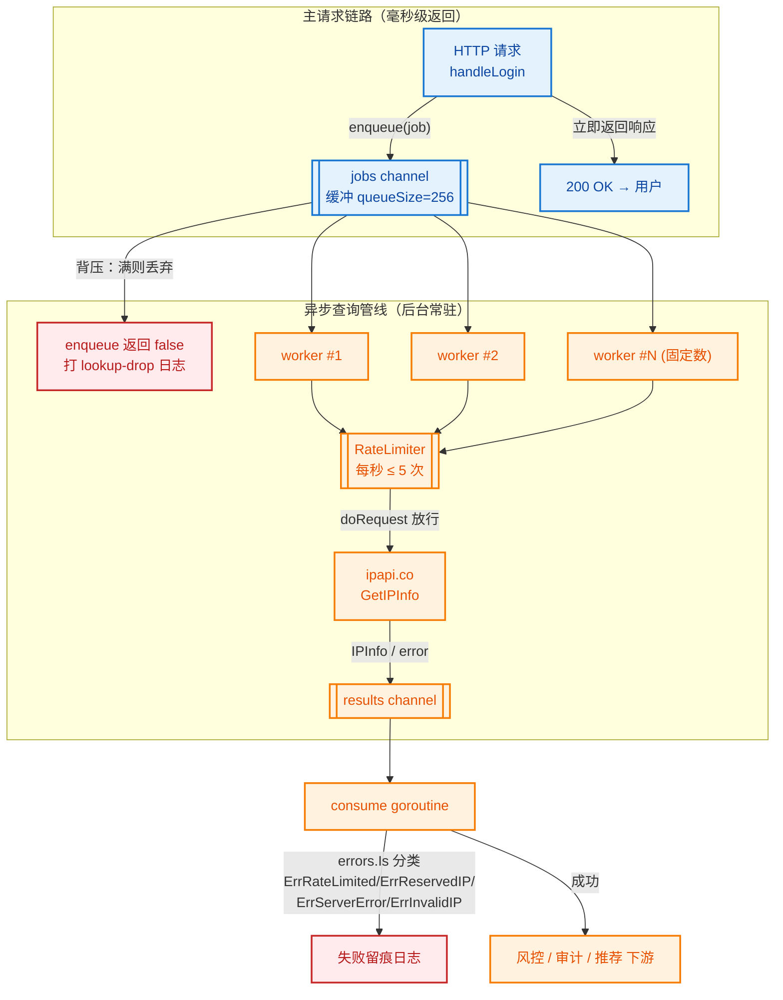

# ⚡ 异步查询 — 用 goroutine + channel 异步查 IP

> 🍳 食谱编号：async-lookup · 适用场景：在 HTTP 请求链路里"发射后即忘"地异步补全 IP 地理信息，不阻塞主响应。

## 🧩 场景

你的服务正在处理一个对延迟敏感的请求——比如登录、下单、内容分发。每一次往返都贵在毫秒。但同时，风控、审计、个性化推荐又都想知道"这个访客来自哪里"。

如果把 IP 查询**同步**插进主链路，等于给每次请求强制加一次 ipapi.co 的网络往返（哪怕 SDK 已经做了重试和超时兜底，最坏仍是 10 秒）。在 P99 视角下，这是不可接受的尾巴。

你真正想要的是：

- 🏎️ **主响应先行**：先把业务结果返回给用户，毫秒级。
- 🧭 **查询后置**：IP 归属信息在后台慢慢查，查到了再喂给风控/审计/推荐。
- 🛡️ **可控背压**：突发流量下不能无限开 goroutine 打爆 ipapi.co 配额，需要一个有界的工作池。
- 🧯 **优雅降级**：查询失败不能影响主流程，且失败要留痕，事后能补。

这就是本食谱要解决的：**用 goroutine + channel 把 IP 查询从主链路解耦，做成可背压、可关闭、可观测的异步管线**。

## 💡 方案

1. **复用单个 Client**：用 `ipapi.NewClient` 创建带超时与重试的客户端，配 `APIKey` 与 `RateLimiter`，全进程共享一个连接池。
2. **有界 worker pool**：开固定数量的 worker goroutine 从 jobs channel 取任务，避免突发流量引爆 goroutine 数。
3. **结果回灌 channel**：每个 worker 把查到的 `IPInfo`（或错误）发到 results channel，下游消费者按需取用，**生产者与消费者解耦**。
4. **发射后即忘**：主请求处理函数只往 jobs channel 里塞一个任务就立刻返回，不等待结果——这正是"fire-and-forget"的精髓。
5. **context 超时兜底**：每个查询派生独立 `context.WithTimeout`，即便 ipapi.co 慢响应，worker 也不会被一个坏请求永久卡住。
6. **限流防封**：用 `Client.RateLimiter` 给整条管线套一个全局节流阀，按 ipapi.co 配额节奏放行。

::: tip 🎨 一图抵千言
端到端流程：HTTP 请求把任务塞进有界队列即返回，固定数量的 worker 从队列取任务、经限流阀查询 ipapi.co，结果回灌 results channel 由消费者分流到风控/审计/推荐下游。


:::

::: warning 🛡️ 配额与背压：别让"异步"变成"打爆配额"
异步管线最容易踩的坑是**用并发掩盖配额**——8 个 worker 看似并行，但若不套 `RateLimiter`，突发流量会瞬间把每日免费额度（约 1000 次/天）烧光并持续触发 [`ErrRateLimited`](../api/errors)。本食谱用 `time.Tick(200ms)` 把全局 QPS 压到 5，确保"worker 多 ≠ 请求多"。另外：

- **4xx 不重试**：SDK 的 [`Retries`](../api/options) 只对网络错误与 5xx 重试，429（限流）属 4xx 不会重试——所以限流即"一次失败一次留痕"，不会因重试放大流量。
- **背压优先于覆盖率**：`enqueue` 的 `default` 分支宁可丢任务也不阻塞主响应，丢任务率应接 Prometheus 告警，> 1% 就该扩 worker 或队列。
- **付费 Key 是生产前提**：免费额度仅够测试，生产环境务必配付费 Key 并进一步下调速率，否则异步管线会沦为"配额黑洞"。
:::

## 🧪 完整代码

```go
package main

import (
	"context"
	"errors"
	"log"
	"net/http"
	"sync"
	"time"

	"github.com/cyberspacesec/ipapi.co-skills/pkg/ipapi"
)

// lookupJob 是投递给 worker 的一条查询任务。
type lookupJob struct {
	IP        string
	RequestID string // 关联到主请求，便于审计回溯
	EnqueuedAt time.Time
}

// lookupResult 是 worker 产出的查询结果。
type lookupResult struct {
	Job     lookupJob
	Info    *ipapi.IPInfo
	Err     error
	Took    time.Duration
}

// asyncLookupService 封装了"有界 worker pool + 限流"的异步查询管线。
// 它在进程级别常驻，被多个 HTTP handler 共享。
type asyncLookupService struct {
	client *ipapi.Client
	jobs   chan lookupJob
	results chan lookupResult
	wg     sync.WaitGroup
}

// newAsyncLookupService 启动 worker pool 并返回服务实例。
// workers 控制并发上限；queueSize 控制 jobs 缓冲深度（背压）。
func newAsyncLookupService(apiKey string, workers, queueSize int) *asyncLookupService {
	client := ipapi.NewClient(
		ipapi.WithAPIKey(apiKey),
		ipapi.WithCustomHTTPClient(&http.Client{
			Timeout: 8 * time.Second,
			Transport: &http.Transport{
				MaxIdleConns:        20,
				MaxIdleConnsPerHost: 10,
				IdleConnTimeout:     90 * time.Second,
			},
		}),
	)
	// 全局限流：每秒最多 5 次查询，保护 ipapi.co 配额
	client.RateLimiter = time.Tick(200 * time.Millisecond)
	client.Retries = 2

	s := &asyncLookupService{
		client:  client,
		jobs:    make(chan lookupJob, queueSize),
		results: make(chan lookupResult, queueSize),
	}
	for i := 0; i < workers; i++ {
		s.wg.Add(1)
		go s.worker(i)
	}
	// 单独的消费者 goroutine，把结果写进审计/风控下游
	go s.consume()
	return s
}

// worker 是查询执行单元：从 jobs 取任务，调用 SDK，把结果回灌 results。
func (s *asyncLookupService) worker(id int) {
	defer s.wg.Done()
	for job := range s.jobs {
		start := time.Now()
		// 每条任务独立超时，坏请求不拖垮 worker
		ctx, cancel := context.WithTimeout(context.Background(), 3*time.Second)
		info, err := s.client.GetIPInfo(ctx, job.IP, string(ipapi.FormatJSON))
		cancel()

		res := lookupResult{Job: job, Info: info, Err: err, Took: time.Since(start)}
		// 即便下游消费者慢，results channel 有缓冲兜底；
		// 若缓冲满则丢弃最旧语义可改为非阻塞写 + 计数告警（见扩展）
		s.results <- res
	}
}

// consume 是结果消费端：按业务需要分流到风控/审计/推荐。
func (s *asyncLookupService) consume() {
	for res := range s.results {
		if res.Err != nil {
			// 失败留痕：区分限流、保留 IP、服务端错误
			reason := "unknown"
			switch {
			case errors.Is(res.Err, ipapi.ErrRateLimited):
				reason = "rate_limited"
			case errors.Is(res.Err, ipapi.ErrReservedIP):
				reason = "reserved_ip"
			case errors.Is(res.Err, ipapi.ErrServerError):
				reason = "server_error"
			case errors.Is(res.Err, ipapi.ErrInvalidIP):
				reason = "invalid_ip"
			}
			log.Printf("lookup-fail req=%s ip=%s reason=%s took=%s",
				res.Job.RequestID, res.Job.IP, reason, res.Took)
			continue
		}
		// 成功：喂给下游。这里仅打印，生产环境可写入风控队列/审计表
		log.Printf("lookup-ok req=%s ip=%s city=%s country=%s asn=%s took=%s",
			res.Job.RequestID, res.Info.IP, res.Info.City,
			res.Info.CountryName, res.Info.ASN, res.Took)
	}
}

// enqueue 是主请求调用的入口：塞任务即返回，绝不阻塞主链路。
// 返回 false 表示队列满（背压触发），主请求可据此降级。
func (s *asyncLookupService) enqueue(job lookupJob) bool {
	select {
	case s.jobs <- job:
		return true
	default:
		// 队列满：丢弃并告警，宁可少查一次也不能拖慢主响应
		log.Printf("lookup-drop req=%s ip=%s reason=queue_full", job.RequestID, job.IP)
		return false
	}
}

// shutdown 优雅关闭：关闭 jobs，等所有 worker 排空，再关 results。
func (s *asyncLookupService) shutdown() {
	close(s.jobs)
	s.wg.Wait()
	close(s.results)
}

// ---- HTTP handler：主响应先行，查询后置 ----

func (s *asyncLookupService) handleLogin(w http.ResponseWriter, r *http.Request) {
	ip := clientIP(r) // 生产环境应解析 X-Forwarded-For
	rid := r.Header.Get("X-Request-ID")
	if rid == "" {
		rid = ip // 兜底
	}

	// 1. 业务逻辑：校验、发 token……（此处略）
	// 2. 发射后即忘：往管线投递查询任务
	s.enqueue(lookupJob{
		IP:         ip,
		RequestID:  rid,
		EnqueuedAt: time.Now(),
	})

	// 3. 立刻返回，不等查询
	w.Header().Set("Content-Type", "application/json")
	_, _ = w.Write([]byte(`{"status":"ok","msg":"login accepted"}`))
}

// clientIP 取真实客户端 IP（示意，生产需校验可信代理链）。
func clientIP(r *http.Request) string {
	if xff := r.Header.Get("X-Forwarded-For"); xff != "" {
		return xff
	}
	return r.RemoteAddr
}

func main() {
	// 启动异步管线：8 个 worker，队列深度 256
	svc := newAsyncLookupService("YOUR_API_KEY", 8, 256)
	defer svc.shutdown()

	mux := http.NewServeMux()
	mux.HandleFunc("/login", svc.handleLogin)

	srv := &http.Server{
		Addr:              ":8080",
		Handler:           mux,
		ReadHeaderTimeout: 5 * time.Second,
	}
	log.Println("listening on :8080")
	log.Fatal(srv.ListenAndServe())
}
```

> 💡 运行前请将 `YOUR_API_KEY` 替换为你在 ipapi.co 申请的真实密钥。无密钥模式下免费额度有限，突发流量极易触发 `ErrRateLimited`。

## 🔍 要点解析

### 🚀 为什么"发射后即忘"能降延迟

`handleLogin` 里调用 `s.enqueue(...)` 是**非阻塞**的：它用 `select...case s.jobs <- job` 配合 `default` 分支，要么立刻塞进缓冲通道，要么当场丢弃。无论哪种，主响应都在微秒级返回。查询那几百毫秒的网络往返被完全推到后台，不进入 P99。代价是：丢弃场景下风控拿不到地理信息——这是用延迟换覆盖率的有意权衡。

### 🧱 有界 worker pool 而非"每请求一 goroutine"

`newAsyncLookupService` 在启动时开固定数量（这里是 8）的 worker。突发流量来 1000 个登录请求，jobs channel 缓冲到 256 后开始丢任务，但 worker 数恒为 8——不会出现"一万个 goroutine 抢同一连接池"的内存与调度爆炸。这正是 Go 并发的纪律：**并发度有上限，背压有出口**。

### 🕳️ jobs / results 双 channel 解耦

worker 把结果发到 `results`，由独立的 `consume` goroutine 消费。这意味着即便下游审计写入很慢，worker 也不会被阻塞（只要 results 缓冲没满），仍能持续从 jobs 取新任务。生产端（HTTP handler）与消费端（审计/风控）**只通过 channel 耦合，互不感知**，是 Go 并发设计里最稳的形态之一。

### ⏱️ 每任务独立超时

`worker` 内部对每个 `job` 派生 `context.WithTimeout(ctx, 3*time.Second)` 并 `defer cancel()`。即便 ipapi.co 对某个 IP 持续慢响应，该 worker 最多被占 3 秒就释放去处理下一个任务，不会因为一个坏请求把整个管线堵死。注意：SDK 的 `Client.HTTPClient.Timeout` 是传输层总超时，而 `context` 是请求层超时，两者叠加构成双保险。

### 🛡️ 限流是配额的生命线

`client.RateLimiter = time.Tick(200 * time.Millisecond)` 给整条管线套了一个全局节流阀——每秒最多 5 次实际请求。`doRequest` 内部在发请求前会 `<-c.RateLimiter` 阻塞等待放行。即便有 8 个 worker 同时取到任务，实际打到 ipapi.co 的 QPS 也被压在 5。免费额度约 1000 次/天，按这个节奏可持续运行约 3 分钟满载——生产环境务必配付费 Key 或进一步降低速率。

### 🧯 失败留痕与降级

`consume` 用 `errors.Is` 精确匹配 SDK 的 sentinel error（`ErrRateLimited`、`ErrReservedIP`、`ErrServerError`、`ErrInvalidIP`），把失败原因写进日志。这样事后能回答两类问题：①"那次没查到是因为限流还是 IP 格式问题？"②"被丢弃的任务有多少？"——`enqueue` 的 `default` 分支会打 `lookup-drop` 日志，丢任务率是管线健康度的核心指标。

### 🛑 优雅关闭顺序

`shutdown` 先 `close(s.jobs)` 让 worker 的 `range` 自然退出，再 `wg.Wait()` 等所有 worker 排空剩余任务，最后 `close(s.results)` 让 `consume` 退出。顺序不能反：若先关 results，worker 往已关闭 channel 写会 panic；若不等 wg 就关 results，在途结果会丢失。这是 Go channel 的铁律——**只由发送方关闭，且关闭前确保无人在写**。

## 🚀 扩展

- **持久化任务队列防丢**：进程重启会丢失 jobs 缓冲里的在途任务。可在 `enqueue` 前先写一行到 Redis/本地磁盘队列，worker 处理完再删除，崩溃后能从断点续查。代价是每任务多一次 IO，按业务对覆盖率的要求取舍。
- **批量合并请求**：若短时间同一 IP 反复入队（如同一用户连点），可在 `enqueue` 前用 `sync.Map` 做去重 + 单飞（`golang.org/x/sync/singleflight`），N 次请求只打一次 API，配额省 N 倍。
- **结果缓存**：`consume` 拿到 `IPInfo` 后写入 `sync.Map` 或 Redis，TTL 设为 1 小时。后续同一 IP 的同步查询可先命中缓存，连异步任务都省了。注意过期后要重新查，IP 重新分配会导致地理漂移。
- **背压告警**：给 `enqueue` 的丢弃分支接一个 Prometheus counter（`lookup_dropped_total`），丢弃率 > 1% 就告警——说明 worker 数或队列深度该扩了。
- **动态 worker 数**：根据队列水位动态 `add`/`stop` worker（用一个 `chan struct{}` 控制环），低峰回收 goroutine，高峰扩容。复杂度上升，但能更好贴合流量曲线。
- **同步降级路径**：对极少数必须拿到地理信息才能放行的请求（如某些地区的硬性合规），提供一条 `enqueueAndWait` 同步路径：用一个 per-job 的 `chan lookupResult` 等待结果，超时则走保守策略。把异步管线当"尽力而为"，同步路径当"必须拿到"。
- **结合 `GetField` 只取必要字段**：风控只关心 `country`/`asn` 时，用 `client.GetField(ctx, ip, "asn")` 替代 `GetIPInfo`，响应体更小、更快，管线吞吐更高。

## 🔗 相关

- 📖 客户端概念：[`](../guide/client-concept`](../guide/client-concept)
- 📖 上下文与超时：[`](../guide/context`](../guide/context)
- 📖 重试与限流：[`](../guide/retry-concept`](../guide/retry-concept)
- 📖 自定义 HTTP 客户端：[`](../guide/custom-http`](../guide/custom-http)
- 📖 批量查询指南：[`](../guide/batch`](../guide/batch)
- 🔧 `GetIPInfo` 接口：[`](../api/get-ip-info`](../api/get-ip-info)
- 🔧 `NewClient` 构造：[`](../api/new-client`](../api/new-client)
- 🔧 `WithCustomHTTPClient` 选项：[`](../api/with-custom-http-client`](../api/with-custom-http-client)
- 🔧 `IPInfo` 数据模型：[`](../api/models`](../api/models)
- 🔧 客户端选项（含 `RateLimiter`）：[`](../api/options`](../api/options)
- 🔧 错误列表：[`](../api/errors`](../api/errors)
- 🧪 批量查询示例：[`](../examples/batch-lookup`](../examples/batch-lookup)
- 🧪 高级用法示例：[`](../examples/advanced-usage`](../examples/advanced-usage)
- 🧪 错误处理示例：[`](../examples/error-handling`](../examples/error-handling)
