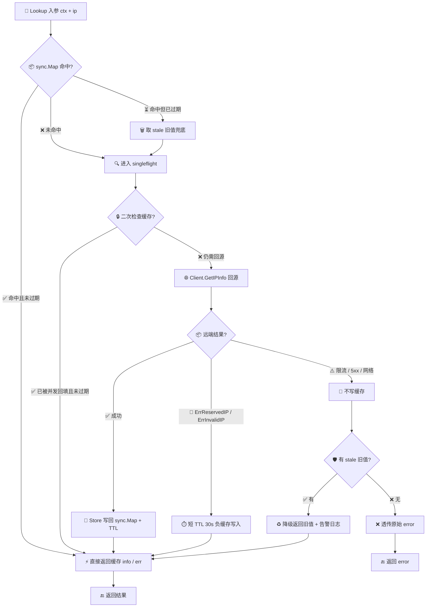

# ⚡ 缓存查询 — 用 `sync.Map` 缓存 IP 结果降配额

> 🛡️ 食谱编号：cached-lookup · 适用场景：高并发服务反复查询同一批 IP，需要在 ipapi.co 配额内承载更多流量。

## 🧩 场景

你的 API 网关每条请求都要根据来源 IP 做地理分流（就近选服、本地化文案、风控初筛）。接入 ipapi.co 之后业务跑得很顺，但账单开始让人发愁：

- 🔁 **重复查询占比高**：同一个出口 IP（公司 NAT、运营商 CGNAT、爬虫代理池）一天能命中几十上百次，每次都打远端接口属于纯浪费。
- 📉 **配额被无效请求吃掉**：免费档每天 1000 次、付费档按调用计费，留给"真正需要实时地理判定"的预算被重复 IP 挤占。
- ⏱️ **远端延迟不可控**：即使 SDK 有重试，跨国 RTT + 偶发慢响应也会拖垮 P99。

你不想引入 Redis 这类外部依赖（部署成本、运维负担、故障域扩大），只想要一个**进程内、并发安全、带 TTL** 的轻量缓存，把重复查询压成一次远端调用。

## 💡 方案

1. **复用单个 `Client`**：用 `ipapi.NewClient` 创建带超时与重试的客户端，HTTP 连接池在所有查询间共享。
2. **`sync.Map` 做缓存载体**：键为 IP 字符串，值为带过期时间的 `cacheEntry`。`sync.Map` 针对读多写少场景优化，无需显式加锁。
3. **TTL 过期策略**：每个条目记录 `expiresAt`，命中后判断是否过期；过期则回源重查。IP 归属变更频率低，TTL 设几分钟到一小时均可。
4. **singleflight 抑制惊群**：缓存击穿（同一 IP 并发失效）时，用 `golang.org/x/sync/singleflight` 合并并发回源为一次远端调用，其余 goroutine 复用结果。
5. **缓存未命中降级**：远端失败时返回上次旧值（若存在）或原始错误，避免缓存空窗期放大故障。
6. **负缓存（可选）**：保留 IP / 格式错误这类"确定查不到"的结果也短时缓存，避免恶意请求反复回源。

::: tip 🎨 一图抵千言
下面这张流程图勾勒了 `CachedLookup.Lookup` 的完整决策链：从 `sync.Map` 命中判断、TTL 过期处理、`singleflight` 合并回源，到失败时降级返回旧值。
:::



## 🧪 完整代码

```go
package main

import (
	"context"
	"errors"
	"log"
	"sync"
	"time"

	"golang.org/x/sync/singleflight"

	"github.com/cyberspacesec/ipapi.co-skills/pkg/ipapi"
)

// cacheEntry 是单条缓存记录，携带过期时间与生成时刻。
type cacheEntry struct {
	info     *ipapi.IPInfo
	err      error // 允许缓存"查不到"类错误（负缓存）
	expiresAt time.Time
	createdAt time.Time
}

// CachedLookup 在 ipapi.Client 之上套一层进程内缓存。
type CachedLookup struct {
	client *ipapi.Client
	ttl    time.Duration

	store sync.Map // map[string]cacheEntry
	group singleflight.Group
}

// NewCachedLookup 构造一个带缓存的查询器。
// ttl 控制命中条目的有效期；建议 5m~1h。
func NewCachedLookup(apiKey string, ttl time.Duration) *CachedLookup {
	c := ipapi.NewClient(ipapi.WithAPIKey(apiKey))
	c.HTTPClient.Timeout = 5 * time.Second
	c.Retries = 1
	return &CachedLookup{client: c, ttl: ttl}
}

// Lookup 返回 IP 的地理信息：命中且未过期则直接返回，否则回源并回填缓存。
func (cl *CachedLookup) Lookup(ctx context.Context, ip string) (*ipapi.IPInfo, error) {
	// 1. 读缓存（快路径）
	if v, ok := cl.store.Load(ip); ok {
		entry := v.(cacheEntry)
		if time.Now().Before(entry.expiresAt) {
			return entry.info, entry.err // 命中，零远端调用
		}
		// 过期：交由 singleflight 回源，旧值在失败时作兜底
		return cl.refresh(ctx, ip, entry)
	}
	// 2. 未命中：回源
	return cl.refresh(ctx, ip, cacheEntry{})
}

// refresh 用 singleflight 合并并发回源，结果写回缓存。
// stale 为过期条目，远端失败时作为兜底返回。
func (cl *CachedLookup) refresh(ctx context.Context, ip string, stale cacheEntry) (*ipapi.IPInfo, error) {
	v, err, _ := cl.group.Do(ip, func() (interface{}, error) {
		// 二次检查：在拿到锁后可能已有并发请求回填了缓存
		if v, ok := cl.store.Load(ip); ok {
			entry := v.(cacheEntry)
			if time.Now().Before(entry.expiresAt) {
				return entry.info, entry.err
			}
		}

		info, err := cl.client.GetIPInfo(ctx, ip, string(ipapi.FormatJSON))
		now := time.Now()
		entry := cacheEntry{
			info:      info,
			err:       err,
			expiresAt: now.Add(cl.ttl),
			createdAt: now,
		}

		// 负缓存策略：保留 IP / 格式错误短时缓存，避免恶意请求反复回源；
		// 限流 / 服务端错误不缓存，让下一次请求尽快重试。
		switch {
		case err == nil:
			cl.store.Store(ip, entry)
		case errors.Is(err, ipapi.ErrReservedIP), errors.Is(err, ipapi.ErrInvalidIP):
			entry.expiresAt = now.Add(30 * time.Second) // 短 TTL
			cl.store.Store(ip, entry)
		default:
			// 网络/限流/5xx：不写缓存，但保留 stale 供本次兜底
		}
		return info, err
	})

	if err != nil {
		// 远端失败：若有旧值则降级返回，避免缓存空窗放大故障
		if stale.info != nil {
			log.Printf("cached-lookup: ip=%s refresh failed (%v), serving stale", ip, err)
			return stale.info, nil
		}
		return nil, err
	}
	return v.(*ipapi.IPInfo), nil
}

// Cleanup 清除所有过期条目，建议由定时器周期调用控制内存占用。
func (cl *CachedLookup) Cleanup() {
	now := time.Now()
	cl.store.Range(func(key, value interface{}) bool {
		if now.After(value.(cacheEntry).expiresAt) {
			cl.store.Delete(key)
		}
		return true
	})
}

func main() {
	cl := NewCachedLookup("YOUR_API_KEY", 10*time.Minute) // 替换为真实密钥
	ctx := context.Background()

	// 后台清理过期条目，控制内存
	go func() {
		t := time.NewTicker(time.Minute)
		defer t.Stop()
		for range t.C {
			cl.Cleanup()
		}
	}()

	// 模拟同一 IP 被并发查询 5 次：远端只会被打到 1 次
	ip := "8.8.8.8"
	var wg sync.WaitGroup
	for i := 0; i < 5; i++ {
		wg.Add(1)
		go func() {
			defer wg.Done()
			info, err := cl.Lookup(ctx, ip)
			if err != nil {
				log.Printf("lookup %s: %v", ip, err)
				return
			}
			log.Printf("lookup %s -> %s, %s", ip, info.CountryName, info.City)
		}()
	}
	wg.Wait()

	// 再次查询（缓存命中）：零远端调用
	if info, err := cl.Lookup(ctx, ip); err == nil {
		log.Printf("cached hit: %s, retrieved_at=%s", info.CountryName, info.RetrievedAt.Format(time.RFC3339))
	}
}
```

> 💡 运行前请将 `YOUR_API_KEY` 替换为你在 ipapi.co 申请的真实密钥。`golang.org/x/sync` 需执行 `go get golang.org/x/sync/singleflight` 引入。

## 🔍 要点解析

### 🗺️ 为什么用 `sync.Map` 而不是 `map + Mutex`

`sync.Map` 针对读远多于写、键集合相对稳定的场景优化：读路径无锁，写路径只在键级别加锁。IP 缓存正是典型"读多写少"——命中时只读不写，仅在过期或未命中时才写入。相比之下 `map + RWMutex` 在高并发读下会因 RWMutex 的写优先策略导致读阻塞。代价是 `sync.Map` 内存占用略高，所以需要 `Cleanup` 周期清旧条目。

### 🌊 singleflight 抑制缓存击穿

缓存击穿指热点 IP 的 TTL 同时到期，瞬间大量并发请求全部 miss 并回源，把 ipapi.co 打爆。`singleflight.Group.Do(key, fn)` 保证同一 key 的并发调用只执行一次 `fn`，其余 goroutine 阻塞等待并复用其结果。代码里 `refresh` 把回源逻辑包在 `group.Do` 内，从根本上避免击穿。

### ♻️ 二次检查（double-check）

进入 `group.Do` 后立即再 `Load` 一次缓存。原因：多个 goroutine 几乎同时 miss，第一个进入临界区回源并写缓存，第二个被 `singleflight` 阻塞——但它复用的是第一个的结果，无需再查；然而如果有 goroutine 是在第一个写完缓存之后才到达 `Lookup` 的快路径之外，二次检查能省掉一次冗余回源。

### 🛡️ 降级返回旧值（serving stale）

远端失败时，若缓存里有虽过期但尚存的旧条目，优先返回旧值而非把错误透传给上游。地理信息变更频率低，"过期但不致命"的数据通常仍可用。这是用一致性换可用性的典型权衡，配合日志记录便于事后追溯。

### 🚫 负缓存

保留 IP（`ErrReservedIP`）与格式非法（`ErrInvalidIP`）这类"确定性失败"也短时缓存（30 秒），避免恶意或错误请求反复回源。但限流（`ErrRateLimited`）与 5xx（`ErrServerError`）**不缓存**——这些是临时故障，应让下次请求尽快重试，否则会把"短时限流"固化成"长时间不可用"。

### 🧹 内存控制

`sync.Map` 不会自动驱逐过期条目，长期运行会内存膨胀。`Cleanup` 用 `Range` 遍历删除过期项，由后台 `time.Ticker` 每分钟触发一次。对超大规模键集，可改为分片 + LRU，但进程内缓存场景下 `sync.Map` + 周期清理通常够用。

## 🚀 扩展

- **分布式缓存**：多实例部署时进程内缓存各自为政，命中率被稀释。可把 `sync.Map` 换成 Redis，键为 `ipapi:ip:{ip}`，TTL 直接复用；仍保留 singleflight 抑制本机击穿。
- **分片缓存降低锁竞争**：键集极大时，可按 IP 哈希分片到多个 `sync.Map`，进一步降低写路径竞争，并让 `Cleanup` 分片并行。
- **主动预热**：服务启动时把历史 Top-N 高频 IP 批量灌入缓存，避免冷启动期集中回源。可结合 `GetIPInfo` 并发拉取，并用 `Client.RateLimiter` 控速。
- **容量上限 + LRU 淘汰**：`sync.Map` 无容量上限。若担心内存失控，可替换为带 LRU 的实现（如 `hashicorp/golang-lru`），设定上限条目数。
- **按字段缓存**：若只需 `country` 一个字段，可改用 `GetField`，缓存体积更小、回源更轻，配额消耗也更细粒度。
- **TTL 抖动**：所有条目用相同 TTL 易出现"集体过期"导致的周期性回源尖峰。可给 TTL 加 ±20% 随机抖动，平滑回源压力。

## 🔗 相关

- 📖 客户端概念：[`](../guide/client-concept`](../guide/client-concept)
- 📖 重试与限流：[`](../guide/retry-concept`](../guide/retry-concept)
- 📖 上下文与超时：[`](../guide/context`](../guide/context)
- 🔧 `GetIPInfo` 接口：[`](../api/get-ip-info`](../api/get-ip-info)
- 🔧 `IPInfo` 数据模型：[`](../api/models`](../api/models)
- 🔧 客户端选项：[`](../api/options`](../api/options)
- 🔧 错误列表（含 `ErrRateLimited`/`ErrReservedIP`）：[`](../api/errors`](../api/errors)
- 🧪 基础用法示例：[`](../examples/basic-usage`](../examples/basic-usage)
- 🧪 带 API Key 示例：[`](../examples/with-api-key`](../examples/with-api-key)
