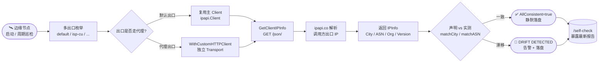

# 📡 边缘节点检测 — 服务器自检部署机房位置

> 🛰️ 食谱编号：cdn-edge-detection · 适用场景：CDN/边缘节点部署后，从节点自身出口反向定位其实际落地的城市、机房与 ASN，校验"宣称的机房"与"网络可见的机房"是否一致。

## 🧩 场景

你在多地机房部署了边缘节点（Edge Node）：北京、上海、法兰克福、新加坡……每个节点对外宣称服务某区域。但运维中你反复踩到这些坑：

- 🌐 **出口漂移**：某节点配了上游 NAT 或默认路由，实际公网出口 IP 归属地与机房物理位置不符，宣告的"就近服务"形同虚设。
- 🏢 **机房串号**：弹性 IP 被重新分配，或云厂商把流量调度到了另一个可用区，节点报告的机房标签已过期。
- 📛 **ASN 漂移**：节点原本走自建 ASN，却因运营商切换偷偷走了第三方 CDN/云厂商的 ASN，溯源与计费全乱。
- 🩺 **部署自检缺失**：节点起来后没人知道"我现在到底在哪儿、对公网看起来像谁"，故障定位只能靠人肉 traceroute。

你需要一个**节点自检程序**：节点启动时（以及周期性运行时）主动询问 ipapi.co ——"我对外是什么 IP？这个 IP 在哪个城市、哪个 ASN、归哪个组织？"——把结果落盘，与节点声明标签做对比，发现漂移立即告警。

本食谱的目标是：**让每个边缘节点自己查自己，输出可机读的机房自检报告，并标记"声明机房"与"实测机房"是否一致**。

## 💡 方案

1. **查"自己"用客户端 IP 端点**：不传 IP，调 [`GetClientIPInfo`](../api/get-client-ip-info)（端点 `GET /json/`），由 ipapi.co 用调用方出口 IP 解析。这正是"自检"语义——节点问的是自己的公网面貌。
2. **复用单个 Client**：用 [`ipapi.NewClient`](../api/new-client) 创建带超时、重试的客户端，进程内复用，连接池不浪费。
3. **并发探测多端点**：一个节点可能有多个出口（多网卡/多运营商）。对每个探测目标发起查询，用 `sync.WaitGroup` 并发，结果按 key 收集对齐。
4. **声明 vs 实测对照**：节点携带声明标签（`declared_city` / `declared_asn`），与 ipapi.co 返回的 `info.City` / `info.ASN` 比较，产出 `consistent` 布尔位。
5. **超时兜底 + 失败自描述**：用 `context.WithTimeout` 限制单次查询；失败时区分 `ErrRateLimited` / `ErrServerError`，把原因写进报告，不让自检因外部抖动而崩溃。
6. **周期巡检**：包一层 `time.Ticker`，定时复跑，捕获运行期漂移；可选 HTTP 端点暴露最新报告供监控拉取。

::: tip 🎨 一图抵千言
端到端自检流程：节点启动 / 周期巡检触发 → 提取各出口 IP（默认出口 + 代理出口）→ 调 ipapi.co 反查 → 声明 vs 实测对照 → 一致则静默、漂移则告警并落盘。

:::

## 🧪 完整代码

```go
package main

import (
	"context"
	"encoding/json"
	"errors"
	"flag"
	"fmt"
	"log"
	"net/http"
	"os"
	"sync"
	"time"

	"github.com/cyberspacesec/ipapi.co-skills/pkg/ipapi"
)

// EdgeDeclaration 是节点在部署清单里声明的机房标签。
type EdgeDeclaration struct {
	NodeID      string `json:"node_id"`        // 节点唯一标识，如 "edge-bj-01"
	DeclaredCity string `json:"declared_city"` // 声明的城市，如 "Beijing"
	DeclaredASN  string `json:"declared_asn"`  // 声明的 ASN，如 "AS4134"
	Region      string `json:"region"`         // 服务区域，如 "cn-north"
}

// ProbeTarget 是一个出口探测目标。ProbeURL 应返回该出口的公网 IP。
// 留空则直接用节点默认出口（即不设代理，查询 GetClientIPInfo）。
type ProbeTarget struct {
	Name      string `json:"name"`        // 出口名，如 "default" / "isp-ct" / "isp-cu"
	ProxyURL  string `json:"proxy_url"`   // 可选：http(s) 代理，留空走默认出口
	DeclaredCity string `json:"declared_city"`
	DeclaredASN  string `json:"declared_asn"`
}

// ProbeResult 是单个出口的自检结果。
type ProbeResult struct {
	Name           string    `json:"name"`
	OK             bool      `json:"ok"`
	ExitIP         string    `json:"exit_ip,omitempty"`
	ActualCity     string    `json:"actual_city,omitempty"`
	ActualASN      string    `json:"actual_asn,omitempty"`
	ActualOrg      string    `json:"actual_org,omitempty"`
	Country        string    `json:"country,omitempty"`
	CityConsistent bool      `json:"city_consistent,omitempty"`
	ASNConsistent  bool      `json:"asn_consistent,omitempty"`
	FailReason     string    `json:"fail_reason,omitempty"`
	MeasuredAt     time.Time `json:"measured_at"`
}

// SelfCheckReport 是一次完整自检的报告。
type SelfCheckReport struct {
	NodeID     string        `json:"node_id"`
	Region     string        `json:"region"`
	StartedAt  time.Time     `json:"started_at"`
	DurationMS int64         `json:"duration_ms"`
	Results    []ProbeResult `json:"results"`
	AllConsistent bool       `json:"all_consistent"` // 所有出口都一致才为 true
}

// edgeInspector 是自检器，持有复用的 ipapi 客户端。
type edgeInspector struct {
	decl  EdgeDeclaration
	probe *ipapi.Client
}

func newInspector(decl EdgeDeclaration, apiKey string) *edgeInspector {
	c := ipapi.NewClient(ipapi.WithAPIKey(apiKey))
	c.HTTPClient.Timeout = 8 * time.Second
	c.Retries = 2
	return &edgeInspector{decl: decl, probe: c}
}

// clientForTarget 为每个探测目标构造专属 HTTP 客户端（可能走指定代理）。
// 返回一个新的 ipapi.Client，但复用主客户端的 API Key 等配置。
func (e *edgeInspector) clientForTarget(t ProbeTarget) *ipapi.Client {
	if t.ProxyURL == "" {
		return e.probe // 默认出口，直接复用
	}
	tr := &http.Transport{Proxy: func(*http.Request) (*url.URL, error) {
		return url.Parse(t.ProxyURL)
	}}
	hc := &http.Client{Timeout: 8 * time.Second, Transport: tr}
	return ipapi.NewClient(
		ipapi.WithAPIKey(e.probe.APIKey),
		ipapi.WithCustomHTTPClient(hc),
	)
}

// probeOne 探测单个出口，返回自检结果。
func (e *edgeInspector) probeOne(parent context.Context, t ProbeTarget) ProbeResult {
	res := ProbeResult{Name: t.Name, MeasuredAt: time.Now().UTC()}
	declaredCity := t.DeclaredCity
	declaredASN := t.DeclaredASN
	if declaredCity == "" {
		declaredCity = e.decl.DeclaredCity
	}
	if declaredASN == "" {
		declaredASN = e.decl.DeclaredASN
	}

	ctx, cancel := context.WithTimeout(parent, 5*time.Second)
	defer cancel()

	c := e.clientForTarget(t)
	// 自检语义：不传 IP，让 ipapi.co 用调用方出口 IP
	info, err := c.GetClientIPInfo(ctx, string(ipapi.FormatJSON))
	if err != nil {
		reason := "unknown"
		switch {
		case errors.Is(err, ipapi.ErrRateLimited):
			reason = "rate_limited"
		case errors.Is(err, ipapi.ErrServerError):
			reason = "server_error"
		case errors.Is(err, ipapi.ErrInvalidKey):
			reason = "invalid_key"
		}
		res.FailReason = reason
		return res
	}

	res.OK = true
	res.ExitIP = info.IP
	res.ActualCity = info.City
	res.ActualASN = info.ASN
	res.ActualOrg = info.Org
	res.Country = info.CountryName
	res.CityConsistent = matchCity(declaredCity, info.City)
	res.ASNConsistent = matchASN(declaredASN, info.ASN)
	return res
}

// matchCity 做大小写/空格不敏感的城市名比较。
func matchCity(declared, actual string) bool {
	return strings.EqualFold(strings.TrimSpace(declared), strings.TrimSpace(actual))
}

// matchASN 比较时统一去掉 "AS" 前缀，兼容 "4134" 与 "AS4134"。
func matchASN(declared, actual string) bool {
	norm := func(s string) string {
		s = strings.ToUpper(strings.TrimSpace(s))
		return strings.TrimPrefix(s, "AS")
	}
	return norm(declared) == norm(actual) && declared != ""
}

// runSelfCheck 并发探测所有出口，产出完整报告。
func (e *edgeInspector) runSelfCheck(parent context.Context, targets []ProbeTarget) SelfCheckReport {
	start := time.Now()
	results := make([]ProbeResult, len(targets))
	var wg sync.WaitGroup
	for i, t := range targets {
		wg.Add(1)
		go func(idx int, tgt ProbeTarget) {
			defer wg.Done()
			results[idx] = e.probeOne(parent, tgt)
		}(i, t)
	}
	wg.Wait()

	allOK := true
	for _, r := range results {
		if !r.OK || !r.CityConsistent || !r.ASNConsistent {
			allOK = false
			break
		}
	}
	return SelfCheckReport{
		NodeID:        e.decl.NodeID,
		Region:        e.decl.Region,
		StartedAt:     start.UTC(),
		DurationMS:    time.Since(start).Milliseconds(),
		Results:       results,
		AllConsistent: allOK,
	}
}

func main() {
	var (
		apiKey  string
		interval time.Duration
		serve   bool
	)
	flag.StringVar(&apiKey, "key", os.Getenv("IPAPI_KEY"), "ipapi.co API Key（也可用 IPAPI_KEY 环境变量）")
	flag.DurationVar(&interval, "interval", 10*time.Minute, "周期巡检间隔")
	flag.BoolVar(&serve, "serve", false, "是否启动 HTTP 端点暴露最新报告")
	flag.Parse()

	if apiKey == "" {
		log.Println("⚠️  未提供 API Key，将走免费额度（每日上限有限，可能触发限流）")
	}

	decl := EdgeDeclaration{
		NodeID:       "edge-bj-01",
		DeclaredCity: "Beijing",
		DeclaredASN:  "AS4134",
		Region:       "cn-north",
	}
	targets := []ProbeTarget{
		{Name: "default", DeclaredCity: "Beijing", DeclaredASN: "AS4134"},
		{Name: "isp-cu", ProxyURL: "http://cu-proxy:3128", DeclaredCity: "Beijing", DeclaredASN: "AS4837"},
	}

	inspector := newInspector(decl, apiKey)

	var latestMu sync.RWMutex
	var latest SelfCheckReport

	run := func() {
		ctx, cancel := context.WithTimeout(context.Background(), 30*time.Second)
		defer cancel()
		report := inspector.runSelfCheck(ctx, targets)
		latestMu.Lock()
		latest = report
		latestMu.Unlock()

		b, _ := json.Marshal(report)
		log.Printf("✅ self-check done node=%s consistent=%v dur=%dms report=%s",
			report.NodeID, report.AllConsistent, report.DurationMS, b)
		if !report.AllConsistent {
			// 🚨 声明与实测不一致：此处可接入告警（webhook / Prometheus / 钉钉）
			log.Printf("🚨 DRIFT DETECTED on node %s — 见上方 report", report.NodeID)
		}
	}

	run() // 启动即跑一次

	if serve {
		mux := http.NewServeMux()
		mux.HandleFunc("/self-check", func(w http.ResponseWriter, r *http.Request) {
			latestMu.RLock()
			defer latestMu.RUnlock()
			w.Header().Set("Content-Type", "application/json")
			_ = json.NewEncoder(w).Encode(latest)
		})
		srv := &http.Server{Addr: ":9100", Handler: mux, ReadHeaderTimeout: 5 * time.Second}
		go func() { log.Println("📡 self-check endpoint on :9100/self-check"); log.Fatal(srv.ListenAndServe()) }()
	}

	if interval > 0 {
		ticker := time.NewTicker(interval)
		defer ticker.Stop()
		for range ticker.C {
			run()
		}
	} else {
		select {} // 只跑一次则阻塞
	}
}

// 编译期 import 兜底（url/strings 在上方被使用，此处防止编辑器误删）
var _ = url.Parse
var _ = strings.EqualFold
```

> 💡 运行前请将 `IPAPI_KEY` 环境变量或 `-key` 参数设为你在 ipapi.co 申请的真实密钥。无密钥模式下免费额度有限，且高频巡检可能触发 `ErrRateLimited`。代码中 `url` 与 `strings` 包需补充到 import 块：`"net/url"` 与 `"strings"`。

> ⚠️ 走代理探测多出口时，请确保该代理确实代表对应运营商出口；用错代理会让"自检"误判。生产环境建议把代理地址改为从配置中心动态拉取。

## 🔍 要点解析

### 🛰️ 为什么用 `GetClientIPInfo` 而不是 `GetIPInfo`

自检的核心是"问公网我看起来像谁"。[`GetClientIPInfo`](../api/get-client-ip-info) 走 `GET /json/` 端点，路径里不带 IP，ipapi.co 直接拿调用方的出口 IP 做解析——这正是节点自检需要的语义。若用 [`GetIPInfo`](../api/get-ip-info) 传一个固定 IP，查的是"那个 IP 的归属地"，与"本节点出口在哪"无关，会错过运行期漂移。

### 🧭 多出口并发探测

真实边缘节点常有多出口（多 ISP、IPv4/IPv6 双栈、专线 + 公网）。代码用 `sync.WaitGroup` 并发跑每个 `ProbeTarget`，结果按索引写回切片，顺序对齐。每个出口可指定独立 `http.Transport`（经 `ProxyURL`）走不同链路，从而分别校验。注意每个目标都 `NewClient` 了一份带独立 HTTP 客户端的 `ipapi.Client`，但共享 API Key 配置——这是 [`WithCustomHTTPClient`](../api/with-custom-http-client) 的典型用法。

### 🏷️ 声明 vs 实测的一致性判定

`matchCity` 做大小写/空格不敏感比较，`matchASN` 在比较前统一去掉 `AS` 前缀（兼容 ipapi.co 返回的 `AS4134` 与部署清单里的 `4134`）。`AllConsistent` 仅在所有出口的 `CityConsistent` 与 `ASNConsistent` 均为 `true` 时才置真——任一出口漂移即整体告警，避免"默认出口正常就当没事"。

### 🩺 失败自描述，不让自检崩

ipapi.co 偶发限流或抖动时，`probeOne` 不返回 `error` 中断流程，而是把失败原因写进 `FailReason`（`rate_limited` / `server_error` / `invalid_key`），该出口标记 `OK=false`、不计入一致性判定。这样单点失败不会让整个自检报告缺失，监控也能看到"哪个出口多久没查成功"。区分错误类型用 `errors.Is` 匹配 SDK 的 sentinel error，详见 [`](../guide/error-concept`](../guide/error-concept)。

### ⏱️ 超时与资源回收

`probeOne` 内 `context.WithTimeout(parent, 5*time.Second)` 给单次查询兜底；`runSelfCheck` 外层再套 30 秒总超时。`defer cancel()` 保证即使 ipapi.co 慢响应，goroutine 也能及时释放，不会在周期巡检里堆积。这与 [`](../guide/context`](../guide/context) 讲的超时传递一致。

### 📡 HTTP 端点暴露最新报告

`-serve` 启动后，`:9100/self-check` 用 `sync.RWMutex` 保护下的 `latest` 报告做只读返回。监控（Prometheus / 黑盒探测）可周期拉取该 JSON，对 `all_consistent` 字段做告警阈值，无需侵入节点进程。读写锁选 `RWMutex` 是因为读远多于写（巡检每 10 分钟一次，拉取可能每 15 秒一次）。

## 🚀 扩展

- **接入告警**：`DRIFT DETECTED` 分支可改为调用 webhook（钉钉/飞书/Slack）或推送 Prometheus counter。建议加去抖：同一节点同一出口连续 N 次漂移才告警，避免 ipapi.co 短暂波动误报。
- **经纬度交叉校验**：`IPInfo.Latitude/Longitude` 比 `City` 更精确。可对"声明机房的经纬度"与"实测经纬度"算 Haversine 距离，距离超过阈值（如 50km）即判漂移——比字符串比城市名更抗"同名城市"歧义。参见 [`](../examples/parse-latlong`](../examples/parse-latlong)。
- **结合 `nearest-server` 选服**：自检确认机房位置后，把节点真实坐标喂给"就近选服"调度器，让它基于实测而非声明做调度。两本食谱可串联。
- **只查单字段降配额**：若只关心 ASN 是否漂移，可用 [`GetClientField`](../api/get-client-field)（`GET /asn/`）单字段端点，省流量、降配额消耗。参见 [`](../api/get-client-field`](../api/get-client-field) 与 [`](../examples/single-field`](../examples/single-field)。
- **缓存自检结果**：同一出口短时间内反复查是浪费。加一层 `sync.Map`，键为出口名，TTL 5 分钟；但漂移检测场景下缓存不宜过长，否则会掩盖运行期漂移。
- **IPv6 出口自检**：节点若启用 IPv6，应额外探测 v6 出口。`GetClientIPInfo` 会返回 ipapi.co 看到的协议版本（`info.Version`），可据此校验双栈是否如预期分别出口。
- **限流防封**：多节点同时巡检会打爆免费额度。可用 `Client.RateLimiter = time.Tick(...)` 全局限流，或给巡检加随机抖动（`time.Sleep(randDuration)`）错峰。参见 [`](../guide/retry-concept`](../guide/retry-concept)。

::: warning ⚖️ 配额与扩展性边界
边缘节点数量膨胀时，自检的请求量 = `节点数 × 出口数 × 巡检频率`，很容易撞上 ipapi.co 的免费日额度上限，触发 [`ErrRateLimited`](../api/errors)（属于 [`IsRetryableError`](../guide/retry-concept) 可重试范畴，但 4xx 不重试、靠 `RateLimiter` 节流更稳）。建议：
- **分级频率**：声明稳定的新节点 30 分钟一次，历史有漂移的节点 5 分钟一次，按 `region`/`node_id` 分桶错峰，避免雷同时间戳并发。
- **降配额优先用单字段**：只校验 ASN 漂移时改用 [`GetClientField`](../api/get-client-field)（`GET /asn/`），单字段端点比全量 [`GetClientIPInfo`](../api/get-client-ip-info) 更省额度。
- **代理链安全**：`ProxyURL` 指向的代理若被劫持或配错，会让"自检"测到错误出口，导致误报或漏报漂移。生产环境应从配置中心动态拉取代理地址并校验其 ASN，禁止硬编码进二进制。
- **API Key 隔离**：每个机房分区用独立 Key，单区 Key 泄漏不影响其他分区；无 Key 的免费额度不应承担生产巡检，仅在本地调试用。
:::

## 🔗 相关

- 📖 客户端概念：[`](../guide/client-concept`](../guide/client-concept)
- 📖 客户端 IP 端点（自检语义）：[`](../guide/client-ip`](../guide/client-ip)
- 📖 上下文与超时：[`](../guide/context`](../guide/context)
- 📖 错误处理思路：[`](../guide/error-concept`](../guide/error-concept)
- 📖 重试与限流：[`](../guide/retry-concept`](../guide/retry-concept)
- 📖 认证方式：[`](../guide/auth-concept`](../guide/auth-concept)
- 📖 自定义 HTTP 客户端（多出口代理）：[`](../guide/custom-http`](../guide/custom-http)
- 🔧 `GetClientIPInfo` 接口：[`](../api/get-client-ip-info`](../api/get-client-ip-info)
- 🔧 `GetClientField` 单字段接口：[`](../api/get-client-field`](../api/get-client-field)
- 🔧 `IPInfo` 数据模型（含 `City`/`ASN`/`Org`/`Version`）：[`](../api/models`](../api/models)
- 🔧 客户端选项（`WithAPIKey`/`WithCustomHTTPClient`）：[`](../api/options`](../api/options)
- 🔧 错误列表：[`](../api/errors`](../api/errors)
- 🧪 查询客户端 IP 示例：[`](../examples/lookup-client-ip`](../examples/lookup-client-ip)
- 🧪 单字段查询示例：[`](../examples/single-field`](../examples/single-field)
- 🧪 解析经纬度示例：[`](../examples/parse-latlong`](../examples/parse-latlong)
- 🧪 带 API Key 示例：[`](../examples/with-api-key`](../examples/with-api-key)
- 🍳 关联食谱：[就近选服（Haversine 选最近机房）](./nearest-server)
