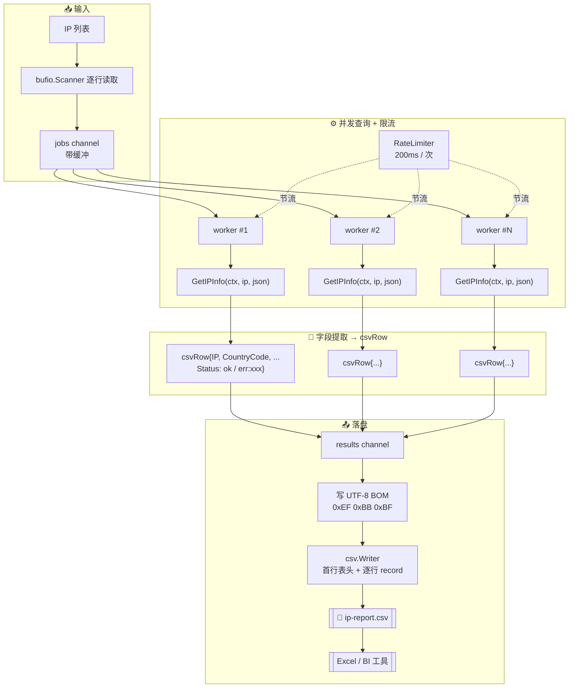

# 📄 CSV 导出：批量查询 IP 并生成报表

> 用 `ipapi.co-skills` 并发查询一批 IP，把地理 / 网络 / ASN 等字段整理成标准 CSV 报表，方便丢进 Excel、BI 工具或下游数据管道。

## 🧩 场景

安全运营或数据分析时，你常常拿到一串 IP——比如 WAF 日志里抽出来的可疑 IP、CDN 节点列表、巡检目标清单：

```text
8.8.8.8
1.1.1.1
203.0.113.5
198.51.100.7
```

老板要的不是 JSON，是一张**能直接在 Excel 打开**的 CSV 表：

| ip        | country_code | country_name  | city        | asn      | org              | timezone        |
|-----------|--------------|---------------|-------------|----------|------------------|-----------------|
| 8.8.8.8   | US           | United States | Mountain View | AS15169  | Google LLC       | America/Los_Angeles |
| 1.1.1.1   | US           | United States | -           | AS13335  | Cloudflare, Inc. | America/Los_Angeles |

问题很直接：**逐个查 IP → 抽取关心的字段 → 按统一列顺序写成 CSV，并且要并发提速但不能把 API 打限流**。本文给出一份完整可运行的方案。

## 💡 方案

1. **准备 IP 列表**：从文件 / 参数 / 标准输入读入一批 IP（演示用硬编码列表，生产环境换成 `bufio.Scanner` 读文件即可）。
2. **并发查询 + 限流**：用 `ipapi.Client` 并发调用 `GetIPInfo`，每个 IP 一个 goroutine，配 `RateLimiter` 节流到免费档可承受的速率（约每秒 5 次）。
3. **统一结果结构**：定义 `csvRow` 结构体保存一行记录，查询失败的 IP 也保留并在 CSV 里标注错误原因，**不丢行**。
4. **写 CSV**：用标准库 `encoding/csv` 写文件，首行为表头，字段顺序固定，对 `*string`（如 `Postal`）用 `IPInfo.GetPostal()` 兜底空值。
5. **汇总统计**：打印成功 / 失败 / 总耗时，方便核对。

::: tip 🎨 一图抵千言
整条流水线从「一批 IP」到「一张 CSV 报表」的端到端流程：



关键节点：`GetIPInfo` 返回结构化 [`IPInfo`](../api/models)，由 worker 抽取关心的字段拼成 `csvRow`，再经 `encoding/csv` 写成带 BOM 的 UTF-8 文件，输入与输出行数严格一一对应。
:::

::: warning ⚠️ 配额与速率——别把免费档打爆
- 免费档请求速率有限，并发 worker 数（`concurrency`）与 [`RateLimiter`](../guide/retry-concept) 的节流间隔必须**配合调校**：worker 太多而节流太慢，会在批量场景下迅速堆积 [`ErrRateLimited`](../api/errors)，而 4xx（含 429）**不重试**（详见 [重试与限流](../guide/retry-concept)），失败请求会直接落到 `Status=err:` 行。
- 大批量（上千 IP）务必先 `map` 去重再入队，并对 `203.0.113.0/24`、`198.51.100.0/24` 这类文档保留地址预判为 [`ErrReservedIP`](../api/errors)，避免无谓消耗额度（思路见 [批量查询指南](../guide/batch)）。
- 生产环境建议改用付费档 + [`WithAPIKey`](../api/new-client) 拉高速率上限，并用 [`IsRetryableError`](../api/errors) 对可重试错误（`ErrRateLimited` / `ErrServerError` / `ErrNotFound`）做退避重试，而非把失败行直接写盘。
- 输出文件含 IP 与地理信息属敏感数据，落盘路径注意权限管控，避免明文 CSV 进入公共目录或提交进 Git 仓库。
:::

## 📜 完整代码

```go
package main

import (
	"context"
	"encoding/csv"
	"fmt"
	"log"
	"os"
	"sync"
	"time"

	"github.com/cyberspacesec/ipapi.co-skills/pkg/ipapi"
)

// csvRow 对应 CSV 报表中的一行。失败查询也会产生一行，Status 标记 ok/err。
type csvRow struct {
	IP          string
	CountryCode string
	CountryName string
	City        string
	Region      string
	Postal      string
	Latitude    string
	Longitude   string
	Timezone    string
	ASN         string
	Org         string
	Status      string // ok 或 err:<原因简述>
	RetrievedAt string
}

// headers 定义 CSV 的列顺序，改这里即可调整报表列。
var headers = []string{
	"ip", "country_code", "country_name", "city", "region",
	"postal", "latitude", "longitude", "timezone",
	"asn", "org", "status", "retrieved_at",
}

// lookupWorker 是单个查询 worker：从 jobs 取 IP，查完把结果写回 results。
func lookupWorker(ctx context.Context, client *ipapi.Client, jobs <-chan string, results chan<- csvRow, wg *sync.WaitGroup) {
	defer wg.Done()
	for ip := range jobs {
		row := csvRow{IP: ip}

		info, err := client.GetIPInfo(ctx, ip, "json")
		if err != nil {
			row.Status = "err:" + truncate(err.Error(), 40)
			results <- row
			continue
		}

		row.CountryCode = info.CountryCode
		row.CountryName = info.CountryName
		row.City = info.City
		row.Region = info.Region
		row.Postal = info.GetPostal() // 处理 *string 的 nil 情况
		row.Latitude = fmt.Sprintf("%f", info.Latitude)
		row.Longitude = fmt.Sprintf("%f", info.Longitude)
		row.Timezone = info.Timezone
		row.ASN = info.ASN
		row.Org = info.Org
		row.Status = "ok"
		row.RetrievedAt = info.RetrievedAt.Format(time.RFC3339)
		results <- row
	}
}

// truncate 把字符串截断到 maxLen，超出加省略号，避免 CSV 单元格过长。
func truncate(s string, maxLen int) string {
	if len(s) <= maxLen {
		return s
	}
	return s[:maxLen-1] + "…"
}

func main() {
	// 1. 准备客户端（生产环境请用 WithAPIKey 申请付费额度以提高速率上限）
	client := ipapi.NewClient()
	// 限流：免费档约每秒 5 次，留余量设 200ms 一次，避免触发 ErrRateLimited
	client.RateLimiter = time.Tick(200 * time.Millisecond)

	// 2. 待查询的 IP 列表（真实场景从日志 / 文件读取）
	ips := []string{
		"8.8.8.8",
		"1.1.1.1",
		"203.0.113.5", // 文档示例保留地址，API 会返回 reserved
		"198.51.100.7",
		"9.9.9.9",
	}

	ctx, cancel := context.WithTimeout(context.Background(), 2*time.Minute)
	defer cancel()

	// 3. 启动 worker pool 并发查询
	const concurrency = 5
	jobs := make(chan string, len(ips))
	results := make(chan csvRow, len(ips))
	var wg sync.WaitGroup

	for i := 0; i < concurrency; i++ {
		wg.Add(1)
		go lookupWorker(ctx, client, jobs, results, &wg)
	}
	for _, ip := range ips {
		jobs <- ip
	}
	close(jobs)

	// 4. 等所有 worker 结束后关闭 results，统一收集
	go func() {
		wg.Wait()
		close(results)
	}()

	rows := make([]csvRow, 0, len(ips))
	okCount, errCount := 0, 0
	for r := range results {
		if r.Status == "ok" {
			okCount++
		} else {
			errCount++
		}
		rows = append(rows, r)
	}

	// 5. 写 CSV 文件
	outPath := "ip-report.csv"
	if err := writeCSV(outPath, rows); err != nil {
		log.Fatalf("写入 CSV 失败: %v", err)
	}

	fmt.Printf("✅ 共 %d 个 IP，成功 %d，失败 %d，已写入 %s\n",
		len(ips), okCount, errCount, outPath)
}

// writeCSV 把 rows 写入 path 指定的文件，首行为表头。
func writeCSV(path string, rows []csvRow) error {
	f, err := os.Create(path)
	if err != nil {
		return err
	}
	defer f.Close()

	// 写入 UTF-8 BOM，让 Excel 正确识别编码，避免中文乱码
	if _, err := f.Write([]byte{0xEF, 0xBB, 0xBF}); err != nil {
		return err
	}

	w := csv.NewWriter(f)
	defer w.Flush()

	if err := w.Write(headers); err != nil {
		return err
	}

	for _, r := range rows {
		record := []string{
			r.IP, r.CountryCode, r.CountryName, r.City, r.Region,
			r.Postal, r.Latitude, r.Longitude, r.Timezone,
			r.ASN, r.Org, r.Status, r.RetrievedAt,
		}
		if err := w.Write(record); err != nil {
			return err
		}
	}
	return nil
}
```

运行后会在当前目录生成 `ip-report.csv`，用 Excel / Numbers 打开即可，控制台输出形如：

```text
✅ 共 5 个 IP，成功 4，失败 1，已写入 ip-report.csv
```

CSV 内容（节选）形如：

```csv
ip,country_code,country_name,city,region,postal,latitude,longitude,timezone,asn,org,status,retrieved_at
8.8.8.8,US,United States,Mountain View,California,94043,37.405610,-122.077541,America/Los_Angeles,AS15169,Google LLC,ok,2026-07-03T08:12:00Z
1.1.1.1,US,United States,,,,-33.494000,143.210400,America/Los_Angeles,AS13335,Cloudflare, Inc.,ok,2026-07-03T08:12:01Z
203.0.113.5,,,,,,,,,,,err:ipapi error: …,,
```

## 🔑 要点解析

- **worker pool 而非「每 IP 一个 goroutine」**：用固定数量的 worker（`concurrency = 5`）从 `jobs` channel 取任务，避免在 IP 量上千时一次性 fork 上千 goroutine 造成内存抖动。worker 数和 `RateLimiter` 节流速率配合，既保并发又守速率上限。
- **限流守额度**：`client.RateLimiter = time.Tick(200 * time.Millisecond)` 把请求节流到每秒约 5 次，配合 `GetIPInfo` 内置的 5xx / 网络错误重试，稳定跑在免费档边界而不触发 `ErrRateLimited`。免费档额度紧张时可换成付费档 + `WithAPIKey`。
- **失败不丢行**：查询失败的 IP 仍然产出一行，`Status` 列写成 `err:<原因>`，其余字段留空。这样 CSV 行数与输入 IP 数一一对应，方便和原始清单对账、做漏查补查。
- **`*string` 字段兜底**：`IPInfo.Postal` 是 `*string`（保留 IP 等场景可能为 `nil`），直接 `*info.Postal` 会 panic。用 SDK 提供的 `GetPostal()` 安全取值，nil 时返回空串，正好适配 CSV 的空单元格。
- **UTF-8 BOM**：Excel 在 Windows 下默认按 GBK 解析 CSV，中文国家名 / 城市名会乱码。写入文件前先写 `0xEF 0xBB 0xBF` 三个字节的 BOM，Excel 即可正确识别为 UTF-8。如果下游是程序读取（Python `csv`、Go `encoding/csv`），BOM 通常会被自动忽略。
- **`csv.Writer` 的 `Flush`**：标准库 `csv.Writer` 内部有缓冲，必须 `defer w.Flush()` 落盘，且 `Flush` 不返回错误——真正的写入错误会延迟到 `Close` 或下次 `Write` 时暴露，所以 `defer f.Close()` 的错误也要关注。本例为简洁未显式检查 `Flush`，生产环境可封装一层捕获其 `Error()`。
- **超时与取消**：用 `context.WithTimeout` 给整体查询设上限（这里 2 分钟），单个 IP 卡住时不会拖死整批。context 取消后，正在进行的 `GetIPInfo` 会随 `http.Request` 一并中止。

## 🚀 扩展

- **从文件读 IP**：把硬编码列表换成 `bufio.Scanner` 逐行读 `ips.txt`，每行 `strings.TrimSpace` 后塞进 `jobs` channel，即可处理上万条 IP。可加 `ipapi.ValidateIP` 在入队前过滤非法行。
- **追加模式 / 增量报表**：把 `os.Create` 换成 `os.OpenFile(path, os.O_APPEND|os.O_CREATE|os.O_WRONLY, 0644)`，并在首行判断文件是否已存在来决定是否写表头，即可做「每天追加一份」的累积报表。
- **字段定制**：`headers` 和 `csvRow` 是唯一的改动点——想加 `Languages`、`Currency`、`CountryPopulation`，在结构体加字段、在 `headers` 加列名、在 `writeCSV` 拼 record 即可。字段全集见 [`IPInfo` 模型](../api/models)。
- **直接用 API 的 CSV 格式**：`GetIPInfoRaw(ctx, ip, "csv")` 可让服务端直接返回单行 CSV，省去本地拼装。但多 IP 合并时仍需自己处理表头与换行，且字段顺序由服务端决定，不如本地 `encoding/csv` 灵活——适合「单 IP、原样存」的简单场景。
- **流式写盘**：IP 量极大时不要等全部查完再写，可在 `results` channel 的消费循环里**边收边写**（每来一行 `w.Write` 一次），把内存占用压到最低；记得最后再 `Flush`。
- **去重查询**：输入 IP 有重复时（如日志场景），先过一遍 `map[string]struct{}` 去重，同一 IP 只查一次，再把结果按原始列表展开，可大幅省额度（思路见 [批量查询指南](../guide/batch)）。
- **错误分级**：把 `err:` 细化成 `err:ratelimit` / `err:reserved` / `err:network`，参考 SDK 的 [错误类型](../api/errors)（`ErrRateLimited`、`ErrReservedIP` 等），便于报表里做失败原因分布统计。

## 🔗 相关

- 📖 [客户端概念](../guide/client-concept) —— `ipapi.Client` 的复用、配置与生命周期
- 📖 [批量查询指南](../guide/batch) —— worker pool、去重与限流的系统讲法
- 📖 [重试与限流](../guide/retry-concept) —— `RateLimiter` 节流与 5xx 重试机制
- 📖 [上下文与超时](../guide/context) —— 用 `context.WithTimeout` 控制批量查询总耗时
- 📖 [响应格式](../guide/format-concept) —— `json` / `csv` / `yaml` 等格式与 `GetIPInfoRaw` 的关系
- 📘 [`GetIPInfo`](../api/get-ip-info) —— 单 IP 完整信息查询入口（本方案核心调用）
- 📘 [`GetIPInfoRaw`](../api/get-ip-info-raw) —— 直接拿服务端 CSV 原文的备选方案
- 📘 [`IPInfo` 模型](../api/models) —— 全部可导出字段定义，按需挑选报表列
- 📘 [`NewClient` 与选项](../api/new-client) —— `WithAPIKey` 等配置项
- 📘 [错误类型](../api/errors) —— `ErrRateLimited` / `ErrReservedIP` 等，用于错误分级
- 🧪 [批量查询示例](../examples/batch-lookup) —— worker pool 写法可直接复用
- 🧪 [查指定 IP](../examples/lookup-specific-ip) —— `GetIPInfo` 的最小用法
- 🧪 [原始格式示例](../examples/raw-formats) —— `GetIPInfoRaw` 拿 CSV / YAML 原文
