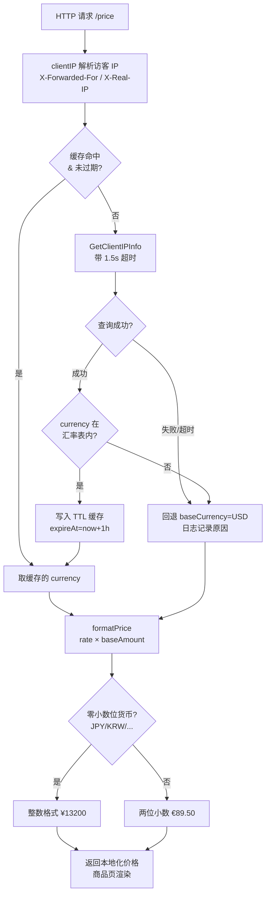

# 💱 货币展示 — 根据访客 IP 自动切换本地货币与价格

> 🛒 食谱编号：currency-display · 适用场景：跨境电商按访客所在国的法定货币展示商品价格，减少结算时的汇率换算摩擦。

## 🧩 场景

你的电商站点面向全球用户，商品在后端以基础货币（比如 `USD` 美元）计价。运营团队提出一个体验诉求：

- 当一位来自日本东京的访客打开商品页时，他看到的应该是 `¥13,200`（日元），而不是 `$99.00 USD` 后还得自己心算汇率。
- 当访客来自欧元区，应显示 `€89.50`；来自英国应显示 `£78.00`。
- 当访客来自货币无法识别的地区，或 ipapi.co 查询失败时，必须**优雅回退**到基础货币 `USD`，而不是抛错导致页面空白。

你当然可以让前端再调一次汇率 API 做换算，但这意味着每个商品页都要多走一跳网络、多承担一次汇率波动的不一致。更好的做法是：**在请求进入业务逻辑前，由后端中间件一次性拿到访客的货币代码（ISO 4217 三字母码）与货币名称，再结合一份本地维护的汇率表换算价格**。

ipapi.co 的响应里直接提供了 `currency`（货币代码，如 `JPY`、`EUR`、`GBP`）和 `currency_name`（如 `Japanese Yen`）两个字段，本食谱的目标是：**复用一个 `ipapi.Client`，在 HTTP 中间件里查到访客货币，叠加一层带 TTL 的缓存与回退逻辑，把"显示价格"这件事变得无状态可扩展**。

## 💡 方案

1. **复用单个 Client**：用 `ipapi.NewClient` 创建带超时与重试的客户端，进程内只建一次，避免每请求新建连接池。
2. **查询访客自身 IP**：使用 `GetClientIPInfo`（不传 IP，由 ipapi.co 根据请求来源自动判定），省去解析 `X-Forwarded-For` 的麻烦。
3. **本地汇率表 + 失败回退**：维护一份 `map[string]float64` 汇率表（基础货币 → 目标货币）。若查到的 `currency` 不在表中，或查询失败，则回退到基础货币 `USD`。
4. **带 TTL 的并发安全缓存**：用 `sync.RWMutex` + 时间戳缓存同一 IP 的查询结果，TTL 设为 1 小时，避免对同一访客反复请求 ipapi.co 配额。
5. **超时兜底**：单次查询用 `context.WithTimeout` 设上限（如 1.5 秒），即使 ipapi.co 慢响应也不阻塞商品页渲染。
6. **价格格式化**：根据货币代码选择符号（`¥`/`€`/`£`/`$`）与小数位（JPY/KRW 等零小数位货币不显示分）。

::: tip 🎨 一图抵千言
端到端流程：HTTP 请求进入 → 解析访客 IP → 查 ipapi.co 拿到 `currency` 字段 → 命中汇率表则换算、未命中或失败则回退 `USD` → 格式化为本地货币展示串 → 返回商品页。


:::

## 🧪 完整代码

```go
package main

import (
	"context"
	"errors"
	"fmt"
	"log"
	"net/http"
	"strconv"
	"strings"
	"sync"
	"time"

	"github.com/cyberspacesec/ipapi.co-skills/pkg/ipapi"
)

// 基础货币：所有商品在后端以它计价。
const baseCurrency = "USD"

// rateTable 是基础货币 → 目标货币的汇率表（1 基础货币 = N 目标货币）。
// 生产环境应从汇率供应商定时拉取，这里用静态值演示。
var rateTable = map[string]float64{
	"USD": 1.0,
	"EUR": 0.90,
	"GBP": 0.79,
	"JPY": 133.0,
	"CNY": 7.18,
	"KRW": 1330.0,
	"INR": 83.0,
	"AUD": 1.52,
	"CAD": 1.36,
}

// currencySymbol 记录货币代码到符号的映射，用于前端展示。
var currencySymbol = map[string]string{
	"USD": "$", "EUR": "€", "GBP": "£", "JPY": "¥",
	"CNY": "¥", "KRW": "₩", "INR": "₹", "AUD": "A$", "CAD": "C$",
}

// zeroDecimalCurrencies 这些货币的最小单位是元本身，不显示小数位（ISO 4217 约定）。
var zeroDecimalCurrencies = map[string]struct{}{
	"JPY": {}, "KRW": {}, "VND": {}, "CLP": {}, "ISK": {}, "HUF": {},
}

// currencyCacheEntry 是单个 IP 的缓存条目。
type currencyCacheEntry struct {
	currency   string
	countryName string
	expireAt   time.Time
}

// priceService 负责把访客 IP 解析为本地货币，并换算价格。
type priceService struct {
	lookup *ipapi.Client

	cacheMu    sync.RWMutex
	cache      map[string]currencyCacheEntry
	cacheTTL   time.Duration
}

func newPriceService(apiKey string) *priceService {
	c := ipapi.NewClient(
		ipapi.WithAPIKey(apiKey),
	)
	c.HTTPClient.Timeout = 5 * time.Second
	c.Retries = 1

	return &priceService{
		lookup:   c,
		cache:    make(map[string]currencyCacheEntry),
		cacheTTL: time.Hour,
	}
}

// resolveCurrency 返回访客应使用的货币代码。
// 失败或货币不在汇率表内时，回退到 baseCurrency。
func (ps *priceService) resolveCurrency(parent context.Context, ip string) (currency, country string) {
	// 1. 命中缓存则直接返回
	ps.cacheMu.RLock()
	if e, ok := ps.cache[ip]; ok && time.Now().Before(e.expireAt) {
		ps.cacheMu.RUnlock()
		return e.currency, e.countryName
	}
	ps.cacheMu.RUnlock()

	// 2. 查询 ipapi.co，带超时
	ctx, cancel := context.WithTimeout(parent, 1500*time.Millisecond)
	defer cancel()

	info, err := ps.lookup.GetClientIPInfo(ctx, string(ipapi.FormatJSON))
	if err != nil {
		// 区分失败类型，便于排查；无论何种失败都回退到基础货币
		reason := "unknown"
		switch {
		case errors.Is(err, ipapi.ErrRateLimited):
			reason = "rate_limited"
		case errors.Is(err, ipapi.ErrServerError):
			reason = "server_error"
		case errors.Is(err, ipapi.ErrInvalidKey):
			reason = "invalid_key"
		case errors.Is(err, ipapi.ErrNotFound):
			reason = "not_found"
		}
		log.Printf("currency-lookup fallback ip=%s reason=%s err=%v", ip, reason, err)
		return baseCurrency, ""
	}

	cur := info.Currency
	if _, ok := rateTable[cur]; !ok {
		// 汇率表里没有该货币，回退
		log.Printf("currency-lookup unknown-currency ip=%s currency=%s -> fallback %s",
			ip, cur, baseCurrency)
		return baseCurrency, info.CountryName
	}

	// 3. 写入缓存
	ps.cacheMu.Lock()
	ps.cache[ip] = currencyCacheEntry{
		currency:    cur,
		countryName: info.CountryName,
		expireAt:    time.Now().Add(ps.cacheTTL),
	}
	ps.cacheMu.Unlock()
	return cur, info.CountryName
}

// formatPrice 把以基础货币计价的金额，换算并格式化为目标货币的展示串。
func formatPrice(baseAmount float64, currency string) string {
	rate, ok := rateTable[currency]
	if !ok || rate == 0 {
		rate = 1.0
		currency = baseCurrency
	}
	amount := baseAmount * rate

	symbol := currencySymbol[currency]
	if symbol == "" {
		symbol = currency + " " // 未知符号时退化为代码前缀
	}

	// 零小数位货币：四舍五入到整数
	if _, zero := zeroDecimalCurrencies[currency]; zero {
		return symbol + strconv.FormatFloat(amount, 'f', 0, 64)
	}
	// 两位小数货币
	return symbol + strconv.FormatFloat(amount, 'f', 2, 64)
}

// priceHandler 演示商品页接口：根据访客货币返回本地化价格。
func (ps *priceService) priceHandler(w http.ResponseWriter, r *http.Request) {
	ip := clientIP(r)
	currency, country := ps.resolveCurrency(r.Context(), ip)

	// 模拟一个商品：基础价 99.00 USD
	const productBasePrice = 99.00
	display := formatPrice(productBasePrice, currency)

	resp := fmt.Sprintf("🛒 商品价格：%s  (访客地区：%s，货币：%s)\n",
		display, fallback(country, "未知"), currency)
	w.Header().Set("Content-Type", "text/plain; charset=utf-8")
	_, _ = w.Write([]byte(resp))
}

// clientIP 解析真实访客 IP，考虑反向代理头。
func clientIP(r *http.Request) string {
	if xff := r.Header.Get("X-Forwarded-For"); xff != "" {
		if idx := strings.Index(xff, ","); idx > 0 {
			return strings.TrimSpace(xff[:idx])
		}
		return strings.TrimSpace(xff)
	}
	if xri := r.Header.Get("X-Real-IP"); xri != "" {
		return strings.TrimSpace(xri)
	}
	// 去掉端口
	addr := r.RemoteAddr
	if i := strings.LastIndex(addr, ":"); i > 0 {
		return addr[:i]
	}
	return addr
}

func fallback(s, def string) string {
	if s == "" {
		return def
	}
	return s
}

func main() {
	ps := newPriceService("YOUR_API_KEY") // 替换为真实密钥

	mux := http.NewServeMux()
	mux.HandleFunc("/price", ps.priceHandler)

	srv := &http.Server{
		Addr:              ":8080",
		Handler:           mux,
		ReadHeaderTimeout: 5 * time.Second,
	}
	log.Println("listening on :8080, try GET /price")
	log.Fatal(srv.ListenAndServe())
}
```

> 💡 运行前请将 `YOUR_API_KEY` 替换为你在 ipapi.co 申请的真实密钥。无密钥模式下免费额度有限，且可能触发 `ErrRateLimited` 导致回退到 USD。

> ⚠️ `GetClientIPInfo` 是由 ipapi.co 根据请求来源 IP 自动判定的，因此示例中虽然解析了 `clientIP`，实际查询用的是访客自身 IP。若你部署在反向代理后，务必保证代理把真实访客 IP 透传给 ipapi.co 的请求（或改用 `GetIPInfo` 显式传入解析后的 IP）。

## 🔍 要点解析

### 🎯 为什么直接读 `currency` / `currency_name` 字段

ipapi.co 已经把"这个 IP 属于哪个国家 → 该国法定货币是什么"这一步映射做完了。SDK 把它们解析为 `IPInfo.Currency`（ISO 4217 三字母码，如 `JPY`）和 `IPInfo.CurrencyName`（全称，如 `Japanese Yen`）。你不需要自己维护一份"国家代码 → 货币代码"的对照表，也不会因为国家增减、货币改制而漏更新。

### ⏱️ 带超时的查询 + 失败回退

`resolveCurrency` 内部用 `context.WithTimeout(parent, 1500*time.Millisecond)`。即使 ipapi.co 偶发慢响应，主请求链路最多等 1.5 秒。超时或出错时，函数返回 `baseCurrency`（`USD`）而非抛错——商品页永远能渲染出一个价格，只是货币可能不是本地最优解。这是"展示场景"应有的取舍：可用性优先于精确性。

### 🗂️ 并发安全的 TTL 缓存

`sync.RWMutex` 配合读多写少的场景：缓存命中走 `RLock` 读路径，未命中才升级为写锁写入。TTL 设为 1 小时，既降低了对 ipapi.co 配额的消耗，也保证了 IP 重新分配后（如移动网络换 NAT）能定期刷新货币判定。过期条目采用惰性删除（命中时发现过期即重查），简单可靠。

### 💰 零小数位货币的特殊处理

ISO 4217 规定日元（JPY）、韩元（KRW）等货币最小单位是元本身，没有"分"。如果统一用两位小数格式化，会得到 `¥13200.00` 这样别扭的展示。`zeroDecimalCurrencies` 集合把它们特殊处理为 `¥13200`，更符合本地习惯。

### 🔐 区分失败类型做排查

SDK 返回的错误是 sentinel error，可用 `errors.Is` 精确匹配 `ErrRateLimited`、`ErrServerError`、`ErrInvalidKey`、`ErrNotFound`。把失败原因写进日志，事后就能回答"那次回退到 USD，是因为限流、服务挂了、还是 API Key 配错了"——这对运营排查"为什么某地区用户总看到美元"非常关键。

::: warning 🛡️ 配额与安全要点
- **缓存是省配额的第一道闸**：本食谱的 TTL 缓存（默认 1 小时）把同一 IP 的重复查询压缩到一次。若去掉缓存，每个商品页请求都打一次 ipapi.co，免费额度会在中等流量下几分钟内耗尽，触发 [`ErrRateLimited`](../api/errors) 反复回退到 USD。
- **API Key 不要写进前端**：`WithAPIKey` 是服务端选项，密钥必须留在后端中间件里。任何把 key 暴露给浏览器/APP 的做法都会被刷量盗用。生产环境建议从环境变量或密钥管理服务读取，不要硬编码（示例里的 `YOUR_API_KEY` 仅为演示）。
- **代理链下谨防 IP 伪造**：`X-Forwarded-For` 可被客户端伪造。若你的服务直接暴露在公网且未经可信反向代理，攻击者可通过伪造 XFF 头把货币判定导向特定国家。务必只在可信代理后启用 XFF 解析，或改用 [`GetIPInfo`](../api/get-ip-info) 显式传入可信来源 IP。
- **汇率表要定时刷新**：静态 `rateTable` 仅适合演示。生产环境必须从汇率供应商定时同步，否则展示价会随汇率波动失真，可能引发用户投诉甚至合规问题（部分国家对价格展示精度有要求）。
:::

## 🚀 扩展

- **汇率自动刷新**：把静态 `rateTable` 换成定时任务拉取的汇率（如每天一次从汇率供应商同步），写入同样的 `map` 并加锁替换。注意保留 `USD` 恒为 `1.0` 的不变量。
- **显式传入 IP**：若部署在多层代理后，`GetClientIPInfo` 拿到的可能是代理 IP。可改用 `GetIPInfo(ctx, ip, format)`，把 `clientIP` 解析结果显式传入，结果更准确。参见 [`](../guide/client-ip`](../guide/client-ip)。
- **用户手动切换货币**：在 Cookie 或会话里记录用户主动选择的货币，优先级高于 IP 判定。这样旅居海外的用户也能强制切回本国货币。
- **批量预渲染**：对于热门商品列表页，可在缓存层预先算好各主要货币的展示价，命中时直接返回，省去运行时乘法。
- **结合 `country_code` 做合规分流**：某些国家禁止展示特定商品（如酒精、电子烟）。可在拿到 `info.CountryCode` 后叠加一层合规过滤，再决定是否展示价格。
- **限流保护配额**：高流量站点可给 `Client.RateLimiter` 信道注入令牌，把对 ipapi.co 的请求速率限制在免费/付费额度内，避免 `ErrRateLimited`。
- **降级到本地 GeoIP 库**：对可用性要求极高的场景，可在 ipapi.co 不可达时降级读取本地 GeoIP 库（如 MaxMind GeoLite2）拿到国家代码，再用本地货币对照表兜底。

## 🔗 相关

- 📖 客户端概念：[`](../guide/client-concept`](../guide/client-concept)
- 📖 查询访客自身 IP：[`](../guide/client-ip`](../guide/client-ip)
- 📖 上下文与超时：[`](../guide/context`](../guide/context)
- 📖 认证方式：[`](../guide/auth-concept`](../guide/auth-concept)
- 📖 重试与限流：[`](../guide/retry-concept`](../guide/retry-concept)
- 📖 错误处理思路：[`](../guide/error-concept`](../guide/error-concept)
- 🔧 `GetClientIPInfo` 接口：[`](../api/get-client-ip-info`](../api/get-client-ip-info)
- 🔧 `GetIPInfo` 接口：[`](../api/get-ip-info`](../api/get-ip-info)
- 🔧 `IPInfo` 数据模型（含 `Currency`、`CurrencyName`）：[`](../api/models`](../api/models)
- 🔧 客户端选项（`WithAPIKey` 等）：[`](../api/options`](../api/options)
- 🔧 货币字段说明：[`](../api/field-currency`](../api/field-currency)
- 🔧 错误列表：[`](../api/errors`](../api/errors)
- 🧪 基础用法示例：[`](../examples/basic-usage`](../examples/basic-usage)
- 🧪 查询访客 IP 示例：[`](../examples/lookup-client-ip`](../examples/lookup-client-ip)
- 🧪 带 API Key 示例：[`](../examples/with-api-key`](../examples/with-api-key)
- 🧪 错误处理示例：[`](../examples/error-handling`](../examples/error-handling)
- 🧪 批量查询示例：[`](../examples/batch-lookup`](../examples/batch-lookup)
```
