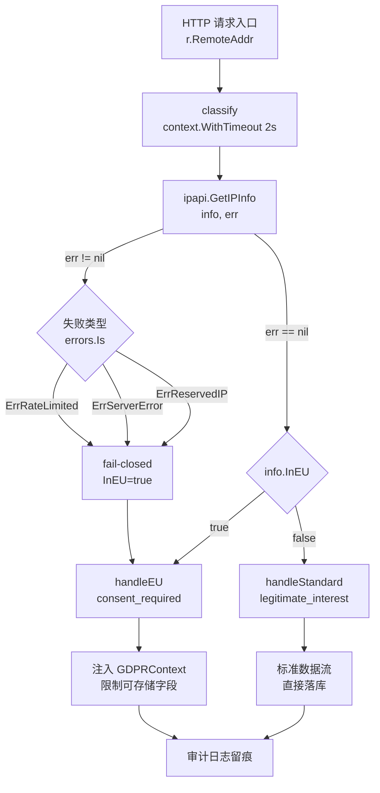

# 🇪🇺 欧盟合规 — 用 `in_eu` 字段判断是否需 GDPR 流程

> 🛡️ 食谱编号：eu-compliance · 适用场景：根据访客地理位置自动判定是否触发欧盟数据保护合规流程。

## 🧩 场景

你的服务面向全球用户，但需要遵守《通用数据保护条例》（GDPR）。运营团队提出一个硬性要求：

- 当访问者的 IP 地址归属于欧盟（EU）或欧洲经济区（EEA）境内时，必须**在落库前**完成 GDPR 合规动作，例如展示 Cookie 同意横幅、记录合法处理依据、限制可存储的字段、提供数据可携带与被遗忘权利接口。
- 当访问者来自欧盟之外时，走简化数据流，不强制触发上述流程。

你当然不想维护一份包含几十个国家代码的硬编码白名单——那样既容易漏掉新加入的成员国，也无法覆盖 EEA（冰岛、列支敦士登、挪威）与瑞士这类"非 EU 但适用 GDPR"的边缘情况。ipapi.co 在响应里直接提供了布尔字段 `in_eu`，由它来回答"这个 IP 是否处于 GDPR 适用区域"。

本食谱的目标是：**在请求中间件里并行查询 IP 归属，依据 `in_eu` 标志分流到"合规处理"或"标准处理"两条链路**，并保证查询失败时按合规保守处理。

## 💡 方案

1. **复用单个 Client**：用 `ipapi.NewClient` 创建带超时与重试的客户端，避免每次请求新建连接池。
2. **并发查询 + 超时兜底**：用 `context.WithTimeout` 给单次 IP 查询设置上限（如 2 秒）。即使 ipapi.co 偶发慢响应，也不会拖垮主请求链路。
3. **保守失败策略**：查询出错或超时时，**默认按欧盟用户处理**（fail-closed）。合规场景下宁可多弹一次 Cookie 横幅，也不能漏判。
4. **分流处理**：根据 `info.InEU` 走两条分支——
   - 🟢 `false`：标准处理，直接落库。
   - 🔴 `true`：合规处理，注入 `GDPRContext`，限制可存储字段，记录处理依据。
5. **记录审计痕迹**：把判定结果、命中字段、判定时间写入审计日志，便于事后证明"我们基于地理位置做了差异化处理"。

::: tip 🎨 一图抵千言
下图展示从请求入口到分流处理的端到端流程，重点突出 `in_eu` 判定与保守失败（fail-closed）两条兜底路径。


:::

::: warning ⚠️ 配额与可靠性
保守失败策略意味着 ipapi.co 不可用时会**把所有访客当欧盟用户处理**——这安全但代价是横幅轰炸。生产环境务必：
- 配置 [`RateLimiter`](../api/options) 避免打爆免费配额触发 [`ErrRateLimited`](../api/errors)；
- 设置 [`Retries`](../api/client) 兜底网络抖动（SDK 仅对网络错误与 5xx 重试，429 不重试）；
- 高可用场景叠加本地 GeoIP 兜底，降低 fail-closed 触发频率。
:::

## 🧪 完整代码

```go
package main

import (
	"context"
	"encoding/json"
	"errors"
	"log"
	"net/http"
	"sync"
	"time"

	"github.com/cyberspacesec/ipapi.co-skills/pkg/ipapi"
)

// GDPRContext 携带合规判定结果，贯穿下游处理链路。
type GDPRContext struct {
	InEU          bool      `json:"in_eu"`
	Country       string    `json:"country"`
	CountryName   string    `json:"country_name"`
	DeterminedAt  time.Time `json:"determined_at"`
	LookupOK      bool      `json:"lookup_ok"`     // 查询是否成功；失败时按 true 兜底
	FailReason    string    `json:"fail_reason"`   // 若失败，记录原因
	LegalBasis    string    `json:"legal_basis"`   // 合法处理依据，仅 EU 用户
}

// complianceClient 在多个 HTTP 请求间复用同一个 ipapi 客户端。
type complianceClient struct {
	lookup *ipapi.Client
}

func newComplianceClient(apiKey string) *complianceClient {
	c := ipapi.NewClient(
		ipapi.WithAPIKey(apiKey),
	)
	// 复用底层 HTTP 客户端，统一超时
	c.HTTPClient.Timeout = 5 * time.Second
	c.Retries = 1
	return &complianceClient{lookup: c}
}

// classify 判定单个 IP 是否处于 GDPR 适用区域。
// 注意：失败时返回的 GDPRContext.InEU 恒为 true（保守策略）。
func (cc *complianceClient) classify(parent context.Context, ip string) GDPRContext {
	ctx, cancel := context.WithTimeout(parent, 2*time.Second)
	defer cancel()

	info, err := cc.lookup.GetIPInfo(ctx, ip, string(ipapi.FormatJSON))
	if err != nil {
		// 区分"保留 IP/格式错误"与"网络/限流错误"两类失败
		reason := "unknown"
		switch {
		case errors.Is(err, ipapi.ErrRateLimited):
			reason = "rate_limited"
		case errors.Is(err, ipapi.ErrReservedIP):
			reason = "reserved_ip"
		case errors.Is(err, ipapi.ErrServerError):
			reason = "server_error"
		}
		return GDPRContext{
			InEU:         true, // 保守：查询失败按欧盟用户处理
			DeterminedAt: time.Now().UTC(),
			LookupOK:     false,
			FailReason:   reason,
			LegalBasis:   "consent_pending", // 待用户明确同意
		}
	}

	gc := GDPRContext{
		InEU:         info.InEU,
		Country:      info.Country,
		CountryName:  info.CountryName,
		DeterminedAt: info.RetrievedAt,
		LookupOK:     true,
	}
	if info.InEU {
		gc.LegalBasis = "consent_required"
	} else {
		gc.LegalBasis = "legitimate_interest"
	}
	return gc
}

// handle 是请求处理入口：先判定合规性，再分流处理。
func (cc *complianceClient) handle(w http.ResponseWriter, r *http.Request) {
	ip := r.RemoteAddr // 生产环境应解析 X-Forwarded-For 等头
	gc := cc.classify(r.Context(), ip)

	// 审计日志：留痕以证明差异化处理的依据
	audit, _ := json.Marshal(gc)
	log.Printf("gdpr-audit ip=%s in_eu=%v ok=%v ctx=%s", ip, gc.InEU, gc.LookupOK, audit)

	if gc.InEU {
		cc.handleEU(w, r, gc)
		return
	}
	cc.handleStandard(w, r, gc)
}

// handleEU 处理欧盟/EEA 访客：必须先获得同意。
func (cc *complianceClient) handleEU(w http.ResponseWriter, _ *http.Request, gc GDPRContext) {
	// 1. 下发 Cookie 同意横幅标记
	w.Header().Set("X-GDPR-Consent-Required", "true")
	// 2. 限制可存储字段：只保留必要数据，不写入精确地理位置
	resp := map[string]string{
		"status":       "ok",
		"message":      "服务可用，已触发 GDPR 同意流程",
		"legal_basis":  gc.LegalBasis,
		"country":      gc.Country,
	}
	w.Header().Set("Content-Type", "application/json")
	_ = json.NewEncoder(w).Encode(resp)
}

// handleStandard 处理非欧盟访客：标准数据流。
func (cc *complianceClient) handleStandard(w http.ResponseWriter, _ *http.Request, gc GDPRContext) {
	resp := map[string]string{
		"status":       "ok",
		"legal_basis":  gc.LegalBasis,
		"country":      gc.CountryName,
	}
	w.Header().Set("Content-Type", "application/json")
	_ = json.NewEncoder(w).Encode(resp)
}

// classifyBatch 演示对一批 IP 并发判定，结果与输入顺序对齐。
func (cc *complianceClient) classifyBatch(parent context.Context, ips []string) []GDPRContext {
	results := make([]GDPRContext, len(ips))
	var wg sync.WaitGroup
	for i, ip := range ips {
		wg.Add(1)
		go func(idx int, addr string) {
			defer wg.Done()
			results[idx] = cc.classify(parent, addr)
		}(i, ip)
	}
	wg.Wait()
	return results
}

func main() {
	cc := newComplianceClient("YOUR_API_KEY") // 替换为真实密钥

	// 演示批量判定
	ctx := context.Background()
	batch := []string{"8.8.8.8", "1.1.1.1", "212.58.244.26"} // US / AU / UK
	for i, gc := range cc.classifyBatch(ctx, batch) {
		log.Printf("[%d] ip=%s in_eu=%v country=%s ok=%v",
			i, batch[i], gc.InEU, gc.Country, gc.LookupOK)
	}

	// 启动 HTTP 服务
	mux := http.NewServeMux()
	mux.HandleFunc("/", cc.handle)
	srv := &http.Server{
		Addr:              ":8080",
		Handler:           mux,
		ReadHeaderTimeout: 5 * time.Second,
	}
	log.Println("listening on :8080")
	log.Fatal(srv.ListenAndServe())
}
```

> 💡 运行前请将 `YOUR_API_KEY` 替换为你在 ipapi.co 申请的真实密钥。无密钥模式下免费额度有限，且可能触发 `ErrRateLimited`。

## 🔍 要点解析

### 🎯 为什么用 `in_eu` 而不是维护国家白名单

ipapi.co 的 `in_eu` 字段已经把 EU 成员国 + EEA 国家 + 瑞士等 GDPR 实际适用区域打包判定好。它由服务端持续维护，比在代码里硬编码 `country == "DE" || country == "FR" ...` 更可靠，也更能跟随欧盟扩张自动更新。SDK 把该字段解析为 `IPInfo.InEU`（`bool` 类型），可直接用于条件分支。

### ⏱️ 超时与并发

`classify` 内部用 `context.WithTimeout(parent, 2*time.Second)` 派生子上下文。即使 ipapi.co 偶发慢响应，`defer cancel()` 也会在主请求结束前释放资源。`classifyBatch` 用 `sync.WaitGroup` 并发查询一批 IP，结果按索引写回切片，保证顺序对齐。

### 🛡️ 保守失败策略（fail-closed）

合规场景下，"查不到"不等于"不需要合规"。代码里 `LookupOK=false` 时强制把 `InEU` 置为 `true`，让访客落入更严格的 `handleEU` 分支。这样最坏情况只是给非欧盟用户多弹一次同意横幅，而不会漏判欧盟用户、留下合规漏洞。

### 🧾 区分失败类型

SDK 返回的错误是 sentinel error（`ErrRateLimited`、`ErrReservedIP`、`ErrServerError` 等），可用 `errors.Is` 精确匹配。把失败原因写进 `FailReason`，审计日志就能回答"那次按欧盟处理是因为限流还是因为服务挂了"。

### 📋 合法处理依据

不同分支附带不同的 `LegalBasis`：欧盟用户标 `consent_required`（需获得同意），非欧盟用户标 `legitimate_interest`（合法利益）。这对应 GDPR 第 6 条的合法处理依据列举，方便下游落库时区分。

## 🚀 扩展

- **缓存判定结果**：同一个 IP 短时间内反复判定是浪费。可加一层 `sync.Map` 或 Redis 缓存，键为 IP、值为 `GDPRContext`，TTL 设为 1 小时。注意缓存过期后要重新判定，避免 IP 重新分配导致误判。
- **解析代理头**：生产环境 `r.RemoteAddr` 往往是上游代理的地址，应解析 `X-Forwarded-For` / `X-Real-IP`，并校验可信代理链，防止用户伪造头绕过判定。
- **结合 `country_code` 做精细豁免**：某些业务（如电子烟、博彩）对特定欧盟国家有额外限制。可在 `handleEU` 内再按 `info.CountryCode` 二次分流。
- **批量预判定**：对于日志分析、历史数据迁移等离线场景，用 `classifyBatch` 并发处理整段 IP 列表，配合限流器（`Client.RateLimiter`）避免打爆 ipapi.co 配额。
- **失败降级到 GeoIP 本地库**：若对可用性要求极高，可在 ipapi.co 不可达时降级读取本地 GeoIP 数据库（如 MaxMind GeoLite2）作为兜底，进一步降低漏判风险。
- **记录"被遗忘"请求**：欧盟用户行使被遗忘权时，需删除其历史数据。可在此中间件之外再起一个删除接口，依据此前审计日志中记录的 `country` 字段定位数据范围。

## 🔗 相关

- 📖 客户端概念：[`](../guide/client-concept`](../guide/client-concept)
- 📖 错误处理思路：[`](../guide/error-concept`](../guide/error-concept)
- 📖 重试与限流：[`](../guide/retry-concept`](../guide/retry-concept)
- 📖 认证方式：[`](../guide/auth-concept`](../guide/auth-concept)
- 📖 上下文与超时：[`](../guide/context`](../guide/context)
- 🔧 `GetIPInfo` 接口：[`](../api/get-ip-info`](../api/get-ip-info)
- 🔧 `IPInfo` 数据模型（含 `InEU` 字段）：[`](../api/models`](../api/models)
- 🔧 客户端选项：[`](../api/options`](../api/options)
- 🔧 错误列表：[`](../api/errors`](../api/errors)
- 🧪 基础用法示例：[`](../examples/basic-usage`](../examples/basic-usage)
- 🧪 错误处理示例：[`](../examples/error-handling`](../examples/error-handling)
- 🧪 批量查询示例：[`](../examples/batch-lookup`](../examples/batch-lookup)
- 🧪 带 API Key 示例：[`](../examples/with-api-key`](../examples/with-api-key)
