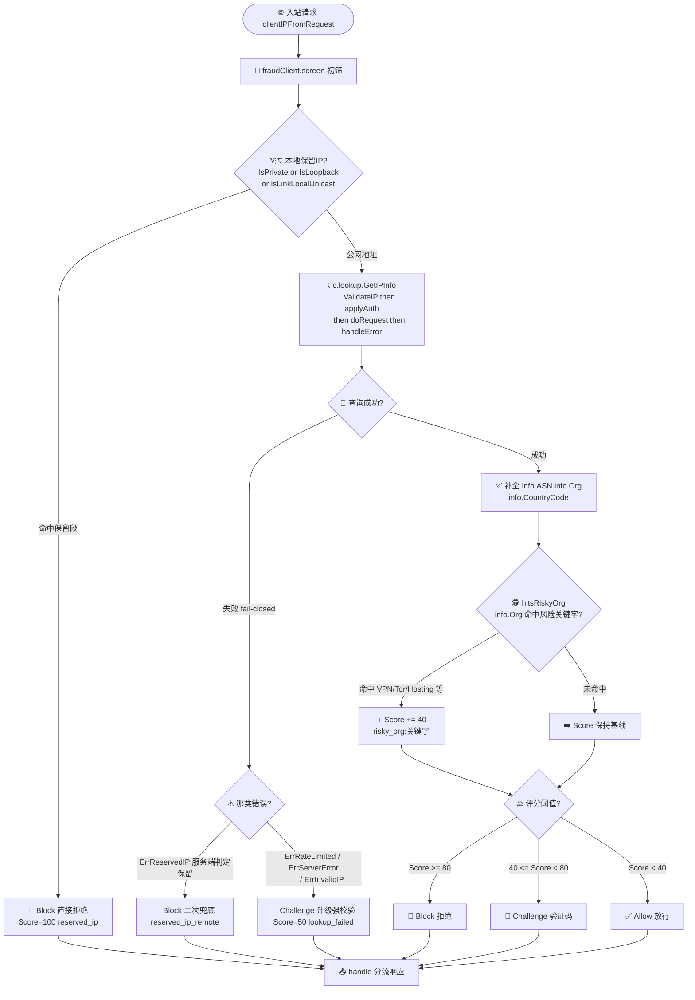

# 🛡️ 风控初筛 — 保留 IP + ASN 异常检测

> 🚨 食谱编号：fraud-detection · 适用场景：在登录、注册、下单等关键动作前对请求来源做一次轻量风控初筛，拦截伪造 IP、内网渗透与高风险 ASN 流量。

## 🧩 场景

你的业务最近频繁遭遇几类可疑流量：

- 🕵️ 注册接口被刷：一批账号注册时 `X-Forwarded-For` 头里带着 `10.0.0.5`、`192.168.1.1` 这类**私有/保留地址**，试图绕过基于地理的风控规则，或冒充"内网管理流量"获取特权路径。
- ☁️ 撞库攻击来自云厂商：登录失败暴增，溯源 IP 全部归属于某几个**云/IDC ASN**（VPS、代理出口、Tor 出口节点），显然不是真实终端用户。
- 🌍 异地登录告警：某账号注册地与本次登录 IP 的国家/ASN 跨度过大，需要二次验证。

风控规则往往很重（图引擎、设备指纹、行为序列），不适合放在每个请求的最前置。你需要一道**轻量初筛**：在进入业务逻辑之前，用 IP 归属信息快速判定"这条请求要不要直接拦掉、要不要升级到强校验"。ipapi.co 的响应里同时带 `asn`、`org`、`country`，加上对保留 IP 的错误反馈，恰好能支撑这道初筛。

本食谱的目标是：**对入站请求的客户端 IP 做一次本地预判 + 远程查询组合风控，输出风险等级与命中规则，供下游分流处理**。

## 💡 方案

::: tip 🎨 一图抵千言
下面这张流程图概括了风控初筛的完整路径：先在本地零开销拦截保留 IP，再经 `GetIPInfo` 远程查询补全 ASN/Org，最后按命中规则累加评分分流到放行/挑战/拦截。
:::



1. **本地预判保留 IP**：先用 `net.IP` 的 `IsPrivate()`、`IsLoopback()`、`IsUnspecified()`、`IsLinkLocalUnicast()` 在本地拦截私有/回环/链路本地地址——这一步零网络开销，且不必消耗 ipapi.co 配额。
2. **远程查询补全归属**：通过 `ipapi.NewClient` 创建带超时与重试的客户端，调用 `GetIPInfo` 取回 `ASN`、`Org`、`CountryCode` 等字段。
3. **ASN 异常清单**：维护一份"高风险 ASN/组织"清单（如已知代理出口、Tor 出口、滥用较多的 VPS 厂商），用 `strings.Contains` 对 `info.Org` 做模糊命中，规避 ASN 字符串前缀差异（`AS12345` vs `12345`）。
4. **风险评分分流**：把命中规则汇总为一个 `RiskScore`，按分值分流——`Block`（直接拒绝）、`Challenge`（触发验证码/二次验证）、`Allow`（放行）。
5. **保守失败策略**：查询超时或限流时，**降级为 `Challenge`**（fail-closed），既不武断拦截真实用户，也不放行可能的风险流量。
6. **并发批量预判**：对一批 IP（如离线日志回填）用 `sync.WaitGroup` 并发查询，配合限流器避免打爆配额。

## 🧪 完整代码

```go
package main

import (
	"context"
	"errors"
	"fmt"
	"log"
	"net"
	"net/http"
	"strings"
	"sync"
	"time"

	"github.com/cyberspacesec/ipapi.co-skills/pkg/ipapi"
)

// RiskLevel 风险等级。
type RiskLevel int

const (
	RiskAllow    RiskLevel = iota // 放行
	RiskChallenge                 // 触发验证码/二次验证
	RiskBlock                     // 直接拒绝
)

// String 便于日志输出。
func (r RiskLevel) String() string {
	switch r {
	case RiskAllow:
		return "ALLOW"
	case RiskChallenge:
		return "CHALLENGE"
	case RiskBlock:
		return "BLOCK"
	}
	return "UNKNOWN"
}

// RiskDecision 风控初筛结果。
type RiskDecision struct {
	IP            string    `json:"ip"`
	Level         RiskLevel `json:"level"`
	Score         int       `json:"score"`           // 0~100，越高越危险
	HitRules      []string  `json:"hit_rules"`       // 命中的规则名
	CountryCode   string    `json:"country_code"`    // 归属国家代码
	ASN           string    `json:"asn"`             // 自治系统号
	Org           string    `json:"org"`             // 组织名
	ReservedLocal bool      `json:"reserved_local"`  // 是否本地判定的保留地址
	LookupOK      bool      `json:"lookup_ok"`       // 远程查询是否成功
	FailReason    string    `json:"fail_reason"`     // 失败原因
	DeterminedAt  time.Time `json:"determined_at"`
}

// 风险 ASN / 组织关键字清单。
// 实际生产中应从配置中心或威胁情报源动态加载，并定期更新。
var riskyOrgKeywords = []string{
	"tor",           // Tor 出口节点
	"vpn",           // 公共 VPN 服务商
	"hosting",       // 主机托管商
	"data center",   // 数据中心
	"datacenter",
	"cloud",
	"server",
	"vps",
	"ovh",           // 常被滥用的 VPS 厂商
	"m247",
	"choopa",
	"leaseweb",
	"online s.a.s.",
}

// fraudClient 复用同一个 ipapi 客户端做风控查询。
type fraudClient struct {
	lookup *ipapi.Client
}

func newFraudClient(apiKey string) *fraudClient {
	c := ipapi.NewClient(
		ipapi.WithAPIKey(apiKey),
	)
	c.HTTPClient.Timeout = 5 * time.Second
	c.Retries = 1 // 风控路径快失败，少重试
	return &fraudClient{lookup: c}
}

// isReservedIP 本地预判私有/回环/未指定/链路本地地址。
// 这一步在调用 ipapi.co 之前完成，避免消耗配额。
func isReservedIP(ipStr string) (net.IP, bool) {
	ip := net.ParseIP(ipStr)
	if ip == nil {
		return nil, false
	}
	switch {
	case ip.IsLoopback(), ip.IsUnspecified(), ip.IsLinkLocalUnicast(),
		ip.IsLinkLocalMulticast(), ip.IsPrivate(), ip.IsMulticast():
		return ip, true
	}
	return ip, false
}

// hitsRiskyOrg 检查组织名是否命中风险关键字（大小写不敏感）。
func hitsRiskyOrg(org string) (string, bool) {
	if org == "" {
		return "", false
	}
	lower := strings.ToLower(org)
	for _, kw := range riskyOrgKeywords {
		if strings.Contains(lower, kw) {
			return kw, true
		}
	}
	return "", false
}

// screen 对单个 IP 做风控初筛。
func (fc *fraudClient) screen(parent context.Context, ipStr string) RiskDecision {
	d := RiskDecision{
		IP:           ipStr,
		DeterminedAt: time.Now().UTC(),
	}

	// 第一步：本地预判保留地址。命中即直接 Block，无需远程查询。
	if ip, reserved := isReservedIP(ipStr); reserved {
		d.ReservedLocal = true
		d.Level = RiskBlock
		d.Score = 100
		d.HitRules = append(d.HitRules, "reserved_ip")
		// 顺便标注是哪类保留地址，便于排查
		switch {
		case ip.IsLoopback():
			d.HitRules = append(d.HitRules, "loopback")
		case ip.IsPrivate():
			d.HitRules = append(d.HitRules, "private")
		case ip.IsLinkLocalUnicast():
			d.HitRules = append(d.HitRules, "link_local")
		case ip.IsMulticast():
			d.HitRules = append(d.HitRules, "multicast")
		case ip.IsUnspecified():
			d.HitRules = append(d.HitRules, "unspecified")
		}
		return d
	}

	// 第二步：远程查询补全 ASN / 组织 / 国家。
	ctx, cancel := context.WithTimeout(parent, 2*time.Second)
	defer cancel()

	info, err := fc.lookup.GetIPInfo(ctx, ipStr, string(ipapi.FormatJSON))
	if err != nil {
		// 查询失败：fail-closed，降级为 Challenge
		reason := "unknown"
		switch {
		case errors.Is(err, ipapi.ErrRateLimited):
			reason = "rate_limited"
		case errors.Is(err, ipapi.ErrReservedIP):
			// 服务端也判定为保留地址（本地没拦到，比如 IPv6 特殊段）
			reason = "reserved_ip_remote"
			d.ReservedLocal = true
			d.Level = RiskBlock
			d.Score = 100
			d.HitRules = append(d.HitRules, "reserved_ip_remote")
			d.FailReason = reason
			return d
		case errors.Is(err, ipapi.ErrServerError):
			reason = "server_error"
		case errors.Is(err, ipapi.ErrInvalidIP):
			reason = "invalid_ip"
		}
		d.LookupOK = false
		d.FailReason = reason
		d.Level = RiskChallenge
		d.Score = 50 // 不确定，升级到强校验
		d.HitRules = append(d.HitRules, "lookup_failed:"+reason)
		return d
	}

	d.LookupOK = true
	d.CountryCode = info.CountryCode
	d.ASN = info.ASN
	d.Org = info.Org

	// 第三步：ASN / 组织异常检测。
	if kw, hit := hitsRiskyOrg(info.Org); hit {
		d.HitRules = append(d.HitRules, "risky_org:"+kw)
		d.Score += 40
	}

	// 第四步：综合评分定级。
	switch {
	case d.Score >= 80:
		d.Level = RiskBlock
	case d.Score >= 40:
		d.Level = RiskChallenge
	default:
		d.Level = RiskAllow
	}
	return d
}

// handle 是请求处理入口：先做风控初筛，再分流。
func (fc *fraudClient) handle(w http.ResponseWriter, r *http.Request) {
	ip := clientIPFromRequest(r) // 解析真实客户端 IP
	decision := fc.screen(r.Context(), ip)

	log.Printf("fraud-screen ip=%s level=%s score=%d hits=%v asn=%s org=%q",
		decision.IP, decision.Level, decision.Score, decision.HitRules,
		decision.ASN, decision.Org)

	switch decision.Level {
	case RiskBlock:
		w.Header().Set("Content-Type", "application/json")
		w.WriteHeader(http.StatusForbidden)
		_, _ = fmt.Fprintf(w, `{"status":"blocked","reason":%q}`, strings.Join(decision.HitRules, ","))
	case RiskChallenge:
		w.Header().Set("X-Risk-Challenge", "true")
		w.Header().Set("Content-Type", "application/json")
		_, _ = w.Write([]byte(`{"status":"challenge_required","next":"/captcha"}`))
	default:
		w.Header().Set("Content-Type", "application/json")
		_, _ = w.Write([]byte(`{"status":"ok"}`))
	}
}

// screenBatch 并发初筛一批 IP，结果与输入顺序对齐。
func (fc *fraudClient) screenBatch(parent context.Context, ips []string) []RiskDecision {
	results := make([]RiskDecision, len(ips))
	var wg sync.WaitGroup
	for i, ip := range ips {
		wg.Add(1)
		go func(idx int, addr string) {
			defer wg.Done()
			results[idx] = fc.screen(parent, addr)
		}(i, ip)
	}
	wg.Wait()
	return results
}

// clientIPFromRequest 从请求里解析真实客户端 IP。
// 注意：X-Forwarded-For 可被伪造，生产环境务必只信任可信代理链。
func clientIPFromRequest(r *http.Request) string {
	if xff := r.Header.Get("X-Forwarded-For"); xff != "" {
		// 取链中第一个地址（最原始的客户端）
		if idx := strings.IndexByte(xff, ','); idx >= 0 {
			return strings.TrimSpace(xff[:idx])
		}
		return strings.TrimSpace(xff)
	}
	if xri := r.Header.Get("X-Real-IP"); xri != "" {
		return strings.TrimSpace(xri)
	}
	host, _, err := net.SplitHostPort(r.RemoteAddr)
	if err != nil {
		return r.RemoteAddr
	}
	return host
}

func main() {
	fc := newFraudClient("YOUR_API_KEY") // 替换为真实密钥

	// 演示批量初筛：混合公网、保留、云厂商 IP
	ctx := context.Background()
	samples := []string{
		"8.8.8.8",        // Google DNS，公网
		"10.0.0.5",       // 私有，本地拦截
		"127.0.0.1",      // 回环，本地拦截
		"203.0.113.42",   // 测试网段（文档用途）
	}
	for i, d := range fc.screenBatch(ctx, samples) {
		log.Printf("[%d] ip=%s level=%s score=%d hits=%v reserved=%v ok=%v",
			i, d.IP, d.Level, d.Score, d.HitRules, d.ReservedLocal, d.LookupOK)
	}

	// 启动 HTTP 服务
	mux := http.NewServeMux()
	mux.HandleFunc("/", fc.handle)
	srv := &http.Server{
		Addr:              ":8080",
		Handler:           mux,
		ReadHeaderTimeout: 5 * time.Second,
	}
	log.Println("listening on :8080")
	log.Fatal(srv.ListenAndServe())
}
```

> 💡 运行前请将 `YOUR_API_KEY` 替换为你在 ipapi.co 申请的真实密钥。无密钥模式下免费额度有限，且可能触发 `ErrRateLimited`，导致大量请求落入 `Challenge` 兜底分支。

## 🔍 要点解析

### 🎯 为什么先本地预判保留 IP

保留地址（`10.0.0.0/8`、`192.168.0.0/16`、`127.0.0.0/8` 等）没有公网地理意义，把它们发给 ipapi.co 既浪费配额，也会得到 `ErrReservedIP`。`net.IP` 提供了 `IsPrivate()`、`IsLoopback()`、`IsLinkLocalUnicast()` 等方法，零开销就能判定。这道预判还能挡住伪造 `X-Forwarded-For: 10.0.0.5` 试图冒充内网流量的攻击。

::: warning ⚠️ 本地预判不能替代服务端校验
`ipapi.ValidateIP` 只判断格式合法性，保留判断在服务端完成。本地 `net.IP` 方法覆盖 IPv4 私有段与 IPv6 的 `fc00::/7`、`::1` 等，但对于某些特殊用途段（如 `203.0.113.0/24` 文档网段）不会标记为保留。因此远程查询返回 `ErrReservedIP` 时，代码里也做了二次兜底拦截。
:::

### 📡 ASN 异常检测的模糊匹配

ipapi.co 返回的 `Org` 字段是组织全名（如 `Google LLC`、`OVH SAS`、`M247 Europe SRL`），不同 ASN 的组织名格式不一。用 `strings.Contains` 配合小写关键字清单做模糊命中，比硬编码 ASN 号（`AS15169`）更稳健——组织改名或换号时仍能命中。关键字清单应来自威胁情报或历史滥用记录，并定期更新。

### 🛡️ 保守失败策略（fail-closed）

风控场景下，"查不到"不能等于"安全"。代码里远程查询失败时，`Level` 被设为 `RiskChallenge`、`Score` 设为 50——既不武断 `Block`（怕误伤真实用户），也绝不 `Allow`（怕放行风险流量），而是把请求推到验证码/二次验证分支。对于服务端返回的 `ErrReservedIP`（本地没拦到、服务端判定保留的特殊段），则直接 `Block`。

### 🧾 区分失败类型

SDK 返回的 sentinel error（`ErrRateLimited`、`ErrReservedIP`、`ErrServerError`、`ErrInvalidIP`）可用 `errors.Is` 精确匹配。把失败原因写进 `FailReason` 与 `HitRules`，审计日志就能回答"那次 Challenge 是因为限流还是服务挂了"，便于事后调参。

### ⚖️ 评分阈值与分流

示例阈值（`>=80` Block、`>=40` Challenge、其余 Allow）仅作演示。真实业务应基于历史样本回测调优：把已知黑样本与白样本跑一遍，取使**漏报率与误报率均衡**的阈值。命中多条规则时分数累加，天然支持"多信号叠加才升级"的策略。

### 🔗 解析真实客户端 IP

`r.RemoteAddr` 在反代后是上游代理的地址，必须解析 `X-Forwarded-For` / `X-Real-IP`。但这两个头**可被客户端伪造**——生产环境务必只信任你自己部署的可信代理链（如 Cloudflare → Nginx → 应用），逐跳校验来源 IP 是否在可信代理白名单内，否则攻击者可伪造头绕过 ASN 风控。

## 🚀 扩展

- **维护 ASN 黑/白名单**：把 `riskyOrgKeywords` 升级为带 ASN 号的精确清单（如 `AS24940 → OVH`），配合 `info.ASN` 精确匹配，避免关键字误伤。详见 [`asn-blocklist`](./asn-blocklist) 食谱。
- **结合异地登录检测**：把账号上次登录的 `CountryCode` / `ASN` 与本次比对，跨度过大时升级 `Challenge`。需要把历史归属落库（注意保留 IP 不落地理字段）。
- **缓存查询结果**：同一 IP 短时间内反复初筛是浪费。加一层 `sync.Map` 或 Redis 缓存，键为 IP、值为 `RiskDecision`，TTL 设为 10~30 分钟。注意 IP 重新分配后缓存需过期。
- **限流保护配额**：批量场景下用 `Client.RateLimiter`（`<-chan time.Time`）控制并发，避免打爆 ipapi.co 免费额度触发 `ErrRateLimited`。
- **接威胁情报源**：把 `riskyOrgKeywords` 替换为外部威胁情报订阅（ AbuseIPDB、Spamhaus 等），按 ASN 动态拉取高风险清单。
- **降级到本地 GeoIP**：对可用性要求极高的场景，可在 ipapi.co 不可达时降级读取本地 GeoIP 数据库（如 MaxMind GeoLite2）补全国家，但 ASN 信息通常不如 ipapi.co 完整。
- **异步落审计**：把 `RiskDecision` 通过 channel 推到后台 worker 落库，避免风控初筛阻塞主请求链路。

## 🔗 相关

- 📖 客户端概念：[`](../guide/client-concept`](../guide/client-concept)
- 📖 错误处理思路：[`](../guide/error-concept`](../guide/error-concept)
- 📖 重试与限流：[`](../guide/retry-concept`](../guide/retry-concept)
- 📖 认证方式：[`](../guide/auth-concept`](../guide/auth-concept)
- 📖 上下文与超时：[`](../guide/context`](../guide/context)
- 📖 保留 IP 地址：[`](../guide/reserved-ip`](../guide/reserved-ip)
- 🔧 `GetIPInfo` 接口：[`](../api/get-ip-info`](../api/get-ip-info)
- 🔧 ASN / 组织字段：[`](../api/field-asn`](../api/field-asn)
- 🔧 `IPInfo` 数据模型：[`](../api/models`](../api/models)
- 🔧 客户端选项：[`](../api/options`](../api/options)
- 🔧 错误列表（含 `ErrReservedIP`）：[`](../api/errors`](../api/errors)
- 🔧 `ValidateIP`：[`](../api/validate-ip`](../api/validate-ip)
- 🧪 基础用法示例：[`](../examples/basic-usage`](../examples/basic-usage)
- 🧪 错误处理示例：[`](../examples/error-handling`](../examples/error-handling)
- 🧪 批量查询示例：[`](../examples/batch-lookup`](../examples/batch-lookup)
- 🧪 带 API Key 示例：[`](../examples/with-api-key`](../examples/with-api-key)
