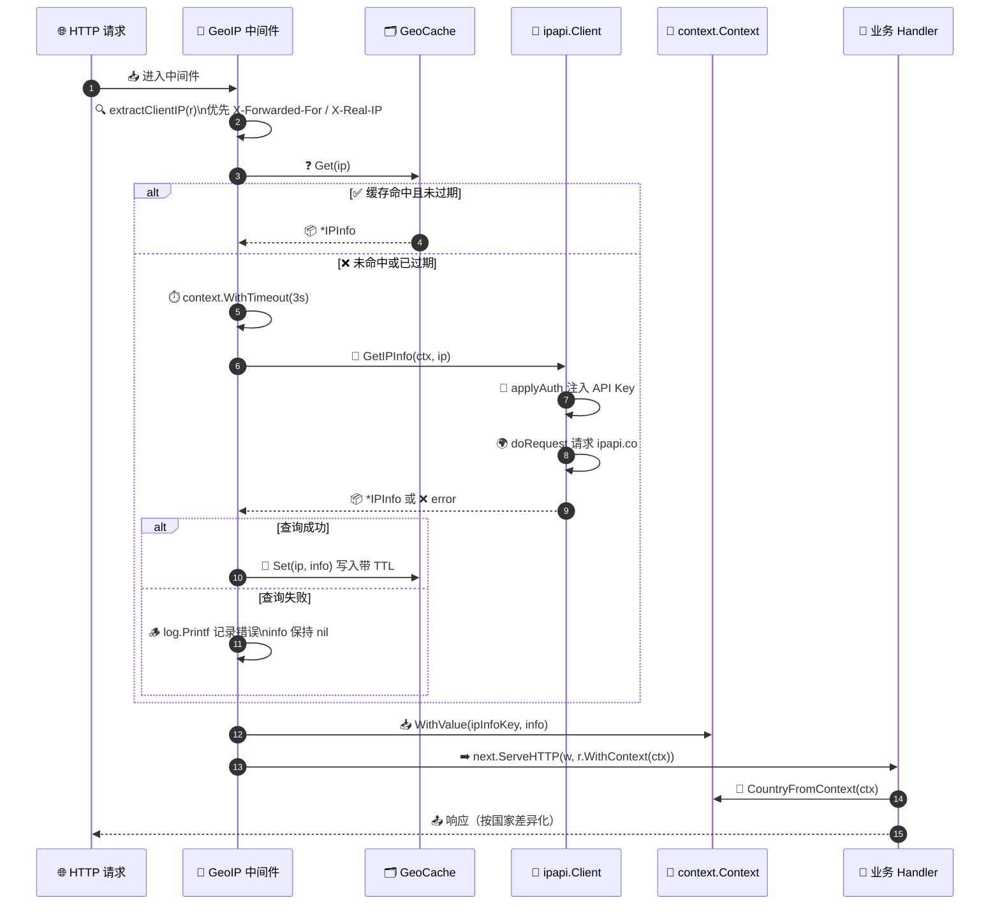

# 🌐 GeoIP 中间件

> 在 HTTP 中间件层识别访问者国家/地区，并把结果注入请求上下文，供后续 handler 复用。

---

## 🎯 场景

你的 Web 服务需要根据访问者所在国家做差异化处理：

- 🌍 内容本地化（按国家切换语言、货币、时区）
- 🛂 访问控制（屏蔽/放行特定地区，合规要求）
- 📊 流量分析（统计各国家访问量、识别异常来源）
- 🚦 灰度发布（仅对某些国家开放新功能）

传统做法是在每个 handler 里各自调用一次 IP 查询接口，这会带来三个问题：

1. **重复查询** — 同一个 IP 在请求生命周期内被反复查询，浪费配额；
2. **逻辑分散** — 国家判断散落在各处，难以维护；
3. **阻塞主链路** — 查询失败时 handler 行为不确定，错误处理不统一。

我们希望把「识别访问者地理位置」这件事收敛到**一处中间件**，结果通过 `context.Context` 向下传递，handler 只管读取。

---

## 💡 方案

整体分四步：

1. **提取真实 IP** — 优先从 `X-Forwarded-For` / `X-Real-IP` 取（经过反向代理时），回退到 `RemoteAddr`；
2. **查询 + 缓存** — 用 `ipapi.Client` 查询，结果按 IP 做**带 TTL 的本地缓存**，避免重复请求与限流；
3. **注入 context** — 把 `*ipapi.IPInfo` 存进 `context.Context`，handler 通过自定义 key 取出；
4. **优雅降级** — 查询失败时注入空值并继续放行，不阻断主链路（业务可自行决定是否容错）。

并发安全靠 `sync.RWMutex` 保护缓存 map。

::: tip 🎨 一图抵千言
下图展示一个请求穿过 GeoIP 中间件到下游 handler 的完整时序：提取真实 IP → 命中缓存或调用 `Client.GetIPInfo` 查询 → 把 `*IPInfo` 注入 `context.Context` → 交给业务 handler 读取。
:::



---

## 💻 完整代码

```go
package main

import (
	"context"
	"fmt"
	"log"
	"net"
	"net/http"
	"strings"
	"sync"
	"time"

	"github.com/cyberspacesec/ipapi.co-skills/pkg/ipapi"
)

// contextKey 是不导出的 context key 类型，避免冲突。
type contextKey string

const ipInfoKey contextKey = "ipinfo"

// cacheEntry 缓存条目：值 + 过期时刻。
type cacheEntry struct {
	info *ipapi.IPInfo
	exp  time.Time
}

// GeoCache 是并发安全的 IP->地理位置 缓存。
type GeoCache struct {
	mu      sync.RWMutex
	items   map[string]cacheEntry
	ttl     time.Duration
}

func NewGeoCache(ttl time.Duration) *GeoCache {
	return &GeoCache{items: make(map[string]cacheEntry), ttl: ttl}
}

// Get 命中且未过期则返回结果，second bool 表示是否命中。
func (c *GeoCache) Get(ip string) (*ipapi.IPInfo, bool) {
	c.mu.RLock()
	defer c.mu.RUnlock()
	e, ok := c.items[ip]
	if !ok || time.Now().After(e.exp) {
		return nil, false
	}
	return e.info, true
}

// Set 写入缓存，自动加上 TTL。
func (c *GeoCache) Set(ip string, info *ipapi.IPInfo) {
	c.mu.Lock()
	defer c.mu.Unlock()
	c.items[ip] = cacheEntry{info: info, exp: time.Now().Add(c.ttl)}
}

// GeoIPMiddleware 在每个请求中识别访问者国家并注入 context。
// 查询失败时注入 nil，请求继续放行（业务侧需自行判空）。
func GeoIPMiddleware(client *ipapi.Client, cache *GeoCache, next http.Handler) http.Handler {
	return http.HandlerFunc(func(w http.ResponseWriter, r *http.Request) {
		ip := extractClientIP(r)

		var info *ipapi.IPInfo
		if ip != "" {
			if cached, ok := cache.Get(ip); ok {
				info = cached
			} else {
				// 给单次查询一个独立超时，避免拖垮整个请求。
				ctx, cancel := context.WithTimeout(r.Context(), 3*time.Second)
				got, err := client.GetIPInfo(ctx, ip, string(ipapi.FormatJSON))
				cancel()
				if err != nil {
					// 查询失败不阻断主链路，仅记录日志。
					log.Printf("geoip lookup failed for %s: %v", ip, err)
				} else {
					info = got
					cache.Set(ip, got)
				}
			}
		}

		// 注入 context，供下游 handler 使用。
		ctx := context.WithValue(r.Context(), ipInfoKey, info)
		next.ServeHTTP(w, r.WithContext(ctx))
	})
}

// CountryFromContext 从 context 取出注入的 IPInfo。
// 返回国家代码（如 "US"、"CN"）；若查询失败或不存在则返回空串。
func CountryFromContext(ctx context.Context) string {
	v, _ := ctx.Value(ipInfoKey).(*ipapi.IPInfo)
	if v == nil {
		return ""
	}
	return v.CountryCode
}

// extractClientIP 从请求头/RemoteAddr 中还原真实客户端 IP。
// 顺序：X-Forwarded-For 第一个非空 -> X-Real-IP -> RemoteAddr。
func extractClientIP(r *http.Request) string {
	if xff := r.Header.Get("X-Forwarded-For"); xff != "" {
		// 取逗号分隔的第一个地址（最靠近客户端的一跳）。
		if idx := strings.IndexByte(xff, ','); idx >= 0 {
			xff = xff[:idx]
		}
		if ip := strings.TrimSpace(xff); ip != "" {
			return ip
		}
	}
	if xri := strings.TrimSpace(r.Header.Get("X-Real-IP")); xri != "" {
		return xri
	}
	host, _, err := net.SplitHostPort(r.RemoteAddr)
	if err != nil {
		return r.RemoteAddr
	}
	return host
}

// --- 示例 handler ---

func indexHandler(w http.ResponseWriter, r *http.Request) {
	country := CountryFromContext(r.Context())
	if country == "" {
		fmt.Fprintf(w, "👋 Hello, visitor! (location unknown)\n")
		return
	}
	fmt.Fprintf(w, "👋 Hello from %s!\n", country)
}

func main() {
	client := ipapi.NewClient(
		ipapi.WithAPIKey("YOUR_API_KEY"), // 鉴权详见 ../guide/auth-concept
	)
	cache := NewGeoCache(10 * time.Minute) // 缓存 10 分钟

	mux := http.NewServeMux()
	mux.HandleFunc("/", indexHandler)

	// 中间件包裹业务路由。
	wrapped := GeoIPMiddleware(client, cache, mux)

	log.Println("listening on :8080")
	if err := http.ListenAndServe(":8080", wrapped); err != nil {
		log.Fatal(err)
	}
}
```

运行后访问 `http://localhost:8080/`，将看到类似 `👋 Hello from US!` 的响应；当 ipapi 查询失败时，则回退到 `location unknown`。

---

## 🔍 要点解析

### 1️⃣ 提取真实 IP

反向代理（Nginx / Cloudflare / ALB）通常把客户端 IP 放在 `X-Forwarded-For`。注意该头可能形如 `client, proxy1, proxy2`，取**第一个**才是真实客户端。`RemoteAddr` 仅在直连场景可信，作为兜底。

### 2️⃣ context key 用不导出类型

```go
type contextKey string
const ipInfoKey contextKey = "ipinfo"
```

Go 官方推荐：context key 用**不导出的自定义类型**，避免不同包之间 key 冲突（`string` 类型的 key 在跨包时极易撞名）。

### 3️⃣ 单次查询独立超时

```go
ctx, cancel := context.WithTimeout(r.Context(), 3*time.Second)
```

派生自 `r.Context()`：当客户端断开连接时，`r.Context()` 会被取消，派生的查询 ctx 也会一并取消，避免做无用查询。查询完务必 `cancel()` 释放资源。

### 4️⃣ 并发安全缓存

- **读多写少** → 用 `sync.RWMutex`，读路径 `RLock` 不阻塞并发读；
- **带 TTL** → 地理信息相对稳定但 IP 可能易主，10 分钟 TTL 是经验值；
- **未做主动淘汰** → 简单起见依赖懒过期（Get 时判断）；高负载场景可加一个后台 goroutine 定期清理。

### 5️⃣ 优雅降级

查询失败时**注入 `nil` 继续放行**，而不是返回 500。GeoIP 是「增强」而非「必需」，handler 通过 `CountryFromContext` 判空即可优雅降级。若你的业务要求强校验（如合规屏蔽），改为查询失败时直接 `http.Error` 拒绝即可。

### 6️⃣ 复用同一个 Client

`ipapi.Client` 线程安全且内部复用连接池，**全局只创建一次**（在 `main` 里），所有请求共享。每请求新建 Client 会丢失连接复用并制造大量临时对象。

---

## 🚀 扩展

- **🏷️ 标签注入**：把 `CountryCode` 写进结构化日志的 tag，便于按国家聚合：`slog.With("country", country)`。
- **🚧 访问控制中间件**：在 GeoIP 之上再叠一层 `AllowCountriesMiddleware("US","JP")`，命中白名单才放行，否则 403。
- **⚡ 异步预取**：对于高频 IP，可先返回降级响应，再异步查询填入缓存，下一个请求即命中。
- **🧹 缓存容量上限**：用 LRU（如 `hashicorp/golang-lru`）替代裸 map，防止内存无界增长；TTL 与容量双限。
- **🌐 IPv6 友好**：`extractClientIP` 已用 `net.SplitHostPort`，对 `[::1]:8080` 这类 IPv6 字面量同样安全。
- **🔁 失败回退源**：主源查询失败时，可回退到 `GetClientField(ctx, "country")` 单字段接口，开销更低。
- **🧪 可测试性**：把 `*ipapi.Client` 抽成接口，测试时注入 mock，避免真实网络调用。

---

## 🔗 相关

- 指南
  - [客户端概念](../guide/client-concept) — `Client` 的线程安全与复用
  - [鉴权概念](../guide/auth-concept) — `WithAPIKey` 与认证方式
  - [Context 概念](../guide/context) — `context.Context` 的取消与超时
  - [重试概念](../guide/retry-concept) — 内置重试如何应对 5xx
  - [保留 IP](../guide/reserved-ip) — 内网/保留地址的处理
- API
  - [`GetIPInfo`](../api/get-ip-info) — 查询指定 IP 的完整信息
  - [`GetClientField`](../api/get-client-field) — 单字段查询（轻量回退）
  - [`NewClient`](../api/new-client) — 客户端构造
  - [`WithAPIKey`](../api/with-api-key) — 注入 API Key
  - [`WithCustomHTTPClient`](../api/with-custom-http-client) — 自定义底层 HTTP 客户端
  - [`Models / IPInfo`](../api/models) — 返回结构体字段
  - [`Errors`](../api/errors) — 错误类型与 `errors.Is`
- 示例
  - [基础用法](../examples/basic-usage) — 最小可运行示例
  - [进阶用法](../examples/advanced-usage) — 自定义 HTTP 客户端与选项
  - [错误处理](../examples/error-handling) — 错误分类与降级
