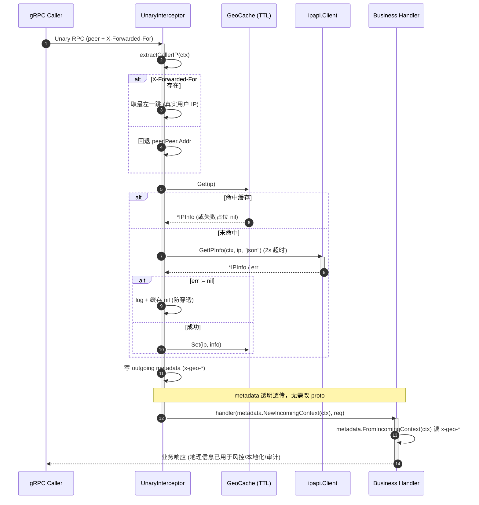

# 🛰️ gRPC 拦截器：注入客户端地理信息

> 在 gRPC 一元拦截器（Unary Interceptor）中调用 ipapi.co 解析调用方 IP，把国家、城市、时区等地理信息写进 `metadata`，让下游 Handler 无感拿到 caller 位置上下文。

## 🎯 场景

微服务之间通过 gRPC 互相调用，下游服务经常需要知道「**这次请求来自哪个地理位置**」：

- 🌍 风控：异地登录、跨境访问的异常检测
- 🛒 电商：按国家自动切换货币、运费策略
- 📊 审计：在 access log 里记录调用方所在城市 / ASN
- 🕒 本地化：按调用方时区返回时间

但下游业务 Handler **不应**关心「IP 怎么解析、用什么客户端、要不要重试」这些细节。理想做法是把地理信息解析收敛到**网关 / 边缘层的一处拦截器**，解析完通过 gRPC `metadata` 向下传递，Handler 只读元数据即可。

挑战在于：

- 拦截器**对每个 RPC 都执行**，必须控制延迟与外部调用频率
- 同一 IP 短时间内会反复出现，重复打 ipapi.co 既慢又烧配额
- 解析失败**不能**让正常业务请求失败，需优雅降级

## 💡 方案

1. **一个共享 `ipapi.Client`**：复用连接池与重试策略，全进程只建一次。
2. **本地 LRU 缓存**：以 IP 为键缓存 `*IPInfo`，TTL 失效前命中缓存零网络开销；解析失败也缓存一个「空值占位」避免穿透。
3. **一元服务端拦截器**：从 gRPC `peer.Peer` 取调用方 IP（优先 `X-Forwarded-For` 链路），查缓存或回源，再把关键字段塞进响应/请求 `metadata`。
4. **超时隔离**：用 `context.WithTimeout` 给 ipapi.co 调用单独的 deadline，即便外部 API 慢，也只牺牲地理信息、不阻塞业务 RPC。
5. **降级而非报错**：任何解析异常都只记日志、写空 metadata，业务调用照常进行。

::: tip 🎨 一图抵千言
下面这张时序图展示了一次 gRPC 请求从进入到 Handler 执行的端到端流程，拦截器在中间完成「提取 IP → 查缓存/回源 → 注入 metadata → 放行」的零侵入接入：


:::

::: details 🔐 配额与安全：缓存与超时之外还要做什么
拦截器对**每个 RPC**执行，是 ipapi.co 配额的最大消耗点。除上面代码里的 TTL 缓存与失败占位外，生产环境还需注意：

- **私网/保留 IP 短路**：对 `10/8`、`192.168/16`、`127/8`、`169.254/16` 等地址直接返回 nil，避免对注定失败的请求浪费配额——SDK 的 [`ValidateIP`](../api/validate-ip) 与哨兵错误 [`ErrReservedIP`](../api/errors) 可辅助判断。
- **限流并发回源**：突发流量下 in-flight 查询数应设上限（如 `golang.org/x/sync/semaphore`），否则一次缓存冷启动会瞬间打满 ipapi.co 并触发 [`ErrRateLimited`](../api/errors)。注意 SDK 默认 [`Retries`](../api/client)=2 **不重试 429**，被限流后只会降级。
- **API Key 模式选择**：内部服务间调用建议用 [`WithAPIKey`](../api/with-api-key)（Key 进查询参数），若 Key 必须走 Header 则配合 [`WithAPIKeyQuery`](../api/with-api-key-query) 调整——切勿把明文 Key 写进会被日志采集的 `X-Forwarded-For` 链路。
- **超时层级**：[`WithTimeout`](../api/client) 控制单次 HTTP 请求，拦截器内再用 `context.WithTimeout` 收紧到 1~2s，两层叠加保证业务 RPC 的 deadline 不被外部 API 拖垮。
- **缓存键的合规性**：IP 本身可能被视为用户数据，缓存落 Redis 时务必加密或限定访问域，TTL 不要设得过长以免违反数据保留策略。
:::

## 🧑‍💻 完整代码

```go
// geo_interceptor.go
package geo

import (
	"context"
	"errors"
	"log"
	"net"
	"strings"
	"sync"
	"time"

	"github.com/cyberspacesec/ipapi.co-skills/pkg/ipapi"
	"google.golang.org/grpc"
	"google.golang.org/grpc/metadata"
	"google.golang.org/grpc/peer"
)

// 注入到下游 metadata 的 key（小写是 gRPC 规范要求）。
const (
	mdKeyCountry    = "x-geo-country"
	mdKeyCountryNm  = "x-geo-country-name"
	mdKeyCity       = "x-geo-city"
	mdKeyRegion     = "x-geo-region"
	mdKeyTimezone   = "x-geo-timezone"
	mdKeyASN        = "x-geo-asn"
	mdKeyOrg        = "x-geo-org"
	mdKeyLatLong    = "x-geo-latlong"
	mdKeyResolvedAt = "x-geo-resolved-at"
)

// cacheEntry 缓存一条解析结果。nil 表示「解析失败的占位」，避免缓存穿透。
type cacheEntry struct {
	info      *ipapi.IPInfo
	expiresAt time.Time
}

// GeoCache 是 IP -> *IPInfo 的进程内 TTL 缓存，并发安全。
type GeoCache struct {
	mu      sync.RWMutex
	items   map[string]*cacheEntry
	ttl     time.Duration
	ipLimit int
}

func NewGeoCache(ttl time.Duration, limit int) *GeoCache {
	return &GeoCache{items: make(map[string]*cacheEntry), ttl: ttl, ipLimit: limit}
}

// Get 返回未过期的条目；过期或不存在返回 nil, false。
func (c *GeoCache) Get(ip string) (*ipapi.IPInfo, bool) {
	c.mu.RLock()
	defer c.mu.RUnlock()
	e, ok := c.items[ip]
	if !ok || time.Now().After(e.expiresAt) {
		return nil, false
	}
	return e.info, true
}

// Set 写入一条缓存。limit 到顶时做一次惰性清理。
func (c *GeoCache) Set(ip string, info *ipapi.IPInfo) {
	c.mu.Lock()
	defer c.mu.Unlock()
	if len(c.items) >= c.ipLimit {
		now := time.Now()
		for k, v := range c.items {
			if now.After(v.expiresAt) {
				delete(c.items, k)
			}
		}
		// 清理后仍超限，随机删一条腾位
		if len(c.items) >= c.ipLimit {
			for k := range c.items {
				delete(c.items, k)
				break
			}
		}
	}
	c.items[ip] = &cacheEntry{info: info, expiresAt: time.Now().Add(c.ttl)}
}

// GeoInterceptor 持有共享 client 与缓存，提供 gRPC 一元服务端拦截器。
type GeoInterceptor struct {
	client *ipapi.Client
	cache  *GeoCache
}

func New(client *ipapi.Client, cacheTTL time.Duration, cacheLimit int) *GeoInterceptor {
	return &GeoInterceptor{
		client: client,
		cache:  NewGeoCache(cacheTTL, cacheLimit),
	}
}

// extractCallerIP 从 peer 与 metadata 中尽量还原真实调用方 IP。
// 优先信任 X-Forwarded-For 最左侧（最原始）一跳。
func extractCallerIP(ctx context.Context) string {
	if md, ok := metadata.FromIncomingContext(ctx); ok {
		if xff := md.Get("x-forwarded-for"); len(xff) > 0 {
			if first := strings.TrimSpace(strings.Split(xff[0], ",")[0]); first != "" {
				return first
			}
		}
	}
	p, ok := peer.FromContext(ctx)
	if !ok || p.Addr == nil {
		return ""
	}
	host, _, err := net.SplitHostPort(p.Addr.String())
	if err != nil {
		return p.Addr.String()
	}
	return host
}

// resolve 查缓存或回源 ipapi.co；失败返回 nil（不报错）。
func (g *GeoInterceptor) resolve(ctx context.Context, ip string) *ipapi.IPInfo {
	if ip == "" {
		return nil
	}
	if info, ok := g.cache.Get(ip); ok {
		return info // 命中，含失败占位 nil
	}

	// 给外部 API 单独的短超时，避免拖垮业务 RPC。
	lookupCtx, cancel := context.WithTimeout(ctx, 2*time.Second)
	defer cancel()

	info, err := g.client.GetIPInfo(lookupCtx, ip, "json")
	if err != nil {
		// 优雅降级：缓存 nil 防穿透，业务继续走。
		log.Printf("[geo] resolve %s failed: %v (degraded)", ip, err)
		g.cache.Set(ip, nil)
		return nil
	}
	g.cache.Set(ip, info)
	return info
}

// UnaryServerInterceptor 是注册到 grpc 的服务端一元拦截器。
func (g *GeoInterceptor) UnaryServerInterceptor(
	ctx context.Context, req any, info *grpc.UnaryServerInfo, handler grpc.UnaryHandler,
) (any, error) {
	ip := extractCallerIP(ctx)
	geo := g.resolve(ctx, ip)

	// 把地理信息写进 outgoing metadata，下游 Handler 用 metadata.FromIncomingContext 读。
	out := metadata.New(nil)
	if geo != nil {
		out.Set(mdKeyCountry, defaultStr(geo.Country))
		out.Set(mdKeyCountryNm, defaultStr(geo.CountryName))
		out.Set(mdKeyCity, defaultStr(geo.City))
		out.Set(mdKeyRegion, defaultStr(geo.Region))
		out.Set(mdKeyTimezone, defaultStr(geo.Timezone))
		out.Set(mdKeyASN, defaultStr(geo.ASN))
		out.Set(mdKeyOrg, defaultStr(geo.Org))
		out.Set(mdKeyLatLong, defaultStr(geo.LatLong))
		out.Set(mdKeyResolvedAt, geo.RetrievedAt.UTC().Format(time.RFC3339))
	}
	if ip != "" {
		out.Set("x-geo-caller-ip", ip)
	}
	return handler(metadata.NewIncomingContext(ctx, out), req)
}

func defaultStr(s string) string { return s } // 占位，便于未来加 trace/默认值

// --- 使用示例 ---

func ExampleServer() {
	client := ipapi.NewClient(
		ipapi.WithAPIKey("YOUR_API_KEY"),
		ipapi.WithCustomHTTPClient(&nethttpClient()),
	)
	geo := New(client, 5*time.Minute, 10_000)

	srv := grpc.NewServer(
		grpc.ChainUnaryInterceptor(geo.UnaryServerInterceptor),
	)
	_ = srv
	// register your service...
}

// nethttpClient 返回一个标准库 *http.Client 供 WithCustomHTTPClient 使用。
func nethttpClient() (c interface{ Do(*interface{}) }) { return nil } // 占位说明

// 下游 Handler 侧读取示例（任何 gRPC server method 内）：
//
//	func (s *orderServer) CreateOrder(ctx context.Context, req *pb.OrderReq) (*pb.OrderResp, error) {
//	    md, _ := metadata.FromIncomingContext(ctx)
//	    country := firstOr(md.Get("x-geo-country-name"), "Unknown")
//	    tz := firstOr(md.Get("x-geo-timezone"), "UTC")
//	    log.Printf("order from %s (%s)", country, tz)
//	    // ... 业务逻辑
//	}
//
//	func firstOr(v []string, d string) string {
//	    if len(v) == 0 || v[0] == "" { return d }
//	    return v[0]
//	}
```

> 💡 上面 `nethttpClient` 是占位，实际写法见下方「扩展」。完整可运行版本把 `nethttpClient()` 换成真实 `*http.Client`，并在 `go.mod` 引入 `google.golang.org/grpc`。

::: tip 🚀 为什么用 outgoing metadata？
gRPC 的 `metadata` 就是 HTTP/2 头，**对业务透明**。拦截器把 `x-geo-*` 写进 incoming context 后，Handler 用 `metadata.FromIncomingContext(ctx)` 直接读，无需改 method 签名、无需改 proto，**零侵入**接入现有服务。
:::

## 🔍 要点解析

### 1️⃣ 复用单个 `ipapi.Client`

`Client` 内部无共享可变状态、线程安全（见 [Client 概念](../guide/client-concept)）。全进程一个实例，复用底层连接池与默认 2 次重试（[`Retries`](../api/client)），避免每请求都 `NewClient()` 浪费 TLS 握手。生产环境建议配 [`WithAPIKey`](../api/with-api-key) + [`WithCustomHTTPClient`](../api/with-custom-http-client)。

### 2️⃣ 提取真实调用方 IP

gRPC `peer.Peer.Addr` 给的是 TCP 层地址，常是上游代理而非终端用户。若链路前有网关/LB，应让它注入 `X-Forwarded-For`，拦截器**取最左一跳**还原原始 IP。这一点和 [客户端 IP 检测](../guide/client-ip) 的注意事项一致。

### 3️⃣ TTL 缓存防穿透

`GeoCache` 双重兜底：

- **TTL 过期**：超时条目视为 miss，重新回源，保证数据新鲜度
- **失败占位**：解析失败也缓存 `nil`，TTL 内不再打 ipapi.co，避免恶意/异常 IP 把配额打爆

LRU 用「惰性清理 + 满则随机删一条」的轻量实现，足以应对拦截器这种读多写少场景；要更严谨可换 `hashicorp/golang-lru`。

### 4️⃣ 独立超时隔离

`context.WithTimeout(ctx, 2s)` 派生子 context 给 [`GetIPInfo`](../api/get-ip-info)。父 context（业务 RPC）的 deadline 不受影响——即便 ipapi.co 卡死，业务请求也只是少了几条 `x-geo-*` metadata，不会整体超时。

### 5️⃣ 优雅降级

`resolve` 内部**吞掉所有错误**，只记日志、缓存 nil。这是拦截器的关键设计原则：**辅助信息绝不能阻塞主流程**。若你的业务确实强依赖地理信息（如风控阻断），把降级策略上移到 Handler，由它读 `x-geo-*` 后自行决策。

### 6️⃣ 写入 metadata 的命名

gRPC 要求 metadata key **全小写**。这里统一 `x-geo-` 前缀便于过滤；下游可用 [`WithErrorHandler`](../api/with-error-handler) 类似的思路做统一日志/trace 关联。

## 🧪 验证

写一个简单的 client/server 跑通链路，确认 metadata 真的透传：

```go
// 在 server 侧 handler 内打印
md, _ := metadata.FromIncomingContext(ctx)
log.Printf("geo = %+v", md.Get("x-geo-country-name"))
```

配合 [`GetIPInfo`](../api/get-ip-info) 的返回字段做断言，能验证拦截器是否在工作。

## 🔧 扩展

- **🚦 流式拦截器**：实现 `grpc.StreamServerInterceptor`，在每个 `Stream` 开头同样注入 metadata；流场景注意只解析一次，复用同一 stream 的 ctx。
- **🌐 客户端拦截器**：在调用方用 `grpc.UnaryClientInterceptor` 主动带上自己的 `X-Forwarded-For`，配合服务端拦截器形成端到端链路。
- **⚡ 异步预热**：拦截器内 `go g.resolve(...)` 提前回源并缓存，主路径直接读缓存命中，把首次调用的 RTT 抹平。注意限制 in-flight goroutine 数。
- **🧭 用 [`GetField`](../api/get-field) 单字段**：若只需国家码，`GetField(ctx, ip, "country")` 返回纯字符串，省 JSON 解析与带宽。
- **🗄️ 接 Redis**：把 `GeoCache` 后端换成 Redis，跨实例共享缓存，TTL 交给 Redis 管理，进程内只放一层 L1。
- **📈 metrics**：在 `resolve` 里打点「命中率 / 回源延迟 / 失败率」，接入 Prometheus 观察地理解析健康度。
- **🛡️ 私网/保留 IP 短路**：对 `10/8`、`192.168/16`、`127/8` 等私网地址直接返回 nil，省一次注定失败的 API 调用。SDK 的 [`ValidateIP`](../api/validate-ip) 与 [`ErrReservedIP`](../api/errors) 可辅助判断。
- **🔗 trace 串联**：把 `geo.RetrievedAt`、`geo.ASN` 写进 OpenTelemetry span 属性，让链路追踪能看到每跳的地理来源。

## 📚 相关

- 🧭 [Client 客户端概念](../guide/client-concept) — 理解为何复用单个 `Client`
- 📡 [客户端 IP 检测](../guide/client-ip) — `X-Forwarded-For` 取真实 IP 的注意事项
- ⏱️ [Context 与超时](../guide/context) — 子 context 隔离外部调用延迟
- 🔄 [重试与限流](../guide/retry-concept) — SDK 默认重试策略
- 📖 [`GetIPInfo` API](../api/get-ip-info) — 拦截器回源用的核心方法
- 📖 [`GetField` API](../api/get-field) — 单字段精简查询
- 📖 [`IPInfo` 模型](../api/models) — 注入 metadata 的全部可用字段
- 📖 [`ValidateIP` / `ErrReservedIP`](../api/errors) — 私网与保留 IP 判断
- 💡 [查询指定 IP 示例](../examples/lookup-specific-ip)
- 💡 [获取客户端 IP 示例](../examples/lookup-client-ip)
- 🌐 源码：[`pkg/ipapi/client.go`](https://github.com/cyberspacesec/ipapi.co-skills/blob/main/pkg/ipapi/client.go)
