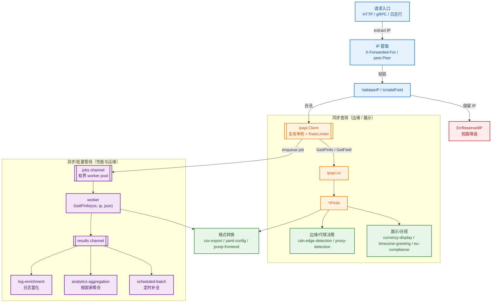
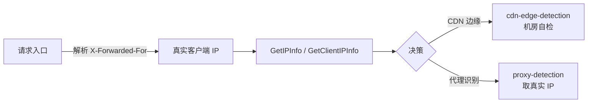
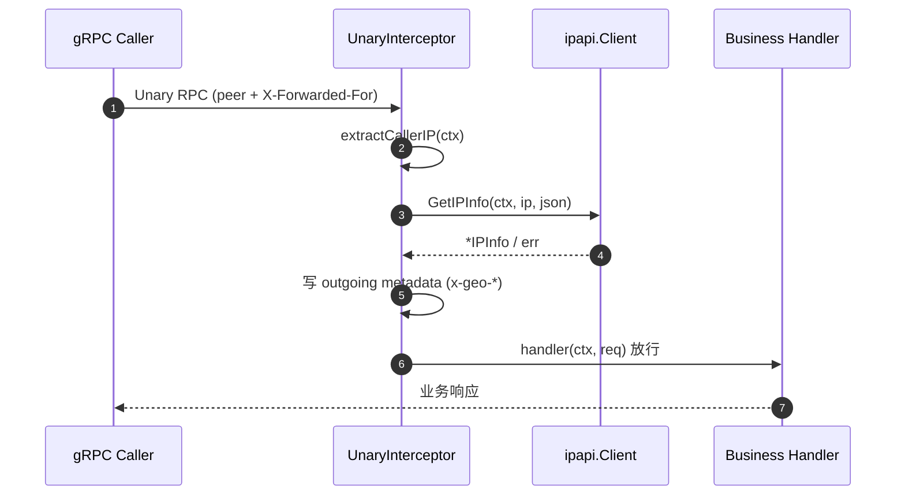
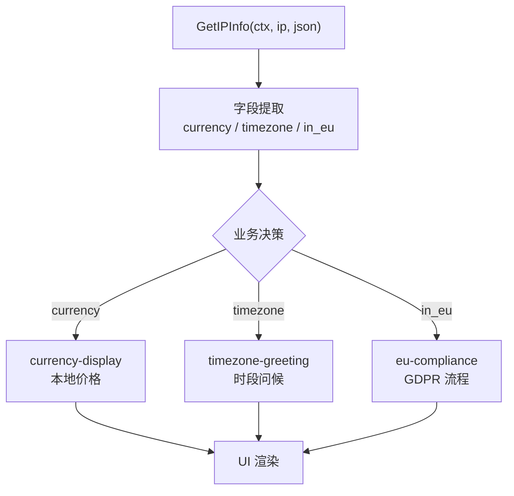
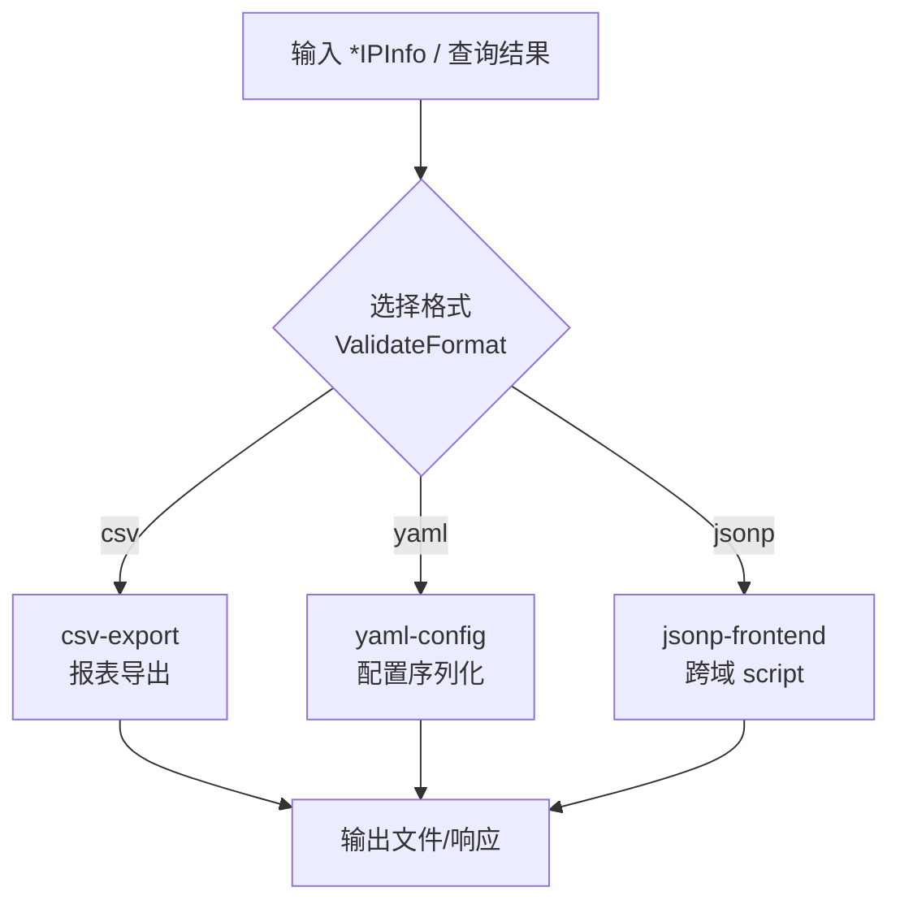

# 🍳 Cookbook 食谱

::: tip 🖥 命令行也有食谱
本节是 Go SDK 库视角的实战方案。许多场景（日志增强、CSV 导出、批量查询、定时任务）用 CLI 一行命令就能搞定 —— 见 [CLI 实战食谱](../cli/cookbook)。
:::

> 实战场景的完整代码方案。每个食谱解决一个具体问题。

## 🌐 地理路由与本地化

- [GeoIP 中间件](./geoip-middleware) — HTTP 中间件识别访问者国家
- [按国家限流](./rate-limit-by-country) — 差异化速率限制
- [按语言重定向](./redirect-by-language) — 本地化站点路由
- [货币展示](./currency-display) — 本地价格显示
- [时区问候](./timezone-greeting) — 早安/午安/晚安
- [欧盟合规](./eu-compliance) — GDPR 流程判断

## 🛡 安全与风控

- [代理检测](./proxy-detection) — 取真实客户端 IP
- [风控初筛](./fraud-detection) — 保留 IP + ASN 异常检测
- [ASN 黑名单](./asn-blocklist) — 拦截特定云厂商
- [私有 IP 检测](../guide/reserved-ip) — 识别内网地址

## 📊 数据与运维

- [日志富化](./log-enrichment) — 给访问日志补全地理字段
- [地区统计](./analytics-aggregation) — 按国家聚合 PV/UV
- [CSV 导出](./csv-export) — 查询结果导出报表
- [YAML 集成](./yaml-config) — 序列化为配置
- [边缘节点检测](./cdn-edge-detection) — 机房位置自检
- [就近选服](./nearest-server) — Haversine 选最近机房

## ⚡ 性能与异步

- [异步查询](./async-lookup) — goroutine + channel
- [缓存查询](./cached-lookup) — sync.Map 降配额
- [定时批量](./scheduled-batch) — cron 定时补全
- [JSONP 前端](./jsonp-frontend) — 跨域 script 调用

::: tip 🎨 一图抵千言
食谱全集的端到端流程：一次请求从入口取出 IP，经 [`ipapi.Client`](../api/new-client) 查询拿到 [`IPInfo`](../api/models)，再按场景分流到风控、本地化、运维、异步四条下游。下方主图覆盖主链路；其后三张小图分别展开「边缘/代理」「gRPC 拦截器」「格式/前端」的专属流程。

**边缘 / 代理**：请求入口 → IP 提取 → 查询 → 决策（横向）。

**gRPC 拦截器**：请求 → 拦截器提取 IP → 查询 → 注入 metadata → 放行。

**展示类**：IP 查询 → 字段提取 → 业务决策 → UI 渲染。

**格式 / 前端**：输入 → 格式转换 → 输出。

:::

::: details 🛡️ 配额、安全与扩展：跨食谱的共性纪律
无论走哪条食谱，下面几条是「配额不爆、安全不漏、可横向扩展」的共性纪律：

- **复用单例 Client**：所有食谱都应只建一个 [`ipapi.NewClient`](../api/new-client) 实例，复用连接池与 [`Retries`](../api/options)（默认 2，最多请求 3 次，仅对网络错误与 5xx 重试，429 等 4xx 不重试）。每请求新建 Client 会导致连接池爆炸且重试策略失效。
- **限流是配额生命线**：异步/批量/拦截器场景务必设 [`RateLimiter`](../api/options)，把全局 QPS 压到 ipapi.co 配额之下；免费额度约 1000 次/天，生产请配付费 Key（[`WithAPIKey`](../api/with-api-key)）。
- **保留 IP 短路**：内网/保留段直接降级，避免对注定失败的请求浪费配额——查询会返回 [`ErrReservedIP`](../api/errors)，参见 [保留 IP 指南](../guide/reserved-ip)。
- **超时隔离**：用 `context.WithTimeout` 给每次查询独立 deadline，外部 API 慢响应不能拖垮主链路；详见 [上下文与超时](../guide/context)。
- **失败降级而非报错**：用 [`errors.Is`](../api/is-retryable) 精确匹配哨兵错误（[`ErrRateLimited`](../api/errors) / [`ErrServerError`](../api/errors) / [`ErrNotFound`](../api/errors) / [`ErrInvalidIP`](../api/errors)），失败只记日志、走保守策略，业务照常进行。
- **可重试才重试**：[`IsRetryableError`](../api/is-retryable) 判定 `ErrRateLimited || ErrServerError || ErrNotFound` 为可重试，其余 4xx（如 [`ErrInvalidField`](../api/errors) / [`ErrInvalidKey`](../api/errors)）重试无意义，应快速失败。
- **只取必要字段**：风控只关心 `country`/`asn` 时用 [`GetField`](../api/get-field) 替代 [`GetIPInfo`](../api/get-ip-info)，响应更小、更快、更省配额。
:::

## 🚀 下一步

- 🧭 看 [核心概念](../guide/intro)
- 📖 看 [API 参考](../api/methods)
- 🧪 看 [示例](../examples/basic-usage)
