# 🌐 JSONP 前端跨域调用

> 后端用 `WithCallback` + `FormatJSONP` 产出回调包裹的脚本，前端用原生 `<script>` 标签直接拿到结构化 IP 数据，绕过浏览器同源策略。

---

## 🎯 场景

你的产品页面（`https://shop.example.com`）想在首屏右下角弹一个「访客所在城市」的小提示，比如：

> 📍 检测到您来自 **上海**，已为您切换到华东节点。

需求很轻，但有几个现实约束：

1. **页面是纯静态站点**，托管在 CDN 上，没有任何 Node/BFF 中间层，没法用 `fetch` 反向代理。
2. **第三方插件页**运行在沙盒 iframe 里，CORS 头不可控，`fetch('https://ipapi.co/json')` 会被同源策略拦截。
3. **不想引入构建链**——一个营销活动页，只想丢一个 `<script>` 进去就能跑。
4. 团队里仍有不少 **老旧浏览器流量**（IE 内核壳浏览器、低版本 WebView），CORS 支持不完整。

`<script>` 标签加载远程资源**不受同源策略限制**——这正是 JSONP（JSON with Padding）的原理：后端把 JSON 包进一个回调函数调用 `cb({...})`，前端定义好同名 `cb` 函数，脚本一执行，数据就到手。

ipapi.co-skills SDK 内建 JSONP 支持：[`WithCallback`](../api/with-callback) 选项会把 `?callback=<name>` 自动拼到请求 URL 上，配合 `FormatJSONP` 格式即可产出合法的回调脚本。

---

## 💡 方案

整体走 **后端 JSONP 代理 + 前端 `<script>` 动态注入** 的双层结构：

```
┌─────────────┐   2. <script src=/api/ip?callback=cb>   ┌────────────────┐
│  浏览器页面  │ ─────────────────────────────────────▶ │  Go JSONP 网关  │
│  (定义 cb)   │ ◀───────────────────────────────────── │  (ipapi SDK)    │
└─────────────┘   3. cb({"ip":"...","city":"..."})      └────────────────┘
        │                                                  │
        │ 1. 用户打开页面                                   │ 4. GetClientIPInfoRaw
        ▼                                                  ▼   转发到 ipapi.co
   首屏渲染完成                                    https://ipapi.co/jsonp/?callback=cb
```

为什么不让前端 `<script>` 直接打 `ipapi.co`？

- **回调名可控**：前端要随机生成回调名防冲突，必须有个网关把前端传来的 `callback` 透传给上游。
- **API Key 隐藏**：把密钥放后端环境变量里，前端永远拿不到（注意：JSONP 模式下 Key 只能走 query，仍会出现在上游 URL，但不会暴露给前端浏览器）。
- **统一缓存与限流**：网关层加 `sync.Map` 缓存 + 漏桶，避免每个访客都打一次上游，省额度。

关键设计点：

- 后端用 [`GetClientIPInfoRaw`](../api/get-client-ip-info-raw)（基于请求来源 IP，无需前端传 IP，避免伪造）。
- 回调名由前端生成、后端透传，**后端做白名单校验**防 XSS 注入（`callback=<script>` 之类的攻击）。
- 返回 `Content-Type: application/javascript`，否则浏览器拒绝执行。
- 前端用动态 `<script>` 注入而非静态标签，便于 **超时兜底** 和 **并发查多个 IP**。

::: tip 🎨 一图抵千言

```mermaid
flowchart LR
    A["浏览器页面<br/>定义 window.__jsonp_cb_xxx"] -->|"1. 动态创建 script<br/>src=/api/ip?callback=__jsonp_cb_xxx"| B["Go JSONP 网关"]
    B -->|"2. 取 X-Forwarded-For / RemoteAddr<br/>提取访客出口 IP"| C{"缓存命中?"}
    C -->|"命中"| G["wrapWithCallback<br/>重包回调名"]
    C -->|"未命中"| D["ipapi.NewClient<br/>WithAPIKey + WithAPIKeyQuery + WithCallback"]
    D -->|"3. GetClientIPInfoRaw<br/>format=FormatJSONP"| E[("ipapi.co<br/>jsonp/?callback=...")]
    E -->|"4. cb({...}) 原始脚本"| F["safeCallback 白名单校验<br/>防 callback XSS 注入"]
    F --> G
    G -->|"5. set Content-Type<br/>application/javascript"| H["写回浏览器"]
    H -->|"6. 执行 cb(data)"| I["前端 Promise.resolve<br/>渲染城市/节点提示"]
    G -.->|"set cache TTL=5m"| J[("sync.RWMutex<br/>进程内缓存")]
```

端到端流程：前端注入 `<script>` → 网关提取来源 IP → SDK 以 JSONP 格式回源 → 包回调后写回浏览器 → 前端回调拿到结构化数据。


:::

::: details 🔒 安全清单：JSONP 网关上线前必查
- **回调名白名单**：`safeCallback` 用 `^[A-Za-z_$][A-Za-z0-9_$.]{0,63}$` 严格校验，拦截 `callback=<script>` 等 XSS 投毒。
- **API Key 下沉**：Key 只存后端环境变量，前端永不接触；JSONP 下必须用 [`WithAPIKeyQuery`](../api/with-api-key-query)，Key 会出现在上游 URL，请用**受限子 Key** 并避免网关日志落盘明文。
- **MIME 锁定**：响应头固定 `Content-Type: application/javascript` + `X-Content-Type-Options: nosniff`，防止响应被当 HTML 解析。
- **XFF 信任边界**：`X-Forwarded-For` 可伪造，只信任自家 LB / CDN 注入的那一跳，否则攻击者可伪造 IP 绕过限流或污染缓存。
- **缓存隔离**：缓存 key = `IP + 回调名`，不同回调名分别缓存，避免跨用户串数据。
- **超时兜底**：上游 4s 超时 + 前端 4s 超时双保险，失败时返回 `cb({error:true})` 而非空响应，前端不会因脚本缺失而报错。
:::

---

## 🧑‍💻 完整代码

### 后端：Go JSONP 网关

```go
// jsonp_gateway.go
package main

import (
	"context"
	"encoding/json"
	"fmt"
	"log"
	"net/http"
	"os"
	"regexp"
	"sync"
	"time"

	"github.com/cyberspacesec/ipapi.co-skills/pkg/ipapi"
)

// jsonpCache 缓存近期查过的 IP 结果，减少上游调用次数。
// 真实生产建议换 Redis，这里用进程内 map 演示思路。
type jsonpCache struct {
	mu sync.RWMutex
	m  map[string]cacheEntry
}

type cacheEntry struct {
	payload   []byte    // 已经包好回调的最终脚本字节
	expiresAt time.Time
}

func newJSONPCache(ttl time.Duration) *jsonpCache {
	c := &jsonpCache{m: make(map[string]cacheEntry)}
	// 后台清理过期项，避免 map 无限膨胀
	go func() {
		ticker := time.NewTicker(time.Minute)
		defer ticker.Stop()
		for range ticker.C {
			c.mu.Lock()
			for k, v := range c.m {
				if time.Now().After(v.expiresAt) {
					delete(c.m, k)
				}
			}
			c.mu.Unlock()
		}
	}()
	return c
}

func (c *jsonpCache) get(key string) ([]byte, bool) {
	c.mu.RLock()
	defer c.mu.RUnlock()
	if e, ok := c.m[key]; ok && time.Now().Before(e.expiresAt) {
		return e.payload, true
	}
	return nil, false
}

func (c *jsonpCache) set(key string, payload []byte, ttl time.Duration) {
	c.mu.Lock()
	defer c.mu.Unlock()
	c.m[key] = cacheEntry{payload: payload, expiresAt: time.Now().Add(ttl)}
}

var (
	cache      = newJSONPCache(5 * time.Minute)
	// callbackNameRe 只允许 [A-Za-z0-9_.] 的合法 JS 标识符，
	// 拦截 callback=<script> 之类的 XSS 注入。
	callbackNameRe = regexp.MustCompile(`^[A-Za-z_$][A-Za-z0-9_$.]{0,63}$`)
)

// safeCallback 校验前端传来的回调名，非法一律回退到 "callback"。
func safeCallback(name string) string {
	if callbackNameRe.MatchString(name) {
		return name
	}
	return "callback"
}

// wrapWithCallback 把原始 JSONP 响应重新包成指定回调名。
// 上游返回的已经是 cb({...}) 形式，这里抽取 {...} 后重新包装，
// 确保最终回调名严格等于前端期望值（而非 SDK 默认值）。
func wrapWithCallback(raw []byte, callback string) []byte {
	// 上游 jsonp 响应形如: callback({...})
	// 找到第一个 '(' 和最后一个 ')'
	start := -1
	end := -1
	for i, b := range raw {
		if b == '(' && start == -1 {
			start = i
		}
		if b == ')' {
			end = i
		}
	}
	var jsonBody []byte
	if start != -1 && end != -1 && end > start {
		jsonBody = raw[start+1 : end]
	} else {
		// 上游可能直接给了纯 JSON（没包回调），原样用
		jsonBody = raw
	}
	return []byte(fmt.Sprintf("%s(%s);", callback, string(jsonBody)))
}

func jsonpHandler(w http.ResponseWriter, r *http.Request) {
	callback := safeCallback(r.URL.Query().Get("callback"))

	// 客户端真实出口 IP：优先取 X-Forwarded-For 第一段，回退到 RemoteAddr。
	// 注意：X-Forwarded-For 可被伪造，生产环境应只信任自家 LB 注入的值。
	clientIP := r.RemoteAddr
	if xff := r.Header.Get("X-Forwarded-For"); xff != "" {
		// 取第一个 IP
		for i := 0; i < len(xff); i++ {
			if xff[i] == ',' {
				clientIP = xff[:i]
				break
			}
		}
		if clientIP == r.RemoteAddr {
			clientIP = xff
		}
		// 去掉可能的端口
		for i := 0; i < len(clientIP); i++ {
			if clientIP[i] == ':' {
				clientIP = clientIP[:i]
				break
			}
		}
	}

	// 缓存 key = IP + 回调名（不同回调名产出不同脚本，需分别缓存）
	cacheKey := clientIP + "|" + callback
	if payload, ok := cache.get(cacheKey); ok {
		writeJS(w, payload)
		return
	}

	// 构造 SDK 客户端：WithCallback 让上游返回 jsonp，WithAPIKeyQuery
	// 是必须的——JSONP 走 <script> 无法设 Header，Key 只能进 query。
	client := ipapi.NewClient(
		ipapi.WithAPIKey(os.Getenv("IPAPI_KEY")),
		ipapi.WithAPIKeyQuery(),
		ipapi.WithCallback(callback),
		ipapi.WithCustomHTTPClient(&http.Client{Timeout: 4 * time.Second}),
	)

	ctx, cancel := context.WithTimeout(r.Context(), 4*time.Second)
	defer cancel()

	// GetClientIPInfoRaw 返回上游原始字节（已是 callback({...}) 形式）。
	// 这里用客户端 IP 查询，无需前端传参，避免伪造。
	raw, err := client.GetClientIPInfoRaw(ctx, string(ipapi.FormatJSONP))
	if err != nil {
		// 出错时返回一个调用回调的空对象，前端不会因脚本缺失而报错
		writeJS(w, []byte(fmt.Sprintf("%s({\"error\":true});", callback)))
		return
	}

	// 重新包装，确保回调名严格匹配（防御上游行为变化）
	payload := wrapWithCallback(raw, callback)
	cache.set(cacheKey, payload, 5*time.Minute)

	writeJS(w, payload)
}

// batchJSONPHandler 一次性返回多个 IP 的信息，前端用动态 <script> 并发拉取。
// 适合「展示访客 + 展示机房对比 IP」这类多 IP 场景。
func batchJSONPHandler(w http.ResponseWriter, r *http.Request) {
	callback := safeCallback(r.URL.Query().Get("callback"))
	ip := r.URL.Query().Get("ip")
	if ip == "" {
		writeJS(w, []byte(fmt.Sprintf("%s({\"error\":\"missing ip\"});", callback)))
		return
	}

	client := ipapi.NewClient(
		ipapi.WithAPIKey(os.Getenv("IPAPI_KEY")),
		ipapi.WithAPIKeyQuery(),
		ipapi.WithCallback(callback),
	)
	ctx, cancel := context.WithTimeout(r.Context(), 4*time.Second)
	defer cancel()

	// 查指定 IP（而非客户端 IP），用于「查任意 IP」场景
	raw, err := client.GetIPInfoRaw(ctx, ip, string(ipapi.FormatJSONP))
	if err != nil {
		writeJS(w, []byte(fmt.Sprintf("%s({\"error\":true,\"ip\":\"%s\"});", callback, ip)))
		return
	}
	writeJS(w, wrapWithCallback(raw, callback))
}

func writeJS(w http.ResponseWriter, b []byte) {
	// 必须是 application/javascript，否则浏览器拒绝执行 <script>
	w.Header().Set("Content-Type", "application/javascript; charset=utf-8")
	// 禁止缓存，保证每次拿到的是当前访客的 IP 信息
	w.Header().Set("Cache-Control", "no-store, max-age=0")
	// 防 MIME 嗅探
	w.Header().Set("X-Content-Type-Options", "nosniff")
	w.Write(b)
}

// healthz 给前端做存活探测，返回标准 JSON（非 JSONP）
func healthz(w http.ResponseWriter, r *http.Request) {
	w.Header().Set("Content-Type", "application/json")
	json.NewEncoder(w).Encode(map[string]any{"ok": true, "ts": time.Now().Unix()})
}

func main() {
	mux := http.NewServeMux()
	mux.HandleFunc("/api/ip", jsonpHandler)        // 查访客自己 IP
	mux.HandleFunc("/api/ip/lookup", batchJSONPHandler) // 查任意 IP
	mux.HandleFunc("/healthz", healthz)

	addr := ":8080"
	log.Printf("JSONP gateway listening on %s", addr)
	srv := &http.Server{
		Addr:              addr,
		Handler:           mux,
		ReadHeaderTimeout: 5 * time.Second,
	}
	if err := srv.ListenAndServe(); err != nil {
		log.Fatalf("server error: %v", err)
	}
}
```

### 前端：HTML + 动态 `<script>`

```html
<!DOCTYPE html>
<html lang="zh-CN">
<head>
  <meta charset="UTF-8" />
  <title>访客定位 Demo</title>
</head>
<body>
  <div id="visitor-tip">📍 定位中...</div>
  <div id="compare"></div>

  <script>
    // 封装一个 JSONP 调用器：动态创建 <script>，支持超时兜底
    function jsonp(url, callbackName, timeoutMs) {
      return new Promise((resolve, reject) => {
        // 1. 在 window 上挂回调函数，名字随机防冲突
        const fn = '__jsonp_cb_' + Math.random().toString(36).slice(2);
        window[fn] = function (data) {
          cleanup();
          resolve(data);
        };

        // 2. 拼接 URL，把回调名透传给后端
        const sep = url.indexOf('?') >= 0 ? '&' : '?';
        const script = document.createElement('script');
        script.src = url + sep + 'callback=' + fn;

        // 3. 超时兜底：JSONP 没有 HTTP 状态码，只能靠定时器
        const timer = setTimeout(() => {
          cleanup();
          reject(new Error('JSONP timeout'));
        }, timeoutMs || 4000);

        function cleanup() {
          clearTimeout(timer);
          delete window[fn];
          if (script.parentNode) script.parentNode.removeChild(script);
        }

        // 4. 加载失败（404/网络错误）也要兜底
        script.onerror = () => {
          cleanup();
          reject(new Error('script load error'));
        };

        document.head.appendChild(script);
      });
    }

    // 首屏：查访客自己 IP
    jsonp('http://localhost:8080/api/ip', null, 4000)
      .then((data) => {
        if (data.error) {
          document.getElementById('visitor-tip').textContent = '📍 定位失败';
          return;
        }
        document.getElementById('visitor-tip').textContent =
          '📍 检测到您来自 ' + (data.city || '未知') + '，已为您切换到就近节点。';
      })
      .catch(() => {
        document.getElementById('visitor-tip').textContent = '📍 定位失败，使用默认节点。';
      });

    // 对比：查一个固定 IP（演示查任意 IP 的能力）
    jsonp('http://localhost:8080/api/ip/lookup?ip=8.8.8.8', null, 4000)
      .then((data) => {
        document.getElementById('compare').textContent =
          '参考节点 8.8.8.8 → ' + (data.city || '未知') + ' / ' + (data.org || '');
      });
  </script>
</body>
</html>
```

### 运行

```bash
# 1. 设置 API Key（没有也能跑，只是会触发限流）
export IPAPI_KEY=your_key_here

# 2. 启动网关
go run jsonp_gateway.go

# 3. 用浏览器打开上面的 HTML（或 curl 验证）
curl 'http://localhost:8080/api/ip?callback=showIP'
# 输出形如: showIP({"ip":"203.0.113.42","city":"Shanghai",...});
```

---

## 🔍 要点解析

### 1. 为什么用 `GetClientIPInfoRaw` 而不是 `GetClientIPInfo`

[`GetClientIPInfo`](../api/get-client-ip-info) 会把响应 `json.Decode` 成 `IPInfo` 结构体，但 JSONP 响应是 `cb({...})` 形式，**不是合法 JSON**，直接 decode 会报错。[`GetClientIPInfoRaw`](../api/get-client-ip-info-raw) 返回原始 `[]byte`，正好把整段脚本原样透传给浏览器。查指定 IP 时同理用 [`GetIPInfoRaw`](../api/get-ip-info-raw)。

### 2. `WithCallback` 做了什么

[`WithCallback`](../api/with-callback) 在 [`applyAuth`](../api/with-callback) 阶段把 `?callback=<name>` 追加到请求 URL。上游收到后会返回 `callback({...})` 而非裸 JSON。回调名由前端随机生成、后端透传，保证每次调用的回调名不冲突。

### 3. JSONP 模式下 API Key 必须走 query

`<script>` 标签**无法设置自定义 HTTP Header**，所以默认的 `Authorization: Bearer` 方案在 JSONP 下不可用。必须用 [`WithAPIKeyQuery`](../api/with-api-key-query) 把 Key 放进 `?key=` query 参数。⚠️ 注意：Key 会出现在上游 URL 和网关日志里，请用受限子 Key，并避免网关日志落盘明文。

### 4. 回调名白名单防 XSS

前端传的 `callback` 参数会被原样写进响应体。如果攻击者构造 `callback=<script>alert(1)</script>`，响应就变成 `<script>alert(1)</script>(...)`——浏览器虽不会执行（因为是 JS 语法错误），但仍可能被其他漏洞链利用。`callbackNameRe` 只放行合法 JS 标识符，从源头掐断注入。

### 5. 缓存用 `sync.RWMutex` 而非 `sync.Map`

[`sync.Map`](https://pkg.go.dev/sync#Map) 适合「写少读多、key 空间分散」的场景，但它没有 TTL 概念，过期清理要自己遍历。这里用 `map + RWMutex` 配合后台 ticker 清理，能精确控制 TTL（5 分钟），且读多写少时 `RLock` 性能足够。如果缓存量大，换 Redis 更合适。

### 6. 前端必须做超时兜底

JSONP 没有 HTTP 状态码，`<script>` 一直不返回时 Promise 永远 pending。`setTimeout` + `cleanup()` 是标配：超时后删回调函数、移除 script 节点，避免内存泄漏和悬挂回调。

### 7. `Content-Type` 必须是 `application/javascript`

写成 `text/plain` 或 `application/json` 时，部分浏览器会因 MIME 严格检查（`X-Content-Type-Options: nosniff`）拒绝执行脚本。同时设 `nosniff` 头防止响应被当 HTML 解析触发 XSS。

---

## 🚀 扩展

- **改用 CORS 替代 JSONP**：现代浏览器 + 可控后端时，直接在网关加 `Access-Control-Allow-Origin` 用 `fetch` 更干净，能拿到 HTTP 状态码、能 POST、能设 Header。JSONP 只在「老旧浏览器/第三方沙盒/无 CORS 服务」时才值得用。详见 [认证机制](../guide/auth-concept)。
- **边缘缓存**：把 JSONP 网关部署到 CDN Edge Worker（如 Cloudflare Workers），按 `IP+callback` 做边缘缓存，首屏延迟可压到 50ms 内。
- **批量回调**：定义一个 `batchCB({ip1: {...}, ip2: {...}})` 协议，一次 `<script>` 拿多个 IP，减少请求数。需要网关侧用 `sync.WaitGroup` 并发查多个 IP 后聚合。
- **限流防刷**：在网关加漏桶（`time.Tick` + channel），按 IP 限频，避免恶意脚本把上游额度刷爆。可参考 SDK 自带的 `RateLimiter` 字段。
- **回调名固定防 CSP 报错**：如果上了 CSP 策略，动态随机回调名会触发 `unsafe-inline`。可改用固定回调名 + 队列模式（前端维护一个待响应队列，回调按序消费）。
- **错误码标准化**：把 `wrapWithCallback` 里的错误对象统一成 `{error: "RATE_LIMITED"}` 等枚举值，前端按 [错误处理](../guide/error-concept) 的语义分支处理。

---

## 🔗 相关

- 📖 [客户端概念](../guide/client-concept) — 理解 `Client` / `ClientOption` 的设计
- 📖 [JSONP 回调指南](../guide/jsonp) — `WithCallback` 的完整说明
- 📖 [响应格式](../guide/formats) — JSON / JSONP / XML / CSV / YAML 的取舍
- 📖 [认证机制](../guide/auth-concept) — Header vs Query 两种 Key 模式
- 📖 [错误处理](../guide/error-concept) — 上游限流、保留 IP 等错误如何透传给前端
- 🔧 [`GetClientIPInfoRaw`](../api/get-client-ip-info-raw) — 查访客 IP 的原始字节接口
- 🔧 [`GetIPInfoRaw`](../api/get-ip-info-raw) — 查指定 IP 的原始字节接口
- 🔧 [`WithCallback`](../api/with-callback) — 设置 JSONP 回调名
- 🔧 [`WithAPIKeyQuery`](../api/with-api-key-query) — Key 走 query 参数
- 🧪 [JSONP 示例](../examples/jsonp) — 最小可运行示例
- 🧪 [原始格式示例](../examples/raw-formats) — XML/CSV/YAML 的 `*Raw` 用法
- 🧪 [查访客 IP 示例](../examples/lookup-client-ip) — `GetClientIPInfo` 系列
