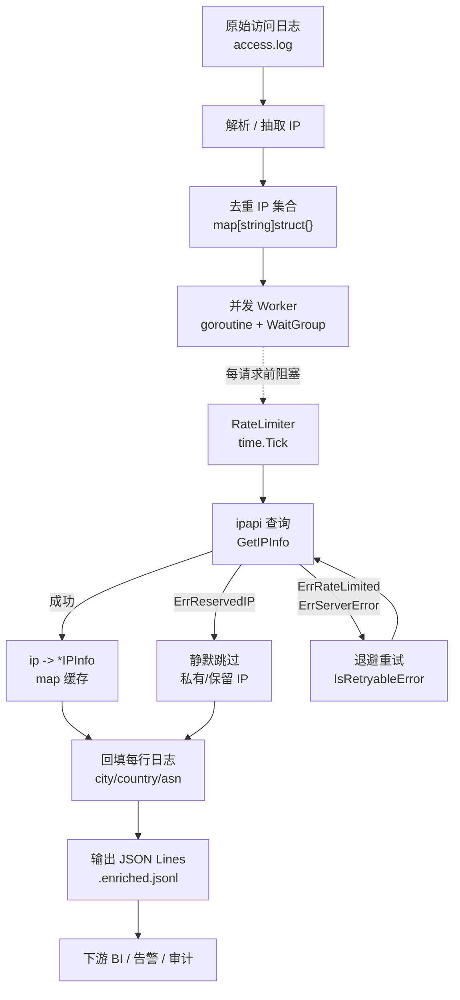

# 📝 日志富化 · Log Enrichment

> 给一行行访问日志补上「城市 / 国家」字段，把冷冰冰的 IP 变成可分析、可统计的地理维度。

## 🎯 场景

你的网关 / Nginx / API 服务每天产生海量访问日志，每条记录里只有一个客户端 IP：

```txt
203.0.113.42 - - [03/Jul/2026:10:21:55 +0800] "GET /api HTTP/1.1" 200 1234
198.51.100.7 - - [03/Jul/2026:10:21:56 +0800] "POST /login HTTP/1.1" 401 89
```

问题随之而来：

- 🧐 **IP 看不懂** —— `203.0.113.42` 是哪里？国内还是国外？
- 📊 **无法按地域统计** —— 想知道「今天哪个国家访问最多」，原始日志答不了。
- 🛡 **风控缺维度** —— 异常流量集中在某城市，光看 IP 看不出来。

目标很明确：**离线（或准实时）把每条日志的 IP 查一遍，补上 `city`、`country`、`country_code` 等字段，输出富化后的结构化日志**，供后续 BI / 告警 / 审计使用。

## 💡 方案

1. **解析** 原始日志，抽出每行的客户端 IP。
2. **去重** —— 同一 IP 一天内可能访问上千次，只查一次，结果缓存复用。
3. **并发查询** —— 用 `ipapi.co-skills` 的 [`Client`](../api/client) 并发调用 [`GetIPInfo`](../api/get-ip-info)，配 `RateLimiter` 防 429。
4. **回填** —— 拿查询结果回写到日志记录，输出 JSON Lines（`.jsonl`）方便下游处理。
5. **容错** —— 私有 / 保留 IP 跳过，单条查询失败不影响整批。

整体流水线：`原始日志 → 解析 → 去重 IP → 并发富化 → 回填 → 富化日志`

::: tip 🎨 一图抵千言

:::

## 💻 完整代码

下面是一份真实可运行的程序。它读取一份访问日志文件，对其中所有去重 IP 做并发富化，再把每行原日志补全 `city` / `country` / `country_code` / `region` / `asn` 字段后写成 `.jsonl`。

```go
package main

import (
	"bufio"
	"context"
	"encoding/json"
	"errors"
	"fmt"
	"log"
	"os"
	"regexp"
	"sync"
	"time"

	"github.com/cyberspacesec/ipapi.co-skills/pkg/ipapi"
)

// EnrichedRecord 是富化后的一条日志记录。
type EnrichedRecord struct {
	Raw         string `json:"raw"`          // 原始日志行，保留可追溯
	IP          string `json:"ip"`          // 抽出的客户端 IP
	City        string `json:"city"`        // 🏙️ 城市
	Region      string `json:"region"`      // 🗺️ 省/州
	CountryName string `json:"country_name"` // 🌍 国家名
	CountryCode string `json:"country_code"` // 🏳️ 国家代码
	ASN         string `json:"asn"`         // 📡 ASN
	Org         string `json:"org"`         // 🏢 所属组织
	Enriched    bool   `json:"enriched"`    // 是否成功富化
	Error       string `json:"error,omitempty"`
}

// 第一个 IPv4 地址（访问日志里第一个 token 段就是客户端 IP）。
var ipRe = regexp.MustCompile(`(\d{1,3}\.\d{1,3}\.\d{1,3}\.\d{1,3})`)

func main() {
	if len(os.Args) < 2 {
		log.Fatal("用法: log-enrichment <access.log>")
	}
	inPath := os.Args[1]
	outPath := inPath + ".enriched.jsonl"

	// 1. 创建客户端：带 API Key（提升配额）+ 限流（防 429）。
	client := ipapi.NewClient(
		ipapi.WithAPIKey(os.Getenv("IPAPI_KEY")),
	)
	// 免费 ~1000/天，约每分钟 1 个；这里按每秒 1 个保守限流。
	client.RateLimiter = time.Tick(time.Second)

	// 2. 读日志 → 抽 IP → 去重。
	ips, lines, err := readAndExtractIPs(inPath)
	if err != nil {
		log.Fatalf("读取日志失败: %v", err)
	}
	fmt.Printf("📄 读入 %d 行日志，去重后 %d 个 IP\n", len(lines), len(ips))

	// 3. 并发富化：每个 IP 只查一次，结果落到 map[ip]*IPInfo。
	geo := enrichIPs(client, ips)

	// 4. 回填 → 写 .jsonl。
	if err := writeEnriched(outPath, lines, geo); err != nil {
		log.Fatalf("写出富化日志失败: %v", err)
	}
	fmt.Printf("✅ 富化完成 → %s\n", outPath)
}

// readAndExtractIPs 读日志，返回（按行原文切片, 去重 IP 切片）。
func readAndExtractIPs(path string) ([]string, []string, error) {
	f, err := os.Open(path)
	if err != nil {
		return nil, nil, err
	}
	defer f.Close()

	var lines []string
	seen := make(map[string]struct{})
	var ips []string

	sc := bufio.NewScanner(f)
	sc.Buffer(make([]byte, 0, 64*1024), 1024*1024) // 放大行缓冲，防超长行
	for sc.Scan() {
		line := sc.Text()
		lines = append(lines, line)
		if m := ipRe.FindStringSubmatch(line); len(m) > 1 {
			ip := m[1]
			if _, ok := seen[ip]; !ok {
				seen[ip] = struct{}{}
				ips = append(ips, ip)
			}
		}
	}
	return lines, ips, sc.Err()
}

// enrichIPs 并发查询每个 IP，返回 ip -> *IPInfo 映射。
// 失败的 IP 不写入映射（回填时标记 enriched=false）。
func enrichIPs(client *ipapi.Client, ips []string) map[string]*ipapi.IPInfo {
	var (
		mu sync.Mutex
		wg sync.WaitGroup
	)
	geo := make(map[string]*ipapi.IPInfo, len(ips))
	// 复用同一个 ctx；单条超时由 Client.HTTPClient.Timeout 控制。
	ctx, cancel := context.WithTimeout(context.Background(), 30*time.Minute)
	defer cancel()

	for _, ip := range ips {
		wg.Add(1)
		go func(addr string) {
			defer wg.Done()
			info, err := client.GetIPInfo(ctx, addr, string(ipapi.FormatJSON))
			if err != nil {
				// 保留 IP 专门处理：私有地址段 ipapi 也可能返回 Reserved。
				if errors.Is(err, ipapi.ErrReservedIP) {
					return // 静默跳过
				}
				log.Printf("⚠️ 查询 %s 失败: %v", addr, err)
				return
			}
			mu.Lock()
			geo[addr] = info
			mu.Unlock()
		}(ip)
	}
	wg.Wait()
	return geo
}

// writeEnriched 遍历每行日志，回填地理字段，写 JSON Lines。
func writeEnriched(path string, lines []string, geo map[string]*ipapi.IPInfo) error {
	out, err := os.Create(path)
	if err != nil {
		return err
	}
	defer out.Close()

	enc := json.NewEncoder(out)
	bw := bufio.NewWriter(out)
	defer bw.Flush()

	for _, line := range lines {
		rec := EnrichedRecord{Raw: line}
		if m := ipRe.FindStringSubmatch(line); len(m) > 1 {
			rec.IP = m[1]
			if info, ok := geo[rec.IP]; ok {
				rec.City = info.City
				rec.Region = info.Region
				rec.CountryName = info.CountryName
				rec.CountryCode = info.CountryCode
				rec.ASN = info.ASN
				rec.Org = info.Org
				rec.Enriched = true
			} else {
				rec.Error = "lookup_failed_or_reserved"
			}
		} else {
			rec.Error = "no_ip_in_line"
		}
		// 直接写到缓冲区，逐行 flush 友好。
		b, _ := json.Marshal(rec)
		bw.Write(b)
		bw.WriteByte('\n')
	}
	return nil
}
```

运行：

```bash
export IPAPI_KEY=your_api_key_here   # 可选，免费额度无需
go run . /var/log/nginx/access.log
# 📄 读入 12580 行日志，去重后 432 个 IP
# ✅ 富化完成 → /var/log/nginx/access.log.enriched.jsonl
```

输出示例（每行一个 JSON）：

```json
{"raw":"203.0.113.42 - - [03/Jul/2026:10:21:55 +0800] \"GET /api HTTP/1.1\" 200 1234","ip":"203.0.113.42","city":"Mountain View","region":"California","country_name":"United States","country_code":"US","asn":"AS15169","org":"Google LLC","enriched":true}
```

## 🔍 要点解析

### 1. 去重是第一优化

同 IP 在日志里重复成百上千次，但地理位置一天内不变。**先抽 IP → 去重 → 只查去重集合**，能把 `12580` 行的查询量压到 `432` 次，直接决定配额消耗。代码里用 `map[string]struct{}` 保序去重。

### 2. 复用单个 Client

```go
client := ipapi.NewClient(ipapi.WithAPIKey(...))
```

所有 goroutine 共享同一个 `Client`，底层 `http.Client` 的连接池被复用，避免每查询一次都新建 TCP/TLS 连接。详见 [客户端概念](../guide/client-concept) 与 [`NewClient`](../api/new-client)。

### 3. RateLimiter 防 429

```go
client.RateLimiter = time.Tick(time.Second)
```

ipapi.co 免费额度约 1000/天，并发裸跑会瞬间打爆限流。`RateLimiter` 是个 `<-chan time.Time`，[`doRequest`](https://github.com/cyberspacesec/ipapi.co-skills/blob/main/pkg/ipapi/api.go) 在每次请求前 `<-c.RateLimiter` 阻塞放行，天然串行化节流。被限流时 SDK 会返回 [`ErrRateLimited`](../api/errors)，可配合 [`IsRetryableError`](../api/is-retryable) 退避重试。

### 4. 并发 + WaitGroup + 预分配 map

```go
var wg sync.WaitGroup
for _, ip := range ips {
    wg.Add(1)
    go func(addr string) { defer wg.Done(); ... }(ip)
}
wg.Wait()
```

并发提速、`Wait` 等齐。结果写 `map` 时加 `sync.Mutex`——map 非并发安全。这里没像 [批量查询示例](../examples/batch-lookup) 那样按 index 写切片，因为 IP 集合本身无序、且要去重，map 更自然。千级以上 IP 可改 [worker pool](../guide/batch) 控制并发数。

### 5. 容错：跳过保留 IP

```go
if errors.Is(err, ipapi.ErrReservedIP) {
    return // 私有地址段静默跳过
}
```

日志里混着 `10.x` / `192.168.x` 内网、健康检查探针等保留地址，ipapi.co 对这些返回 [`ErrReservedIP`](../guide/reserved-ip)。富化任务对单条失败要容忍——一条查不到，整批照跑。详见 [错误概念](../guide/error-concept)。

### 6. 输出 JSON Lines 而非 CSV

`.jsonl` 每行一个独立 JSON 对象，可流式追加、可 `jq` 行级过滤、下游 BI 易于加载。原始日志原文保留在 `raw` 字段，富化失败也不丢数据（`enriched=false` + `error` 说明原因）。

## 🧩 扩展

::: details 📊 配额规划与扩展规模
免费额度约 1000 次/天。去重后若仍超出日配额，可采取以下策略：

- **持久化 IP→地理 缓存**：把 `geo` map 序列化到本地（SQLite / BoltDB），跨天复用。同一 IP 24h 内只查一次，配额消耗趋近于「新增 IP 数」而非「日志行数」。
- **只查需要的字段**：若只要国家，用 [`GetField(ctx, ip, "country")`](../api/get-field) 替代 `GetIPInfo`，响应更小、更快、更省配额。详见 [字段概念](../guide/field-concept)。
- **批量去重窗口**：流式场景下用 LRU + TTL 而非全局 map，兼顾内存与命中率。
- **付费 Key 提额**：通过 [`WithAPIKey`](../api/new-client) 注入付费 Key 解除免费额度上限。

配额预估公式：`当日去重 IP 数 × 平均查询字段数 ≤ 日配额`，超限即需缓存或升级。
:::

- **流式富化**：把第 2~4 步改成 pipeline——` tail -f access.log | enricher >> enriched.jsonl`，做到准实时。注意流式场景下「去重窗口」要用 LRU + TTL，而非全局 map。
- **异常地域告警**：富化后接一条规则——「某国家访问量 5 分钟内翻 10 倍」即触发告警，把富化数据接入风控。
- **IPv6 支持**：把正则换成 `net.ParseIP` 兼容 IPv4/IPv6 的抽 IP 逻辑（SDK 对 IPv6 透明，见 [IPv6 指南](../guide/ipv6)）。
- **重试与退避**：对 [`ErrRateLimited`](../api/errors) 做指数退避整体暂停，而非逐条重试，避免雪崩。见 [重试概念](../guide/retry-concept)。

## 🔗 相关

- 📖 [客户端概念](../guide/client-concept) —— 为什么复用单个 `Client`
- 📖 [批量查询指南](../guide/batch) —— worker pool、配额规划
- 📖 [重试与限流](../guide/retry-concept) —— `RateLimiter` 与退避策略
- 📖 [错误概念](../guide/error-concept) / [保留 IP](../guide/reserved-ip) —— `ErrReservedIP` 等错误处理
- 📖 [字段概念](../guide/field-concept) —— 单字段查询省配额
- 📡 [`GetIPInfo`](../api/get-ip-info) / [`GetField`](../api/get-field) / [`NewClient`](../api/new-client)
- 🛡 [`ErrRateLimited`](../api/errors) / [`IsRetryableError`](../api/is-retryable)
- 🚀 [批量查询示例](../examples/batch-lookup) / [高级用法示例](../examples/advanced-usage) / [错误处理示例](../examples/error-handling)
```
