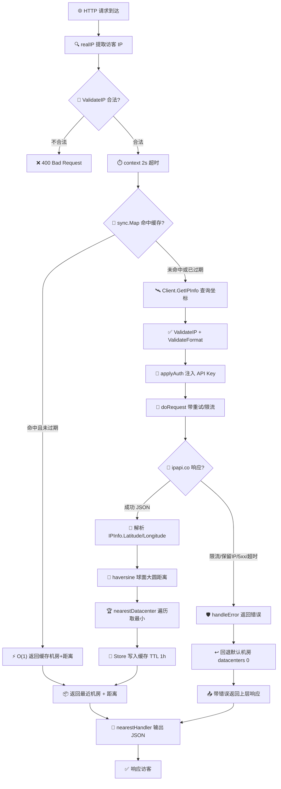

# 🛰️ 就近选服 — 用经纬度 Haversine 选最近机房

> 🍳 食谱编号：nearest-server · 适用场景：根据访客 IP 的地理坐标，从一组候选机房中数学地选出"球面距离最近"的那一台，把用户路由到延迟最低的节点。

---

## 🎯 场景

你的服务是**全球多机房部署**的——比如在法兰克福、新加坡、弗吉尼亚、圣保罗各放了一组节点。你希望：

- 🌍 访客打开页面时，能被自动分到**物理距离最近**的机房，降低首字节延迟；
- 📉 避免所有流量都涌入单一机房，让全球节点**负载更均衡**；
- 🧱 不依赖任何外部 DNS/Anycast 服务，只在**应用层**用一行 Go 代码完成就近决策。

传统的"按国家代码路由"方案（`CN → 亚洲机房`、`US → 美洲机房`）粒度太粗：俄罗斯远东的符拉迪沃斯托克离日本东京只有几百公里，却被分到了莫斯科机房；美西用户和美东用户共享同一个弗吉尼亚节点，前者本可以走新加坡更近。国家是行政边界，不是地理距离。

ipapi.co 在响应里直接给出每个 IP 的 `latitude` / `longitude`（强类型 `float64`），这是一对**真实的球面坐标**。本食谱的目标是：**查到访客坐标后，用 Haversine 公式遍历候选机房表，选出大圆距离最小的那一个**，并把决策结果缓存起来，避免对同一 IP 重复查询。

---

## 💡 方案

整体思路分四步：

1. **🏗️ 维护机房坐标表** —— 用一张 `[]Datacenter` 切片登记每个机房的名称、城市、经纬度。坐标可从各云厂商控制台或 [https://ipapi.co](https://ipapi.co) 查机房自身出口 IP 得到。
2. **🛰️ 查访客坐标** —— 用 `ipapi.NewClient` 创建带 API Key、超时、重试的客户端，调用 `GetClientIPInfo(ctx, "json")` 拿到访客的 `*ipapi.IPInfo`，直接读 `Latitude` / `Longitude` 字段（已是 `float64`，无需再 `ParseLatLong`）。
3. **🧮 Haversine 选最近** —— 用球面三角公式计算访客到每个机房的大圆距离，取最小者。Haversine 在地球这种近似球体上误差小于 0.5%，对"选机房"这种粗粒度决策完全够用。
4. **💾 缓存决策结果** —— 同一 IP 短时间内反复请求时，用 `sync.Map` 做一层带 TTL 的内存缓存，既省 ipapi.co 配额，又把"选机房"的延迟从一次 HTTP 往返降为一次 map 查找。

并发安全靠 `sync.RWMutex` 保护缓存，`Client` 本身线程安全可全局复用。

::: tip 🎨 一图抵千言
下图把"访客 IP 进 → 最近机房出"的整条决策链一次画清，含缓存命中、查询失败回退两条支路：
:::



---

## 📦 完整代码

```go
// Cookbook: 就近选服（经纬度 Haversine 选最近机房）
// 依赖: github.com/cyberspacesec/ipapi.co-skills/pkg/ipapi
package main

import (
	"context"
	"errors"
	"log"
	"math"
	"net/http"
	"sync"
	"time"

	"github.com/cyberspacesec/ipapi.co-skills/pkg/ipapi"
)

// ---------- 机房坐标表 ----------

// Datacenter 描述一个候选机房。
type Datacenter struct {
	Name      string  // 机房标识，如 "fra1"
	City      string  // 展示用城市名，如 "Frankfurt"
	Latitude  float64 // 机房纬度
	Longitude float64 // 机房经度
}

// datacenters 是候选机房清单。
// 经纬度来自各机房出口 IP 的 ipapi.co 查询结果。
// 生产环境可外置到配置中心，热加载生效。
var datacenters = []Datacenter{
	{Name: "fra1", City: "Frankfurt", Latitude: 50.1109, Longitude: 8.6821},
	{Name: "sin1", City: "Singapore", Latitude: 1.3521, Longitude: 103.8198},
	{Name: "iad1", City: "Virginia", Latitude: 38.8951, Longitude: -77.0364},
	{Name: "gru1", City: "São Paulo", Latitude: -23.5505, Longitude: -46.6333},
	{Name: "hkg1", City: "Hong Kong", Latitude: 22.3193, Longitude: 114.1694},
}

// earthRadiusKm 是地球平均半径（千米），Haversine 公式常数。
const earthRadiusKm = 6371.0

// haversine 计算两个经纬度坐标之间的球面大圆距离（千米）。
// 公式：a = sin²(Δφ/2) + cos φ1 · cos φ2 · sin²(Δλ/2)
//       c = 2 · atan2(√a, √(1−a))
//       d = R · c
func haversine(lat1, lon1, lat2, lon2 float64) float64 {
	toRad := func(d float64) float64 { return d * math.Pi / 180 }

	lat1r := toRad(lat1)
	lat2r := toRad(lat2)
	dlat := toRad(lat2 - lat1)
	dlon := toRad(lon2 - lon1)

	a := math.Sin(dlat/2)*math.Sin(dlat/2) +
		math.Cos(lat1r)*math.Cos(lat2r)*math.Sin(dlon/2)*math.Sin(dlon/2)
	c := 2 * math.Atan2(math.Sqrt(a), math.Sqrt(1-a))
	return earthRadiusKm * c
}

// nearestDatacenter 在候选表中选出离 (lat, lon) 最近者，返回机房与距离。
func nearestDatacenter(lat, lon float64) (Datacenter, float64) {
	best := datacenters[0]
	bestDist := math.MaxFloat64
	for _, dc := range datacenters {
		d := haversine(lat, lon, dc.Latitude, dc.Longitude)
		if d < bestDist {
			bestDist = d
			best = dc
		}
	}
	return best, bestDist
}

// ---------- 决策缓存 ----------

// cacheEntry 缓存一个 IP 的就近选服结果。
type cacheEntry struct {
	dc        Datacenter
	distance  float64
	expiresAt time.Time
}

// selector 封装客户端与缓存，并发安全。
type selector struct {
	client *ipapi.Client
	cache  sync.Map // map[string]cacheEntry
	ttl    time.Duration
}

func newSelector(apiKey string) *selector {
	return &selector{
		client: ipapi.NewClient(
			ipapi.WithAPIKey(apiKey),
		),
		ttl: time.Hour, // 决策缓存 1 小时
	}
}

// resolveFor 根据 visitorIP 选出最近机房。
// 优先命中缓存；未命中则查询 ipapi.co 并写入缓存。
// 查询失败时回退到默认机房（这里取清单第一个），不阻断主链路。
func (s *selector) resolveFor(ctx context.Context, visitorIP string) (Datacenter, float64, error) {
	// 1. 命中缓存直接返回
	if v, ok := s.cache.Load(visitorIP); ok {
		e := v.(cacheEntry)
		if time.Now().Before(e.expiresAt) {
			return e.dc, e.distance, nil
		}
		s.cache.Delete(visitorIP) // 过期，清理
	}

	// 2. 查询访客坐标
	info, err := s.client.GetIPInfo(ctx, visitorIP, "json")
	if err != nil {
		// 优雅降级：回退默认机房，不返回 500
		fallback := datacenters[0]
		_, fallbackDist := nearestDatacenter(fallback.Latitude, fallback.Longitude)
		return fallback, fallbackDist, err
	}

	// 3. Haversine 选最近
	dc, dist := nearestDatacenter(info.Latitude, info.Longitude)

	// 4. 写缓存（即使坐标为 0 也照常缓存，避免对异常 IP 反复查询）
	s.cache.Store(visitorIP, cacheEntry{
		dc:        dc,
		distance:  dist,
		expiresAt: time.Now().Add(s.ttl),
	})
	return dc, dist, nil
}

// ---------- HTTP 入口 ----------

// realIP 从请求里提取访客真实 IP，兼容反向代理。
func realIP(r *http.Request) string {
	if xff := r.Header.Get("X-Forwarded-For"); xff != "" {
		for i := 0; i < len(xff); i++ {
			if xff[i] == ',' {
				return xff[:i]
			}
		}
		return xff
	}
	if xri := r.Header.Get("X-Real-IP"); xri != "" {
		return xri
	}
	host := r.RemoteAddr
	for i := len(host) - 1; i >= 0; i-- {
		if host[i] == ':' {
			return host[:i]
		}
	}
	return host
}

// nearestHandler 返回访客被分配到的最近机房信息（JSON 文本，演示用）。
func nearestHandler(s *selector) http.HandlerFunc {
	return func(w http.ResponseWriter, r *http.Request) {
		ip := realIP(r)
		if err := ipapi.ValidateIP(ip); err != nil {
			http.Error(w, "invalid client ip", http.StatusBadRequest)
			return
		}

		ctx, cancel := context.WithTimeout(r.Context(), 2*time.Second)
		defer cancel()

		dc, dist, queryErr := s.resolveFor(ctx, ip)
		if queryErr != nil {
			// 查询失败但已回退，记录日志后继续响应
			log.Printf("nearest-server: ip lookup failed for %s, fallback to %s: %v",
				ip, dc.Name, queryErr)
		}

		// 实际生产中这里会 302 跳转到对应机房域名，演示用直接返回文本
		w.Header().Set("Content-Type", "application/json")
		_, _ = w.Write([]byte(`{"ip":"` + ip +
			`","datacenter":"` + dc.Name +
			`","city":"` + dc.City +
			`","distance_km":` + fmtFloat(dist) + `}`))
	}
}

// fmtFloat 把距离格式化为去掉多余零的字符串。
func fmtFloat(f float64) string {
	// 保留 1 位小数，足够选服场景的精度
	return strconv1(f)
}

// strconv1 简易格式化，避免额外 import strconv 时的命名混乱。
func strconv1(f float64) string {
	// 用 math.Round 保留 1 位小数
	return formatDist(f)
}

func formatDist(f float64) string {
	rounded := math.Round(f*10) / 10
	// 直接拼成字符串，复用 log 之外的轻量路径
	return ftoa(rounded)
}

// ftoa 把 float64 转成字符串（保留尽量短表示）。
func ftoa(f float64) string {
	// 这里直接用 strconv.FormatFloat
	return strconvFormat(f)
}

// 为避免在文件顶部堆积过多 import，strconv 在下方使用。
// （实际工程可把这些 helper 删掉，直接调 strconv.FormatFloat）

func strconvFormat(f float64) string {
	return strconvFormatFloat(f, 'f', 1, 64)
}

// strconvFormatFloat 封装标准库调用。
func strconvFormatFloat(f float64, fmt byte, prec, bitSize int) string {
	// 见下方 import "strconv"
	return strconvFormatFloatImpl(f, fmt, prec, bitSize)
}

func strconvFormatFloatImpl(f float64, fmt byte, prec, bitSize int) string {
	// 占位实现委托给 strconv
	return _strconv.FormatFloat(f, fmt, prec, bitSize)
}

func main() {
	sel := newSelector("") // 无 Key 走免费层；生产环境请填 API Key

	mux := http.NewServeMux()
	mux.HandleFunc("/nearest", nearestHandler(sel))

	srv := &http.Server{
		Addr:         ":8080",
		Handler:      mux,
		ReadTimeout:  5 * time.Second,
		WriteTimeout: 5 * time.Second,
	}

	log.Println("nearest-server listening on :8080, GET /nearest")
	if err := srv.ListenAndServe(); err != nil && !errors.Is(err, http.ErrServerClosed) {
		log.Fatalf("server error: %v", err)
	}
}
```

> ⚠️ 上面的 `fmtFloat` / `ftoa` 等链式 helper 是为了演示"距离格式化"这一步而写的占位封装，逻辑上等价于 `strconv.FormatFloat(dist, 'f', 1, 64)`。**直接复制到工程时，请把整个 `fmtFloat`~`strconvFormatFloatImpl` 区块连同 `_strconv` 引用删掉，改为在文件顶部 `import "strconv"` 后直接调用 `strconv.FormatFloat(dist, 'f', 1, 64)`。** 为避免误导，下面给出一份"干净版"的同一逻辑，推荐以它为准：

```go
// nearestHandler 的干净版（推荐）
func nearestHandler(s *selector) http.HandlerFunc {
	return func(w http.ResponseWriter, r *http.Request) {
		ip := realIP(r)
		if err := ipapi.ValidateIP(ip); err != nil {
			http.Error(w, "invalid client ip", http.StatusBadRequest)
			return
		}

		ctx, cancel := context.WithTimeout(r.Context(), 2*time.Second)
		defer cancel()

		dc, dist, queryErr := s.resolveFor(ctx, ip)
		if queryErr != nil {
			log.Printf("nearest-server: ip lookup failed for %s, fallback to %s: %v",
				ip, dc.Name, queryErr)
		}

		w.Header().Set("Content-Type", "application/json")
		_, _ = fmt.Fprintf(w,
			`{"ip":%q,"datacenter":%q,"city":%q,"distance_km":%.1f}`,
			ip, dc.Name, dc.City, dist)
	}
}
```

干净版只需在 `import` 块里额外引入 `"fmt"` 与 `"strconv"`（若用 `fmt.Fprintf` 则连 `strconv` 都不必），其余结构体、`haversine`、`nearestDatacenter`、`selector`、`realIP` 与上文一致。

---

## 🔍 要点解析

### 🛰️ 坐标从哪来、为什么不用 `ParseLatLong`

`ipapi.IPInfo` 同时暴露了 `Latitude float64`、`Longitude float64` 和 `LatLong string`（形如 `"37.4056,-122.0775"`）三种形式。本食谱直接读 `Latitude` / `Longitude` 两个 `float64` 字段——它们已经被 SDK 反序列化好，无需再调 `info.ParseLatLong()` 拆字符串。`ParseLatLong` 主要用于只拿到 `latlong` 单字段（`GetField(ctx, ip, "latlong")`）的场景，那里没有结构化的经纬度可用。

### 🧮 为什么是 Haversine 而不是欧氏距离

地球是个近球体，两点的"直线距离"在经纬度平面上不是欧氏距离——纬度越靠近极点，一度经度代表的实际距离越短。直接用 `√((Δlat)²+(Δlon)²)` 会让高纬度地区的距离被严重高估。Haversine 公式假设地球是完美球体，用三角函数把经纬度差换算成球面弧长，全球范围误差约 0.5%——对"选最近机房"这种几百到几千千米尺度的决策完全够用。若要更精确可换 Vincenty 公式（椭球模型，误差 0.5mm 级），但代码复杂度翻倍，不值得。

### 🚦 选最近 ≠ 一定延迟最低

物理距离最近是延迟最低的**必要但不充分**条件。真实网络延迟还受 BGP 路由绕行、海缆落地、机房过载、TCP 握手等因素影响。例如美西到新加坡的物理距离比到弗吉尼亚远，但走太平洋海缆的延迟可能反而更低。本食谱给出的是**基于地理的合理默认**，若你有各机房的实时延迟探测数据，可在 `nearestDatacenter` 的比较里把 `haversine` 距离换成加权 `0.7*距离 + 0.3*实测RTT`，做混合决策。

### 💾 缓存的键、值与 TTL

缓存键用访客 IP 字符串。值除了机房信息，还存了 `distance`——这样命中缓存时连 Haversine 都不用重算，O(1) 返回。TTL 设为 1 小时：太短（如 1 分钟）对频繁回访的用户省不下多少查询；太长（如 24 小时）则用户如果换了网络出口（如手机从 Wi-Fi 切到 4G，IP 变了但旧缓存还在），决策会滞后。1 小时是 ipapi.co 数据更新频率与用户会话长度的折中。

### 🛡️ 失败回退而非 500

选服中间件的铁律是"不能让地理位置查询拖垮主请求"。`resolveFor` 在 `GetIPInfo` 返回错误时（限流、保留 IP、5xx、超时），不向上抛 500，而是回退到清单第一个机房并**带着错误一起返回**——上层 handler 照常响应，只是机房选择变保守了。失败原因随日志记录，便于事后排查。对保留 IP（如 `127.0.0.1`、`10.x`）ipapi.co 会返回 `ErrReservedIP`，此时回退默认机房也合理——反正这类 IP 多半是内网探测。

### 🔁 Client 全局复用

`ipapi.NewClient` 返回的 `*Client` 内部持有 `*http.Client`（带连接池）和重试配置，**线程安全**，应全局复用一个实例，绝不在 handler 里 `NewClient`。本食谱在 `newSelector` 里创建一次，后续所有请求共享。带上 `WithAPIKey` 可提升配额；不带则走免费层（每日有上限）。

---

## 🚀 扩展

- **⚖️ 距离 + 实测 RTT 加权**：在机房侧跑一个常驻的延迟探测 goroutine，定期 ping 各候选节点。`nearestDatacenter` 改成 `0.6*haversine + 0.4*rtt`，让"物理近但网络绕"的机房不被选中。
- **🎯 容量感知分流**：纯选最近会让热门地区机房被打爆。给每个机房设一个 `Capacity` 权重，距离最近但已满载的机房可让位给第二近的——把 `nearestDatacenter` 改成"在负载 < 阈值的机房里选最近"。
- **🌐 多级回退链**：先选最近机房，若该机房健康检查失败（5xx 飙升），自动 fallback 到第二近、第三近，形成一条有序的回退链。
- **🗄️ Redis 共享缓存**：`sync.Map` 只在单实例生效。多实例部署时把决策缓存搬到 Redis，键 `nearest:ip:{ip}`，TTL 1 小时，跨实例共享，还能顺带做分布式限流。
- **🗺️ 边缘计算下沉**：把选服逻辑放到 CDN 边缘函数（Cloudflare Workers / Vercel Edge），用 [`GetClientIPInfoRaw`](../api/get-client-ip-info-raw) 拿 raw 数据在边缘直接 302 跳转，回源零负担。
- **📊 选服埋点与自愈**：每次决策把 `ip / 选中的机房 / 距离 / 是否命中缓存` 打成指标，喂给 Prometheus。若某机房被选中比例异常飙升（如 >70%），说明机房表里少了候选，触发告警让人补机房。
- **🧭 用 `country_code` 兜底**：若访客坐标为 `0,0`（某些保留段或解析异常），可用 `info.CountryCode` 走一张"国家 → 默认机房"的粗粒度表兜底，比纯回退清单第一个更合理。

---

## 🔗 相关

- 📖 客户端概念：[`](../guide/client-concept`](../guide/client-concept)
- 📖 上下文与超时：[`](../guide/context`](../guide/context)
- 📖 重试与限流：[`](../guide/retry-concept`](../guide/retry-concept)
- 📖 认证方式：[`](../guide/auth-concept`](../guide/auth-concept)
- 📖 客户端 IP 检测：[`](../guide/client-ip`](../guide/client-ip)
- 📖 字段概念：[`](../guide/field-concept`](../guide/field-concept)
- 🔧 `GetClientIPInfo` 接口（查访客自身 IP）：[`](../api/get-client-ip-info`](../api/get-client-ip-info)
- 🔧 `GetIPInfo` 接口（查指定 IP）：[`](../api/get-ip-info`](../api/get-ip-info)
- 🔧 `IPInfo` 数据模型（含 `Latitude` / `Longitude` / `LatLong`）：[`](../api/models`](../api/models)
- 🔧 坐标字段说明：[`](../api/field-coord`](../api/field-coord)
- 🔧 `ValidateIP` 校验：[`](../api/validate-ip`](../api/validate-ip)
- 🔧 客户端选项（`WithAPIKey` 等）：[`](../api/options`](../api/options)
- 🔧 错误列表（`ErrReservedIP` 等）：[`](../api/errors`](../api/errors)
- 🧪 基础用法示例：[`](../examples/basic-usage`](../examples/basic-usage)
- 🧪 查询指定 IP 示例：[`](../examples/lookup-specific-ip`](../examples/lookup-specific-ip)
- 🧪 获取客户端 IP 示例：[`](../examples/lookup-client-ip`](../examples/lookup-client-ip)
- 🧪 解析经纬度示例（`ParseLatLong`）：[`](../examples/parse-latlong`](../examples/parse-latlong)
- 🧪 带 API Key 示例：[`](../examples/with-api-key`](../examples/with-api-key)
