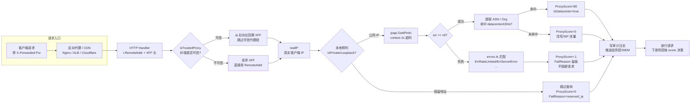

# 🛡️ 代理检测 — 结合 X-Forwarded-For 取真实 IP

> 🍳 食谱编号：proxy-detection · 适用场景：在反向代理 / CDN / 负载均衡之后，准确还原客户端真实 IP 并识别代理流量。

## 🧩 场景

你的服务部署在一层（甚至多层）反向代理之后：Nginx、Cloudflare、AWS ALB、Kubernetes Ingress……这些代理会把原始客户端 IP 记录在 `X-Forwarded-For` 头里，而你从 `r.RemoteAddr` 拿到的只是**最后一跳代理的地址**。

这带来两类麻烦：

1. **拿不到真实 IP**：风控、限流、地理路由、GDPR 判定全都依赖访客真实归属地，而 `RemoteAddr` 指向的是你自己的内网代理，拿去查 ipapi.co 只会得到机房地址。
2. **代理/VPN 流量难以识别**：爬虫、撞库、薅羊毛往往躲在企业代理或 Tor 出口节点背后。你需要知道"这个真实 IP 背后是住宅宽带还是数据中心 ASN"。

更糟的是 `X-Forwarded-For` 是可伪造的——任何客户端都能在请求里塞一个假的 `X-Forwarded-For: 1.2.3.4`。如果你的服务**直接信任**这个头的第一个值，攻击者就能用假 IP 绕过基于地理的风控。

本食谱的目标是：**从右向左、按可信代理链回溯出真实客户端 IP，再用 ipapi.co 查询它的 ASN / Org 判断是否为数据中心流量**，并给出"代理疑似度"评分。

## 💡 方案

1. **维护可信代理网段**：只有来自已知反代（Nginx、ALB、Cloudflare 节点）的请求才信任其 `X-Forwarded-For`。其他来源直接用 `RemoteAddr`，防止外网伪造。
2. **从右向左回溯**：`X-Forwarded-For: client, proxy1, proxy2` 是逗号分隔的链路。最右端是离你最近的代理，最左端是原始客户端。沿链从右往左跳过所有"可信代理"地址，第一个不可信的就是真实客户端 IP。
3. **复用单个 Client**：用 `ipapi.NewClient` 创建带超时、重试、限流通道的客户端，跨请求复用连接池。
4. **并发查询 + 超时兜底**：用 `context.WithTimeout` 给单次查询设上限（如 2 秒），查询失败时不阻断主请求，按"未知"放行但打日志。
5. **代理疑似度评分**：依据 `info.ASN` / `info.Org` 是否命中已知数据中心/ hosting 提供商（Google、AWS、DigitalOcean、Tor 出口等）给出 `proxyScore`，写入审计日志供风控消费。
6. **失败保守但不阻断**：查询出错时 `proxyScore` 置 -1 表示未知，由下游风控决定放行或加强验证，但本中间件不直接拒绝请求。

::: tip 🎨 一图抵千言
下面这张端到端流程图展示了从 HTTP 请求进入、可信代理链回溯真实 IP、到 ipapi.co 查询 ASN 并产出代理疑似度评分的全链路：



整条链路的关键设计点：**安全边界在 `isTrustedProxy`**（不可信对端绝不信任 XFF），**配额保护在本地预判 + RateLimiter**（保留地址不发请求、并发令牌桶限流），**容错在超时 + 失败不阻断**（2 秒兜底、`ProxyScore=-1` 交由风控定夺）。
:::

::: warning ⚠️ 配额与安全两条红线
- **配额**：`detectBatch` 并发场景务必设置 `c.RateLimiter`（如 `time.Tick(200*time.Millisecond)` 约 5 QPS），否则瞬时高并发会打爆 ipapi.co 配额触发 [`ErrRateLimited`](../api/errors)。本地 `IsPrivate()` 预判能把内网流量挡在请求之外，省下宝贵配额给真正需要判定的公网 IP。
- **安全**：`trustedProxyNets` 必须与你的实际部署严格对齐。前端若为 Cloudflare，定期从 [官方 IP 段](https://www.cloudflare.com/ips/) 同步，否则会把 CDN 节点误判为真实客户端，整套代理检测随之失效。`datacenterASNs` 也应定期从 Threat Intel 源更新，避免漏判新出现的 hosting 提供商。
:::

## 🧪 完整代码

```go
package main

import (
	"context"
	"encoding/json"
	"errors"
	"fmt"
	"log"
	"net"
	"net/http"
	"strings"
	"sync"
	"time"

	"github.com/cyberspacesec/ipapi.co-skills/pkg/ipapi"
)

// trustedProxyCIDRs 是你已知的反代/CDN 网段。生产环境按实际部署维护。
// 例：Nginx 内网地址、Cloudflare 公开 IP 段、ALB 节点等。
var trustedProxyNets = func() []*net.IPNet {
	cidrs := []string{
		"10.0.0.0/8",       // 内网 Nginx
		"172.16.0.0/12",    // 内网 Ingress
		"192.168.0.0/16",   // 内网
		"127.0.0.0/8",      // 本机回环
		"173.245.48.0/20",  // Cloudflare 段（示例）
		"103.21.244.0/22",  // Cloudflare 段（示例）
	}
	nets := make([]*net.IPNet, 0, len(cidrs))
	for _, c := range cidrs {
		_, n, err := net.ParseCIDR(c)
		if err != nil {
			panic(err)
		}
		nets = append(nets, n)
	}
	return nets
}()

// datacenterASNs 是已知的数据中心/云/hosting ASN 集合，用于代理疑似度评分。
// 实际生产应从 Threat Intel 源维护，这里仅放示例。
var datacenterASNs = map[string]bool{
	"AS15169": true, // Google
	"AS13335": true, // Cloudflare
	"AS16509": true, // Amazon AWS
	"AS14618": true, // Amazon AES
	"AS8075":  true, // Microsoft
	"AS29073": true, // Hetzner / OVH 等 hosting
	"AS24940": true, // Hetzner
	"AS14061": true, // DigitalOcean
	"AS9009":  true, // M247 (常见 VPN 出口)
}

// proxyDetector 复用同一个 ipapi 客户端，跨请求并发查询。
type proxyDetector struct {
	lookup *ipapi.Client
}

func newProxyDetector(apiKey string) *proxyDetector {
	c := ipapi.NewClient(
		ipapi.WithAPIKey(apiKey),
	)
	c.HTTPClient.Timeout = 5 * time.Second
	c.Retries = 1
	// 简单令牌桶限流：每 200ms 放行一次（约 5 QPS），避免打爆配额
	c.RateLimiter = time.Tick(200 * time.Millisecond)
	return &proxyDetector{lookup: c}
}

// realIP 从请求中还原真实客户端 IP。
// peerAddr 是 TCP 连接对端地址（r.RemoteAddr 去端口）。
// xff 是 X-Forwarded-For 头原始值。
func realIP(peerAddr, xff string) string {
	// 1. 对端不可信，直接用 TCP 对端地址，忽略可伪造的 XFF
	if !isTrustedProxy(peerAddr) {
		return peerAddr
	}

	// 2. 对端可信，解析 XFF 链
	chain := splitXFF(xff)
	if len(chain) == 0 {
		return peerAddr
	}

	// 3. 从右向左跳过所有可信代理，第一个不可信即真实客户端
	for i := len(chain) - 1; i >= 0; i-- {
		if isTrustedProxy(chain[i]) {
			continue
		}
		// 校验是合法 IP，防止注入脏数据
		if net.ParseIP(chain[i]) == nil {
			continue
		}
		return chain[i]
	}

	// 4. 链路里全是可信代理（罕见），退回链路最左端
	return chain[0]
}

// isTrustedProxy 判断某地址是否落在可信代理网段内。
func isTrustedProxy(addr string) bool {
	ipStr, _, err := net.SplitHostPort(addr)
	if err != nil {
		// 没带端口，直接当 IP 用
		ipStr = addr
	}
	ip := net.ParseIP(ipStr)
	if ip == nil {
		return false
	}
	for _, n := range trustedProxyNets {
		if n.Contains(ip) {
			return true
		}
	}
	return false
}

// splitXFF 解析 X-Forwarded-For 头为去空白后的 IP 列表，保留顺序。
func splitXFF(xff string) []string {
	if xff == "" {
		return nil
	}
	parts := strings.Split(xff, ",")
	out := make([]string, 0, len(parts))
	for _, p := range parts {
		p = strings.TrimSpace(p)
		if p != "" {
			out = append(out, p)
		}
	}
	return out
}

// proxyVerdict 是单次代理检测的判定结果。
type proxyVerdict struct {
	RealIP      string    `json:"real_ip"`
	ASN         string    `json:"asn"`
	Org         string    `json:"org"`
	Country     string    `json:"country"`
	Hostname    string    `json:"hostname,omitempty"`
	ProxyScore  int       `json:"proxy_score"`  // 0=住宅/未知，1-100 疑似数据中心/VPN，-1 查询失败
	IsDatacenter bool     `json:"is_datacenter"`
	LookupOK    bool      `json:"lookup_ok"`
	FailReason  string    `json:"fail_reason,omitempty"`
	DeterminedAt time.Time `json:"determined_at"`
}

// detect 查询真实 IP 的归属信息并给出代理疑似度评分。
func (d *proxyDetector) detect(parent context.Context, realAddr string) proxyVerdict {
	v := proxyVerdict{
		RealIP:       realAddr,
		DeterminedAt: time.Now().UTC(),
	}

	// 内网/保留地址不查 ipapi.co，避免 ErrReservedIP 浪费配额
	ip := net.ParseIP(realAddr)
	if ip != nil && (ip.IsPrivate() || ip.IsLoopback() || ip.IsUnspecified()) {
		v.ProxyScore = 0
		v.FailReason = "reserved_ip"
		return v
	}

	ctx, cancel := context.WithTimeout(parent, 2*time.Second)
	defer cancel()

	info, err := d.lookup.GetIPInfo(ctx, realAddr, string(ipapi.FormatJSON))
	if err != nil {
		reason := "unknown"
		switch {
		case errors.Is(err, ipapi.ErrRateLimited):
			reason = "rate_limited"
		case errors.Is(err, ipapi.ErrReservedIP):
			reason = "reserved_ip"
		case errors.Is(err, ipapi.ErrServerError):
			reason = "server_error"
		case errors.Is(err, ipapi.ErrInvalidIP):
			reason = "invalid_ip"
		}
		v.ProxyScore = -1
		v.LookupOK = false
		v.FailReason = reason
		return v
	}

	v.ASN = info.ASN
	v.Org = info.Org
	v.Country = info.Country
	v.Hostname = info.Hostname
	v.LookupOK = true
	v.DeterminedAt = info.RetrievedAt

	// 评分：命中数据中心 ASN 即判为疑似代理流量
	if datacenterASNs[info.ASN] {
		v.IsDatacenter = true
		v.ProxyScore = 80
	} else {
		v.ProxyScore = 0
	}
	return v
}

// detectBatch 并发检测一批真实 IP，结果与输入顺序对齐。
func (d *proxyDetector) detectBatch(parent context.Context, realAddrs []string) []proxyVerdict {
	results := make([]proxyVerdict, len(realAddrs))
	var wg sync.WaitGroup
	for i, addr := range realAddrs {
		wg.Add(1)
		go func(idx int, a string) {
			defer wg.Done()
			results[idx] = d.detect(parent, a)
		}(i, addr)
	}
	wg.Wait()
	return results
}

// detectHandler 是 HTTP 处理入口：先还原真实 IP，再判定代理疑似度。
func (d *proxyDetector) detectHandler(w http.ResponseWriter, r *http.Request) {
	peerAddr := r.RemoteAddr
	real := realIP(peerAddr, r.Header.Get("X-Forwarded-For"))

	verdict := d.detect(r.Context(), real)

	// 审计日志：留痕真实 IP + 代理评分，供风控/安全分析消费
	audit, _ := json.Marshal(verdict)
	log.Printf("proxy-audit peer=%s real=%s score=%d dc=%v ctx=%s",
		peerAddr, verdict.RealIP, verdict.ProxyScore, verdict.IsDatacenter, audit)

	resp := map[string]any{
		"status":         "ok",
		"real_ip":        verdict.RealIP,
		"country":        verdict.Country,
		"asn":            verdict.ASN,
		"org":            verdict.Org,
		"proxy_score":    verdict.ProxyScore,
		"is_datacenter":  verdict.IsDatacenter,
		"lookup_ok":      verdict.LookupOK,
	}
	w.Header().Set("Content-Type", "application/json")
	_ = json.NewEncoder(w).Encode(resp)
}

func main() {
	detector := newProxyDetector("YOUR_API_KEY") // 替换为真实密钥

	// 演示批量检测
	ctx := context.Background()
	batch := []string{"8.8.8.8", "1.1.1.1", "203.0.113.42"} // 8.8.8.8 是数据中心
	for i, v := range detector.detectBatch(ctx, batch) {
		fmt.Printf("[%d] ip=%s asn=%s org=%s score=%d dc=%v ok=%v\n",
			i, v.RealIP, v.ASN, v.Org, v.ProxyScore, v.IsDatacenter, v.LookupOK)
	}

	// 启动 HTTP 服务
	mux := http.NewServeMux()
	mux.HandleFunc("/detect", detector.detectHandler)
	srv := &http.Server{
		Addr:              ":8080",
		Handler:           mux,
		ReadHeaderTimeout: 5 * time.Second,
	}
	log.Println("listening on :8080")
	log.Fatal(srv.ListenAndServe())
}
```

> 💡 运行前请将 `YOUR_API_KEY` 替换为你在 ipapi.co 申请的真实密钥。无密钥模式下免费额度有限，且可能触发 `ErrRateLimited`。`hostname` 字段为可选 add-on，普通账户可能为空。

## 🔍 要点解析

### 🎯 为什么"从右向左"回溯

`X-Forwarded-For` 是逐跳（hop-by-hop）头：每经过一层代理，代理会把自己的对端地址**追加到最右端**。因此链路形态是 `[client, proxy1, proxy2, ...]`，**最左端是原始客户端**，最右端是离你最近的代理。

但最左端恰恰最不可信——攻击者可以在首个请求里伪造任意值，后续真实代理会忠实地把这个假值保留在最左端并追加真实地址到右边。所以正确做法是：**只信任最右端的可信代理**，从右往左跳过所有你部署的可信代理，第一个不可信的地址才是真实客户端 IP。

### 🛡️ 可信代理网段是安全基石

`isTrustedProxy` 是整个方案的安全边界。只有当 TCP 对端 `r.RemoteAddr` 落在你预先登记的可信网段内时，才允许解析 `X-Forwarded-For`；否则直接用对端地址，丢弃头。这能挡住"外网直连 + 伪造 XFF"的攻击。

::: warning ⚠️ 别忘了维护 Cloudflare / ALB 段
若你的服务直接暴露在公网且前端是 Cloudflare，要把 Cloudflare 公开 IP 段加进 `trustedProxyNets`，否则会把 Cloudflare 节点当真实客户端。Cloudflare 官方提供 [IP 段列表](https://www.cloudflare.com/ips/) 可定期同步。
:::

### 🧹 本地预判保留地址

`detect` 在发请求前先用 `net.IP.IsPrivate()` / `IsLoopback()` / `IsUnspecified()` 过滤内网地址。这能避免对 `10.0.0.1` 这类地址发起请求——它们会触发服务端返回 `ErrReservedIP`，白白消耗配额。这一步与 SDK 的 [`ValidateIP`](../api/validate-ip) 互补：`ValidateIP` 只判格式合法，保留判断在服务端；本地 `IsPrivate()` 则提前拦截。

### 📡 用 ASN 识别数据中心流量

ipapi.co 返回的 `info.ASN`（如 `AS15169`）和 `info.Org`（如 `Google LLC`）能告诉你这个 IP 背后是住宅 ISP 还是云厂商。命中 `datacenterASNs` 集合的地址高度疑似代理/VPN/爬虫流量。`ProxyScore` 把它量化成数值，便于下游风控统一阈值（如 `score >= 80` 触发人机校验）。

### ⏱️ 超时与并发

`detect` 内部用 `context.WithTimeout(parent, 2*time.Second)` 派生子上下文，即使 ipapi.co 慢响应也不拖垮主请求。`detectBatch` 用 `sync.WaitGroup` 并发查询一批 IP，结果按索引写回切片保证顺序对齐。客户端的 `RateLimiter` 通道（`time.Tick`）在并发场景下做令牌桶，避免打爆 ipapi.co 配额触发 `ErrRateLimited`。

### 🧾 区分失败类型

SDK 返回的是 sentinel error，可用 `errors.Is` 精确匹配 `ErrRateLimited` / `ErrReservedIP` / `ErrServerError` / `ErrInvalidIP`。把失败原因写进 `FailReason`，审计日志能回答"那次 `proxy_score=-1` 是因为限流还是 IP 格式非法"。失败时 `ProxyScore` 置 -1 而非 0，明确区分"查到了且是住宅"与"没查到"。

## 🚀 扩展

- **缓存判定结果**：同一个真实 IP 短时间内反复判定是浪费。可加一层 `sync.Map` 或 Redis 缓存，键为 IP、值为 `proxyVerdict`，TTL 设为 1 小时。注意 IP 重新分配后要重新判定。
- **Tor 出口节点检测**：维护 [Tor consensus](https://check.torproject.org/exit-addresses) 的出口地址集合，命中即把 `ProxyScore` 拉满到 100，并在审计日志里打 `tor_exit` 标记。
- **解析 `X-Real-IP` / `Forwarded` 头**：部分代理用 `X-Real-IP` 单值头或标准化的 `Forwarded` 头传递客户端 IP，可在 `realIP` 里增加回退解析分支，优先级低于可信链回溯。
- **结合 `country_code` 做地理风控**：某些业务对特定国家有额外限制（如制裁地区）。可在 `detect` 后再按 `info.CountryCode` 二次分流，与 [`eu-compliance`](./eu-compliance) 食谱的 GDPR 判定联动。
- **失败降级到本地 GeoIP 库**：对可用性要求极高的场景，可在 ipapi.co 不可达时降级读取本地 MaxMind GeoLite2 ASN 库做兜底判定，仅损失精度而非完全失明。
- **可信代理段自动同步**：若前端是 Cloudflare，写一个定时任务拉取其官方 IP 段 JSON，热更新 `trustedProxyNets`，避免段变更后漏判。
- **接入威胁情报流**：把 `proxy_score` 与 `real_ip` 推送到 SIEM（如 Elasticsearch / Loki），与登录异常、下单频率等信号联合建模，做实时风控。

## 🔗 相关

- 📖 客户端概念：[`](../guide/client-concept`](../guide/client-concept)
- 📖 保留 IP 地址：[`](../guide/reserved-ip`](../guide/reserved-ip)
- 📖 错误处理思路：[`](../guide/error-concept`](../guide/error-concept)
- 📖 重试与限流：[`](../guide/retry-concept`](../guide/retry-concept)
- 📖 上下文与超时：[`](../guide/context`](../guide/context)
- 🔧 `GetIPInfo` 接口：[`](../api/get-ip-info`](../api/get-ip-info)
- 🔧 `IPInfo` 数据模型：[`](../api/models`](../api/models)
- 🔧 ASN 字段（含 `ASN` / `Org` / `Hostname`）：[`](../api/field-asn`](../api/field-asn)
- 🔧 `ValidateIP` 校验：[`](../api/validate-ip`](../api/validate-ip)
- 🔧 客户端选项：[`](../api/options`](../api/options)
- 🔧 错误列表：[`](../api/errors`](../api/errors)
- 🧪 基础用法示例：[`](../examples/basic-usage`](../examples/basic-usage)
- 🧪 错误处理示例：[`](../examples/error-handling`](../examples/error-handling)
- 🧪 批量查询示例：[`](../examples/batch-lookup`](../examples/batch-lookup)
- 🧪 指定 IP 查询示例：[`](../examples/lookup-specific-ip`](../examples/lookup-specific-ip)
