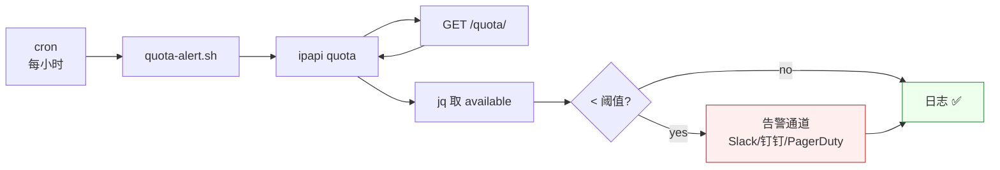

# 🍳 配额监控与告警

> 定时探查 ipapi.co 剩余配额，低于阈值时告警，避免生产环境突发 `429 RATE_LIMITED`。

## 场景

ipapi.co 的 free plan 每天 1000 次、付费 plan 按月配额。配额耗尽后所有查询返回 `429 RATE_LIMITED`（退出码 6），导致依赖 IP 定位的服务降级。本食谱用 `ipapi quota` 命令 + cron 构建一个轻量监控，在耗尽前主动告警。

## 方案

```bash
#!/usr/bin/env bash
# quota-alert.sh —— ipapi.co 配额监控
set -euo pipefail

THRESHOLD="${QUOTA_THRESHOLD:-1000}"   # 低于此值告警
KEY="${IPAPI_API_KEY:?need IPAPI_API_KEY}"

# 取剩余配额（stdout 纯 JSON 信封）
resp=$(ipapi quota 2>/tmp/quota.err) || {
  code=$(jq -r '.error.code' /tmp/quota.err)
  echo "🚨 quota 查询失败: $code" >&2
  exit 1
}

available=$(echo "$resp" | jq -r '.data.available')

# "API key needed" 等非数字直接退出
[[ "$available" =~ ^[0-9]+$ ]] || { echo "ℹ️ 配额不可查: $available"; exit 0; }

if [ "$available" -lt "$THRESHOLD" ]; then
  echo "⚠️ ipapi 配额仅剩 $available（阈值 $THRESHOLD）"
  # 接入你的告警通道：Slack / 钉钉 / PagerDuty / 邮件
  # send_alert "ipapi quota low: $available"
  exit 2
fi

echo "✅ ipapi 配额充足: $available"
```

## cron 部署

```bash
# 每小时整点检查一次
3 * * * * IPAPI_API_KEY=xxx /path/to/quota-alert.sh >> /var/log/ipapi-quota.log 2>&1
```

## 架构



## Go SDK 版本

若需嵌入 Go 服务：

```go
func checkQuota(ctx context.Context, c *ipapi.Client, threshold int) error {
    q, err := c.GetQuota(ctx)
    if err != nil {
        return fmt.Errorf("quota check: %w", err)
    }
    n, ok := q.AvailableInt()
    if !ok {
        return nil // 无 key 或不可查，跳过
    }
    if n < threshold {
        return alertLowQuota(n) // 你的告警逻辑
    }
    return nil
}

// 后台 goroutine 每小时检查
go func() {
    t := time.NewTicker(time.Hour)
    defer t.Stop()
    for range t.C {
        _ = checkQuota(ctx, client, 1000)
    }
}()
```

## 关联

- [SDK `GetQuota`](/api/get-quota)
- [CLI `quota` 命令](/cli/command-quota)
- [限流策略最佳实践](/best-practices/rate-limit-strategy)
- [可观测性最佳实践](/best-practices/observability)
