# 🌍 按国家限流

> 根据访客 IP 所属国家代码，施加差异化的速率限制策略。

## 🧩 场景

你的服务面向全球开放，但不同国家/地区的流量画像差异很大：

- 🚀 核心市场（如 `US`、`JP`）请求量稳定、可信度高，应给更高配额；
- ⚠️ 风险较高或刷量严重的地区需要更严格的限流；
- 🧱 免费层服务对总请求数有上限，必须把额度"好钢用在刀刃上"。

传统按单一全局阈值限流的方案，会让低风险用户被高风险地区拖累，也让攻击者难以被单点封堵。我们需要在请求入口拿到访客的国家代码，再据此决定放行还是限流。

## 💡 方案

整体思路分三步：

1. **🔍 识别国家** —— 在请求入口调用 `ipapi` SDK 解析客户端 IP 的 `country_code` 字段，拿到 ISO-2 国家码（如 `CN`、`US`）。
2. **🎚️ 配置差异化配额** —— 用一张 `map[string]RateLimit` 配置表，为每个国家设定独立的 `limit`（窗口内最大请求数）与 `window`（时间窗口）。
3. **🧮 滑动窗口计数** —— 用 `sync.Map` + `sync.Mutex` 为每个国家维护独立的计数桶，窗口到期自动重置；未命中配置的国家走 `default` 兜底策略。

下面给出一个可独立运行、基于标准库 `net/http`、`sync`、`time` 的完整中间件实现。

::: tip 🎨 一图抵千言
下图展示了一个请求从进入到被限流决策的完整链路：先提取客户端 IP，经 `countryResolver` 解析国家代码（命中缓存直返，未命中则调 `Client.GetField` 拉取 `country_code`，底层经 `doRequest`/`applyAuth` 发往 ipapi.co），再交给 `limiter` 按国家配额桶判定放行或 429。
:::

```mermaid
flowchart LR
    A["🌐 HTTP 请求进入"] --> B["🔎 clientIP 提取真实 IP"]
    B --> C{"🧠 缓存命中?"}
    C -- "✅ 命中" --> F["🏷️ 拿到国家代码"]
    C -- "❌ 未命中" --> D["📦 Client.GetField country_code"]
    D --> D1["🔧 doRequest / applyAuth"]
    D1 --> D2["🌐 请求 ipapi.co"]
    D2 --> D3{"⚠️ handleError"}
    D3 -- "✅ 成功" --> E["💾 写入 IP 缓存"]
    E --> F
    D3 -- "❌ 失败" --> F0["🕳️ 空串走 default 兜底"]
    F0 --> G
    F --> G["🎚️ ruleFor 选配额策略"]
    G --> H["🪣 limiter.allow 命中国家计数桶"]
    H --> I{"🧮 是否超限?"}
    I -- "✅ 未超" --> J["🚀 放行 next.ServeHTTP"]
    I -- "❌ 超限" --> K["⛔ 429 Too Many Requests"]
    J --> L["📤 写 X-Client-Country 头"]
    L --> M["🎯 下游业务处理"]
```



## 📦 完整代码

```go
// Cookbook: 按国家限流
// 依赖: github.com/cyberspacesec/ipapi.co-skills/pkg/ipapi
package main

import (
	"context"
	"fmt"
	"log"
	"net/http"
	"strings"
	"sync"
	"time"

	"github.com/cyberspacesec/ipapi.co-skills/pkg/ipapi"
)

// ---------- 限流策略配置 ----------

// RateLimit 描述一个国家在时间窗口内允许的请求数。
type RateLimit struct {
	Limit  int
	Window time.Duration
}

// perCountryRules 是国家代码 -> 限流策略的配置表。
// 可按业务需要自由增删，未命中的国家走 defaultRule。
var perCountryRules = map[string]RateLimit{
	"US": {Limit: 1000, Window: time.Minute}, // 核心市场：1000 req/min
	"JP": {Limit: 800, Window: time.Minute},
	"DE": {Limit: 600, Window: time.Minute},
	"CN": {Limit: 120, Window: time.Minute}, // 风险较高：120 req/min
	"RU": {Limit: 60, Window: time.Minute},
}

// defaultRule 兜底策略：未在表中列出的国家。
var defaultRule = RateLimit{Limit: 200, Window: time.Minute}

// ruleFor 返回指定国家代码的限流策略。
func ruleFor(country string) RateLimit {
	if r, ok := perCountryRules[strings.ToUpper(country)]; ok {
		return r
	}
	return defaultRule
}

// ---------- 滑动窗口计数器 ----------

// counter 是单国家维度的计数桶。
type counter struct {
	mu      sync.Mutex
	hits    int
	expires time.Time
}

// limiter 按国家维度管理所有计数桶。
type limiter struct {
	store sync.Map // map[string]*counter
}

// allow 根据 country 查对应规则，判断是否放行。
func (l *limiter) allow(country string) bool {
	rule := ruleFor(country)

	v, _ := l.store.LoadOrStore(country, &counter{})
	c := v.(*counter)

	c.mu.Lock()
	defer c.mu.Unlock()

	now := time.Now()
	// 窗口过期则重置
	if now.After(c.expires) {
		c.hits = 0
		c.expires = now.Add(rule.Window)
	}

	if c.hits >= rule.Limit {
		return false // 触发限流
	}
	c.hits++
	return true
}

// ---------- 国家识别（ipapi SDK） ----------

// countryResolver 用 ipapi 客户端解析 IP 的国家代码。
// 它带有一个本地缓存，避免对同一 IP 重复查询消耗配额。
type countryResolver struct {
	client *ipapi.Client
	cache  sync.Map // map[string]string  ip -> country code
}

// resolve 返回大写的国家代码；解析失败返回空串。
func (r *countryResolver) resolve(ip string) string {
	if ip == "" {
		return ""
	}
	if v, ok := r.cache.Load(ip); ok {
		return v.(string)
	}

	// 用 context 控制超时，避免查询拖垮主请求
	ctx, cancel := context.WithTimeout(context.Background(), 3*time.Second)
	defer cancel()

	// GetField 只取 country_code 单字段，比拉全量 IPInfo 更省流量
	code, err := r.client.GetField(ctx, ip, "country_code")
	if err != nil {
		log.Printf("ipapi lookup %s failed: %v", ip, err)
		return ""
	}
	code = strings.ToUpper(strings.TrimSpace(code))
	r.cache.Store(ip, code)
	return code
}

// ---------- HTTP 中间件 ----------

// rateLimitByCountry 组合上述组件，作为 HTTP 中间件。
func rateLimitByCountry(resolver *countryResolver, lim *limiter, next http.Handler) http.Handler {
	return http.HandlerFunc(func(w http.ResponseWriter, req *http.Request) {
		ip := clientIP(req)
		country := resolver.resolve(ip)

		// 拿不到国家代码时，走 default 兜底（country="" 会命中 defaultRule）
		if !lim.allow(country) {
			w.Header().Set("Retry-After", "60")
			http.Error(w,
				fmt.Sprintf("⛔ rate limit exceeded for country %q, try later", country),
				http.StatusTooManyRequests)
			return
		}

		// 把识别到的国家透传给下游业务，方便做更多决策
		w.Header().Set("X-Client-Country", country)
		next.ServeHTTP(w, req)
	})
}

// clientIP 从请求中提取客户端真实 IP，优先读代理头。
func clientIP(req *http.Request) string {
	if xff := req.Header.Get("X-Forwarded-For"); xff != "" {
		// 取列表中第一个（最原始的客户端）
		if i := strings.IndexByte(xff, ','); i >= 0 {
			return strings.TrimSpace(xff[:i])
		}
		return strings.TrimSpace(xff)
	}
	if real := req.Header.Get("X-Real-IP"); real != "" {
		return strings.TrimSpace(real)
	}
	// 退而求其次用 RemoteAddr
	host := req.RemoteAddr
	if i := strings.LastIndex(host, ":"); i >= 0 {
		host = host[:i]
	}
	return host
}

// ---------- 启动示例 ----------

func main() {
	// 1. 创建 ipapi 客户端；生产环境建议配置 API Key 提高配额
	client := ipapi.NewClient(
		ipapi.WithAPIKey("YOUR_API_KEY"), // 可选：填入你的密钥
	)

	resolver := &countryResolver{client: client}
	lim := &limiter{}

	mux := http.NewServeMux()
	mux.HandleFunc("/", func(w http.ResponseWriter, req *http.Request) {
		fmt.Fprintf(w, "✅ hello, your country header is %s\n", w.Header().Get("X-Client-Country"))
	})

	// 2. 套上按国家限流中间件
	server := &http.Server{
		Addr:    ":8080",
		Handler: rateLimitByCountry(resolver, lim, mux),
	}

	log.Println("🚀 listening on :8080")
	if err := server.ListenAndServe(); err != nil {
		log.Fatalf("server error: %v", err)
	}
}
```

运行后，来自 `US` 的请求每分钟可放行 1000 次，而来自 `CN` 的请求超过 120 次即返回 `429 Too Many Requests` 并带上 `Retry-After: 60`，下游业务还能通过响应头 `X-Client-Country` 拿到识别到的国家代码。

## 🔍 要点解析

- **🎯 用 `GetField` 而非 `GetIPInfo`**：限流只需 `country_code` 一个字段，调用 [`GetField`](../api/get-field) 拉取单字段比 [`GetIPInfo`](../api/get-ip-info) 取全量响应更省带宽、更快，也少占 API 配额。
- **🧠 本地缓存避免重复查询**：`countryResolver` 用 `sync.Map` 缓存 IP→国家映射，同一 IP 在缓存有效期内只查一次 ipapi，这是控制成本的关键。生产中可换成带 TTL 的 LRU。
- **🛡️ `context` 超时保护**：解析国家时设了 3s 超时，ipapi 查询慢或失败时不会拖垮主请求链路，参见 [上下文与超时](../guide/context)。
- **🎚️ 配置表与兜底策略**：`perCountryRules` + `defaultRule` 让限流策略可声明式配置，新国家上线只需加一行；未命中走兜底，避免漏网。
- **🔒 并发安全**：`sync.Map` 存桶、`sync.Mutex` 保护桶内计数，多 goroutine 并发请求下计数不会错乱——这正是 [`Client`](../guide/client-concept) 自身线程安全理念在业务侧的延续。
- **📤 国家透传**：通过 `X-Client-Country` 响应头把识别结果传给下游，方便风控、日志、AB 测试复用，无需重复解析。
- **⏎ 友好的 429**：返回标准 `429` 状态码并附带 `Retry-After`，符合 HTTP 语义，客户端可据此退避重试。

## 🧪 扩展

- **🔄 滑动窗口升级为令牌桶**：当前是固定窗口计数，临界点可能瞬时翻倍。可改用令牌桶或滑动日志算法，平滑突发流量。
- **⏳ 给缓存加 TTL**：IP 归属可能变更，给 `countryResolver` 的缓存项加过期时间（如 1h），兼顾成本与准确性。
- **🧱 按 ASN/运营商二次分层**：在 `country_code` 之外再用 [`asn`](../api/field-asn) / `org` 字段细分，对同一国家内的云厂商出口做单独限流，防刷更精准。
- **📉 接入 Prometheus 指标**：为每个国家的 `allowed` / `denied` 计数暴露 metrics，可视化各国产出与拦截比。
- **🗝️ 配置热更新**：把 `perCountryRules` 改为从配置中心（如 etcd / 文件 watch）加载，无需重启即可调整阈值。
- **🚦 配合降级**：当 ipapi 自身返回 [`ErrRateLimited`](../api/errors) 时，临时回退到 `defaultRule`，保证限流中间件不因依赖故障而全放行或全拒绝。

## 🔗 相关

- 指南：[客户端概念](../guide/client-concept) · [上下文与超时](../guide/context) · [认证概念](../guide/auth-concept) · [字段概念](../guide/field-concept)
- API：[GetIPInfo](../api/get-ip-info) · [GetField](../api/get-field) · [NewClient](../api/new-client) · [WithAPIKey](../api/with-api-key) · [错误类型](../api/errors)
- 示例：[查询指定 IP](../examples/lookup-specific-ip) · [单字段查询](../examples/single-field) · [自定义错误处理](../examples/custom-error)
