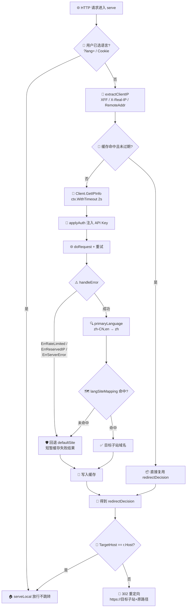

# 🌐 按语言重定向 — 用 `languages` 字段路由到本地化站点

> 🛡️ 食谱编号：redirect-by-language · 适用场景：根据访客 IP 的语言偏好，自动把请求重定向到对应语种的本地化站点。

## 🧩 场景

你的产品面向多语言市场，为每个主要语种部署了独立的本地化站点：

- `zh.example.com` —— 简体中文站
- `en.example.com` —— 英文站
- `ja.example.com` —— 日文站
- `de.example.com` —— 德文站
- ……

你希望访客**第一次**打开主站 `example.com` 时，服务端就能根据其所在地常用的语言**自动 302 跳转**到最合适的语种子站，而不是让用户自己去页面角落里点"切换语言"。

浏览器自带的 `Accept-Language` 头当然能做类似的事，但它有两个问题：一是终端用户经常不配置、或配置得混乱（系统语言与浏览器语言不一致）；二是它可被任意伪造，无法与真实地理位置挂钩。ipapi.co 在响应里直接返回 `languages` 字段——它给出该 IP 所在地区**事实上最常用**的语言列表（如 `"zh-CN,en"`、`"ja"`、`"de,en"`），比 `Accept-Language` 更贴近访客的真实语境。

本食谱的目标是：**在 HTTP 中间件里查询访客 IP 的 `languages`，解析出首选语言主标签，映射到本地化站点后 302 重定向**；并在查询失败、语言未识别时回退到默认英文站，保证链路不中断。

## 💡 方案

1. **复用单个 Client**：用 `ipapi.NewClient` 创建带 API Key、超时与重试的客户端，全局复用，避免每次请求新建连接池。
2. **并发安全 + 超时兜底**：`Client` 本身线程安全，可在多个 goroutine 间复用；每次查询派生 `context.WithTimeout` 子上下文（如 2 秒），即使 ipapi.co 偶发慢响应也不会拖垮主请求。
3. **解析 `languages` 主标签**：该字段是逗号分隔的语言列表（如 `"zh-CN,en"`），取**第一项**作为首选语言，再按下划线/横杠拆出主语言子标签（`zh-CN` → `zh`），用于匹配站点映射表。
4. **站点映射表 + 默认回退**：用一张 `map[string]string` 维护「主语言 → 子站域名」。命中即 302 跳转；未命中或查询失败时回退默认站（英文）。
5. **尊重用户已显式选择**：如果请求带有 `?lang=xx` 或 `Set-Cookie: lang=xx`，说明用户已手动切换语言，应跳过自动重定向，避免"跳来跳去"的循环。
6. **缓存判定结果**：同一 IP 短时间内反复判定是浪费。用 `sync.Map` 做一层内存缓存，TTL 设为 1 小时，减少 ipapi.co 配额消耗。

::: tip 🎨 一图抵千言
下图把"访客 IP → 查询 `languages` → 路由到本地化子站"的整条链路串起来，包含缓存命中、用户已显式选择、失败回退三条捷径。
:::



## 🧪 完整代码

```go
package main

import (
	"context"
	"errors"
	"log"
	"net/http"
	"strings"
	"sync"
	"time"

	"github.com/cyberspacesec/ipapi.co-skills/pkg/ipapi"
)

// langSiteMapping 维护「主语言标签 → 本地化子站域名」映射。
// 未命中的语言将回退到 defaultSite。
var langSiteMapping = map[string]string{
	"zh": "zh.example.com", // 简体中文
	"en": "en.example.com", // 英文
	"ja": "ja.example.com", // 日文
	"ko": "ko.example.com", // 韩文
	"de": "de.example.com", // 德文
	"fr": "fr.example.com", // 法文
	"es": "es.example.com", // 西班牙文
	"ru": "ru.example.com", // 俄文
	"pt": "pt.example.com", // 葡萄牙文
	"ar": "ar.example.com", // 阿拉伯文
}

const (
	defaultSite   = "en.example.com" // 兜底站点：英文
	cacheTTL      = time.Hour        // 判定结果缓存有效期
	lookupTimeout = 2 * time.Second  // 单次 IP 查询超时
)

// redirectDecision 封装一次语言判定的结果，便于缓存与审计。
type redirectDecision struct {
	PrimaryLang string    // 解析出的首选语言主标签，如 "zh"
	TargetHost  string    // 命中的目标子站域名
	LookupOK    bool      // ipapi.co 查询是否成功
	DeterminedAt time.Time // 判定时刻
}

// cachedEntry 是 sync.Map 里的缓存条目。
type cachedEntry struct {
	decision  redirectDecision
	expiresAt time.Time
}

// redirectServer 封装 HTTP 服务与 ipapi 客户端。
type redirectServer struct {
	lookup *ipapi.Client
	cache  sync.Map // map[string]*cachedEntry，键为访客 IP
}

func newRedirectServer(apiKey string) *redirectServer {
	c := ipapi.NewClient(
		ipapi.WithAPIKey(apiKey),
	)
	c.HTTPClient.Timeout = 5 * time.Second
	c.Retries = 1
	return &redirectServer{lookup: c}
}

// primaryLanguage 解析 ipapi.co 的 languages 字段，返回首选语言主标签。
// 输入形如 "zh-CN,en" / "ja" / "de,en" / "pt-BR,pt,en"。
// 取逗号前的第一项，再取横杠/下划线前的子标签，统一小写。
func primaryLanguage(languages string) string {
	if languages == "" {
		return ""
	}
	// 1. 取第一项（首选语言）
	first := strings.SplitN(languages, ",", 2)[0]
	// 2. 去掉区域子标签：zh-CN -> zh；pt-BR -> pt
	if i := strings.IndexAny(first, "-_"); i > 0 {
		first = first[:i]
	}
	return strings.ToLower(strings.TrimSpace(first))
}

// resolve 把 IP 解析为重定向决策。优先读缓存，未命中才查 ipapi.co。
func (s *redirectServer) resolve(parent context.Context, ip string) redirectDecision {
	// 1. 命中缓存且未过期，直接返回
	if raw, ok := s.cache.Load(ip); ok {
		if entry, ok := raw.(*cachedEntry); ok && time.Now().Before(entry.expiresAt) {
			return entry.decision
		}
	}

	// 2. 查询 ipapi.co
	ctx, cancel := context.WithTimeout(parent, lookupTimeout)
	defer cancel()

	info, err := s.lookup.GetIPInfo(ctx, ip, string(ipapi.FormatJSON))
	if err != nil {
		// 查询失败：回退默认站，并记录原因便于排查
		reason := "unknown"
		switch {
		case errors.Is(err, ipapi.ErrRateLimited):
			reason = "rate_limited"
		case errors.Is(err, ipapi.ErrReservedIP):
			reason = "reserved_ip"
		case errors.Is(err, ipapi.ErrServerError):
			reason = "server_error"
		}
		log.Printf("lang-redirect ip=%s lookup_failed reason=%s err=%v", ip, reason, err)
		d := redirectDecision{
			PrimaryLang:  "",
			TargetHost:   defaultSite,
			LookupOK:     false,
			DeterminedAt: time.Now().UTC(),
		}
		// 失败也短暂缓存，避免短时间内对 ipapi.co 重复打爆
		s.cache.Store(ip, &cachedEntry{decision: d, expiresAt: time.Now().Add(cacheTTL)})
		return d
	}

	// 3. 解析首选语言并映射站点
	lang := primaryLanguage(info.Languages)
	target, ok := langSiteMapping[lang]
	if !ok {
		target = defaultSite // 未识别语言回退英文站
	}
	d := redirectDecision{
		PrimaryLang:  lang,
		TargetHost:   target,
		LookupOK:     true,
		DeterminedAt: info.RetrievedAt,
	}
	s.cache.Store(ip, &cachedEntry{decision: d, expiresAt: time.Now().Add(cacheTTL)})
	return d
}

// extractClientIP 从请求里取出真实访客 IP。
// 优先解析可信代理头，最后回退 RemoteAddr。
func extractClientIP(r *http.Request) string {
	// 生产环境应只信任已知代理设置的该头，避免被终端用户伪造
	if xff := r.Header.Get("X-Forwarded-For"); xff != "" {
		// 取链路最左侧（最原始的客户端）
		if i := strings.IndexByte(xff, ','); i > 0 {
			return strings.TrimSpace(xff[:i])
		}
		return strings.TrimSpace(xff)
	}
	if real := r.Header.Get("X-Real-IP"); real != "" {
		return strings.TrimSpace(real)
	}
	// RemoteAddr 形如 "1.2.3.4:5678"，去掉端口
	host := r.RemoteAddr
	if i := strings.LastIndex(host, ":"); i > 0 {
		host = host[:i]
	}
	return host
}

// userAlreadyChosen 判断用户是否已显式选择语言。
// 若是，则跳过自动重定向，尊重用户意愿。
func userAlreadyChosen(r *http.Request) bool {
	// 1. URL 参数 ?lang=xx
	if _, ok := r.URL.Query()["lang"]; ok {
		return true
	}
	// 2. Cookie: lang=xx
	if c, err := r.Cookie("lang"); err == nil && c.Value != "" {
		return true
	}
	return false
}

// serve 是请求处理入口。
func (s *redirectServer) serve(w http.ResponseWriter, r *http.Request) {
	// 用户已显式选择语言，直接放行，不做自动重定向
	if userAlreadyChosen(r) {
		s.serveLocal(w, r)
		return
	}

	ip := extractClientIP(r)
	d := s.resolve(r.Context(), ip)

	// 审计日志
	log.Printf("lang-redirect ip=%s lang=%q target=%s ok=%v",
		ip, d.PrimaryLang, d.TargetHost, d.LookupOK)

	// 命中目标与当前 Host 相同时，不再跳转，避免循环
	if d.TargetHost == r.Host {
		s.serveLocal(w, r)
		return
	}

	// 302 临时重定向到本地化子站，保留原路径与查询
	target := "https://" + d.TargetHost + r.URL.RequestURI()
	http.Redirect(w, r, target, http.StatusFound)
}

// serveLocal 不重定向时直接给出落地页内容。
func (s *redirectServer) serveLocal(w http.ResponseWriter, r *http.Request) {
	w.Header().Set("Content-Type", "text/html; charset=utf-8")
	_, _ = w.Write([]byte(`<!doctype html><html><body>
<h1>欢迎 / Welcome / ようこそ / Willkommen</h1>
<p>当前站点：` + r.Host + `</p>
</body></html>`))
}

func main() {
	srv := newRedirectServer("YOUR_API_KEY") // 替换为真实密钥

	mux := http.NewServeMux()
	mux.HandleFunc("/", srv.serve)
	httpSrv := &http.Server{
		Addr:              ":8080",
		Handler:           mux,
		ReadHeaderTimeout: 5 * time.Second,
	}
	log.Println("listening on :8080")
	log.Fatal(httpSrv.ListenAndServe())
}
```

> 💡 运行前请将 `YOUR_API_KEY` 替换为你在 ipapi.co 申请的真实密钥。无密钥模式下免费额度有限，且可能触发 `ErrRateLimited`。完整源码亦可参见 [GitHub 仓库](https://github.com/cyberspacesec/ipapi.co-skills/blob/main/examples/)。

## 🔍 要点解析

### 🎯 为什么用 `languages` 而不是 `Accept-Language`

`Accept-Language` 由浏览器发送，反映的是用户**配置**的语言偏好，常常与实际所在地脱节（比如一个旅居日本的中国用户，浏览器可能仍是 `zh-CN`）。而 ipapi.co 的 `languages` 字段返回的是该 IP 所在地区**事实上最常用**的语言（如日本 IP 返回 `"ja"`），更贴近"访客语境"。两者可结合使用：优先 `languages`，必要时用 `Accept-Language` 做二次细化。SDK 把该字段解析为 `IPInfo.Languages`（`string` 类型），形如 `"zh-CN,en"`。

### 🧩 解析语言主标签

`languages` 是逗号分隔的列表，按优先级排序。`primaryLanguage` 先取第一项（首选语言），再去掉区域子标签（`zh-CN` → `zh`、`pt-BR` → `pt`），统一小写后用于查映射表。这样既能匹配到主语言子站，又不会因为区域变体（`zh-CN` vs `zh-HK`）而漏判。

### ⏱️ 超时与并发

`resolve` 内部用 `context.WithTimeout(parent, 2*time.Second)` 派生子上下文，即使 ipapi.co 偶发慢响应，`defer cancel()` 也会在主请求结束前释放资源。`Client` 本身线程安全，多个 goroutine 并发调用 `GetIPInfo` 无需额外加锁——这与 [Client 概念](../guide/client-concept) 中描述的复用模式一致。

### 🛡️ 失败回退而非报错

重定向中间件的核心是"不能让本地化逻辑拖垮主请求"。查询失败（限流、保留 IP、服务端错误）时，代码不返回 500，而是回退到默认英文站并短暂缓存失败结果，避免短时间内对 ipapi.co 重复打爆。失败原因用 `errors.Is` 精确匹配后写入审计日志，便于事后排查。

### 🙆 尊重用户已显式选择

自动重定向最大的坑是"循环跳转"和"覆盖用户选择"。`userAlreadyChosen` 检查 `?lang=` 参数和 `lang` Cookie——用户一旦手动切换语言，就不再自动跳转，并把其选择记入 Cookie。同时 `TargetHost == r.Host` 时也跳过重定向，避免主站把自己跳转到自己。

### 🗺️ 站点映射表的可维护性

`langSiteMapping` 用 `map` 维护，新增语种只需加一行。生产环境可把它外置到配置文件或配置中心，热加载生效，无需重新编译。映射键用主语言标签（`zh` 而非 `zh-CN`），保证只维护一份"主语言 → 站点"关系。

## 🚀 扩展

- **结合 `Accept-Language` 双因子判定**：先用 `languages` 确定地理语言基线，再用 `Accept-Language` 做用户偏好微调。例如 IP 在加拿大（`en,fr`）但浏览器只要 `fr`，则跳法语站。
- **按 `country_code` 二次分流**：同一主语言在不同国家可能有不同站点。如 `zh` 在 `CN` 跳简体站、在 `TW` 跳繁体站，可在 `langSiteMapping` 之上再叠加 `country_code` 维度。
- **持久化缓存到 Redis**：`sync.Map` 只适用于单实例。多实例部署时改用 Redis 缓存判定结果，键为 `lang:ip:{ip}`，TTL 1 小时，跨实例共享。
- **302 vs 301**：本食谱用 302（临时重定向），便于随时调整映射表。若语种映射长期稳定且希望被搜索引擎记忆，可改用 301（永久），但要承担"改不动"的成本。
- **预取热门 IP 段**：对已知的高流量 IP 段（如某国运营商 NAT 出口），可在启动时预取并预热缓存，降低首次请求的延迟。
- **配合 CDN 边缘跳转**：把判定逻辑下沉到 CDN 边缘函数（如 Cloudflare Workers、Vercel Edge），用 ipapi.co 的 raw 格式接口（[`GetClientIPInfoRaw`](../api/get-client-ip-info-raw)）拿到原始数据，在边缘直接 302，回源零负担。
- **`Vary` 头与 SEO**：重定向响应若想被搜索引擎正确索引，可加 `Vary: Accept-Language` 提示"本响应随语言而变"，避免缓存错乱。

## 🔗 相关

- 📖 客户端概念：[`](../guide/client-concept`](../guide/client-concept)
- 📖 上下文与超时：[`](../guide/context`](../guide/context)
- 📖 重试与限流：[`](../guide/retry-concept`](../guide/retry-concept)
- 📖 认证方式：[`](../guide/auth-concept`](../guide/auth-concept)
- 📖 客户端 IP 检测：[`](../guide/client-ip`](../guide/client-ip)
- 📖 字段概念：[`](../guide/field-concept`](../guide/field-concept)
- 🔧 `GetIPInfo` 接口：[`](../api/get-ip-info`](../api/get-ip-info)
- 🔧 `IPInfo` 数据模型（含 `Languages` 字段）：[`](../api/models`](../api/models)
- 🔧 客户端选项：[`](../api/options`](../api/options)
- 🔧 错误列表：[`](../api/errors`](../api/errors)
- 🧪 基础用法示例：[`](../examples/basic-usage`](../examples/basic-usage)
- 🧪 查询指定 IP 示例：[`](../examples/lookup-specific-ip`](../examples/lookup-specific-ip)
- 🧪 获取客户端 IP 示例：[`](../examples/lookup-client-ip`](../examples/lookup-client-ip)
- 🧪 带 API Key 示例：[`](../examples/with-api-key`](../examples/with-api-key)
- 🧪 批量查询示例：[`](../examples/batch-lookup`](../examples/batch-lookup)
