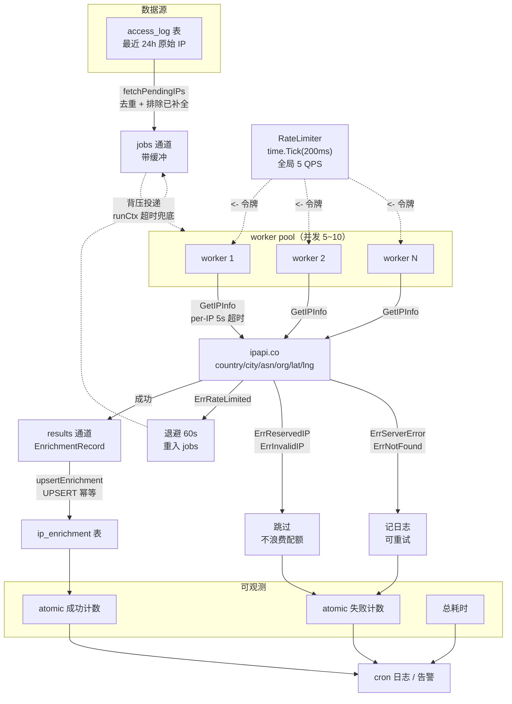

# ⏰ 定时批量 — cron 驱动的 IP 信息周期补全

> 🗓️ 食谱编号：scheduled-batch · 适用场景：用 cron 定时拉取一批待补全的 IP，并发查询 ipapi.co 并把结果写回存储，支撑安全审计、访问日志富化、资产地图等离线任务。

## 🧩 场景

你的安全运营平台每天会从网关、WAF、CDN 等多个数据源收集到大量访问日志，其中只保存了原始 IP 地址，缺少地理位置、ASN、运营商等上下文。这些上下文是做威胁狩猎、异常地域告警、合规报表的基础。

需求很明确：

- 📥 每天凌晨从数据库里捞出「最近 24 小时内出现、但尚未补全地理信息」的 IP 列表（去重后通常几百到几千条）。
- 🌍 调用 ipapi.co 把每条 IP 的 `country_name`、`city`、`asn`、`org`、`latitude`、`longitude` 等字段补齐。
- 💾 结果写回 `ip_enrichment` 表，供下游报表与告警引擎查询。
- ⏱️ 整个任务由 cron 触发，必须在有限时间窗（如 30 分钟）内跑完，单条失败不能拖垮整批，触发限流要自动退避。

手动跑一次不难，难在「稳定地每天跑、出错可观测、不把额度打爆」。本食谱给出一个可直接放进 cron 的可运行程序骨架。

## 💡 方案

1. **复用单个 Client** 🧱：用 `ipapi.NewClient` 创建带超时、重试、API Key 的客户端，全批共用一个连接池，避免每条 IP 都握手。
2. **限流防封** 🚦：通过 `client.RateLimiter = time.Tick(...)` 给并发请求加上节流阀，配合 ipapi.co 的免费 / 付费额度合理设速。免费额度约 1000/天，大批量务必挂 Key。
3. **worker pool 并发** 🔧：用一个固定大小的 goroutine 池消费 IP 通道，控制并发数（如 5~10），既比串行快几十倍，又不会一次开几千个 goroutine 把对端打挂。
4. **per-IP 超时** ⏳：每条查询用 `context.WithTimeout` 单独设一个上限（如 5 秒），单条慢响应不会拖垮整批；超时计入失败、跳过该条。
5. **错误分流** 🧭：区分可重试错误（`ErrRateLimited` / `ErrServerError`）与不可重试错误（`ErrReservedIP` / `ErrInvalidIP`）。限流时整体退避一分钟，私有地址直接跳过，普通错误记日志后继续。
6. **超时整体兜底** 🛡️：用一个根 `context` 给整批任务设一个硬上限（如 25 分钟），到点立刻收尾，保证 cron 的下一跳不被阻塞。
7. **结果落库 + 幂等** 💽：成功一条写一条，用 `ip` 作主键做 `UPSERT`，任务中途崩溃或重复跑也不会产生脏数据。
8. **可观测** 📊：跑完输出成功 / 失败 / 限流次数与总耗时，方便接监控或 cron 邮件告警。

::: tip 🎨 一图抵千言
端到端流程：数据源捞出待补全 IP → 投递到 jobs 通道 → worker pool 受 `RateLimiter` 节流后并发查询 ipapi.co → 错误分流（重试 / 跳过）→ 结果写回 `ip_enrichment` 表。



关键节点对应代码：[`NewClient`](../api/new-client) 构建 Client · [`RateLimiter`](../guide/retry-concept) 全局节流 · [`GetIPInfo`](../api/get-ip-info) 单条查询 · [`IsRetryableError`](../api/is-retryable) 错误分流 · [`errors`](../api/errors) 哨兵错误。
:::

::: warning ⚠️ 配额与安全红线
- **免费额度极易打爆**：ipapi.co 免费额度约 1000 次/天。本食谱默认挂 [`WithAPIKey`](../api/with-api-key) 并把 `RateLimiter` 压到 5 QPS；若批次动辄数千条，务必切换付费计划或拆分到多天跑完，否则整批会被 429 拖死。
- **429 不自动重试**：SDK 内置重试仅对网络错误与 5xx 生效，4xx（含 429）不重试。命中 [`ErrRateLimited`](../api/errors) 时需在本食谱的业务层做退避 + 重入队列，别指望 Client 自己重试。
- **Key 不要进代码库**：示例用环境变量 `IPAPI_API_KEY` 注入，切勿把 Key 硬编码进源码或 cron 脚本后提交到 Git；生产环境建议走配置中心或密钥管理服务。
- **整批硬上限必须小于 cron 间隔**：`runCtx` 设 25 分钟是为了给 cron 下一跳留余量，若 cron 间隔是 30 分钟，硬上限绝不能设到 30 分钟，否则两次任务会重叠、额度翻倍、互相挤占 `RateLimiter`。
:::

## 🧪 完整代码

```go
package main

import (
	"context"
	"database/sql"
	"errors"
	"log"
	"os"
	"sync"
	"sync/atomic"
	"time"

	_ "github.com/go-sql-driver/mysql"
	"github.com/cyberspacesec/ipapi.co-skills/pkg/ipapi"
)

// EnrichmentRecord 是要落库的补全结果。
type EnrichmentRecord struct {
	IP          string
	CountryName string
	City        string
	ASN         string
	Org         string
	Latitude    float64
	Longitude   float64
	RetrievedAt time.Time
}

func main() {
	// 1. 读取配置（这里用环境变量示意，生产环境建议用配置文件）
	apiKey := mustEnv("IPAPI_API_KEY") // 大批量务必申请 Key，避免触发免费额度限制
	dsn := mustEnv("DB_DSN")
	concurrency := 5                   // 并发 worker 数
	rateInterval := 200 * time.Millisecond // 每 200ms 放行一个请求 ≈ 5 QPS

	// 2. 整批任务硬上限：25 分钟，给 cron 留出余量
	start := time.Now()
	runCtx, cancel := context.WithTimeout(context.Background(), 25*time.Minute)
	defer cancel()

	// 3. 建立数据库连接
	db, err := sql.Open("mysql", dsn)
	if err != nil {
		log.Fatalf("打开数据库失败: %v", err)
	}
	defer db.Close()

	// 4. 构建复用的 Client：带 Key、带超时、带重试、带限流
	client := ipapi.NewClient(
		ipapi.WithAPIKey(apiKey),
	)
	// 限流：所有 worker 共享同一个 ticker，确保全局 QPS 不超标
	client.RateLimiter = time.Tick(rateInterval)
	// HTTP 超时（单次请求级，与 context 超时双保险）
	client.HTTPClient.Timeout = 8 * time.Second

	// 5. 拉取待补全的 IP 列表（去重 + 未补全）
	ips, err := fetchPendingIPs(runCtx, db, 5000)
	if err != nil {
		log.Fatalf("拉取待补全 IP 失败: %v", err)
	}
	log.Printf("📋 本批待补全 IP 数量: %d", len(ips))
	if len(ips) == 0 {
		return
	}

	// 6. 启动 worker pool
	jobs := make(chan string, len(ips))
	results := make(chan EnrichmentRecord, len(ips))

	var wg sync.WaitGroup
	for w := 0; w < concurrency; w++ {
		wg.Add(1)
		go func(workerID int) {
			defer wg.Done()
			for ip := range jobs {
				rec, err := lookupOne(runCtx, client, ip)
				if err != nil {
					// 错误分流：限流则整体退避，私有/无效地址跳过，其余记日志
					switch {
					case errors.Is(err, ipapi.ErrRateLimited):
						log.Printf("worker %d 命中限流，退避 60s: %s", workerID, ip)
						time.Sleep(60 * time.Second)
						// 退避后把该 IP 重新塞回队列再试一次
						select {
						case jobs <- ip:
						default:
							log.Printf("worker %d 重入队列失败（队列满）: %s", workerID, ip)
						}
					case errors.Is(err, ipapi.ErrReservedIP), errors.Is(err, ipapi.ErrInvalidIP):
						// 私有/保留/无效地址，直接跳过，不重试
						continue
					default:
						log.Printf("worker %d 查询失败 ip=%s: %v", workerID, ip, err)
					}
					continue
				}
				results <- rec
			}
		}(w)
	}

	// 7. 投递任务
	for _, ip := range ips {
		select {
		case <-runCtx.Done():
			log.Printf("⏰ 整批超时，停止投递剩余 IP")
			break
		case jobs <- ip:
		}
	}
	close(jobs)

	// 8. 等 worker 全部退出后关闭结果通道
	go func() {
		wg.Wait()
		close(results)
	}()

	// 9. 单独一个落库 goroutine 串行写，避免 SQLite/MySQL 写锁竞争
	var success, failed int64
	for rec := range results {
		if err := upsertEnrichment(runCtx, db, rec); err != nil {
			log.Printf("落库失败 ip=%s: %v", rec.IP, err)
			atomic.AddInt64(&failed, 1)
			continue
		}
		atomic.AddInt64(&success, 1)
	}

	log.Printf("✅ 批量补全完成: 成功 %d, 失败 %d, 耗时 %s",
		atomic.LoadInt64(&success), atomic.LoadInt64(&failed), time.Since(start))
}

// lookupOne 查询单个 IP，带 per-IP 超时。
func lookupOne(parent context.Context, client *ipapi.Client, ip string) (EnrichmentRecord, error) {
	ctx, cancel := context.WithTimeout(parent, 5*time.Second)
	defer cancel()

	info, err := client.GetIPInfo(ctx, ip, "json")
	if err != nil {
		return EnrichmentRecord{}, err
	}
	return EnrichmentRecord{
		IP:          info.IP,
		CountryName: info.CountryName,
		City:        info.City,
		ASN:         info.ASN,
		Org:         info.Org,
		Latitude:    info.Latitude,
		Longitude:   info.Longitude,
		RetrievedAt: info.RetrievedAt,
	}, nil
}

// fetchPendingIPs 拉取最近 24 小时内出现、尚未补全的 IP（已去重）。
func fetchPendingIPs(ctx context.Context, db *sql.DB, limit int) ([]string, error) {
	query := `
		SELECT DISTINCT source_ip
		FROM access_log
		WHERE created_at >= NOW() - INTERVAL 24 HOUR
		  AND source_ip NOT IN (SELECT ip FROM ip_enrichment)
		ORDER BY source_ip
		LIMIT ?`
	rows, err := db.QueryContext(ctx, query, limit)
	if err != nil {
		return nil, err
	}
	defer rows.Close()

	var ips []string
	for rows.Next() {
		var ip string
		if err := rows.Scan(&ip); err != nil {
			return nil, err
		}
		ips = append(ips, ip)
	}
	return ips, rows.Err()
}

// upsertEnrichment 用 IP 作主键做幂等写入，任务重跑不产生脏数据。
func upsertEnrichment(ctx context.Context, db *sql.DB, rec EnrichmentRecord) error {
	const q = `
		INSERT INTO ip_enrichment (ip, country_name, city, asn, org, latitude, longitude, retrieved_at)
		VALUES (?, ?, ?, ?, ?, ?, ?, ?)
		ON DUPLICATE KEY UPDATE
		  country_name = VALUES(country_name),
		  city         = VALUES(city),
		  asn          = VALUES(asn),
		  org          = VALUES(org),
		  latitude     = VALUES(latitude),
		  longitude    = VALUES(longitude),
		  retrieved_at = VALUES(retrieved_at)`
	_, err := db.ExecContext(ctx, q,
		rec.IP, rec.CountryName, rec.City, rec.ASN, rec.Org,
		rec.Latitude, rec.Longitude, rec.RetrievedAt)
	return err
}

func mustEnv(key string) string {
	v := os.Getenv(key)
	if v == "" {
		log.Fatalf("环境变量 %s 未设置", key)
	}
	return v
}
```

> 📌 配套 crontab 示例（每天凌晨 2:30 跑一次，输出写日志）：
>
> ```txt
> 30 2 * * * /usr/local/bin/ip-enrichment >> /var/log/ip-enrichment.log 2>&1
> ```

## 🔍 要点解析

- 🧱 **复用 Client 而非每条新建**：`ipapi.NewClient` 内部持有 `*http.Client` 与连接池，全批共用一个 Client 才能让 keep-alive 真正生效。每次请求 new 一个 Client 等于每次握手，批量场景下性能差几个数量级。参见 [客户端概念](../guide/client-concept)。
- 🚦 **`RateLimiter` 是全局节流阀**：它是一个 `<-chan time.Time`，所有 worker 在 `doRequest` 入口处 `<-c.RateLimiter` 阻塞等令牌。把它设成 `time.Tick(200ms)`，5 个 worker 也会被压到全局 5 QPS，从而与 ipapi.co 的免费额度（约 1000/天）或付费配额对齐。限流原理见 [重试与限流](../guide/retry-concept)。
- ⏳ **双层超时**：`runCtx`（25 分钟）兜整批，`context.WithTimeout(parent, 5s)` 兜单条。子 context 继承父 context，整批到点会自动取消所有在途的单条查询，goroutine 不会泄漏。
- 🧭 **错误分流是稳定运行的关键**：
  - `ErrRateLimited` → 整体退避 60s 后把 IP 重入队列重试，避免连续撞 429 被封。
  - `ErrReservedIP` / `ErrInvalidIP` → 私有网段（10/8、192.168/16 等）和格式非法的地址，永远查不到，直接跳过，不浪费配额。
  - `ErrServerError` / `ErrNotFound` → 可重试错误，可结合 [`IsRetryableError`](../api/is-retryable) 做统一判断。
  - 错误分类与映射逻辑见 [错误概念](../guide/error-concept) 与 [`errors` API](../api/errors)。
- 💾 **`UPSERT` 保证幂等**：cron 任务可能因机器重启、超时等原因中断后重跑。用 `ip` 作主键 + `ON DUPLICATE KEY UPDATE`，重跑不会产生重复行，也不会覆盖更新时间靠后的更优结果（按业务需要调整）。
- 📊 **`atomic` 计数无锁**：成功 / 失败计数用 `atomic.AddInt64`，多个 worker 写结果时无需互斥锁，最后用 `atomic.LoadInt64` 读出终值。
- 🔁 **退避后重入队列的小陷阱**：重入用的是同一个 `jobs` 通道，必须先 `close(jobs)` 再 `wg.Wait()`，否则重入操作可能死锁。示例中 `wg.Wait()` 在独立 goroutine 里跑、`close(jobs)` 在投递循环结束后立即调用，时序是安全的；如果你的退避时间可能超过整批超时，建议给重入的 `select` 加 `runCtx.Done()` 分支兜底。

## 🚀 扩展

- 🌐 **换持久层**：把 `fetchPendingIPs` / `upsertEnrichment` 换成 Redis、ClickHouse 或 Elasticsearch 实现即可适配不同存储；查询逻辑与落库逻辑已解耦，互不影响。
- 🧱 **增量游标**：示例用 `created_at >= NOW() - INTERVAL 24 HOUR` 滑窗，若日志量大可改为基于 `last_enriched_at` 游标的水位线推进，避免每次全表扫描。
- 🧪 **本地预检去重**：拉取后先用 `map[string]struct{}` 在内存里二次去重，并对每个 IP 调用 [`ValidateIP`](../api/validate-ip) 提前过滤无效地址，减少对端无效请求。
- ⚡ **断点续跑**：把 `success` / `failed` 列表写入一张 `enrichment_checkpoint` 表，任务重启时跳过已成功的 IP，应对数万级 IP 的长批次。
- 📡 **JSON 横切**：若下游只需要原始字段，可改用 [`GetIPInfoRaw`](../api/get-ip-info-raw) 拿 CSV/YAML 原文，批量导入更省内存。
- 🔔 **告警接入**：跑完把 `success/failed/耗时/限流次数` 推到 Prometheus 或飞书/钉钉 webhook，失败率超阈值自动告警。
- 🗓️ **多 cron 错峰**：若同时有「日级补全」「小时级热点 IP 追踪」两个任务，给它们配不同的 `RateLimiter` 间隔与不同 Client，避免共用额度互相挤占。

## 🔗 相关

- 📖 概念：[客户端概念](../guide/client-concept) · [重试与限流](../guide/retry-concept) · [错误概念](../guide/error-concept) · [批量查询](../guide/batch) · [上下文](../guide/context)
- 🛠️ API：[`NewClient`](../api/new-client) · [`GetIPInfo`](../api/get-ip-info) · [`GetIPInfoRaw`](../api/get-ip-info-raw) · [`ValidateIP`](../api/validate-ip) · [`IsRetryableError`](../api/is-retryable) · [`errors`](../api/errors) · [`WithAPIKey`](../api/with-api-key)
- 🧪 示例：[批量查询示例](../examples/batch-lookup) · [高级用法](../examples/advanced-usage) · [错误处理](../examples/error-handling) · [使用 API Key](../examples/with-api-key)
