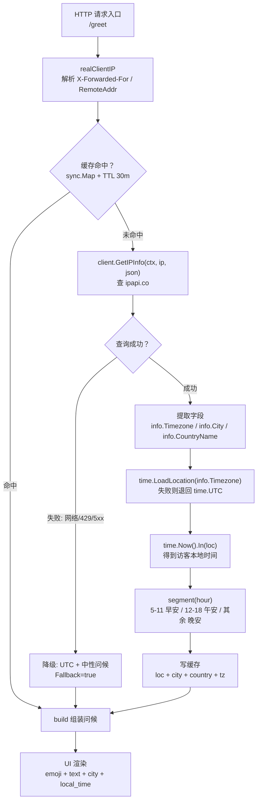

# 🌍 时区问候 — 根据访问者时区显示早安/午安/晚安

> 🕐 食谱编号：timezone-greeting · 适用场景：依据访客所在时区，在页面或消息中输出符合当地时段的问候语。

## 🧩 场景

你的应用面向全球用户，登录后或打开首页时想给一句贴心的问候。问题来了：

- 服务器跑在固定时区（比如 UTC 或部署机的本地时区），用它来判断"现在是早上还是晚上"对东京用户和洛杉矶用户完全错位——服务器还是早上 9 点，东京已经晚上 10 点了。
- 你不想让前端各自上报时区，也不信任浏览器 `Intl.DateTimeFormat().resolvedOptions().timeZone`（用户可能开着 VPN、系统时区设错了）。
- 你希望以**IP 地理位置推断出的时区**为准，给每位访客输出 `早安` / `午安` / `晚安`，并在问候语里附上其所在城市与当前本地时间。

ipapi.co 在响应中直接返回 `timezone`（IANA 标识，如 `Asia/Shanghai`）与 `utc_offset`（如 `+08:00`），由服务端依据 IP 归属推断，无需依赖客户端上报。本食谱的目标是：**在 HTTP 请求处理中查一次 IP，把访问者时区加载为 `time.Location`，按本地小时数分段输出问候语**。

## 💡 方案

1. **复用单个 Client**：用 `ipapi.NewClient` 创建带超时与重试的客户端，整个服务生命周期复用同一连接池。
2. **从请求里取真实访客 IP**：优先解析 `X-Forwarded-For`，回退到 `RemoteAddr`，避免拿到的是上游代理地址。
3. **查 IP 拿时区**：调用 `client.GetIPInfo` 获取 `info.Timezone`（IANA 标识），SDK 同时把 `info.RetrievedAt` 设为 UTC 查询时刻。
4. **加载为 `time.Location`**：用 `time.LoadLocation(info.Timezone)` 把 IANA 标识变成可计算的时区对象，再 `time.Now().In(loc)` 得到访客本地时间。
5. **按时段分段问候**：按本地小时数划分 `早安(5-11)` / `午安(12-18)` / `晚安(其余)`，并附带城市名与格式化后的本地时间字符串。
6. **失败优雅降级**：查询出错或时区加载失败时，回退到 UTC 并给一个中性问候，绝不因为问候功能把首页拖垮。
7. **短时缓存**：同一 IP 短时间内重复查询是浪费，加一层 `sync.Map` 缓存（TTL 30 分钟），避免打爆 ipapi.co 配额。

::: tip 🎨 一图抵千言
下面这张图展示了从 HTTP 请求进入到前端渲染问候语的端到端流程：访客 IP 提取 → ipapi.co 查询时区字段 → 加载为 `time.Location` → 按本地小时数做业务决策（分段问候）→ 渲染到 UI。


:::

::: warning ⚠️ 配额与安全提醒
- **缓存是配额的第一道防线**：本食谱用 `sync.Map` 做 30 分钟 TTL 缓存，热点 IP 不会反复打 ipapi.co。若去掉缓存，每个请求一次查询很容易触发 [`ErrRateLimited`](../api/errors)（429，SDK 不重试 4xx）。
- **只查需要的字段更省流量**：若只关心时区，用 `client.GetField(ctx, ip, "timezone")` 只拉一个字符串，详见 [`GetField`](../api/get-field)。
- **别盲信 `X-Forwarded-For`**：仅在可信代理链上解析该头，否则用户可伪造 IP 绕过时区判定甚至污染缓存键。生产部署请配合 [`client-ip`](../guide/client-ip) 的可信代理校验。
- **tzdata 依赖**：`time.LoadLocation` 依赖容器的 tzdata。极简镜像（如 `scratch` / `alpine` 不装 `tzdata`）会加载失败，此时走 [`utc_offset`](../api/field-time) 兜底或安装 tzdata 包。
:::

## 🧪 完整代码

```go
package main

import (
	"context"
	"fmt"
	"log"
	"net"
	"net/http"
	"strings"
	"sync"
	"time"

	"github.com/cyberspacesec/ipapi.co-skills/pkg/ipapi"
)

// Greeting 是最终返回给前端的问候载荷。
type Greeting struct {
	Text      string    `json:"text"`        // 如 "早安"
	Emoji     string    `json:"emoji"`       // 对应图标
	City      string    `json:"city"`        // 访客所在城市
	Country   string    `json:"country"`     // 国家名
	Timezone  string    `json:"timezone"`    // IANA 时区，如 Asia/Shanghai
	LocalTime string    `json:"local_time"`  // 访客当前本地时间，格式 15:04
	Hour      int       `json:"hour"`        // 访客本地小时数（0-23）
	DeterminedAt time.Time `json:"determined_at"` // 判定时刻（UTC）
	Fallback  bool      `json:"fallback"`    // 是否走了降级（UTC 兜底）
}

// cacheEntry 缓存单个 IP 的查询结果，避免短时间内反复打 ipapi.co。
type cacheEntry struct {
	loc       *time.Location
	city      string
	country   string
	timezone  string
	expiresAt time.Time
}

// greeterService 负责把 IP 翻译成问候语。
type greeterService struct {
	lookup *ipapi.Client
	cache  sync.Map // map[string]*cacheEntry
	ttl    time.Duration
}

func newGreeterService(apiKey string) *greeterService {
	c := ipapi.NewClient(ipapi.WithAPIKey(apiKey))
	c.HTTPClient.Timeout = 5 * time.Second
	c.Retries = 1
	return &greeterService{lookup: c, ttl: 30 * time.Minute}
}

// segment 按访客本地小时数划分问候语段。
func segment(hour int) (text, emoji string) {
	switch {
	case hour >= 5 && hour < 12:
		return "早安", "🌅"
	case hour >= 12 && hour < 18:
		return "午安", "☀️"
	default:
		return "晚安", "🌙"
	}
}

// loadLocation 优先用 ipapi 返回的 IANA 时区；失败时回退到 UTC。
func (g *greeterService) loadLocation(info *ipapi.IPInfo) (*time.Location, bool) {
	if info.Timezone == "" {
		return time.UTC, true
	}
	loc, err := time.LoadLocation(info.Timezone)
	if err != nil {
		// IANA 标识无法加载，退回 UTC
		return time.UTC, true
	}
	return loc, false
}

// greetForIP 查询单个 IP 并构造问候语。
func (g *greeterService) greetForIP(parent context.Context, ip string) Greeting {
	// 1. 命中缓存？
	if v, ok := g.cache.Load(ip); ok {
		if ce, ok := v.(*cacheEntry); ok && time.Now().Before(ce.expiresAt) {
			return g.build(ip, ce.loc, ce.city, ce.country, ce.timezone, false)
		}
	}

	// 2. 查询 ipapi.co，给 2 秒上限，不拖垮主请求
	ctx, cancel := context.WithTimeout(parent, 2*time.Second)
	defer cancel()

	info, err := g.lookup.GetIPInfo(ctx, ip, string(ipapi.FormatJSON))
	if err != nil {
		// 3. 降级：UTC + 中性问候
		log.Printf("greet lookup failed ip=%s err=%v", ip, err)
		now := time.Now().UTC()
		text, emoji := segment(now.Hour())
		return Greeting{
			Text:         text,
			Emoji:        emoji,
			City:         "未知",
			Country:      "未知",
			Timezone:     "UTC",
			LocalTime:    now.Format("15:04"),
			Hour:         now.Hour(),
			DeterminedAt: now,
			Fallback:     true,
		}
	}

	loc, fellBack := g.loadLocation(info)

	// 4. 写缓存（TTL 30 分钟）
	g.cache.Store(ip, &cacheEntry{
		loc:       loc,
		city:      info.City,
		country:   info.CountryName,
		timezone:  info.Timezone,
		expiresAt: time.Now().Add(g.ttl),
	})

	return g.build(ip, loc, info.City, info.CountryName, info.Timezone, fellBack)
}

// build 根据已加载的时区组装最终的 Greeting。
func (g *greeterService) build(ip string, loc *time.Location, city, country, tz string, fellBack bool) Greeting {
	now := time.Now().In(loc)
	text, emoji := segment(now.Hour())
	return Greeting{
		Text:         text,
		Emoji:        emoji,
		City:         city,
		Country:      country,
		Timezone:     loc.String(),
		LocalTime:    now.Format("15:04"),
		Hour:         now.Hour(),
		DeterminedAt: time.Now().UTC(),
		Fallback:     fellBack,
	}
}

// realClientIP 从请求里取出访客真实 IP，优先 X-Forwarded-For。
func realClientIP(r *http.Request) string {
	if xff := r.Header.Get("X-Forwarded-For"); xff != "" {
		// 取第一个（最原始的客户端）
		if i := strings.IndexByte(xff, ','); i >= 0 {
			return strings.TrimSpace(xff[:i])
		}
		return strings.TrimSpace(xff)
	}
	// RemoteAddr 形如 1.2.3.4:5678，去掉端口
	if h, _, err := net.SplitHostPort(r.RemoteAddr); err == nil {
		return h
	}
	return r.RemoteAddr
}

// greetBatch 演示对一批 IP 并发生成问候语，结果与输入顺序对齐。
func (g *greeterService) greetBatch(parent context.Context, ips []string) []Greeting {
	results := make([]Greeting, len(ips))
	var wg sync.WaitGroup
	for i, ip := range ips {
		wg.Add(1)
		go func(idx int, addr string) {
			defer wg.Done()
			results[idx] = g.greetForIP(parent, addr)
		}(i, ip)
	}
	wg.Wait()
	return results
}

// handle 是 HTTP 入口：取真实 IP → 查时区 → 输出问候。
func (g *greeterService) handle(w http.ResponseWriter, r *http.Request) {
	ip := realClientIP(r)
	gr := g.greetForIP(r.Context(), ip)
	w.Header().Set("Content-Type", "application/json; charset=utf-8")
	// 简易手写 JSON，避免再引 encoding/json 之外的依赖
	fmt.Fprintf(w,
		`{"emoji":"%s","text":"%s","city":"%s","country":"%s","timezone":"%s","local_time":"%s","hour":%d,"fallback":%t}`+"\n",
		gr.Emoji, gr.Text, gr.City, gr.Country, gr.Timezone, gr.LocalTime, gr.Hour, gr.Fallback,
	)
}

func main() {
	g := newGreeterService("YOUR_API_KEY") // 替换为真实密钥

	// 演示批量问候
	ctx := context.Background()
	batch := []string{"8.8.8.8", "1.1.1.1", "36.110.147.1"} // US / AU / CN
	for i, gr := range g.greetBatch(ctx, batch) {
		log.Printf("[%d] ip=%s -> %s %s 城市=%s 时区=%s 本地时间=%s 兜底=%v",
			i, batch[i], gr.Emoji, gr.Text, gr.City, gr.Timezone, gr.LocalTime, gr.Fallback)
	}

	// 启动 HTTP 服务
	mux := http.NewServeMux()
	mux.HandleFunc("/greet", g.handle)
	srv := &http.Server{
		Addr:              ":8080",
		Handler:           mux,
		ReadHeaderTimeout: 5 * time.Second,
	}
	log.Println("listening on :8080  (try GET /greet)")
	log.Fatal(srv.ListenAndServe())
}
```

> 💡 运行前请将 `YOUR_API_KEY` 替换为你在 ipapi.co 申请的真实密钥。无密钥模式下免费额度有限，且可能触发 `ErrRateLimited`。

## 🔍 要点解析

### 🌐 为什么用 IP 推断的时区，而不是服务器时区

服务器跑在固定时区，但访客分布在全球。直接用 `time.Now()`（服务器本地时间）判时段，对地球另一端的用户完全错位。ipapi.co 依据 IP 归属返回 `timezone`（IANA 标识）与 `utc_offset`，由服务端推断，不依赖客户端上报，能避开 VPN/系统时区误设带来的脏数据。SDK 把它们解析为 `IPInfo.Timezone` 与 `IPInfo.UTCOffset`，可直接用于条件分支。

### 🕐 IANA 标识如何变成可计算的时间

拿到 `info.Timezone`（如 `America/Los_Angeles`）后，调用标准库 `time.LoadLocation` 把它加载为 `*time.Location`，再用 `time.Now().In(loc)` 得到该时区的"当下"。这样无需手写偏移计算，也自动处理夏令时——洛杉矶夏天是 `UTC-07:00`、冬天是 `UTC-08:00`，`time` 包按 IANA 规则自动切换。

### 🪜 优雅降级

两处失败需要兜底：

- **查询失败**（网络、限流、保留 IP）：回退到 UTC，给一个中性问候，`Fallback=true` 标记，前端可据此隐藏"你的城市"等不可靠信息。
- **时区加载失败**（IANA 标识异常或本机 tzdata 缺失）：在 `loadLocation` 内退回 `time.UTC`。

问候功能是锦上添花，绝不能因为 ipapi.co 不可达把首页拖垮。

### ⏱️ 超时与并发

`greetForIP` 用 `context.WithTimeout(parent, 2*time.Second)` 派生子上下文，即使 ipapi.co 偶发慢响应，也不会阻塞主请求。`greetBatch` 用 `sync.WaitGroup` 并发处理一批 IP，结果按索引写回切片，保证顺序对齐——适合日志分析、批量推送问候等离线场景。

### 💾 短时缓存

同一个 IP 在 30 分钟内反复查是浪费配额。`greeterService` 用 `sync.Map` 缓存 `*time.Location` 与城市信息，TTL 到期后才重新查询。注意：缓存的只是"时区/城市"，本地时间每次都重新 `time.Now().In(loc)` 计算，不会因为缓存而过时。

### 🧾 取真实访客 IP

生产环境 `r.RemoteAddr` 往往是上游代理的地址。`realClientIP` 优先解析 `X-Forwarded-For` 的第一段（最原始客户端），回退到 `RemoteAddr` 去端口。务必只信任可信代理链上的该头，防止用户伪造绕过问候的时区判定。

## 🚀 扩展

- **按 `utc_offset` 兜底**：若部署环境没有完整 tzdata（如极简容器），`time.LoadLocation` 可能失败。此时可退而用 `info.UTCOffset`（如 `+08:00`）解析出固定偏移 `time.FixedLocation("UTC+8", 8*3600)`，代价是丢失夏令时自动切换。
- **更细的时段划分**：把 `segment` 扩成 `凌晨(0-5)` / `清晨(5-7)` / `上午(7-12)` / `下午(12-18)` / `傍晚(18-22)` / `深夜(22-24)`，匹配更精致的运营文案。
- **结合 `languages` 字段做本地化**：ipapi.co 返回 `languages`（如 `zh-CN,en`），可据此在问候语之外再切换界面语言——早安 / Good morning / おはよう。
- **缓存迁移到 Redis**：多实例部署时 `sync.Map` 不共享，可换成 Redis，键为 IP、值为 `{loc_name, city, country, tz}`，TTL 1 小时。
- **仅查单字段省流量**：若只需时区不要其他字段，用 `client.GetField(ctx, ip, "timezone")` 只拉一个字符串，比 `GetIPInfo` 更省带宽。
- **配合定时推送**：对注册用户，按其时区的"早上 9 点"推送日报——把 `greetForIP` 的逻辑复用到定时任务里，按每位用户的本地时段触发。

## 🔗 相关

- 📖 客户端概念：[`](../guide/client-concept`](../guide/client-concept)
- 📖 客户端 IP 检测：[`](../guide/client-ip`](../guide/client-ip)
- 📖 上下文与超时：[`](../guide/context`](../guide/context)
- 📖 错误处理思路：[`](../guide/error-concept`](../guide/error-concept)
- 📖 重试与限流：[`](../guide/retry-concept`](../guide/retry-concept)
- 🔧 `GetIPInfo` 接口：[`](../api/get-ip-info`](../api/get-ip-info)
- 🔧 `GetField` 接口（单字段查询）：[`](../api/get-field`](../api/get-field)
- 🔧 时间字段（`timezone` / `utc_offset`）：[`](../api/field-time`](../api/field-time)
- 🔧 `IPInfo` 数据模型：[`](../api/models`](../api/models)
- 🔧 客户端选项：[`](../api/options`](../api/options)
- 🔧 错误列表：[`](../api/errors`](../api/errors)
- 🧪 基础用法示例：[`](../examples/basic-usage`](../examples/basic-usage)
- 🧪 查询指定 IP 示例：[`](../examples/lookup-specific-ip`](../examples/lookup-specific-ip)
- 🧪 查询客户端 IP 示例：[`](../examples/lookup-client-ip`](../examples/lookup-client-ip)
- 🧪 单字段查询示例：[`](../examples/single-field`](../examples/single-field)
