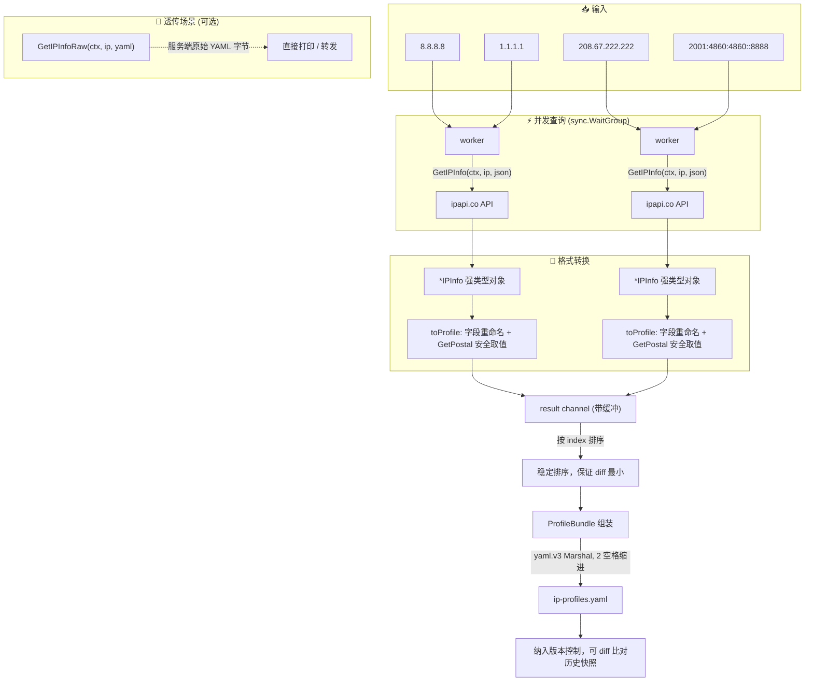

# 🗂️ YAML 集成 — 把 IP 信息序列化为 YAML 配置

> 📋 食谱编号：yaml-config · 适用场景：将 ipapi.co 返回的 IP 归属信息转换为可读、可版本化、可被运维工具消费的 YAML 配置片段。

## 🧩 场景

你的基础设施以"配置即代码"的方式运转——无论是 Ansible inventory、Helm values、Terraform 变量文件，还是自研的灰度发布控制器，都习惯读 YAML。运营同学提了一个需求：

- 当某个出口 IP（例如自建代理、CDN 回源节点、办公网公网出口）的归属信息发生变化时，**生成一份结构化的 YAML 片段**，包含城市、国家、ASN、坐标、货币、时区等关键字段。
- 这份 YAML 要能被下游工具直接 `kubectl apply` 或被 Python/Rust 服务用 `yaml.safe_load` 解析，因此字段命名必须稳定、缩进必须规范、特殊字符（如带逗号的语言列表）不能破坏结构。
- 你还希望对**多个 IP 批量产出**，并合并成一份带检索时间戳的清单文件，方便事后比对历史快照。

ipapi.co 既支持 `yaml` 响应格式（`GetIPInfoRaw` 直接拿原始 YAML 字节），也支持 `json` 格式（`GetIPInfo` 拿到强类型 `IPInfo` 结构）。本食谱结合两者优势：用 JSON 拿到强类型对象便于字段裁剪与重命名，再用本地 YAML 库序列化为可控的配置片段。

## 💡 方案

1. **JSON 拿数据，本地转 YAML**：调用 `GetIPInfo(ctx, ip, "json")` 获取强类型 `*IPInfo`，避免手写 YAML 转义；再用 `gopkg.in/yaml.v3` 序列化。这样字段顺序、空值处理、缩进都由库统一保证。
2. **自定义结构体映射**：不直接序列化 `IPInfo`（它字段过多且命名是 `CountryCodeISO3` 这种 Go 风格），而是映射到一个语义清晰、下划线命名的 `IPProfile` 结构，契合运维同学的阅读习惯。
3. **并发批量 + 同步落盘**：用 `sync.WaitGroup` 并发查询多个 IP，结果通过带缓冲 channel 汇聚，最后排序后一次性写入 YAML 文件，保证输出稳定可 diff。
4. **保留原始 YAML 选项**：额外演示 `GetIPInfoRaw(ctx, ip, "yaml")` 直接拿服务端 YAML 的用法，适合"只转发、不加工"的透传场景。
5. **超时与错误隔离**：单个 IP 查询失败不影响整批输出，失败项以 `status: error` 条目记录在最终清单里，便于补查。

::: tip 🎨 一图抵千言
端到端流程：从多 IP 输入，到并发查询与格式转换，再到稳定的 YAML 清单落盘。



关键节点对应代码：并发调度见 [`lookupProfile`](./yaml-config#🧪-完整代码)，字段映射与空值处理见 [`toProfile`](./yaml-config#🧪-完整代码)，原始 YAML 透传见 [`GetIPInfoRaw`](../api/get-ip-info-raw)。
:::

## 🧪 完整代码

```go
package main

import (
	"context"
	"fmt"
	"log"
	"os"
	"sort"
	"sync"
	"time"

	"github.com/cyberspacesec/ipapi.co-skills/pkg/ipapi"
	"gopkg.in/yaml.v3"
)

// IPProfile 是面向运维消费的 YAML 配置条目，字段采用下划线命名。
type IPProfile struct {
	IP            string  `yaml:"ip"`
	Version       string  `yaml:"ip_version"`
	City          string  `yaml:"city"`
	Region        string  `yaml:"region"`
	Country       string  `yaml:"country"`
	CountryCode   string  `yaml:"country_code"`
	CountryName   string  `yaml:"country_name"`
	ContinentCode string  `yaml:"continent_code"`
	InEU          bool    `yaml:"in_eu"`
	Postal        string  `yaml:"postal,omitempty"`
	Latitude      float64 `yaml:"latitude"`
	Longitude     float64 `yaml:"longitude"`
	Timezone      string  `yaml:"timezone"`
	UTCOffset     string  `yaml:"utc_offset"`
	Currency      string  `yaml:"currency"`
	CurrencyName  string  `yaml:"currency_name"`
	Languages     string  `yaml:"languages"`
	ASN           string  `yaml:"asn"`
	Org           string  `yaml:"org"`
	Network       string  `yaml:"network"`
	Status        string  `yaml:"status"` // ok | error
	Error         string  `yaml:"error,omitempty"`
	RetrievedAt   string  `yaml:"retrieved_at"`
}

// ProfileBundle 是最终落盘的 YAML 根结构。
type ProfileBundle struct {
	GeneratedAt string     `yaml:"generated_at"`
	Source      string     `yaml:"source"`
	Count       int        `yaml:"count"`
	Profiles    []IPProfile `yaml:"profiles"`
}

func toProfile(info *ipapi.IPInfo) IPProfile {
	return IPProfile{
		IP:            info.IP,
		Version:       info.Version,
		City:          info.City,
		Region:        info.Region,
		Country:       info.Country,
		CountryCode:   info.CountryCode,
		CountryName:   info.CountryName,
		ContinentCode: info.ContinentCode,
		InEU:          info.InEU,
		Postal:        info.GetPostal(),
		Latitude:      info.Latitude,
		Longitude:     info.Longitude,
		Timezone:      info.Timezone,
		UTCOffset:     info.UTCOffset,
		Currency:      info.Currency,
		CurrencyName:  info.CurrencyName,
		Languages:     info.Languages,
		ASN:           info.ASN,
		Org:           info.Org,
		Network:       info.Network,
		Status:        "ok",
		RetrievedAt:   info.RetrievedAt.UTC().Format(time.RFC3339),
	}
}

func main() {
	client := ipapi.NewClient(
		ipapi.WithAPIKey(os.Getenv("IPAPI_KEY")),
	)
	// 统一超时，避免单 IP 慢响应拖垮整批
	client.HTTPClient.Timeout = 8 * time.Second

	targets := []string{
		"8.8.8.8",           // Google Public DNS
		"1.1.1.1",           // Cloudflare DNS
		"208.67.222.222",    // OpenDNS
		"2001:4860:4860::8888", // Google DNS (IPv6)
	}

	ctx, cancel := context.WithTimeout(context.Background(), 30*time.Second)
	defer cancel()

	// 并发查询，结果汇聚到 channel
	type result struct {
		index  int
		profile IPProfile
	}
	out := make(chan result, len(targets))
	var wg sync.WaitGroup

	for i, ip := range targets {
		wg.Add(1)
		go func(idx int, addr string) {
			defer wg.Done()
			profile := lookupProfile(ctx, client, addr)
			out <- result{index: idx, profile: profile}
		}(i, ip)
	}
	wg.Wait()
	close(out)

	// 收集并按原始顺序排序，保证输出稳定可 diff
	results := make([]result, 0, len(targets))
	for r := range out {
		results = append(results, r)
	}
	sort.Slice(results, func(i, j int) bool {
		return results[i].index < results[j].index
	})

	bundle := ProfileBundle{
		GeneratedAt: time.Now().UTC().Format(time.RFC3339),
		Source:      "ipapi.co",
		Count:       len(results),
	}
	for _, r := range results {
		bundle.Profiles = append(bundle.Profiles, r.profile)
	}

	// 序列化为 YAML，2 空格缩进
	data, err := yaml.Marshal(bundle)
	if err != nil {
		log.Fatalf("YAML 序列化失败: %v", err)
	}

	if err := os.WriteFile("ip-profiles.yaml", data, 0o644); err != nil {
		log.Fatalf("写入文件失败: %v", err)
	}
	fmt.Printf("✅ 已生成 ip-profiles.yaml，共 %d 条记录\n", bundle.Count)

	// 演示：直接拿服务端原始 YAML（透传场景）
	rawYAML, err := client.GetIPInfoRaw(ctx, "8.8.8.8", string(ipapi.FormatYAML))
	if err != nil {
		log.Printf("获取原始 YAML 失败: %v", err)
	} else {
		fmt.Printf("\n--- 服务端原始 YAML (8.8.8.8) ---\n%s\n", string(rawYAML))
	}
}

func lookupProfile(ctx context.Context, client *ipapi.Client, ip string) IPProfile {
	info, err := client.GetIPInfo(ctx, ip, string(ipapi.FormatJSON))
	if err != nil {
		// 失败隔离：返回 error 条目，不中断整批
		return IPProfile{
			IP:          ip,
			Status:      "error",
			Error:       err.Error(),
			RetrievedAt: time.Now().UTC().Format(time.RFC3339),
		}
	}
	return toProfile(info)
}
```

运行后生成的 `ip-profiles.yaml` 形如：

```yaml
generated_at: 2026-07-03T10:12:00Z
source: ipapi.co
count: 4
profiles:
  - ip: 8.8.8.8
    ip_version: IPv4
    city: Mountain View
    region: California
    country: US
    country_code: US
    country_name: United States
    continent_code: NA
    in_eu: false
    latitude: 37.4056
    longitude: -122.0775
    timezone: America/Los_Angeles
    utc_offset: -0700
    currency: USD
    currency_name: Dollar
    languages: en
    asn: AS15169
    org: Google LLC
    network: 8.8.8.0/24
    status: ok
    retrieved_at: 2026-07-03T10:12:00Z
  - ip: 1.1.1.1
    # ... 其余字段
    status: ok
```

## 🔍 要点解析

- 📥 **JSON 拿、YAML 存**：`GetIPInfo(ctx, ip, "json")` 走强类型反序列化路径，`Postal` 是 `*string`，用 `info.GetPostal()` 安全取值避免空指针；本地再用 `yaml.v3` 序列化，省去手写缩进与引号转义。若只需透传，用 `GetIPInfoRaw(ctx, ip, "yaml")` 直接拿服务端 YAML 字节即可。
- 🏷️ **字段重命名**：`IPProfile` 用 `yaml:"country_code"` 等下划线 tag，把 Go 风格的 `CountryCodeISO3` 转成运维熟悉的命名；`omitempty` 让空邮政编码不污染输出。
- ⚡ **并发 + 顺序保证**：`sync.WaitGroup` 并发查询缩短墙钟时间，但用 `result.index` 排序后落盘，保证多次运行生成的 YAML diff 最小，便于纳入版本控制。
- 🛡️ **失败隔离**：`lookupProfile` 把错误包成 `status: error` 条目返回，单个 IP 失败不会让整份清单生成中断，事后可按 `error` 字段补查。
- ⏱️ **双层超时**：外层 `context.WithTimeout(30s)` 限制整批，内层 `HTTPClient.Timeout` 限制单次；两层叠加避免长尾请求拖垮生成任务。
- 🔐 **密钥注入**：`ipapi.WithAPIKey(os.Getenv("IPAPI_KEY"))` 从环境变量读密钥，避免硬编码进配置文件。无密钥也能跑（受免费额度限流约束）。

::: warning ⚠️ 配额与安全扩展须知
- **并发别越配额线**：本食谱演示了 4 个 IP 并发，但免费层有每分钟/每日请求上限。盲目放大 `targets` 列表会迅速触达 [`ErrRateLimited`](../guide/error-concept)，且 429 不在 SDK 重试范围内（默认 `Retries=2` 仅重试网络错误与 5xx）。生产批量场景请启用 [`WithCallback`](../guide/client-concept) 自限流，或给 `RateLimiter` 设一个低于配额上限的阈值。
- **密钥别进 YAML**：`ProfileBundle` 里只放归属信息，**绝不要**把 `IPAPI_KEY` 写进 `generated_at` 同级的元数据字段——YAML 清单会进版本控制和对象存储，密钥一旦落盘就是泄露面。密钥只走环境变量或密钥管理服务。
- **历史快照的留存策略**：定时生成 `ip-profiles-<ts>.yaml` 时，旧文件可能含已失效的 ASN/Org，建议按合规留存期（如 90 天）配置生命周期策略，避免对象存储无限膨胀，也防止历史快照被误当作"当前真相"。
- **透传 YAML 的解析风险**：[`GetIPInfoRaw`](../api/get-ip-info-raw) 拿到的服务端 YAML 虽然由服务端保证结构，但若再合并第三方数据源，请用 `yaml.Node` 而非 `map[string]interface{}` 解析，避免字段类型漂移（如 `asn` 在某些响应里是字符串、某些是数字）破坏下游 `kubectl apply`。
:::

## 🚀 扩展

- 📜 **生成 Ansible inventory**：把 `IPProfile.Org` 作为分组键、`IP` 作为 host，输出 `hosts.yml`，实现"出口 IP 变更自动刷新资产清单"。
- 🔁 **定时快照**：包一层 cron / systemd timer，每小时生成一份带时间戳的 `ip-profiles-20260703-1012.yaml`，落对象存储，形成历史曲线。
- 🧬 **多源合并**：把 `GetIPInfoRaw` 拿到的服务端 YAML 与本地 `IPProfile` YAML 用 `yaml.Node` 合并，保留服务端原始字段的同时追加自定义标签（如 `env: prod`）。
- 🩺 **健康度评分**：在 `IPProfile` 上加 `score` 字段，依据 `ASN` 是否在已知可信列表、`InEU` 是否符合预期等规则打分，输出可被监控告警直接消费的指标。
- 🔄 **反向同步**：读取现有 YAML 配置，比对 ipapi.co 最新数据，发现 `Org` 或 `Country` 漂移时触发告警——把"配置即代码"升级为"配置即真相"。

## 🔗 相关

- 📖 客户端概念：[`../guide/client-concept`](../guide/client-concept)
- 📖 响应格式概念：[`../guide/format-concept`](../guide/format-concept)
- 📖 格式总览与用法：[`../guide/formats`](../guide/formats)
- 📖 错误处理概念：[`../guide/error-concept`](../guide/error-concept)
- 📖 重试机制：[`../guide/retry-concept`](../guide/retry-concept)
- 🛠️ `GetIPInfo` API：[`../api/get-ip-info`](../api/get-ip-info)
- 🛠️ `GetIPInfoRaw` API（原始 YAML）：[`../api/get-ip-info-raw`](../api/get-ip-info-raw)
- 🛠️ `NewClient` 与选项：[`../api/new-client`](../api/new-client)
- 🛠️ `ValidateFormat`：[`../api/validate-format`](../api/validate-format)
- 🧪 高级用法示例：[`../examples/advanced-usage`](../examples/advanced-usage)
- 🧪 原始格式示例：[`../examples/raw-formats`](../examples/raw-formats)
- 🧪 批量查询示例：[`../examples/batch-lookup`](../examples/batch-lookup)
