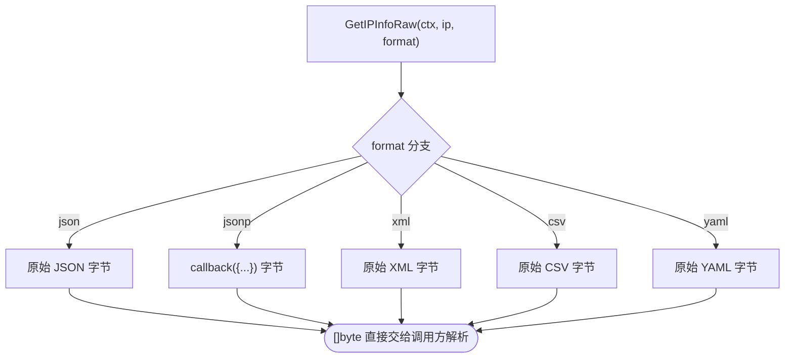
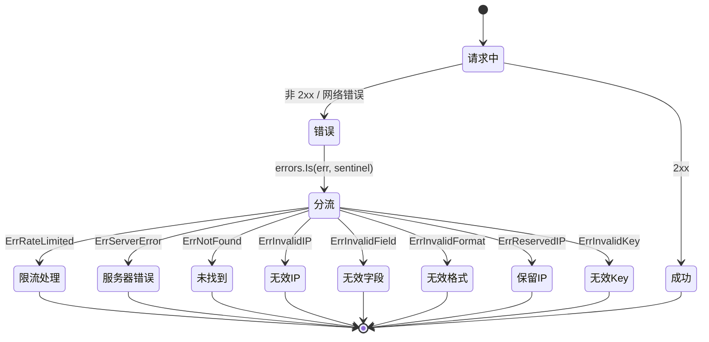
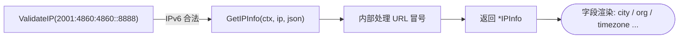
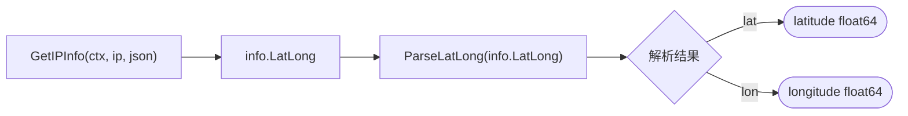

# 🚀 高级用法

> 对应 `examples/advanced_usage/main.go`，展示定制化客户端。

::: tip 🎨 一图抵千言
本示例综合了认证、自定义 HTTP、错误处理、IPv4/IPv6、单字段查询等多块能力。下图以 [`advanced-usage`](./advanced-usage) 为中心，向上承接各基础示例的调用结构，向下汇入错误处理与字段渲染流程。

```mermaid
flowchart TD
  subgraph OPT["多选项 Client 构造"]
    A1(["os.Getenv / 硬编码 Key"]) --> C["ipapi.NewClient(opts...)"]
    A2(["WithCustomHTTPClient"]) --> C
    A3(["WithErrorHandler"]) --> C
  end

  subgraph QUERY["查询阶段（IPv4 + IPv6 透明）"]
    C --> Q1["GetIPInfo(ctx, 8.8.8.8, json)"]
    C --> Q2["GetIPInfo(ctx, 2001:4860:4860::8888, json)"]
    C --> Q3["GetField(ctx, 8.8.8.8, org)"]
  end

  subgraph ERR["错误处理分支"]
    Q1 -. 可重试? .-> R{"IsRetryableError"}
    Q2 -. 可重试? .-> R
    R -->|"ErrRateLimited / ErrServerError / ErrNotFound"| RT["内部重试（最多 3 次请求）"]
    R -->|"4xx 不可重试"| EH["customErrorHandler 打印后返回"]
    RT --> EH
  end

  subgraph RENDER["字段渲染"]
    Q1 --> P1["打印 city/country/asn/org/timezone"]
    Q2 --> P1
    Q3 --> P2["TrimSpace 后打印 org"]
  end

  EH -. 错误向上冒泡 .-> P1
  EH -. 错误向上冒泡 .-> P2
  ```

相关调用链可参考：[`NewClient`](../api/new-client) · [`GetIPInfo`](../api/get-ip-info) · [`GetField`](../api/get-field) · [`WithAPIKey`](../api/with-api-key) · [`WithCustomHTTPClient`](../api/with-custom-http-client) · [`WithErrorHandler`](../api/with-error-handler)
:::

### 调用结构速查

不同示例的调用链各不相同，下面用 Mermaid 分组速查，方便对照源码。

#### 基础查询（[`basic-usage`](./basic-usage) / [`lookup-specific-ip`](./lookup-specific-ip) / [`lookup-client-ip`](./lookup-client-ip)）

```mermaid
sequenceDiagram
  participant M as main
  participant C as *ipapi.Client
  participant API as ipapi.co API

  M->>C: NewClient(opts...)
  M->>C: GetIPInfo(ctx, ip, "json") / GetClientIPInfo(ctx, "json")
  C->>API: HTTP GET /{ip}/json/
  API-->>C: 200 JSON body
  C-->>M: *IPInfo, nil
  M->>M: fmt.Printf 打印字段
```

#### 单字段查询（[`single-field`](./single-field)）


#### 原始格式（[`raw-formats`](./raw-formats) / [`jsonp`](./jsonp)）



#### 带 API Key（[`with-api-key`](./with-api-key)）

```mermaid
flowchart LR
  A(["os.Getenv(\"IPAPI_API_KEY\")"]) --> B["WithAPIKey(key)"]
  B --> C["NewClient(opts...)"]
  C --> D["setHeaders / applyAuth"]
  D --> E["注入 Authorization: Bearer {key}"]
  E --> F["HTTP GET 携带认证"]
```

#### 错误处理与自定义错误（[`error-handling`](./error-handling) / [`custom-error`](./custom-error)）



#### IPv6 查询（[`ipv6`](./ipv6)）



#### 解析经纬度（[`parse-latlong`](./parse-latlong)）



## 完整代码

```go
package main

import (
	"context"
	"fmt"
	"log"
	"net/http"
	"time"

	"github.com/cyberspacesec/ipapi.co-skills/pkg/ipapi"
)

func main() {
	// 创建定制化客户端
	client := ipapi.NewClient(
		ipapi.WithAPIKey("your_api_key_here"),
		ipapi.WithCustomHTTPClient(&http.Client{
			Timeout:   15 * time.Second,
			Transport: &http.Transport{MaxIdleConns: 10},
		}),
		ipapi.WithErrorHandler(customErrorHandler),
	)

	ctx := context.Background()

	// 获取特定IP的详细信息
	printIPInfo(client, ctx, "8.8.8.8")
	printIPInfo(client, ctx, "2001:4860:4860::8888")

	// 获取特定字段
	if org, err := client.GetField(ctx, "8.8.8.8", "org"); err == nil {
		fmt.Printf("\nDNS服务器所属组织: %s\n", org)
	}
}

func printIPInfo(client *ipapi.Client, ctx context.Context, ip string) {
	info, err := client.GetIPInfo(ctx, ip, "json")
	if err != nil {
		log.Printf("查询IP %s 失败: %v", ip, err)
		return
	}

	fmt.Printf("\n%s 的详细信息:\n", ip)
	fmt.Printf("地理位置: %s, %s\n网络信息: %s (%s)\n时区: %s (UTC%s)\n",
		info.City, info.CountryName,
		info.ASN, info.Org,
		info.Timezone, info.UTCOffset)
}

func customErrorHandler(err error) error {
	fmt.Printf("\n自定义错误处理: %v\n", err)
	return err
}
```

## 要点解析

### 1. 组合多个选项

```go
client := ipapi.NewClient(
	ipapi.WithAPIKey("your_api_key_here"),
	ipapi.WithCustomHTTPClient(...),
	ipapi.WithErrorHandler(customErrorHandler),
)
```

一次配齐：认证 + 自定义 HTTP + 错误处理。详见 [选项函数](/api/options)。

### 2. 自定义 HTTP 客户端

```go
&http.Client{
	Timeout:   15 * time.Second,
	Transport: &http.Transport{MaxIdleConns: 10},
}
```

调长超时 + 连接池。详见 [`WithCustomHTTPClient`](/api/with-custom-http-client)。

### 3. 自定义错误处理

```go
func customErrorHandler(err error) error {
	fmt.Printf("\n自定义错误处理: %v\n", err)
	return err
}
```

每个错误返回前先打印。详见 [`WithErrorHandler`](/api/with-error-handler)。

### 4. 同时查 IPv4 和 IPv6

```go
printIPInfo(client, ctx, "8.8.8.8")
printIPInfo(client, ctx, "2001:4860:4860::8888")
```

SDK 对 IPv4/IPv6 透明，URL 构建内部处理冒号。

### 5. 单字段查询

```go
org, err := client.GetField(ctx, "8.8.8.8", "org")
```

只拿组织名。详见 [`GetField`](/api/get-field)。

::: details 运行预期输出与常见问题
**预期输出（已设置有效 API Key 时）：**

```
8.8.8.8 的详细信息:
地理位置: Mountain View, United States
网络信息: AS15169 (Google LLC)
时区: America/Los_Angeles (UTC-07:00)

2001:4860:4860::8888 的详细信息:
地理位置: Mountain View, United States
网络信息: AS15169 (Google LLC)
时区: America/Los_Angeles (UTC-07:00)

DNS服务器所属组织: Google LLC
```

**常见问题：**

- **未设置 API Key 却频繁限流？** 免费额度有限，[`WithAPIKey`](../api/with-api-key) 注入 Bearer 认证可提高上限；触发限流会返回 [`ErrRateLimited`](../api/errors)，属可重试错误。
- **IPv6 地址带冒号，URL 会出错吗？** 不会。SDK 内部 [`newGetRequest`](../api/methods) 已处理冒号转义，[`ValidateIP`](../api/validate-ip) 也会先校验合法性。
- **自定义 HTTP 客户端的超时被覆盖了？** [`WithCustomHTTPClient`](../api/with-custom-http-client) 注入的 `*http.Client` 优先级最高；若未设置，SDK 用默认 [`Timeout`](../api/client)。
- **`customErrorHandler` 返回 nil 会吞掉错误吗？** 不会。返回 nil 等于“消化”错误，后续 `GetIPInfo` 会返回 nil，需自行保证不漏报。
- **重试策略是什么？** 默认 `Retries=2`（最多请求 3 次），仅对网络错误与 5xx 重试；4xx（含 429）不重试。详见 [`IsRetryableError`](../api/is-retryable)。
:::

## 运行

```bash
cd examples/advanced_usage
go run main.go
```

预期输出：

```
8.8.8.8 的详细信息:
地理位置: Mountain View, United States
网络信息: AS15169 (Google LLC)
时区: America/Los_Angeles (UTC-07:00)

2001:4860:4860::8888 的详细信息:
地理位置: Mountain View, United States
网络信息: AS15169 (Google LLC)
时区: America/Los_Angeles (UTC-07:00)

DNS服务器所属组织: Google LLC
```

## 下一步

- 🛡 看 [错误处理示例](./error-handling)
- 🔧 学 [自定义 HTTP 客户端](/guide/custom-http)
- 📖 看 [选项函数](/api/options)
