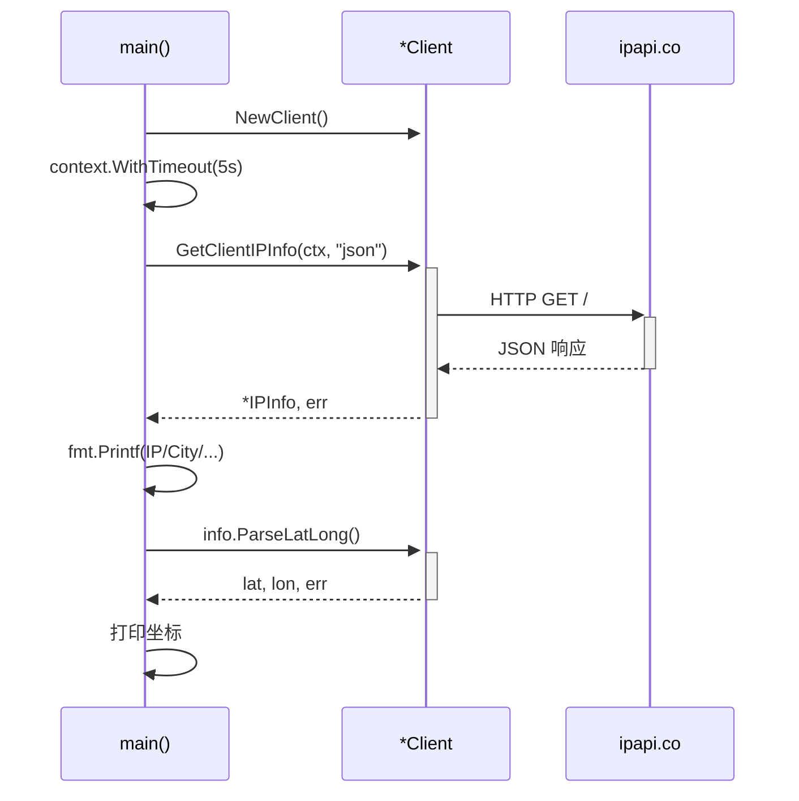
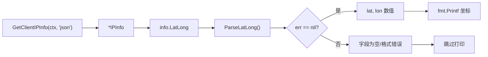

# 🧪 基础用法

> 对应 `examples/basic_usage/main.go`，最简查询示例。

::: tip 🎨 一图抵千言
本示例的调用结构：`main` 创建默认客户端，通过带超时的 `context` 发起查询，拿到 [`IPInfo`](../api/models) 后打印并解析经纬度。


:::

## 完整代码

```go
package main

import (
	"context"
	"fmt"
	"log"
	"time"

	"github.com/cyberspacesec/ipapi.co-skills/pkg/ipapi"
)

func main() {
	// 创建默认客户端
	client := ipapi.NewClient()
	ctx, cancel := context.WithTimeout(context.Background(), 5*time.Second)
	defer cancel()

	// 获取当前 IP 的完整信息
	info, err := client.GetClientIPInfo(ctx, "json")
	if err != nil {
		log.Fatalf("获取IP信息失败: %v", err)
	}

	fmt.Printf("IP基本信息:\n%s\n国家: %s\n城市: %s\n时区: %s\n经纬度: %s\n",
		info.IP, info.CountryName, info.City, info.Timezone, info.LatLong)

	// 解析经纬度坐标
	lat, lon, err := info.ParseLatLong()
	if err == nil {
		fmt.Printf("解析后的坐标: 纬度=%.4f, 经度=%.4f\n", lat, lon)
	}
}
```

## 要点解析

### 1. 创建默认客户端

```go
client := ipapi.NewClient()
```

无需任何配置，使用默认 10s 超时、`https://ipapi.co/` 基地址。详见 [`NewClient`](/api/new-client)。

### 2. 设置超时上下文

```go
ctx, cancel := context.WithTimeout(context.Background(), 5*time.Second)
defer cancel()
```

5 秒超时，`defer cancel()` 防止泄漏。详见 [Context 指南](/guide/context)。

### 3. 查询客户端 IP

```go
info, err := client.GetClientIPInfo(ctx, "json")
```

用 [`GetClientIPInfo`](/api/get-client-ip-info) 拿「调用方出口 IP」的完整信息。

### 4. 读取字段

```go
info.IP           // IP 地址
info.CountryName  // 国家名
info.City         // 城市
info.Timezone     // 时区
info.LatLong      // 经纬度字符串
```

### 5. 解析经纬度

```go
lat, lon, err := info.ParseLatLong()
```

用 [`ParseLatLong`](/api/models#parselatlong) 把 `"lat,lon"` 字符串解析为数值。

::: tip 🎨 解析经纬度流程

:::

## 运行

```bash
cd examples/basic_usage
go run main.go
```

预期输出：

```
IP基本信息:
203.0.113.42
国家: China
城市: Beijing
时区: Asia/Shanghai
经纬度: 39.9042,116.4074
解析后的坐标: 纬度=39.9042, 经度=116.4074
```

::: details 运行预期输出与常见问题
- 上面的输出为示例值，实际结果随调用方出口 IP 变化；若在容器/CI 内运行，返回的是网关 IP 而非宿主机 IP。
- 若 `info.ParseLatLong()` 返回 `err != nil`，通常是 [`LatLong`](../api/models) 字段为空字符串——说明上游返回数据缺失经纬度，应先判空再解析。
- 若请求报超时，优先调大 `context.WithTimeout` 的时长，而非依赖 [`Retries`](../api/client)；SDK 重试只覆盖网络错误与 5xx，对 4xx（含 429）不会重试。
- 若返回 `ErrReservedIP`，说明查询的是保留/私有地址段，详见 [保留 IP 指南](../guide/reserved-ip)。
:::

## 下一步

- 🚀 看 [高级用法](./advanced-usage)
- 🛡 看 [错误处理示例](./error-handling)
- 📖 回顾 [快速开始](/guide/getting-started)
