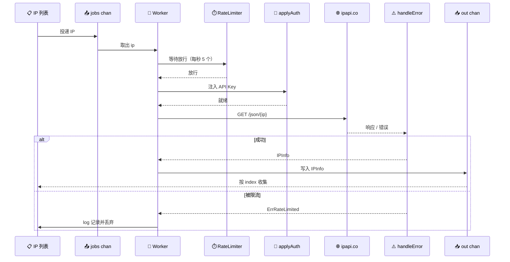

```mermaid
flowchart LR
    subgraph 生产者
        IPS[📋 IP 列表切片] -->|遍历投递| JOBS
    end

    JOBS([📤 jobs chan string]) --> W1
    JOBS --> W2
    JOBS --> WN

    subgraph Worker 池 N 个
        W1[🧵 Worker 1]
        W2[🧵 Worker 2]
        WN[🧵 Worker N]
    end

    W1 --> GET1
    W2 --> GET2
    WN --> GETN

    subgraph Client.GetIPInfo 调用链
        GET1[📡 GetIPInfo ctx ip json] --> DO1[🔌 doRequest]
        GET2[📡 GetIPInfo ctx ip json] --> DO2[🔌 doRequest]
        GETN[📡 GetIPInfo ctx ip json] --> DON[🔌 doRequest]
        DO1 --> RL1[⏱️ RateLimiter 阻塞放行]
        DO2 --> RL2[⏱️ RateLimiter 阻塞放行]
        DON --> RLN[⏱️ RateLimiter 阻塞放行]
        RL1 --> AUTH1[🔑 applyAuth 注入 Key]
        RL2 --> AUTH2[🔑 applyAuth 注入 Key]
        RLN --> AUTHN[🔑 applyAuth 注入 Key]
        AUTH1 --> HTTP1[🌐 HTTP 请求 ipapi.co]
        AUTH2 --> HTTP2[🌐 HTTP 请求 ipapi.co]
        AUTHN --> HTTPN[🌐 HTTP 请求 ipapi.co]
        HTTP1 --> ERR1[⚠️ handleError]
        HTTP2 --> ERR2[⚠️ handleError]
        HTTPN --> ERRN[⚠️ handleError]
    end

    ERR1 -->|成功 IPInfo| OUT
    ERR1 -->|限流 ErrRateLimited| DROP1[🗑️ 记录并丢弃]
    ERR2 -->|成功 IPInfo| OUT
    ERR2 -->|限流 ErrRateLimited| DROP2[🗑️ 记录并丢弃]
    ERRN -->|成功 IPInfo| OUT
    ERRN -->|限流 ErrRateLimited| DROPN[🗑️ 记录并丢弃]

    OUT([📥 out chan IPInfo]) --> COLLECT[📚 results 切片按 index 收集]
    COLLECT --> DONE[✅ 返回结果]
```

# 💡 批量 IP 查询

> 并发查询多个 IP，配限流防封。

## 场景

日志分析、IP 库批量补全等需要查大量 IP 的场景。

## 代码

```go
func batchLookup(client *ipapi.Client, ips []string) []*ipapi.IPInfo {
	// 限流：每秒 5 个
	client.RateLimiter = time.Tick(200 * time.Millisecond)

	var wg sync.WaitGroup
	results := make([]*ipapi.IPInfo, len(ips))

	for i, ip := range ips {
		wg.Add(1)
		go func(idx int, addr string) {
			defer wg.Done()
			info, err := client.GetIPInfo(context.Background(), addr, "json")
			if err == nil {
				results[idx] = info
			} else if errors.Is(err, ipapi.ErrRateLimited) {
				log.Printf("%s 被限流", addr)
			}
		}(i, ip)
	}
	wg.Wait()
	return results
}

func main() {
	client := ipapi.NewClient()
	ips := []string{"8.8.8.8", "1.1.1.1", "8.8.4.4", "9.9.9.9"}

	results := batchLookup(client, ips)
	for _, info := range results {
		if info != nil {
			fmt.Printf("%s → %s, %s\n", info.IP, info.City, info.CountryCode)
		}
	}
}
```

## 要点

- ✅ **复用** 同一 `client`（连接池）
- ✅ **设 RateLimiter** 防限流
- ✅ **goroutine + WaitGroup** 并发
- ✅ **预分配切片** 按 index 写，无锁
- ✅ 容忍单条失败

## worker pool（千级 IP）

::: tip 🎨 一图抵千言
下面的流程图展示了 worker pool 的整体架构：任务通过 `jobs` 通道分发，N 个 worker 并发消费，每个 worker 调用 `Client.GetIPInfo`（内部经 `doRequest` 触发 `RateLimiter` 限流、`applyAuth` 鉴权、`handleError` 处理 `ErrRateLimited`），成功结果汇入 `out` 通道。
:::



```go
func batchLookupPool(client *ipapi.Client, ips []string, workers int) []*ipapi.IPInfo {
	jobs := make(chan string, len(ips))
	out := make(chan *ipapi.IPInfo, len(ips))

	for w := 0; w < workers; w++ {
		go func() {
			for ip := range jobs {
				if info, err := client.GetIPInfo(context.Background(), ip, "json"); err == nil {
					out <- info
				}
			}
		}()
	}
	for _, ip := range ips {
		jobs <- ip
	}
	close(jobs)

	var results []*ipapi.IPInfo
	for i := 0; i < len(ips); i++ {
		select {
		case info := <-out:
			results = append(results, info)
		default:
		}
	}
	return results
}
```

::: tip 🎨 一图抵千言
上面的流程图刻画的是并发拓扑（谁连谁），下面这张时序图则聚焦单个 worker 处理一个 IP 的**时间先后**：`jobs` 通道投递 IP 后，worker 经 `RateLimiter` 阻塞放行、`applyAuth` 注入 Key、发起 HTTP 请求，最终在 `handleError` 处分叉为「成功写入 `out`」或「`ErrRateLimited` 被记录丢弃」两条路径。
:::



## 配额规划

免费额度约 1000/天。批量前估算：

| 数量 | 建议 |
|------|------|
| < 100 | 默认 |
| 100-1000 | 限流 + Key |
| > 1000 | 付费 Key |

详见 [批量查询指南](/guide/batch)。

## 下一步

- 🔄 学 [重试与限流](/guide/retry-concept)
- 📖 看 [`Client.RateLimiter`](/api/client)
- 🚀 学 [批量查询指南](/guide/batch)
