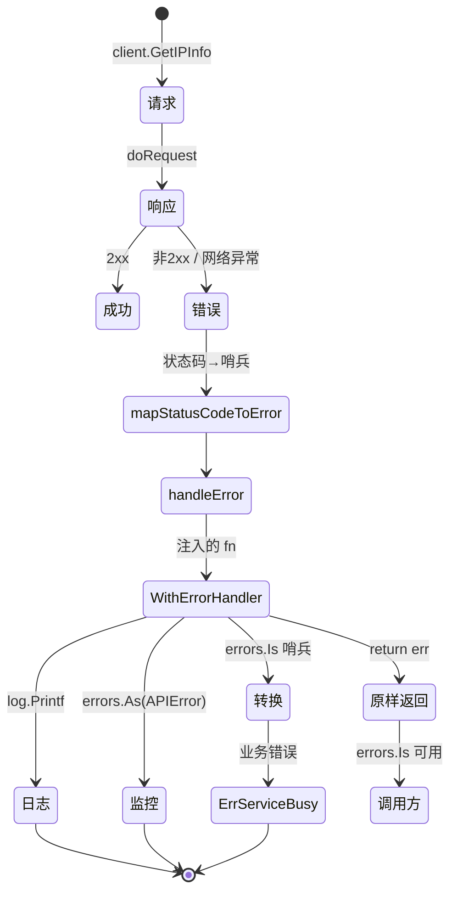
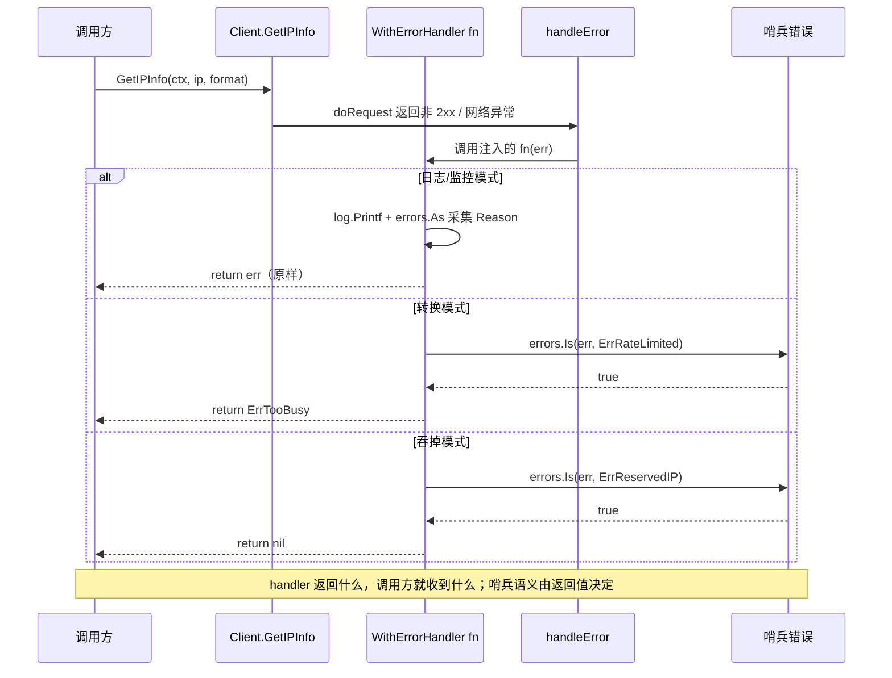

# 💡 自定义错误处理

> 用 `WithErrorHandler` 统一拦截错误，做日志/监控/转换。

## 场景

所有 IP 查询错误都要上报监控、记日志、或转换成业务错误。

::: tip 🎨 一图抵千言
自定义错误处理的核心是「请求 → 错误 → 哨兵分流 → 各自处理」这条链路。下面用状态图展示错误从产生到被消费的全过程。


:::

## 代码

```go
func main() {
	client := ipapi.NewClient(
		ipapi.WithErrorHandler(func(err error) error {
			// 1. 日志
			log.Printf("[ipapi] %v", err)

			// 2. 监控上报
			var apiErr *ipapi.APIError
			if errors.As(err, &apiErr) {
				metrics.IncCounter("ipapi_error_" + apiErr.Reason)
			}

			// 3. 业务错误转换
			if errors.Is(err, ipapi.ErrRateLimited) {
				return ErrServiceBusy // 转成业务错误
			}

			return err
		}),
	)

	_, err := client.GetIPInfo(context.Background(), "8.8.8.8", "json")
	if err != nil {
		fmt.Println(err)
	}
}

var ErrServiceBusy = errors.New("service busy")
```

## 用法模式

### 仅日志

```go
ipapi.WithErrorHandler(func(err error) error {
	log.Printf("ipapi error: %v", err)
	return err
})
```

### 吞掉特定错误

```go
ipapi.WithErrorHandler(func(err error) error {
	if errors.Is(err, ipapi.ErrReservedIP) {
		return nil // 保留地址不当错误
	}
	return err
})
```

### 转换错误

```go
ipapi.WithErrorHandler(func(err error) error {
	if errors.Is(err, ipapi.ErrRateLimited) {
		return ErrTooBusy
	}
	return err
})
```

::: tip 🎨 一图抵千言
上面三种模式共享同一条「错误进入 handler → 分支判断 → 产出新错误或原样返回」的时序链路。下面用时序图展示 `WithErrorHandler` 注入的函数在调用栈中的位置与交互顺序。


:::

## ⚠ 优先级

设了 handler 后，[`handleError`](../api/errors) **不再**做 `Reason → 哨兵` 映射。若仍需哨兵匹配，要么在 handler 内调，要么返回原 err 让调用方 `errors.Is`。

::: tip 💡 推荐：返回原 err
除非确有转换需求，handler 内只做副作用（日志/监控），返回 `err` 原样，保留哨兵语义。
:::

::: details 运行预期输出与常见问题
**预期输出**（当 `8.8.8.8` 触发限流或服务端错误时，handler 生效）：

```txt
[ipapi] ipapi: rate limited (429)
service busy
```

正常情况下无日志输出，`err == nil`。

**常见问题**：

- **handler 内 `errors.Is` 总返回 false？** 检查是否在 handler 内把 err 转成了业务错误后丢失了原始哨兵——若需保留，handler 应返回原 `err`，转换交给调用方。
- **设了 handler 后不再有 `APIError.Reason`？** handler 接管了 [`handleError`](../api/errors)，原本的 `Reason → 哨兵` 映射被跳过；如需 `Reason`，在 handler 内自行用 [`errors.As`](../api/errors) 解包 [`*APIError`](../api/models)。
- **429 也不重试？** 重试只覆盖网络错误与 5xx，4xx（含 429）不重试；[`ErrRateLimited`](../api/errors) 属 4xx，会被 handler 立即捕获。
- **可重试哨兵有哪些？** [`IsRetryableError`](../api/is-retryable) 仅对 [`ErrRateLimited`](../api/errors)、[`ErrServerError`](../api/errors)、[`ErrNotFound`](../api/errors) 返回 true。
:::

## 下一步

- 📖 看 [`WithErrorHandler`](../api/with-error-handler)
- 🛡 学 [错误处理概念](../guide/error-concept)
- 🧪 看 [错误处理示例](./error-handling)
