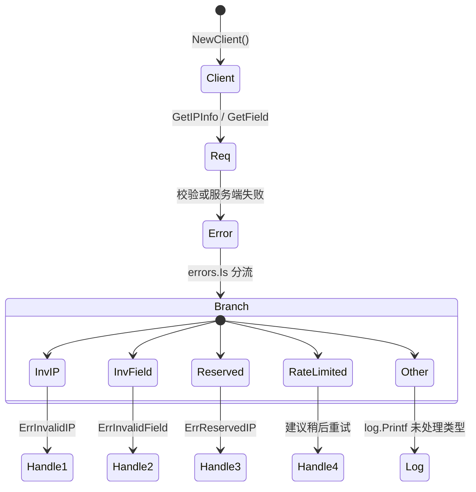
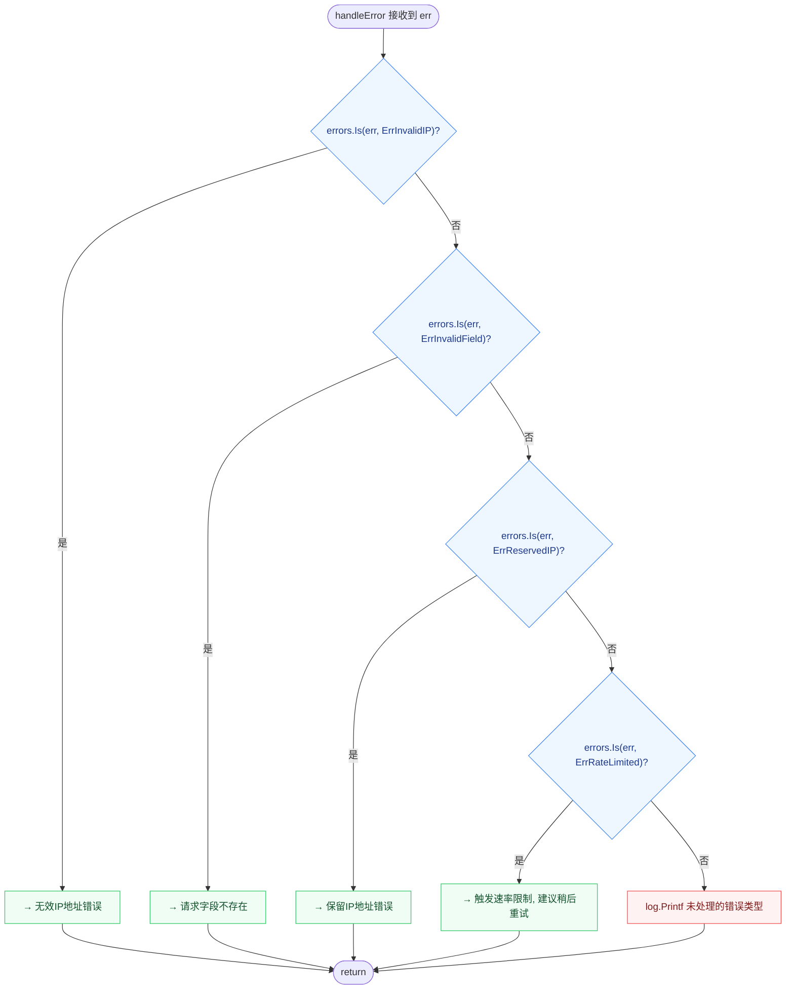

# 🛡 错误处理示例

> 对应 `examples/error_handling/main.go`，演示各类错误场景。

::: tip 🎨 一图抵千言
下面的状态图展示本示例的错误分流逻辑：请求触发错误后，用 [`errors.Is`](https://pkg.go.dev/errors#Is) 配合 SDK 哨兵值精准匹配，再进入对应的处理分支。



- 校验类错误（[`ErrInvalidIP`](../api/errors)、[`ErrInvalidField`](../api/errors)）在客户端拦截，**不发请求**。
- [`ErrReservedIP`](../api/errors) 需网络往返，由服务端 `mapStatusCodeToError` 映射。
- [`ErrRateLimited`](../api/errors) 属可重试错误，详见 [`IsRetryableError`](../api/is-retryable)。
:::

## 完整代码

```go
package main

import (
	"context"
	"errors"
	"fmt"
	"log"

	"github.com/cyberspacesec/ipapi.co-skills/pkg/ipapi"
)

func main() {
	client := ipapi.NewClient()

	// 测试各种错误场景
	testCases := []struct {
		ip     string
		field  string
		format string
	}{
		{"invalid.ip", "city", "json"},     // 无效IP
		{"8.8.8.8", "invalid_field", ""},   // 无效字段
		{"10.0.0.1", "city", "json"},       // 保留IP
		{"999.999.999.999", "country", ""}, // 非法格式
	}

	for _, tc := range testCases {
		fmt.Printf("\n测试用例: IP=%s, Field=%s\n", tc.ip, tc.field)

		if _, err := client.GetIPInfo(context.Background(), tc.ip, tc.format); err != nil {
			handleError(err)
		}

		if _, err := client.GetField(context.Background(), tc.ip, tc.field); err != nil {
			handleError(err)
		}
	}
}

func handleError(err error) {
	switch {
	case errors.Is(err, ipapi.ErrInvalidIP):
		fmt.Println("→ 无效IP地址错误")
	case errors.Is(err, ipapi.ErrInvalidField):
		fmt.Println("→ 请求字段不存在")
	case errors.Is(err, ipapi.ErrReservedIP):
		fmt.Println("→ 保留IP地址错误")
	case errors.Is(err, ipapi.ErrRateLimited):
		fmt.Println("→ 触发速率限制，建议稍后重试")
	default:
		log.Printf("未处理的错误类型: %v", err)
	}
}
```

## 测试用例解析

| 用例 | 触发错误 |
|------|----------|
| `ip="invalid.ip"` | `ErrInvalidIP`（格式非法） |
| `field="invalid_field"` | `ErrInvalidField`（字段不在白名单） |
| `ip="10.0.0.1"` | `ErrReservedIP`（私有地址） |
| `ip="999.999.999.999"` | `ErrInvalidIP`（格式非法） |

## 要点

### errors.Is 精准匹配

```go
switch {
case errors.Is(err, ipapi.ErrInvalidIP):
case errors.Is(err, ipapi.ErrReservedIP):
case errors.Is(err, ipapi.ErrRateLimited):
}
```

用哨兵值分支，不依赖错误消息字符串。详见 [`错误处理概念`](../guide/error-concept)。

下面的流程图从 `handleError` 入口出发，展示 `errors.Is` 逐哨兵值匹配的判定路径与默认兜底分支：



### 前置校验不发请求

`"invalid.ip"` 和 `"invalid_field"` 在客户端就被拦截，**不产生网络请求**：

- `GetIPInfo` 调 [`ValidateIP`](../api/validate-ip) → `ErrInvalidIP`
- `GetField` 查 `validFields` → `ErrInvalidField`

### 保留 IP 需网络往返

`10.0.0.1` 格式合法（`ValidateIP` 通过），但服务端返回保留错误：

```go
// 服务端返回 APIError{Reason: "Reserved IP Address"}
// handleError 映射为 ErrReservedIP
```

## 运行

```bash
cd examples/error_handling
go run main.go
```

预期输出（节选）：

```
测试用例: IP=invalid.ip, Field=city
→ 无效IP地址错误
→ 无效IP地址错误

测试用例: IP=8.8.8.8, Field=invalid_field
→ 请求字段不存在

测试用例: IP=10.0.0.1, Field=city
→ 保留IP地址错误
```

::: details 常见问题与运行预期
- **为什么 `invalid.ip` 打印两次？** 同一用例先调 [`GetIPInfo`](../api/get-ip-info)，再调 [`GetField`](../api/get-field)，两者都先过客户端校验，故同一条 `ErrInvalidIP` 触发两次。
- **`10.0.0.1` 为什么不在客户端被拦截？** 私有地址格式合法，[`ValidateIP`](../api/validate-ip) 通过；保留判定由服务端返回，再由 `mapStatusCodeToError` 映射为 [`ErrReservedIP`](../api/errors)。
- **没看到 `ErrRateLimited`？** 速率限制需触发限流才会出现，本示例固定用例不一定命中；想稳定复现可改用 [`WithErrorHandler`](../api/with-error-handler) 自定义处理。
- **默认重试会重试这些错误吗？** 不会。`Retries=2` 仅对网络错误与 5xx 重试，4xx（含 429）不重试，见 [`IsRetryableError`](../api/is-retryable)。
- **如何改成自定义处理？** 参考 [`custom-error`](./custom-error) 示例配合 [`WithErrorHandler`](../api/with-error-handler)。
:::

## 下一步

- 🛡 学 [`错误处理概念`](../guide/error-concept)
- 📖 看 [`错误类型`](../api/errors)
- 🛠 看 [`自定义错误处理示例`](./custom-error)
