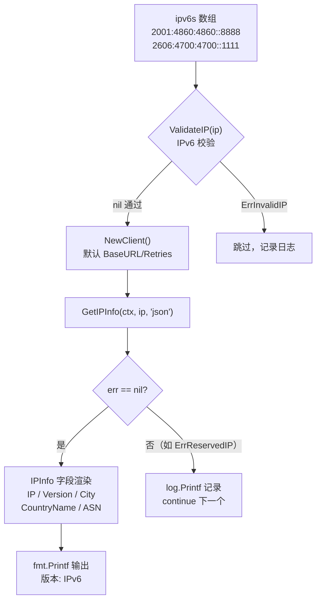
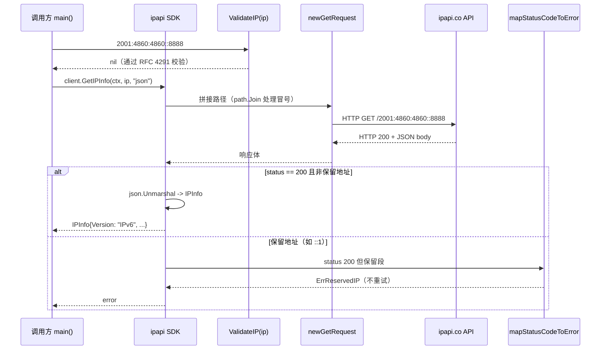

# 💡 IPv6 查询

> 查询 IPv6 地址的地理位置。

## 场景

移动网络、物联网大量使用 IPv6，需完整覆盖。

::: tip 🎨 一图抵千言
下图展示 IPv6 查询的调用结构：先用 [`ValidateIP`](../api/validate-ip) 校验 IPv6 字面量，再由 [`NewClient`](../api/new-client) 构造客户端、调用 [`GetIPInfo`](../api/get-ip-info) 拿到 [`IPInfo`](../api/models) 字段。


:::

## 代码

```go
func main() {
	client := ipapi.NewClient()
	ctx, cancel := context.WithTimeout(context.Background(), 5*time.Second)
	defer cancel()

	ipv6s := []string{
		"2001:4860:4860::8888", // Google DNS
		"2606:4700:4700::1111", // Cloudflare DNS
	}

	for _, ip := range ipv6s {
		info, err := client.GetIPInfo(ctx, ip, "json")
		if err != nil {
			log.Printf("%s: %v", ip, err)
			continue
		}
		fmt.Printf("%s\n  版本: %s\n  城市: %s\n  国家: %s\n  ASN: %s\n",
			info.IP, info.Version, info.City, info.CountryName, info.ASN)
	}
}
```

## 输出

```
2001:4860:4860::8888
  版本: IPv6
  城市: Mountain View
  国家: United States
  ASN: AS15169
```

## 要点

- ✅ IPv6 冒号由 [`newGetRequest`](../api/methods) 内部 `path.Join` 处理
- ✅ `info.Version` 区分 `IPv4`/`IPv6`
- ✅ 与 IPv4 用法完全一致

下面用一张时序图，呈现单次 IPv6 查询从校验到拿到结果在各函数之间的流转：

::: tip 🎨 一图抵千言

:::

## 校验

```go
ipapi.ValidateIP("2001:4860:4860::8888") // nil
ipapi.ValidateIP("::1")                   // nil（但查询返回保留错误）
```

`::1` 是回环地址，查询会返回 [`ErrReservedIP`](../api/errors)。

::: details ▶ 运行预期输出与常见问题
**预期输出**（两个 IPv6 均成功）：

```txt
2001:4860:4860::8888
  版本: IPv6
  城市: Mountain View
  国家: United States
  ASN: AS15169
2606:4700:4700::1111
  版本: IPv6
  城市: San Francisco
  国家: United States
  ASN: AS13335
```

**常见问题**

- ❓ 为什么我的 IPv6 报 `ErrInvalidIP`？
  IPv6 字面量必须符合 RFC 4291，如 `2001:4860:4860::8888`。缺少 `::` 缩写或段数错误会被 [`ValidateIP`](../api/validate-ip) 拒绝。

- ❓ 查询 `::1` / `fe80::` 返回什么？
  这些是保留地址，HTTP 200 但 [`mapStatusCodeToError`](../api/errors) 会映射为 [`ErrReservedIP`](../api/errors)，不会重试。

- ❓ IPv6 冒号会破坏 URL 路径吗？
  不会。[`newGetRequest`](../api/methods) 内部用 `path.Join` 拼接，冒号由 SDK 处理，与 IPv4 用法一致。

- ❓ 想区分 v4/v6 怎么取值？
  查看 `info.Version` 字段，取值为 `IPv4` 或 `IPv6`（详见 [`IPInfo`](../api/models)）。
:::

## 下一步

- 🌍 学 [IPv6 概念](/guide/ipv6)
- 🌐 看 [IPv4 查询](/guide/ipv4)
- 📖 看 [`GetIPInfo`](/api/get-ip-info)
