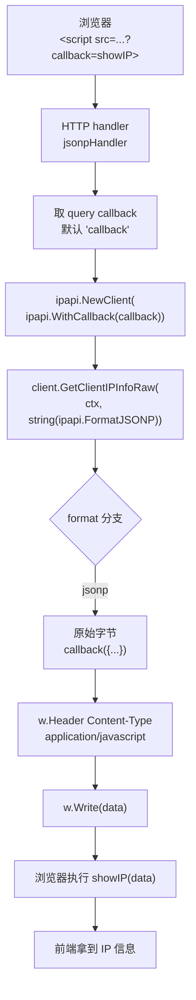
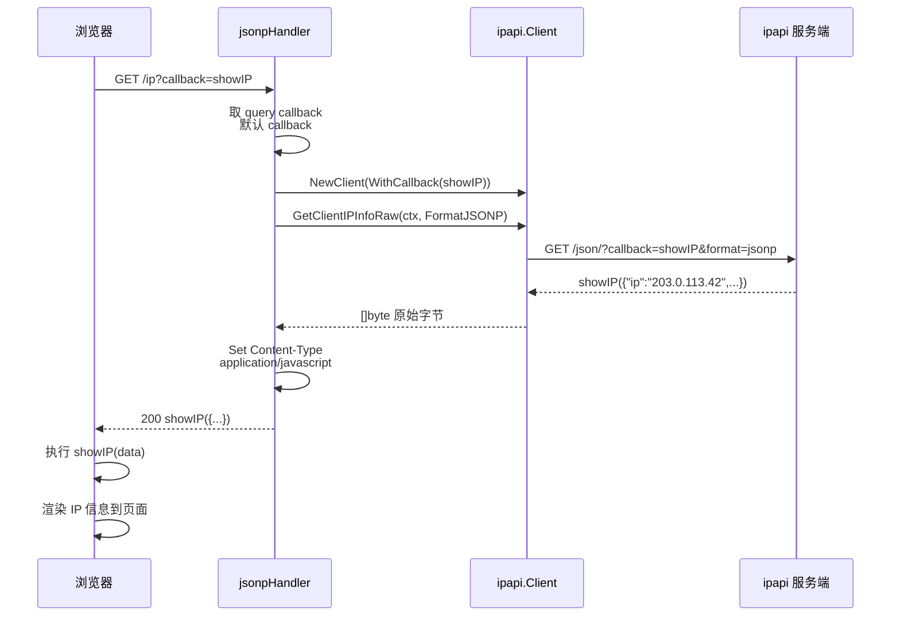

# 💡 JSONP 回调

> 用 `WithCallback` + `FormatJSONP` 实现浏览器跨域调用。

::: tip 🎨 一图抵千言
JSONP 走 [`GetClientIPInfoRaw`](../api/get-client-ip-info-raw) 原始字节通道：HTTP handler 取 query 回调名 → 构造带 `WithCallback` 的 [`Client`](../api/client) → 以 [`FormatJSONP`](../api/validate-format) 请求 → 直接把 `[]byte` 当 `application/javascript` 回写前端，由 `<script>` 自动调用回调。


:::

## 场景

前端 `<script>` 标签直接获取 IP 信息，无需 CORS。

下面这张时序图补充展示浏览器、后端 handler、ipapi Client 与上游 API 之间的交互顺序，与上面的流程图视角互补：

::: tip 🎨 一图抵千言



:::

## 后端代码

```go
func jsonpHandler(w http.ResponseWriter, r *http.Request) {
	callback := r.URL.Query().Get("callback")
	if callback == "" {
		callback = "callback"
	}

	client := ipapi.NewClient(ipapi.WithCallback(callback))
	data, err := client.GetClientIPInfoRaw(r.Context(), string(ipapi.FormatJSONP))
	if err != nil {
		http.Error(w, err.Error(), 500)
		return
	}
	w.Header().Set("Content-Type", "application/javascript")
	w.Write(data)
}

func main() {
	http.HandleFunc("/ip", jsonpHandler)
	http.ListenAndServe(":8080", nil)
}
```

访问 `http://localhost:8080/ip?callback=showIP` 返回：

```js
showIP({"ip":"203.0.113.42","city":"Beijing",...})
```

## 前端代码

```html
<script>
function showIP(data) {
  console.log("你的 IP:", data.ip);
  console.log("城市:", data.city);
  document.getElementById("ip").textContent = data.ip;
}
</script>
<script src="http://localhost:8080/ip?callback=showIP"></script>
```

## 要点

- ✅ `WithCallback` 设回调名
- ✅ `FormatJSONP` 格式
- ✅ 返回 `application/javascript`
- ✅ 回调名从 query 取，灵活

## 带 API Key 的 JSONP

`<script>` 无法设 Header，需用 query 参数认证：

```go
client := ipapi.NewClient(
	ipapi.WithAPIKey(os.Getenv("IPAPI_KEY")),
	ipapi.WithAPIKeyQuery(),
	ipapi.WithCallback(callback),
)
```

⚠️ Key 会暴露在前端，仅用受限/临时 Key。详见 [JSONP 指南](../guide/jsonp)。

::: details 📋 运行预期输出与常见问题
**预期输出：**

后端启动后，访问 `http://localhost:8080/ip?callback=showIP`，浏览器 `View Source` 可见：

```txt
showIP({"ip":"203.0.113.42","city":"Beijing","country":"CN","country_name":"China",...})
```

不传 callback 时回退默认名：

```txt
callback({"ip":"203.0.113.42","city":"Beijing",...})
```

前端控制台打印：

```txt
你的 IP: 203.0.113.42
城市: Beijing
```

**常见问题：**

- **返回 `callback({...})` 但前端没调用？** 检查 `<script src>` 的 `callback` 参数与全局函数名是否一致；函数必须挂在 `window` 上，参考 [JSONP 指南](../guide/jsonp)。
- **Content-Type 设成 `application/json`？** JSONP 必须是 `application/javascript`，否则部分浏览器拒绝执行，参考 [`GetClientIPInfoRaw`](../api/get-client-ip-info-raw)。
- **回调名含非法字符报错？** 回调名需符合 JS 标识符规则（字母/数字/下划线/$），非法名会导致前端语法错误。
- **带 API Key 时 Key 泄露？** `<script>` 无法设 Header，必须用 [`WithAPIKeyQuery`](../api/with-api-key-query) 走 query 参数，Key 会出现在 URL 里，仅用受限/临时 Key，参考 [认证机制](../guide/auth-concept)。
- **想返回 JSON 而非 JSONP？** 改用 [`GetClientIPInfoRaw`](../api/get-client-ip-info-raw) + [`FormatJSON`](../api/validate-format)，但需前端自行处理 CORS。
- **JSONP 格式校验？** 用 [`ValidateFormat`](../api/validate-format) 预校验，合法值见 [`ValidFormats`](../api/validate-format)。
:::

## 下一步

- 📖 看 [`WithCallback`](../api/with-callback)
- 📞 学 [JSONP 回调](../guide/jsonp)
- 🔒 学 [认证机制](../guide/auth-concept)
