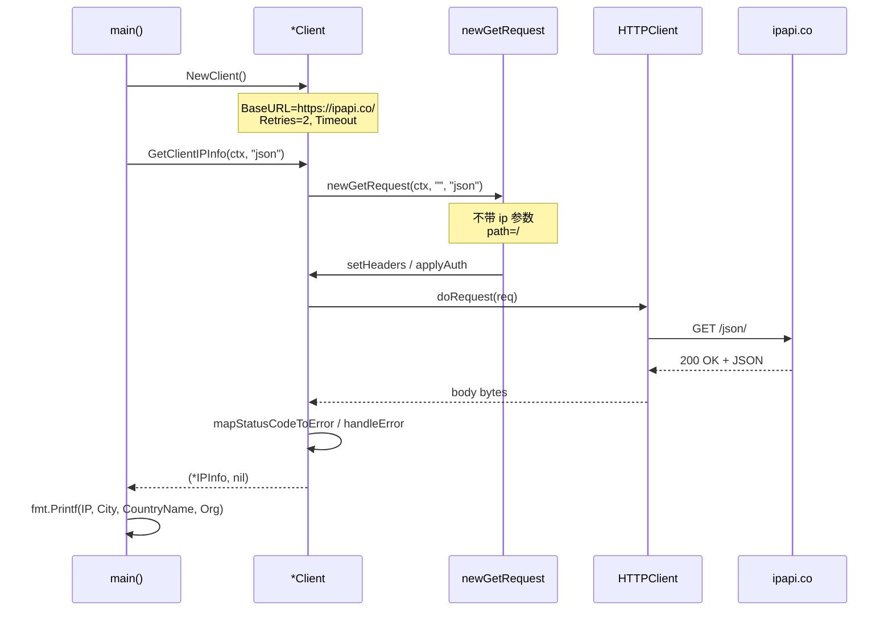
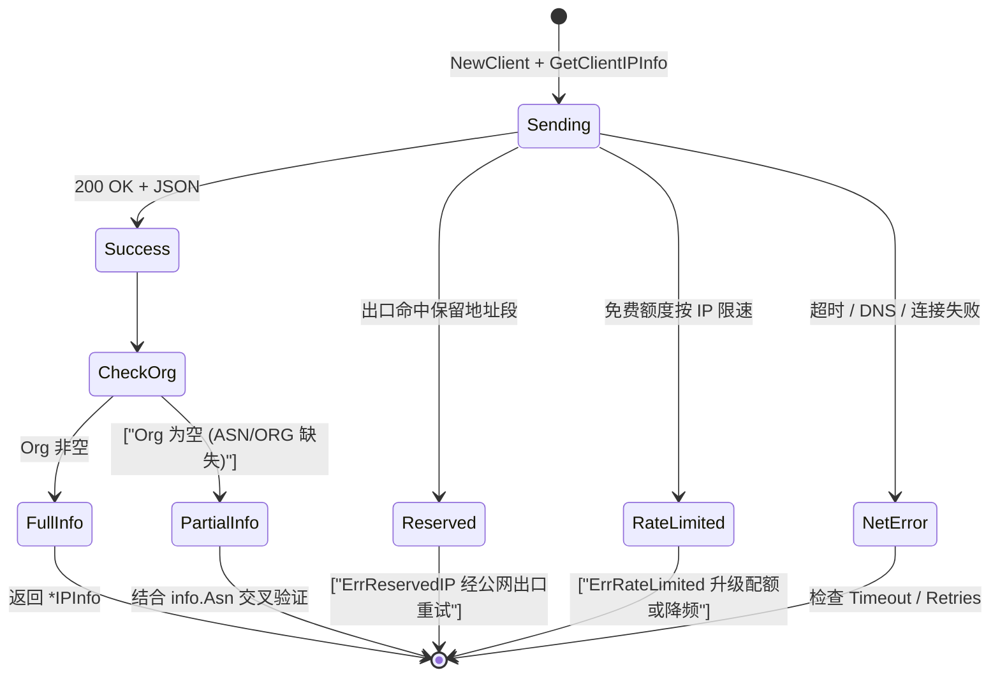

# 💡 获取客户端 IP

> 查询「调用方」自己的公网 IP 与位置。

## 场景

- 显示「你的 IP 是什么」
- 服务部署位置自检
- 出口 IP 探测

## 调用结构

::: tip 🎨 一图抵千言
`GetClientIPInfo` 与 [`GetIPInfo`](../api/get-ip-info) 同源，区别仅在于前者不传 IP 参数——由服务端根据请求来源自动判定「调用方」出口 IP。


:::

## 代码

```go
func main() {
	client := ipapi.NewClient()
	ctx, cancel := context.WithTimeout(context.Background(), 5*time.Second)
	defer cancel()

	info, err := client.GetClientIPInfo(ctx, "json")
	if err != nil {
		log.Fatal(err)
	}
	fmt.Printf("我的公网 IP: %s\n城市: %s\n国家: %s\nISP: %s\n",
		info.IP, info.City, info.CountryName, info.Org)
}
```

## 输出

```
我的公网 IP: 203.0.113.42
城市: Beijing
国家: China
ISP: China Telecom
```

## 只查 IP 字符串

```go
myIP, _ := client.GetClientField(ctx, "ip")
fmt.Println("IP:", myIP)
```

用 [`GetClientField`](../api/get-client-field)。

## ⚠ 注意

`GetClientIPInfo` 返回的是 **SDK 所在机器** 出口 IP，**不是终端用户 IP**。要查终端用户 IP，需从请求头取真实 IP 再用 `GetIPInfo`：

```go
func userLocation(client *ipapi.Client, r *http.Request) (*ipapi.IPInfo, error) {
	userIP := r.Header.Get("X-Forwarded-For")
	if userIP == "" {
		userIP = strings.Split(r.RemoteAddr, ":")[0]
	}
	return client.GetIPInfo(r.Context(), userIP, "json")
}
```

详见 [客户端 IP 概念](../guide/client-ip)。

## 运行预期与常见问题

下面这张状态图自上而下描绘 `GetClientIPInfo` 从发起到返回的几种终态——成功拿到出口 IP 信息、命中保留地址段、触发限速，以及拿到数据但 `Org` 字段缺失——与上方时序图互补，便于一眼定位排错路径。

::: tip 🎨 一图抵千言

:::

::: details 运行预期输出与排错
**预期输出**（实际值取决于调用方出口 IP 与归属地）：

```txt
我的公网 IP: 203.0.113.42
城市: Beijing
国家: China
ISP: China Telecom
```

**常见问题**

- **返回的 IP 不是我的真实出口 IP？** `GetClientIPInfo` 反映的是 SDK 所在机器的出口 IP。若该机器经过 NAT、代理或容器网络，返回的将是代理/NAT 后的地址，而非内网地址。要查终端用户 IP，请从 `X-Forwarded-For` / `RemoteAddr` 取值后改用 [`GetIPInfo`](../api/get-ip-info)。
- **触发了 `ErrRateLimited`？** 免费额度按 IP 限速。在容器/CI 等共享出口环境多实例并发调用会共占同一配额。可通过 [`WithAPIKey`](../api/with-api-key) 升级配额，或减小调用频率。
- **`info.Org` 为空？** 部分网段 ASN/ORG 数据缺失属正常现象，并非 SDK bug；可结合 `info.Asn` 字段交叉验证。
- **返回 `ErrReservedIP`？** 调用方出口命中保留地址段时触发，常见于纯内网环境，需经公网出口重试。
:::

## 下一步

- 📖 看 [`GetClientIPInfo`](../api/get-client-ip-info)
- 💡 看 [查询指定 IP](./lookup-specific-ip)
- 📡 学 [客户端 IP 检测](../guide/client-ip)
